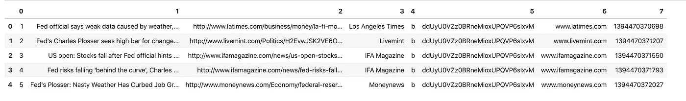
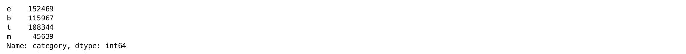
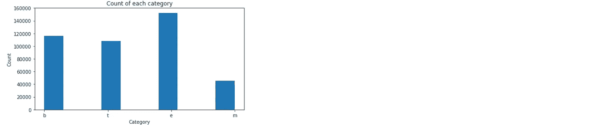
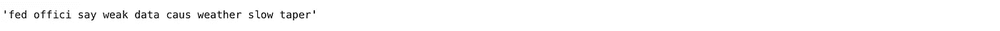
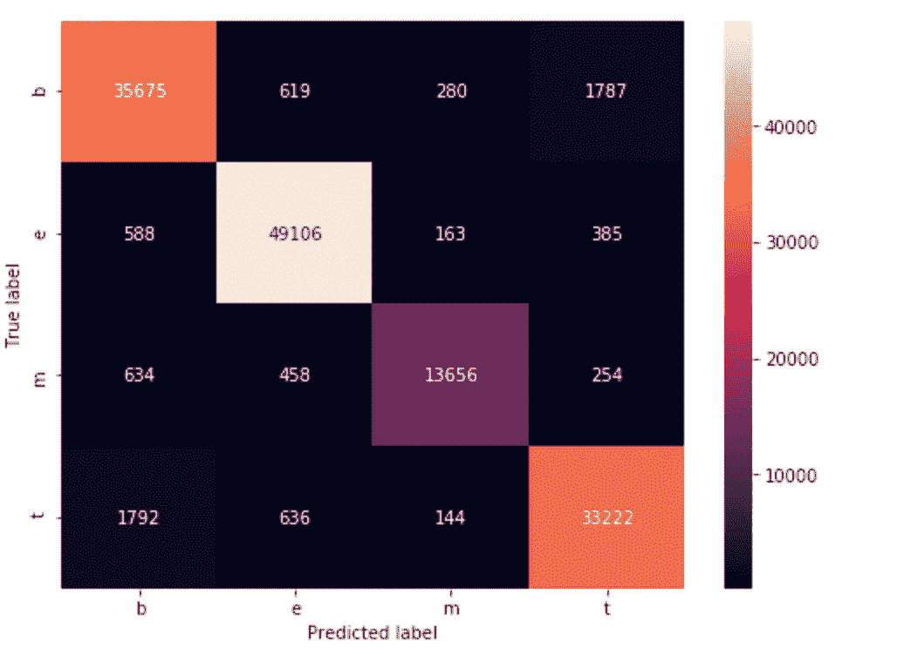

# 快速简单的文本分类

> 原文：<https://medium.com/analytics-vidhya/quick-and-simple-text-classification-aeaf9f301068?source=collection_archive---------6----------------------->

TL；DR:我向你展示如何在 5 分钟内编写文本分类程序。


文本分类很难。有很多方法可以做到这一点。

但有时我们需要尽可能快地把事情做完。

**数据集**

我将处理这个新闻数据集:https://archive.ics.uci.edu/ml/datasets/News+Aggregator#

数据分为 4 类—商业、技术、娱乐和健康。

让我们开始吧。

首先，我们需要导入库。

```
import pandas as pd
import numpy as np
import seaborn as sns
import matplotlib.pyplot as plt
%matplotlib inline
from sklearn.model_selection import train_test_split
from sklearn.linear_model import LogisticRegression
from sklearn.feature_extraction.text import TfidfVectorizer, CountVectorizer
from sklearn.metrics import accuracy_score, confusion_matrix
from sklearn.pipeline import Pipeline
import nltk
from nltk.corpus import stopwords
stop_words = set(stopwords.words(‘english’))
from nltk.stem import SnowballStemmer
from nltk.tokenize import wordpunct_tokenize, word_tokenize
import string
```

和读取数据集

```
data = pd.read_csv(‘data/newsCorpora.csv’, header=None, sep=’\t’)
data.head()
```



为了方便起见，我们设置了列名:

```
data.columns = [‘id’, ‘title’, ‘url’, ‘publisher’, ‘category’, ‘story’, ‘hostname’, ‘timestamp’]
```

好了，我们准备检查数据了。

我们将根据新闻标题来预测类别。这就是为什么我们需要观察领域*类别*。

```
data[‘category’].value_counts()
```



```
fig, ax = plt.subplots(figsize=(8, 4))
plt.hist(data[‘category’])
plt.title(‘Count of each category’)
plt.xlabel(‘Category’)
plt.ylabel(‘Count’)
plt.show()
```



我们看到有一点阶级不平衡，但现在，这不是问题。

每个机器学习模型都不接受原始文本。所以我们要把文本转换成向量。

**2。一袋文字**

单词包是将文本表示为单词包(集合)而不考虑顺序的模型。在这个模型中，文档中每个单词的频率ф是机器学习模型的一个特征。另一种方法是使用 tf-idf(术语频率-逆文档频率)技术对单词相对重要性进行评分。

TF 被定义为单词在文档中出现的次数与文档中单词总数的比率。

IDF 定义为文档数与文档数之比的对数，包含单词。

更多详情请见[https://en.wikipedia.org/wiki/Tf–idf](https://en.wikipedia.org/wiki/Tf%E2%80%93idf)

此外，将相同的单词用不同的后缀表示成一种形式也是一种很好的做法。例如，假设我们有单词 *tree* 和 *trees，*，我们希望这些单词表示相同的*。*

为此，我们将使用词干。这是一个切断后缀的过程。

Nltk 图书馆有我们所需要的一切。

```
stemmer = SnowballStemmer(language=’english’)
```

此外，有些词几乎可以出现在每个文档中。因此，它们不会帮助我们按类别区分文档。这些词被称为停用词。在大多数情况下，我们在 *nltk* 中有一组这样的单词。但是有时候，加入我们自己的也是好的。出于我们的目的，我们不会那样做。

此外，我们将从文本中删除标点符号。

我们来定义一下 clean 函数。

```
def clean_text(text):
 text = str(text).lower()
 tokens = [stemmer.stem(word) for word in wordpunct_tokenize(text) if word not in list(stop_words) + list(string.punctuation)]
 text = “ “.join(tokens)
 return text
```

让我们看看结果:

```
data[‘title’].iloc[0]
```


```
clean_text(data[‘title’].iloc[0])
```



将函数应用于所有数据集

```
data[‘clean_title’] = data[‘title’].apply(clean_text)
```

然后我们需要将数据分为训练数据集和测试数据集:

```
X_train, X_test, y_train, y_test = train_test_split(data[‘clean_title’], data[‘category’], test_size=0.33, random_state=42)
```

定义矢量器

```
vectorizer = TfidfVectorizer(ngram_range=(1,2))
```

首先，我们需要让它适合我们的训练数据，然后继续测试数据。

```
vector_train = vectorizer.fit_transform(X_train)vector_test = vectorizer.transform(X_test)
```

现在，我们准备创建一个模型。在本教程中，我们将使用逻辑回归。

```
model = LogisticRegression()
model.fit(vector_train, y_train)
```

为了了解它是如何工作的，我们使用准确性指标:

```
accuracy_score(y_test, model.predict(vector_test))0.9444759288086715
```

作为基线，还不错。

但是，由于我们有两个以上的类，我们需要了解模型在所有类上的表现。为此，我们使用混淆矩阵。

```
conf_matrix = confusion_matrix(y_test, model.predict(vector_test))
```

并展示出来

```
fig, ax = plt.subplots(figsize=(8, 6))
df_cm = pd.DataFrame(conf_matrix, index=model.classes_, columns=model.classes_)
sns.heatmap(df_cm,annot=True, fmt=”d”, ax=ax)
plt.ylabel(‘True label’)
plt.xlabel(‘Predicted label’)
```



正如我们所见，在大多数情况下，它表现良好。

作为最后一步，我们可以在管道中结合向量化和训练模型。在 sklearn 中，我们为此提供了类管道。

```
pipeline = Pipeline(steps=[(‘vectorizer’, TfidfVectorizer(ngram_range=(1,2))), (‘clf’, LogisticRegression())])
```

为了训练，我们只是适应它。

```
pipeline.fit(X_train, y_train)
```

看看结果

```
accuracy_score(y_test, pipeline.predict(X_test))0.9444759288086715
```

完成了。现在，我们有了一个有效的文本分类模型。