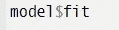

# 用于机器学习建模的快速简洁的 R 代码技巧

> 原文：<https://medium.com/analytics-vidhya/quick-crisp-code-tricks-in-r-for-machine-learning-modelling-2f9addd202b8?source=collection_archive---------34----------------------->

如果你对数据科学感兴趣，你会在某个时候或者大部分时间与训练模型打交道。尽管 R 不是每个人都喜欢的语言，但它几乎没有真正简单的方法来训练和测试模型。本文使用菜谱和扫帚包来构建机器学习模型。

***问题陈述:*** 建立一个以 y 为响应变量，以 x1，x2…X70 为预测变量的多重 ML 模型，其中模型要根据变量 x1 分组。

首先，执行预处理很重要。这将减少不必要的预测。作为预处理的一部分，重要的是处理缺失值、接近零值、偏斜数据、数据标准化以及处理任何线性组合。单独这样做不是一个好的编码！

这里的食谱包将代码减少到只有几行代码。

需要使用 juice 命令创建、准备并最终执行配方。输出是带有预处理数据的数据集。除了上述功能之外，还可以使用 recipe 执行其他预处理任务。

根据问题陈述的第二部分，必须有更多的模型根据基于预测值 x1 的各个组进行训练。要实现这一点，要么走一条长路，为分组值单独设置数据子集，然后单独建模。但是是不是太繁琐重复了？

扫帚就派上了用场。Broom 包具有“nest”和“map”函数，可以与 dplyr 包中的 mutate 函数一起使用，根据组训练模型。caret 包中的 train()函数用于训练模型。下面的代码使用 SVM 算法训练数据。以类似的方式，利用不同的参数，可以使用其他算法。“x1Group”是将 x1 分组后具有类别的变量。“finaldata”是之前收到的预处理数据集。

这会训练模型。但是怎么看模型合适呢？为此，只需使用以下代码:

甚至预测数据也是一件容易的事情。它工作正常，就像用脱字符号包一样。只需要调用正确的模型。如果有两组，模型$fit[[1]]是第一组的模型。' test_x1G1 '是具有组类别之一的测试数据。

因此，通过使用扫帚和食谱，可以避免大量的重复代码。

## 快乐学习！！