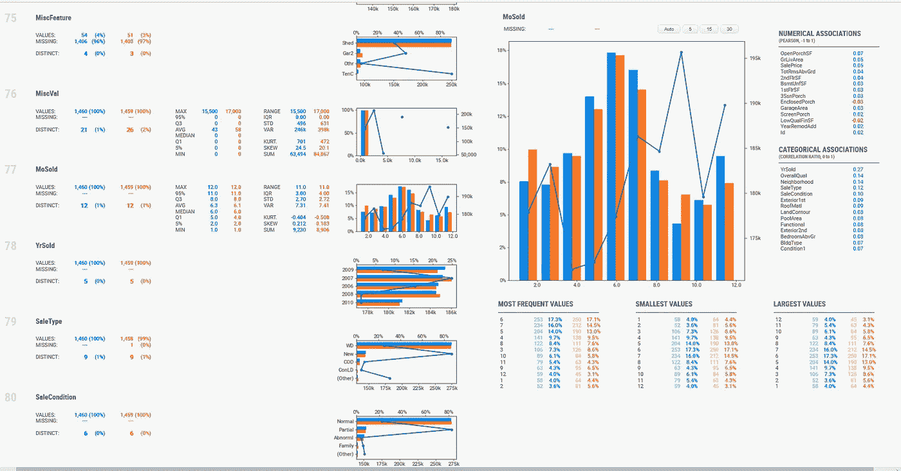

# 使用这些用于数据科学问题的 Python 包，仅需 5 分钟即可完成快速探索性数据分析:快速入门指南

> 原文：<https://medium.com/analytics-vidhya/quick-exploratory-data-analysis-in-5-minutes-using-python-packages-for-data-science-8a600529031?source=collection_archive---------10----------------------->

这是我喜欢 python 社区的另一个原因，我们需要编写太多代码来对数据集执行探索性数据分析的日子已经一去不复返了。

虽然 Tableau 等自助式数据探索分析工具很方便，但并不是每个人都负担得起许可费用。此外，对该工具的某种程度的理解对于释放所有数据探索能力是必要的。此外，您还必须投入一些时间构建探索性图表来执行任何类型的分析，这对于 BI 专家来说听起来可能并不具有挑战性。

但是，如果我们可以只用几行代码就自动完成所有的数据探索和分析，那会怎么样呢？只需在 python 笔记本上键入 2-3 行，然后去喝点咖啡/茶。当你回来的时候，你只需要下载生成的报告和你需要的所有信息，听起来是不是很酷。

让我们来看两个 python 库，它们只用几行代码就可以帮助进行探索性的数据分析。

# **sweetviz:**

就像名字一样，这个 python 包提供了它所说的内容。Sweetviz 是一个开源 Python 库，可通过一行代码为 kickstart EDA(探索性数据分析)生成美观、高密度的可视化效果。

该系统围绕快速可视化目标值和比较数据集而构建。它的目标是帮助快速分析目标特征、训练与测试数据以及其他类似的数据表征任务。目前，该库生成 3 种报告:

1.  分析(…)

分析单个数据帧。

2.比较(…)

比较 2 个数据帧，例如训练和测试数据帧

3.比较 _ 内部(…)

基于指定类别比较相同数据框的两个子集。

要尝试自己从这里下载 python 笔记本[。](https://github.com/anuragbisht12/medium/blob/master/EDA_usingSweetViz.ipynb)

联合

数据帧比较

# 熊猫 _ 简介:

图片提供:pypi.org

Pandas Profiling 是另一个 python 包，它以小部件或 html 报告的形式生成带有所有下面提到的统计数据的配置文件报告。

*   类型推断:检测数据帧中列的[类型](https://pypi.org/project/pandas-profiling/#types)。
*   要素:类型、唯一值、缺失值
*   分位数统计，如最小值、Q1、中值、Q3、最大值、范围、四分位间距
*   描述性统计，如平均值、众数、标准差、总和、中位数绝对偏差、变异系数、峰度、偏斜度
*   最常见的值
*   柱状图
*   相关性突出显示高度相关的变量、Spearman、Pearson 和 Kendall 矩阵
*   缺失值矩阵、计数、缺失值的热图和树状图
*   文本分析了解文本数据类别(大写、空格)、脚本(拉丁文、西里尔文)和块(ASCII)。
*   文件和图像分析提取文件大小、创建日期和尺寸，并扫描截断的图像或包含 EXIF 信息的图像。

这里有一个[笔记本](https://github.com/anuragbisht12/medium/blob/master/Data_Profiling_Pandas.ipynb)的样品。

注意:自该笔记本发布以来，一些功能发生了变化，请确保您安装了最新版本的库。

安装时，您可能需要确保您的虚拟环境中安装了最新版本的 matplotlib。

数据集信息

相关性和缺失值

如果你想了解更多关于探索性数据分析的内容，你可以前往 [Analytics Vidhya](https://www.analyticsvidhya.com/blog/2016/01/guide-data-exploration/) 阅读这篇一页长的文章。

如果你喜欢这篇文章，那就看看我的其他文章吧。希望对你有帮助。