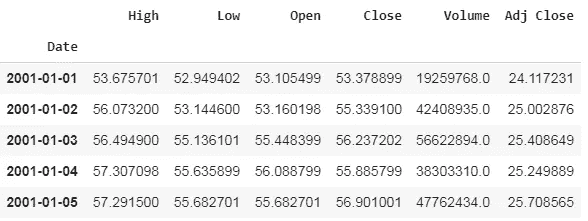
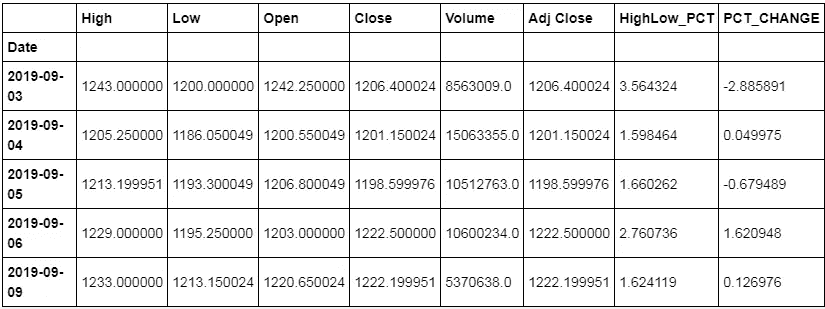
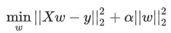
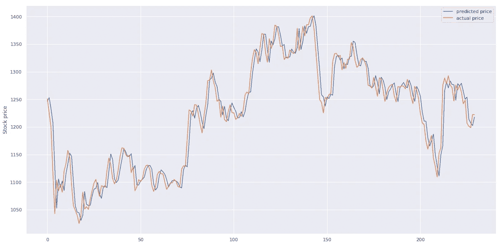
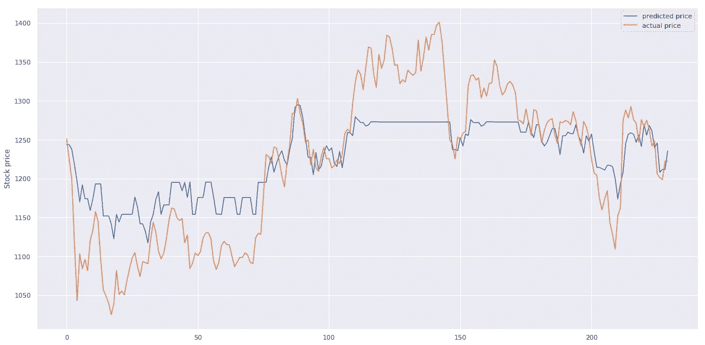
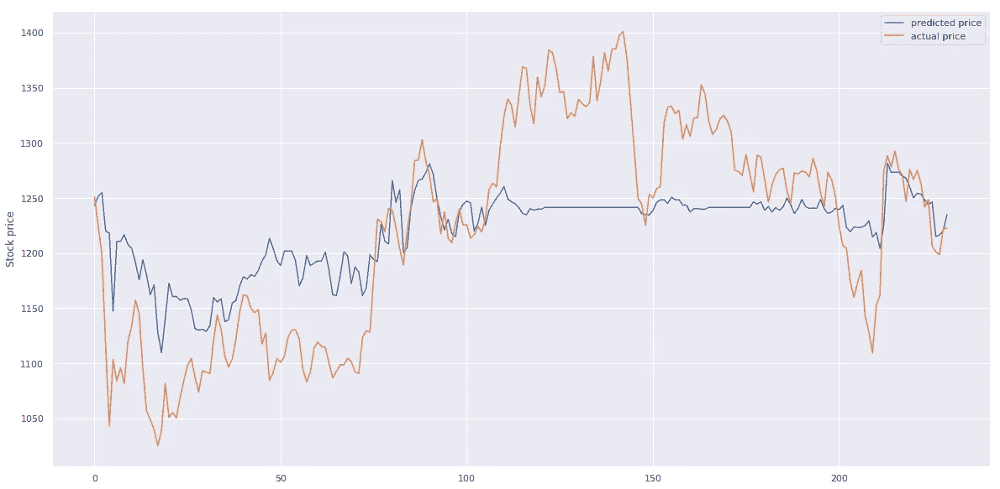
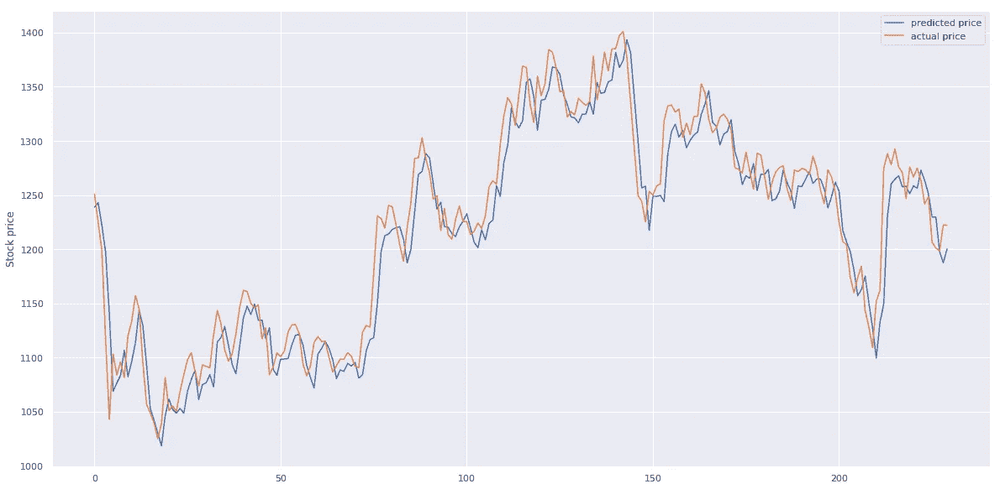

# 股票价格预测快速指南

> 原文：<https://medium.com/analytics-vidhya/quick-guide-for-stock-price-prediction-d6624eb29248?source=collection_archive---------9----------------------->

## 熊猫、sklearn 和 Keras 股票价格分析和可视化初学者指南。


最近我对股票交易和投资感兴趣，所以，当然，我的目标是通过股票分析和预测赚钱。作为一个机器学习爱好者，我认为尝试使用机器学习来预测股票价格和赚钱。

本文的目的是快速启动股票预测之旅，并不断改进我们的模型。

## 资料组

使用熊猫网络阅读器功能和雅虎财经 API，我们将提取股票的数据。

```
import pandas as pd
import datetime
import pandas_datareader.data as web
from pandas import Series, DataFramestart = datetime.datetime(2001, 1, 1)
end = datetime.datetime(2019, 9, 11)df = web.DataReader("RELIANCE.NS", 'yahoo', start, end)
df.head()
```



这段代码将从雅虎财经中提取 2001 年 1 月到 2019 年 9 月的数据。您可以调整代码，从不同的时间戳中提取数据。

下面简单的代码将取股票的高低百分比和开盘价-收盘价百分比。当我们预测股票时，这是不必要的，它只是帮助我们进行可视化。

```
df['HighLow_PCT']= (df['High'] - df['Low']) / df['Close'] * 100
df['PCT_CHANGE'] = (df['Close'] - df['Open']) / df['Open'] * 100
```



## 如何利用这些数据进行预测？

所以我们知道，我们需要一些带标签的训练数据来训练我们的模型。但是，如果我们使用这些高、低、开、收盘价格作为训练，并希望预测每天的“Adj Close ”,会发生什么呢？如果我们使用这些数据来训练，那么我们将无法预测未来数据的模型，因为我们没有未来时间戳的任何这些值。

那么这个问题的解决方法是什么呢？

我们可以将该问题视为时间序列问题，并且只有一个特征“Adj Close”将用于模型的训练和模型的预测。

```
window_size = 32 *#*num_samples = len(df) - window_size
indices = np.arange(num_samples).astype(np.int)[:,**None**] + np.arange(window_size + 1).astype(np.int)
data = df['Adj Close'].values[indices]
```

我们以这样一种方式准备数据，我们有 32 天的窗口，并预测第二天的股票价格。

在预处理并将数据分成训练和测试之后，我们将尝试机器学习模型。

# 1)岭回归。

`[**Ridge**](https://scikit-learn.org/stable/modules/generated/sklearn.linear_model.Ridge.html#sklearn.linear_model.Ridge)`回归将 L2 惩罚添加到[普通最小二乘法](https://scikit-learn.org/stable/modules/linear_model.html#ordinary-least-squares)中，防止模型过度拟合。



为了简单起见，我们不调整任何超参数。下面的简单代码为数据集构建岭回归。

```
ridge_model = Ridge()
ridge_model.fit(X_train, y_train)*# Infer*
y_pred_ridge = ridge_model.predict(X_test)
```

从下面我们可以看到，岭模型对于股票数据非常有效，因为它可以识别数据的趋势。



# 2)梯度推进树

GBM 是一种以弱预测模型的[集合](https://en.wikipedia.org/wiki/Ensemble_learning)的形式产生预测模型的技术，通常是决策树。下面的代码为我们的数据创建了 GBM 模型。

```
**from** **sklearn.ensemble** **import** RandomForestRegressor
rf_model = RandomForestRegressor()
rf_model.fit(X_train,y_train)y_pred_rf = rf_model.predict(X_test)
```

从下图可以看出，我们的模型拟合不足，无法正确预测数据，当然可以通过使用适当的超参数进行改进。



# 3)随机森林回归量

**随机森林**是一种[集成学习](https://en.wikipedia.org/wiki/Ensemble_learning)方法，通过在训练时构建大量的[决策树](https://en.wikipedia.org/wiki/Decision_tree_learning)并输出类，即类(分类)或个体树的均值预测(回归)的[模式](https://en.wikipedia.org/wiki/Mode_(statistics))。随机森林纠正了决策树过度适应的习惯。

从下面的图表中我们可以看到，它并没有很好地处理这些数据。当然，我们可以调整超参数以获得更好的结果。



随机森林预测与实际

# 4)回归神经网络

股票价格是时间序列问题，当涉及到解决时间序列问题时，神经网络通常工作得更好。下面的代码将使用 Keras 构建一个基本的神经网络来预测价格。

```
**from** **keras** **import** Sequential
**from** **keras.layers** **import** Dense,Dropout
**def** build_regressor():
    regressor = Sequential()
    regressor.add(Dense(units=128, input_dim=32))
    regressor.add(Dense(units=64))
    regressor.add(Dense(units=32))
    regressor.add(Dense(units=16))
    regressor.add(Dense(units=8))
    regressor.add(Dense(units=1))
    regressor.compile(optimizer='adam', loss='mean_squared_error',)
    **return** regressor
**from** **keras.wrappers.scikit_learn** **import** KerasRegressor
regressor = KerasRegressor(build_fn=build_regressor, batch_size=1024,epochs=1000)
```

我们使用 sklearn Keras 包装器，因为 Keras 不能直接用作回归变量。下图显示了实际价格与预测价格的对比，表明我们的模型可以预测价格的趋势。



本文的代码可以在[这里](https://github.com/isapansoni/stock-prediction)找到

# 结论

1.  我们可以尝试 LSTM，而不是完全连接的神经网络，因为 LSTM 在时间序列数据上工作得更好。
2.  我们可以对所有模型进行超参数调整，以获得更好的结果
3.  我们可以进行情感分析，并将其作为预测价格的一个特征

如果你想联系我，请用我的 [LinkedIn](https://www.linkedin.com/in/isapansoni/) 联系我

感谢您阅读帖子。