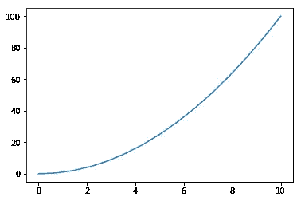
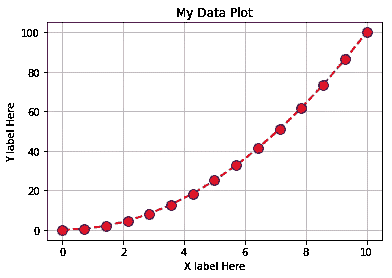
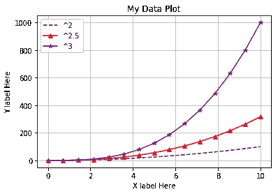
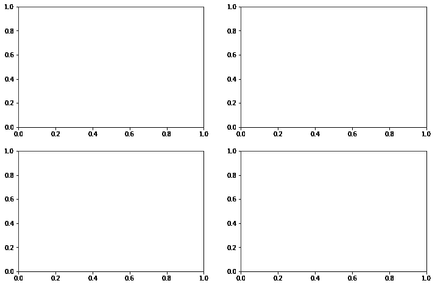
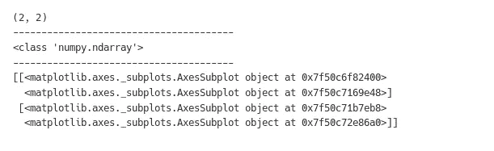
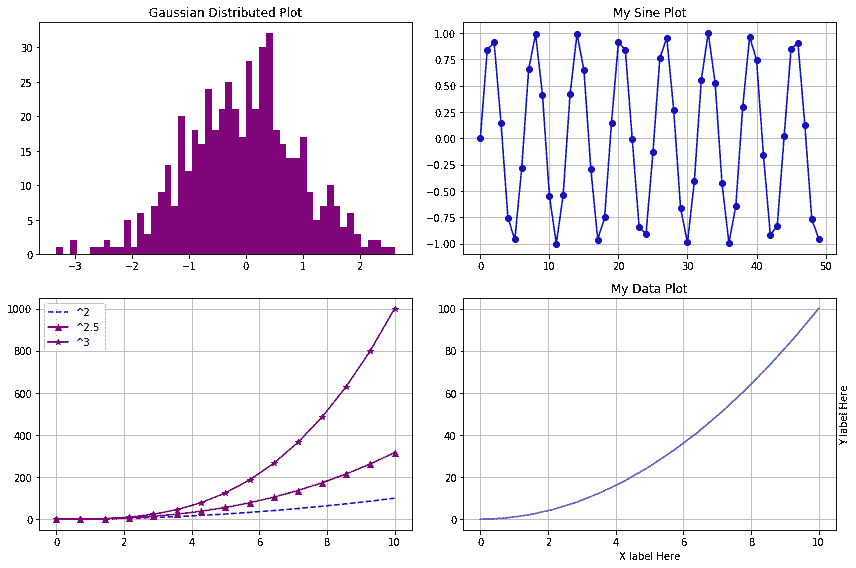

# matplotlib.pyplot 快速指南

> 原文：<https://medium.com/analytics-vidhya/quick-guide-to-matplotlib-pyplot-the-object-oriented-way-bc92ae470605?source=collection_archive---------11----------------------->

## 面向对象的方法

这篇文章的代码和文本也可以在 jupyter notebook 上找到，可以在这里找到。


来源——维基百科

> “一幅画胜过千言万语”

弗雷德·r·巴纳德说的在任何情况下都是正确的。视觉以简洁的方式传达更清晰的信息，特别是在数据科学和机器学习方面，可视化发挥着至关重要的作用。适当的可视化使庞大而复杂的数据更容易理解，更有意义。你可能会想，说了这么多关于图像的东西，我仍然在写这篇文字博客。好吧，我会尽我所能在可能的地方描绘出来。所以，回到主题…
**Matplotlib** 是 python 社区中最著名和最广泛使用的数据可视化工具。它的 **pyplot** 子模块是命令行风格函数的集合，使 matplotlib 像 MATLAB 一样工作。在本文中，我们将使用无状态方法(即面向对象的方法)浏览以下主题

*   面向对象方式的简单绘图
*   支线剧情的使用()
*   使情节吸引人
*   使用子情节的多个轴()

## 所以，让我们开始吧-

说到简单，在抽象层次上，您可以直接使用 matplotlib，只需将 pyplot 作为 plt 导入并使用 plot 函数。

```
import numpy as np
import matplotlib.pyplot as plt
%matplotlib inlinex = np.linspace(0,10,15)
y = x**2plt.plot(x,y)
```



但是使用面向对象的方法是更直观的方式，当一起处理多个轴和图形时会变得很方便。

*   首先，让我们创建一个图形对象。这代表一个空画布，您可以在其中添加一组轴来绘制一些东西。
*   现在，我们可以使用 add_axes()方法向图形添加一组轴。它以一个列表作为参数，该列表包含四个值— **左**、**底**、**宽**、**高**，即轴在画布中的位置。所有这些值都在 0 和 1 之间。
*   最后，您可以使用 plot()方法在轴上绘图。

```
fig = plt.figure()ax = fig.add_axes([0.1, 0.1, 0.8, 0.8])ax.plot(x,y)
```


这可能看起来比典型的方法更难，但是如果我说你不需要自己创建图形和添加轴呢？是的，这可以用**支线剧情()**函数来完成。 **plt.subplots()** 返回一个带有图形对象和轴数组(默认为单轴)的元组，可用于直接绘图。让我们把情节变得更有吸引力和可读性-

*   使用 grid()方法添加网格。
*   plot()方法中的“r —”参数用于红色虚线。
*   lw=2 将线宽设置为原始宽度的两倍。
*   marker='o '，markeredgecolor='blue '，markersize=10 表示标记形状为圆形，边缘颜色为蓝色，大小为 10。
*   指定地块的标题和标签。

```
fig, ax = plt.subplots()ax.grid() # for gridax.plot(x, y, ‘r — ‘, lw=2, marker=’o’, markeredgecolor=’blue’, markersize=10)ax.set_title(‘My Data Plot’)
ax.set_xlabel(‘X label Here’)
ax.set_ylabel(‘Y label Here’)
```



单组轴也可以用于绘制多个项目。可以通过给每个图添加标签来分隔这些图。当您调用 **ax.legend()** 方法时，这些标签显示为图例。还可以通过将 loc 参数添加到图例中来将位置添加到图例中。默认情况下，它被设置为最佳位置。

```
fig, ax = plt.subplots()ax.grid()
ax.plot(x, x**2, ‘b — ‘, label=’^2’)
ax.plot(x, x**2.5, ‘r’, marker=’^’, label=’^2.5')
ax.plot(x, x**3, ‘purple’, marker=’*’, label=’^2’)
ax.legend()ax.set_title(‘My Data Plot’)
ax.set_xlabel(‘X label Here’)
ax.set_ylabel(‘Y label Here’)
```



正如我前面提到的， **plt.subplots()** 返回一个带有图形对象和轴数组的元组。默认情况下，参数 *nrows* 和 *ncols* 被设置为 1，这就是为什么我们得到一个单轴对象。现在，将 *nrows* 和 *ncols* 的值更改为 2，我们将得到 *ax* 作为包含 4 个对象的轴的数组。

*注意:-* 您也可以通过向 *figsize* 参数传递一个元组来根据需要更改图形大小。该元组以英寸表示该图的*长度*和*宽度*。这里我取了 *figsize=(12，8)* 。

```
fig, ax = plt.subplots(nrows=2, ncols=2, figsize=(12,8))
```



看一下 *ax* 的形状、类型和内容，我们可以清楚地看到这是一把 2x2 numpy 的 ndarray。

```
print(ax.shape)
print(‘ — — — — — — — — — — — — — — — — — — — -’)
print(type(ax))
print(‘ — — — — — — — — — — — — — — — — — — — -’)
print(ax)
```



这些 AxesSubplots 对象可以简单地通过索引或迭代数组来访问。

```
fig, ax = plt.subplots(nrows=2, ncols=2, figsize=(12,8))a = np.random.randn(500)
ax[0][0].hist(a, bins= 50, color=’purple’)
ax[0][0].set_title(‘Gaussian Distributed Plot’)a = np.arange(50)
b = np.sin(a)
ax[0][1].grid()
ax[0][1].plot(a,b,’b’, marker=’o’)
ax[0][1].set_title(‘My Sine Plot’)ax[1][0].grid()
ax[1][0].plot(x, x**2, ‘b — ‘, label=’²’)
ax[1][0].plot(x, x**2.5, ‘r’, marker=’^’, label=’².5')
ax[1][0].plot(x, x**3, ‘purple’, marker=’*’, label=’³’)
ax[1][0].legend()ax[1][1].grid()
ax[1][1].plot(x,y)
ax[1][1].set_title(‘My Data Plot’)
ax[1][1].set_xlabel(‘X label Here’)
ax[1][1].yaxis.set_label_position(“right”)
ax[1][1].set_ylabel(‘Y label Here’)fig.tight_layout()
```



*注意:-**fig . tight _ layout()*用于确保两个轴子图不相互重叠。

希望这篇文章对你有帮助。敬请期待更多；)