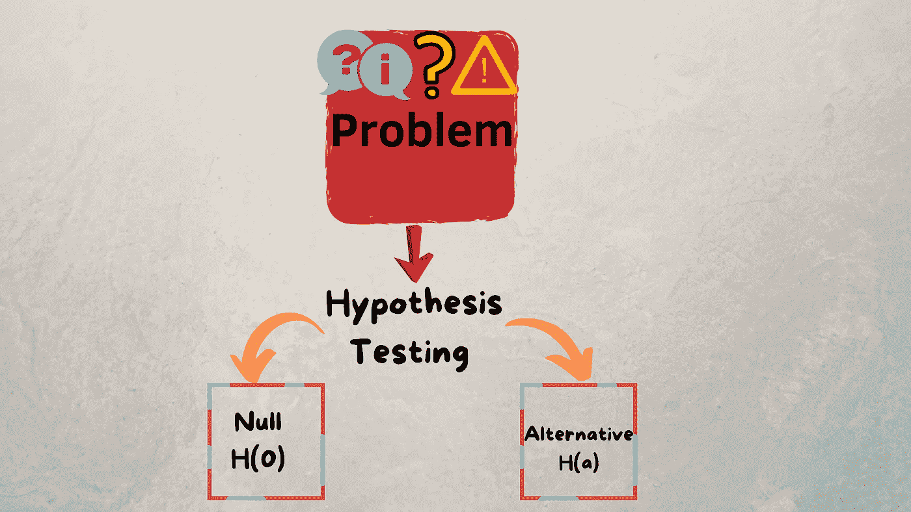
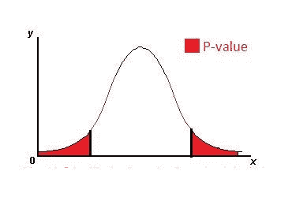

# 如何进行假设检验

> 原文：<https://medium.com/analytics-vidhya/quick-guide-to-perform-hypothesis-testing-75919fe9d60a?source=collection_archive---------16----------------------->

# 介绍

## 假设检验几乎对每个部门都是必要的，不仅限于统计学家或数据科学家。例如，如果我们开发一个代码，我们也执行测试。同样，对于一个组织展示的每一个产品或问题，都必须通过提供假设来解决。这可以通过“假设检验”来完成。

在此之前，让我们知道假设的确切含义:

> 假设被描述为对不符合当前理论的不确定事件的推荐解决方案。

假设检验的实际定义是，分析师通过假设检验关于总体参数的假设。分析师采用的方法取决于所用数据的性质和分析的原因。

# 执行假设检验的步骤:

1.  定义无效假设和替代假设
2.  检查数据，检查假设
3.  计算测试统计
4.  确定相应的 p 值
5.  对零假设做出决定。

为了执行所有这些步骤，让我们举一个例子来容易理解。

**问题:**考虑到生活在意大利的 18-30 岁年龄组的意大利成年人，男性的平均身体质量指数(身体质量指数)是否明显高于女性？

这里的人群是意大利的意大利成年人(18-30 岁),感兴趣的参数是身体质量指数(身体质量指数)

# 步骤 1:定义假设

*   **Null** :均值身体质量指数没有差异
    H(0):U1 = U2【U1 代表男性的人口均值身体质量指数，U2 代表女性的人口均值身体质量指数】
    这里 H(0)表示彼此相等
*   **替代:**平均身体质量指数有显著差异

【U1 代表男性的人口平均数身体质量指数，U2 代表女性的人口平均数身体质量指数】
这里 H(A)表示他们彼此不相等

*   显著性水平= 5%

# 步骤 2:检查数据并检查假设

在这一步中，数据被过滤，只包括年龄在 18 到 30 岁之间的意大利成年人。在此之后，我们需要做一些统计计算，如平均值，最小值，最大值，标准偏差，以及男性和女性的样本量。

我们需要检查的一些假设如下:

*   样本被认为是简单的随机样本
*   样本是相互独立的
*   两个群体的反应是近似正常的或样本量都足够大。

# 步骤 3:计算测试统计数据:

检验统计量是根据估计的标准误差来衡量样本统计量与假设总体参数的差距。

*   Z=最佳估计值-空值/估计标准误差
*   最好的估计是男性和女性统计样本均值之间的差异
*   空值是假设的空值
*   两个平均值的估计标准误差会根据我们要使用的方法而变化。
*   您可以使用的两种方法是池化方法和非池化方法。
*   混合方法是假设两个总体的方差相等。
*   无池方法是放弃方差相等的假设。

# 步骤 4:确定 P 值:

p 值是通过假设零假设为真来确定的，它是观察值(Z)或更极端值的检验统计的概率。

所以我们将使用 Z 分布来计算这个概率，其中 d*f*= n1+N2–2

我们需要检查两边，因为这是一个两边的选择假设，因为我们的选择也不相等。所以，我们必须检查分布的上下尾部。

分布图如下所示，带有相应的样本大小和自由度:

分布曲线

从上图中，我们可以看到正的测试统计值和负的测试统计值。这意味着，如果男性和女性之间的总体均值身体质量指数差异真的为零，那么如果零假设为真，那么观察到检验统计值的样本均值差异或更极端的情况是相当可能的。几乎有 20%的可能性会看到，因为这个值太大了，我们将继续下去，无法拒绝空值。

# 第五步:做出决定

如果 P 值大于显著性水平，这意味着有微弱的证据反对零。因此，我们不能拒绝零假设。

因此，总而言之，假设检验被用来检验关于感兴趣的参数的理论。在这里，这个参数就是总体均值的差异。进行假设检验的基本步骤。首先，我们要定义我们的假设。然后，我们将检查我们的数据，同时检查我们的假设和计算我们的测试统计。有了这个测试统计，我们将确定我们相应的 p 值，最后，我们将根据这个值作出决定。

总体均值的双样本 t 检验的假设是，我们需要两组数据都是两个简单的随机样本，并且它们需要彼此独立。我们需要确保两个群体的回答都是正态分布的。如果没有，我们需要确保我们至少有一个大的样本量，这样我们就可以应用中心极限定理。我们的总体方差是否相等也是决定我们是使用集合方法还是非集合方法的关键。最后，我们需要知道如何解释 p 值、决策和我们的最终结论。在进行假设检验时，这些都是非常重要的。

如需更多文章，请查看以下简介:

https://likhithakakanuru.medium.com/