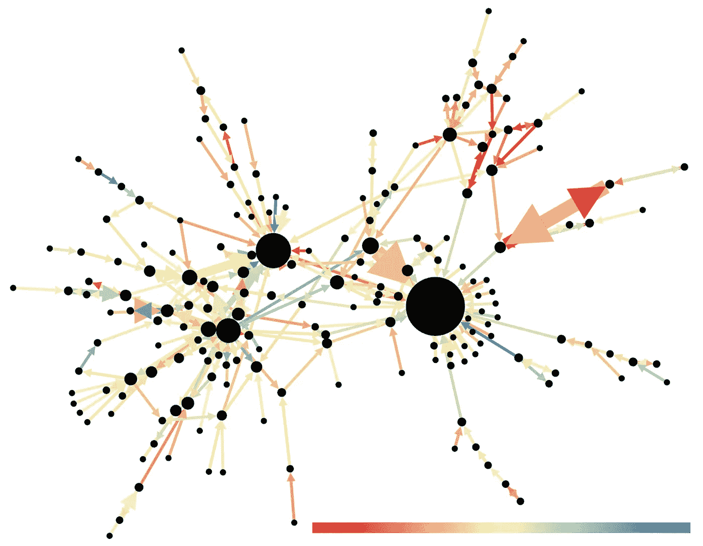
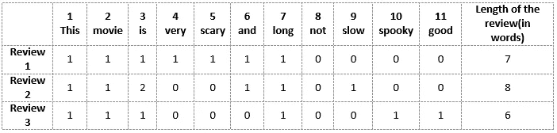
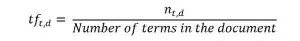
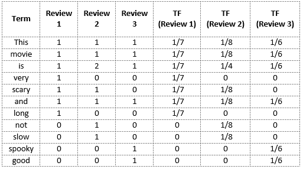
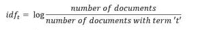
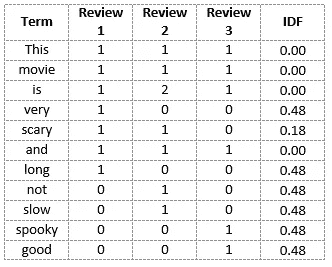
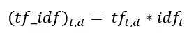
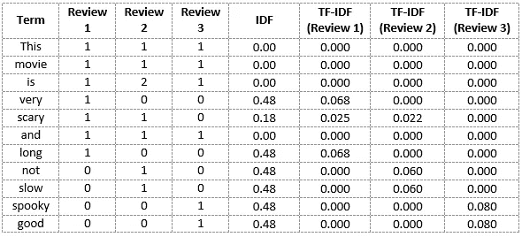

# 快速介绍用于从文本创建特征的词袋(BoW)和 TF-IDF

> 原文：<https://medium.com/analytics-vidhya/quick-introduction-to-bag-of-words-bow-and-tf-idf-for-creating-features-from-text-46912dce0cd9?source=collection_archive---------6----------------------->

## 让机器理解文本的挑战

语言是一种奇妙的交流媒介。

你和我会在瞬间理解这句话。但是机器无法处理原始形式的文本数据。他们需要我们将文本分解成机器容易阅读的数字格式(自然语言处理背后的想法！).

抄送:西沃恩·格雷森/抄送 BY-SA(【https://creativecommons.org/licenses/by-sa/4.0】T2

这就是单词袋(BoW)和 TF-IDF 的概念发挥作用的地方。BoW 和 TF-IDF 都是帮助我们将文本句子转换成数字向量的技术。

在本文中，我将同时讨论单词袋和 TF-IDF。我们将使用一个直观和通用的例子来详细理解每个概念。

*自然语言处理(NLP)新手？我们为您提供了完美的入门课程:*

*   [*【自然语言处理(NLP)入门】*](https://courses.analyticsvidhya.com/courses/Intro-to-NLP) *—免费课程！*
*   [*使用 Python 的自然语言处理(NLP)*](https://courses.analyticsvidhya.com/courses/natural-language-processing-nlp)*—全面的端到端 NLP 课程*

# 让我们举个例子来理解词袋(BoW)和 TF-IDF

我将举一个流行的例子来解释本文中的词袋(BoW)和 TF-DF。

我们都爱看电影(程度不同)。在我决定看电影之前，我总是倾向于看电影的评论。我知道你们很多人也是这样做的！所以，我在这里用这个例子。

抄送[[https://www.piqsels.com/en/public-domain-photo-stmmn]](https://www.piqsels.com/en/public-domain-photo-stmmn)

以下是对一部特定恐怖电影的评论样本:

*   评论 1:这部电影很恐怖，很长
*   点评 2:这部电影不恐怖，节奏慢
*   评论 3:这部电影很恐怖，很好

你可以看到有一些关于这部电影的对比评论，以及电影的长度和节奏。想象一下看一千篇这样的评论。显然，我们可以从中获得许多有趣的见解，并以此为基础来衡量这部电影的表现。

然而，正如我们在上面看到的，我们不能简单地将这些句子交给机器学习模型，并要求它告诉我们评论是积极的还是消极的。我们需要执行某些文本预处理步骤。

单词袋和 TF-IDF 是如何做到这一点的两个例子。

# 从文本创建矢量

你能想出一些我们可以用来在开头向量化一个句子的技术吗？基本要求是:

1.  它不应该产生稀疏矩阵，因为稀疏矩阵会导致高计算成本
2.  我们应该能够记住句子中的大部分语言信息

单词嵌入就是这样一种技术，我们可以用向量来表示文本。更流行的单词嵌入形式有:

1.  BoW，代表单词袋
2.  TF-IDF，代表术语频率-逆文档频率

现在，让我们看看如何将上述电影评论表示为嵌入，并为机器学习模型做好准备。

# 单词袋(蝴蝶结)模型

单词袋(BoW)模型是最简单的单词表示形式。就像这个术语本身一样，我们可以将一个句子表示为一个单词包向量(一串数字)。

让我们回忆一下之前看到的三种类型的影评:

*   评论 1:这部电影很恐怖，很长
*   点评 2:这部电影不恐怖，节奏慢
*   评论 3:这部电影很恐怖，很好

我们将首先从所有文档中的单词语料库中构建一个词汇表。词汇由这 11 个词组成:“这个”、“电影”、“是”、“非常”、“吓人”、“长”、“不”、“慢”、“装神弄鬼”、“好”。

我们现在可以将这些单词中的每一个用 1 和 0 来标记它们在上面三个文档中的出现。这将为我们提供 3 个文档的 3 个向量:

这就是单词袋(BoW)模型背后的核心思想。

## 使用单词袋(BoW)模型的缺点

在上面的例子中，我们可以有长度为 11 的向量。然而，当我们遇到新的句子时，我们开始面临问题:

1.  如果新句子的长度更长，我们的词汇量会增加，因此，向量的长度也会增加
2.  新的句子可能包含更多的未知单词，如果我们保持固定的向量大小，我们必须忽略它们
3.  此外，向量也将包含许多 0，从而导致一个稀疏矩阵(这是我们想要避免的)
4.  我们不保留句子的语法信息，也不保留实际文档中单词的顺序信息

# 术语频率-逆文档频率(TF-IDF)

我们先围绕 TF-IDF 放一个正式的定义。维基百科是这样说的:

> *词频(Term frequency)——逆文档频率(inverse document frequency)，是一种数字统计，旨在反映一个词对集合或语料库中的文档有多重要。*

## 术语频率(TF)

术语频繁度(TF)是术语 t 在文档 d 中出现频率的度量:

***这里，在分子中，n 是术语“t”在文档“d”中出现的次数。因此，每个文档和术语都有自己的 TF 值。***

我们将再次使用我们在单词袋模型中构建的相同词汇来展示如何计算复习#2 的 TF:

*点评 2:这部电影不恐怖，速度慢*

这里，

*   词汇 **:** '这个'，'电影'，'是'，'非常'，'吓人'，'长'，'不'，'慢'，'装神弄鬼'，'好'
*   复习 2 的字数= 8
*   单词‘this’的 TF =(评论 2 中‘this’出现的次数)/(评论 2 中的术语数)= 1/8

同样的，

*   TF('电影')= 1/8
*   TF('is') = 2/8 = 1/4
*   TF('very') = 0/8 = 0
*   TF('吓人')= 1/8
*   TF('and') = 1/8
*   TF('long') = 0/8 = 0
*   TF('not') = 1/8
*   TF('慢')= 1/8
*   TF('幽灵')= 0/8 = 0
*   TF('好')= 0/8 = 0

我们可以用这种方式计算所有术语和所有评论的术语频率:

## 反向文档频率(IDF)

这是衡量一个术语有多重要的标准。我们需要 IDF 值，因为仅计算 TF 不足以理解单词的重要性:

我们可以计算复习 2 中所有单词的 IDF 值:

IDF('this') = log(文档数/包含单词' this') = log(3/3) = log(1) = 0

同样的，

*   IDF('电影'，)= log(3/3) = 0
*   IDF('is') = log(3/3) = 0
*   IDF('非')= log(3/1) = log(3) = 0.48
*   IDF('吓人')= log(3/2) = 0.18
*   IDF('和')= log(3/3) = 0
*   IDF(‘慢’)= log(3/1)= 0.48

我们可以像这样计算每个单词的 IDF 值。因此，整个词汇表的 IDF 值将是:

**于是，我们看到像“是”、“这”、“和”等这样的词。，降为 0，重要性不大；而像“吓人”、“长”、“好”等词。是更重要的词，因此具有更高的价值。**

我们现在可以计算语料库中每个单词的 TF-IDF 分数。分数较高的单词更重要，分数较低的单词不太重要:

我们现在可以计算复习 2 中每个单词的 TF-IDF 分数:

TF-IDF('这个'，点评 2) = TF('这个'，点评 2) * IDF('这个')= 1/8 * 0 = 0

同样的，

*   TF-IDF('电影'，评论 2) = 1/8 * 0 = 0
*   TF-IDF('is '，审查 2) = 1/4 * 0 = 0
*   TF-IDF('非'，审查 2) = 1/8 * 0.48 = 0.06
*   TF-IDF('吓人'，点评 2) = 1/8 * 0.18 = 0.023
*   TF-IDF('and '，Review 2) = 1/8 * 0 = 0
*   TF-IDF('慢速'，审查 2) = 1/8 * 0.48 = 0.06

类似地，我们可以针对所有评论计算所有单词的 TF-IDF 分数:

我们现在已经获得了词汇的 TF-IDF 分数。TF-IDF 也为不太频繁的单词给出较大的值，并且当 IDF 和 TF 值都高时，即该单词在所有组合的文档中很少，但是在单个文档中很频繁时，TF-IDF 也很高。

# 结束注释

让我总结一下我们在文章中涉及的内容:

1.  单词包只是创建一组包含词汇单词及其在文档中出现次数的向量，而 TF-IDF 模型包含关于更重要的单词和不太重要的单词的信息。
2.  单词袋模型可以用于更简单的任务，因为它易于理解和解释。然而，对于更复杂的任务，我们需要 TF-IDF。

虽然单词袋和 TF-IDF 在各自方面都很受欢迎，但在理解单词的上下文方面仍然存在空白。检测单词“幽灵”和“恐怖”之间的相似性，或者将我们给定的文档翻译成另一种语言，需要关于文档的更多信息。

这就是诸如 Word2Vec、连续单词包(CBOW)、Skipgram 等单词嵌入技术的地方。进来吧。你可以在这里找到这种技术的详细指南:[对单词嵌入的直观理解:从计数向量到 Word2Vec](https://www.analyticsvidhya.com/blog/2017/06/word-embeddings-count-word2veec/)

参考资料:

1.  https://en.wikipedia.org/wiki/Tf%E2%80%93idf
2.  [https://mael fabien . github . io/machine learning/NLP _ 2/# 2-term-frequency-inverse-document-frequency-TF-IDF](https://maelfabien.github.io/machinelearning/NLP_2/#2-term-frequency-inverse-document-frequency-tf-idf)
3.  [https://www . analyticsvidhya . com/blog/2017/06/word-embeddings-count-word 2 veec/](https://www.analyticsvidhya.com/blog/2017/06/word-embeddings-count-word2veec/)

你也可以在分析 Vidhya 的 Android 应用上阅读这篇文章

*原载于 2020 年 2 月 27 日 https://www.analyticsvidhya.com**的* [*。*](https://www.analyticsvidhya.com/blog/2020/02/quick-introduction-bag-of-words-bow-tf-idf/)