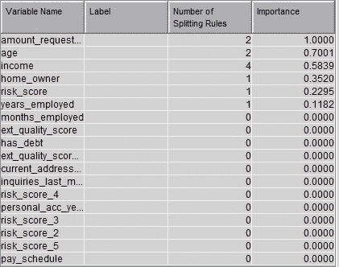

# SAS Enterprise Miner 快速说明

> 原文：<https://medium.com/analytics-vidhya/quick-notes-on-sas-enterprise-miner-d4c3b9868db2?source=collection_archive---------4----------------------->

# 1.问题陈述

本练习的目标是确定销售线索签署贷款的可能性。大多数贷款公司通过分析申请人的财务历史来决定是否贷款。目标受众是那些申请了贷款的人。目标是开发一个模型来预测申请人的质量。在这种情况下，这将是一个决策树。

我们想预测申请人是否会完成入职流程。数据集中的目标变量称为电子签名。

# 2.数据

我们从内部团队开发的算法中获得一组风险分数。我们还将从外部团队获得一些质量分数。根据这些数据，我们可以开发一个模型来预测电子签名。

条目 id —此变量用于标识用户

年龄—用户的年龄

支付时间表——申请人多长时间获得一次支付(每周一次、每两周一次等)

房主-如果申请人拥有一所房子，则为 1，否则为 0

收入——申请人的月收入

任职年限—员工在当前工作岗位上的工作年限

年地址—此人在当前地址居住的年数

个人账户年数—个人持有当前账户的年数

有债务-如果申请人有未清偿债务，则为 1，否则为 0

申请金额–用户申请的金额

风险得分/风险得分 2 /风险得分 3 /风险得分 4 /风险得分 5 —内部团队给出了五个风险得分

外部质量分数/外部质量分数 2 —这是我们从外部团队获得的两个风险分数

上个月的调查——申请人的信用评分被严格检查了多少次

e signed — 1 表示申请人已完成电子签名流程，否则为 0。这是目标变量。

图 1:数据的内容

# 3.任务

**1。** **创建新的 SAS EM 项目**

**2。** **为数据定义一个新的 SAS 库**

**3。** **定义一个新的 SAS EM 数据源**

**4。** **创建新的 SAS EM 流程图**

**5。** **在流程图上放置一个输入数据源**

6。 **资源管理器输入数据集中变量的统计属性**

**7。** **训练一棵完整的决策树**

# 3.1.创建新的 SAS EM 项目

在 SAS EM 中，您可以将工作保存在项目中。一个项目包含一个或多个流程图以及与其相关的信息。

要创建新项目-

启动 SAS EM

点击创建新项目

输入项目名称

图 2:创建一个新的 SAS EM 项目

# 3.2.为数据定义新的 SAS 库

为了使用 SAS EM 访问数据，必须定义库。库是服务器或计算机上存储数据的位置。当您创建库时，您给 SAS 一个快捷方式名称和一个指向该位置的指针。

要创建新的 SAS 库-

转到 SAS EM 菜单

选择文件à新库

为您的库命名

图 3:为数据定义一个新的 SAS 库

# 3.3.定义新的 SAS EM 数据源

SAS EM 数据源包含定义和配置输入数据集的数据和元数据。

要创建新的 SAS EM 数据源-

输入<library>。<dataset name=""></dataset></library>

将打开列元数据表编辑器

您需要定义— ID、目标、输入和拒绝

图 4:定义新的 SAS EM 数据源

图 5:定义元数据

# 3.4.创建新的 SAS EM 流程图

现在我们需要为数据挖掘练习创建一个流程图。

创建新的 SAS EM 流程图——

选择文件新建图表

输入图表名称

打开图表工作区

# 3.5.将输入数据源放在流程图上

我们希望将数据源添加到图表工作区。它将是练习的输入数据节点。将输入数据源拖到图表工作区。

图 6:在流程图中放置一个输入数据源

# 3.6.浏览输入数据集中变量的统计属性

可视化输入数据有助于您在构建模型之前观察可能的模式并检查缺失值。在本例中,“请求金额”的价值最高。

探索统计属性–

探险家à国家探索

将输入数据连接到 StatExplore

属性面板à卡方统计à区间变量(是)

卡方图对前 20 个变量进行排序

变量价值图根据输入变量在预测目标变量时的价值对其进行排序

在 SAS 输出中，您将看到每个变量缺失值的计数

图 7:浏览输入数据集中变量的统计属性

图 8:缺失值(数字)

图 9:缺失值(分类)

# 3.7.自动训练完整的决策树

决策树模型很好地适应了输入变量和一个或多个目标变量之间的非线性关联。

决策树–

模型+决策树

属性面板à拆分规则(最大深度= 5) à节点(叶大小= 900)

> o 最大深度=独立变量计数的 sqrt ~ 5
> 
> o 叶片大小=观察数量的 5 %~ 900

视图à模型à节点规则

图 10:完整的流程图

图 11:可变的重要性

图 12:自动训练一个完整的决策树

# 4.给数据打分

最后，你需要给你的数据打分。

对数据进行评分–

评估得分

右键单击运行结果

优化的 SAS 代码à复制 SAS 代码

程序编辑器

定义库并粘贴代码

图 13:对数据评分

图 14:程序编辑器

图 15:混淆矩阵

# 5.参考

SAS 企业矿工视频–

[https://video.sas.com/category/videos/sas-enterprise-miner](https://video.sas.com/category/videos/sas-enterprise-miner)

资料组

[https://www . superdata science . com/pages/machine-learning-practical](https://www.superdatascience.com/pages/machine-learning-practical)