# Tableau 快速笔记

> 原文：<https://medium.com/analytics-vidhya/quick-notes-on-tableau-8596f1b6009?source=collection_archive---------7----------------------->

Tableau 是一个用于可视化分析数据的商业智能工具。使用 Tableau，用户可以创建可共享的交互式仪表板，以图形和图表的形式显示趋势和变化。它可以连接到文件、大数据和关系源来获取数据并处理它们，一切都非常轻松。

本文涵盖的主题:

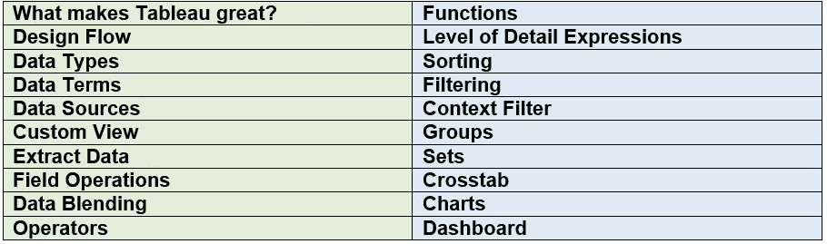

# 1.是什么让画面如此精彩？

不需要预先的技术知识。

可以连接到各种数据源，包括 **MS Excel、web 数据和仓库**。

它可以在几秒钟内而不是几个月或几年内制作出交互式的可视演示。

数据可视化有助于业务增长和利润。

它提供了很好的商业洞察力。

简单的拖拽界面，简单易学易操作。

# 2.设计流量

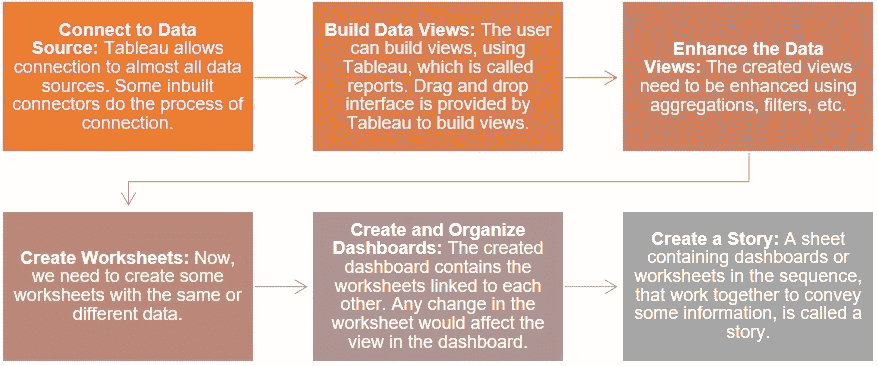

# 3.数据类型

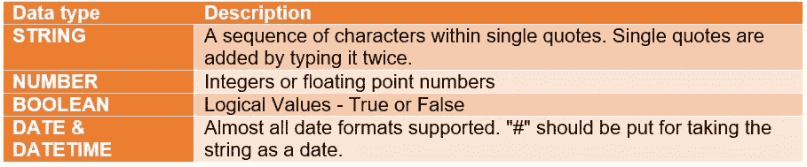

# 4.数据术语

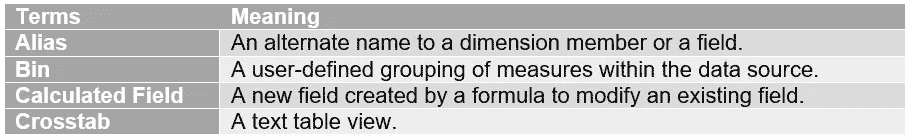

# 5.数据源

Tableau 支持几乎所有流行的数据源。其中一些包括:

文件系统:CSV、Excel 等。

Rational 数据库:Oracle、SQL Server、DB2 等。

云系统:Windows Azure，Google BigQuery 等。

使用 ODBC 的其他源。

# 6.自定义视图

自定义数据视图用于通过一些附加功能扩展普通数据视图。一些常用的自定义视图包括:

**下钻视图:**如果字段是层次结构的一部分，我们可能需要知道上一级或下一级聚合的结果。右键单击表格标题，然后从上下文菜单中单击“向下钻取”以向上和向下钻取。

**交换维度:**我们可以从现有的视图中创建一个新的视图。交换维度的位置将完成这项任务。您可以执行此任务，方法是单击“类别”列末尾的垂直线，并将其拖动到“段”列。

# 7.提取数据

可以使用数据提取来创建数据子集。Tableau 的数据提取功能用于离线访问数据。

**创建提取:**点击数据菜单中的提取数据选项，即可创建提取。

**应用提取过滤器:**可以创建过滤器来从数据源中提取数据子集。为此，单击过滤器选项中的从列表中选择选项，并勾选您需要数据的复选框。

**向提取添加新数据:**要向已创建的提取添加更多数据，单击数据> >提取> >从文件中提取数据，然后浏览文件并单击确定按钮。

**提取历史:**点击数据菜单中的提取历史可查看提取历史。

# 8.野战

Tableau 提供了许多功能来操作数据平面中的字段。下面讨论一些重要的现场操作:

**将字段添加到工作表:**要将字段添加到工作表，单击鼠标右键，然后单击添加到工作表选项。

**合并两个字段:**点击鼠标右键，从创建菜单中选择创建合并字段选项，即可创建一个合并字段。创建的字段的名称将是组合字段的组合。

**搜索字段:**搜索选项由 Tableau 提供，用于搜索字段的名称。

**重新排序字段:**通过上下拖动可以改变字段的位置。

# 9.数据混合

当我们希望在单个视图中分析来自多个数据源的相关数据时，数据混合功能非常有用。这是 Tableau 的一个引人注目的特点。数据混合涉及的步骤:

**准备数据进行混合:**点击数据> >新建数据源，然后选择数据源。

**添加辅助数据源:**对于添加辅助数据源，按照同样的步骤>数据>新建数据源，然后选择数据源。

**数据融合:**现在，可以整合来自上述来源的数据。

# 10.经营者

任何告诉编译器执行一些数学或逻辑运算的符号都是运算符。
Tableau 支持不同的运算符来创建公式和计算字段。
Tableau 支持的不同运算符包括:

> o 一般运算符(+，-)
> 
> o 算术运算符(*、/、%、^)
> 
> o 比较运算符(==，=，！=，<>，>，
> 
> o Logical Operators (AND, OR, NOT)

# 11\. Functions

In Tableau, the calculations are applied to the fields being analyzed using the **计算编辑**。Tableau 有许多帮助创建表达式的内置函数。其中一些讨论如下:

**数字函数:**用于数值运算。它们只接受数值作为输入。数字函数的例子包括:

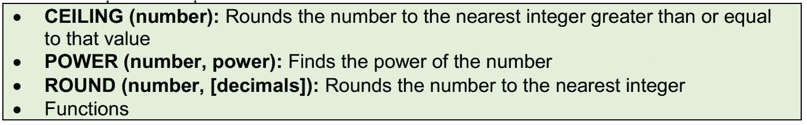

**字符串函数:**用于字符串操作。

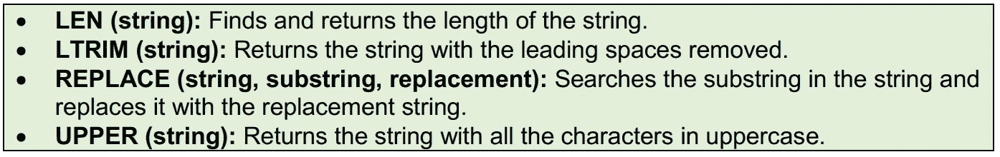

**逻辑功能:**对表达式求值并给出一个布尔输出。

**日期函数:** Tableau 有很多日期函数。

**聚合函数**

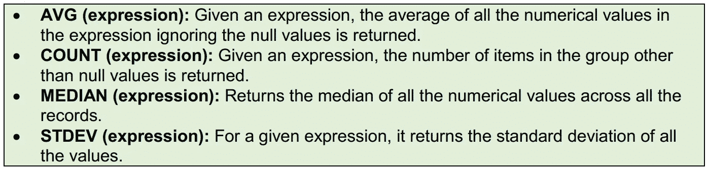

# 12.详细等级表达式

详细等级表达式(也称为 LOD 表达式)允许您在数据源级别和可视化级别计算值。然而，LOD 表达式可以让您更好地控制想要计算的粒度级别。它们可以在更细粒度的级别(包含)、更细粒度的级别(排除)或完全独立的级别(固定)执行。LOD 表达式的类型:
**固定 LOD 表达式:**使用指定的尺寸计算值，而不参考视图中的其他表达式。
**包含 LOD 表达式:**除了视图中的表达式，它还使用指定的尺寸计算值。
**排除 LOD 表达式:**从视图级别中减去尺寸。

# `13\. Sorting`

排序是数据分析的一个重要特征。Tableau 允许对字段中的数据进行排序，称为维度。Tableau 中有两种排序:
**计算排序:**在这种排序中，选择要排序的字段，然后使用排序对话框应用排序。
**手动排序:**这里需要通过一个接一个的拖拽来手动定位字段。

# `14\. Filtering`

筛选是从结果集中删除一个值或一系列值的过程。Tableau 既支持简单的过滤器，也支持基于上下文的或高级的计算过滤器。Tableau 中有三种类型的过滤器。分别是:
**筛选维度:**筛选应用于维度字段
**筛选度量:**筛选应用于度量字段
**筛选日期:**筛选应用于日期字段

# `15\. Context Filter`

有些情况下，我们需要一个进程处理另一个过滤器返回的记录。
这里，第二个过滤器被称为相关过滤器，因为它处理通过上下文过滤器传递的数据。上下文过滤器的目的:
提高性能
创建一个相关的数字或前 N 名过滤器

# `16\. Groups`

Tableau 允许创建组来组合字段中的相关成员。
小组帮助我们纠正错误，回答“如果…会怎样”的问题。
在 Tableau 中创建了一个组后，您仍然可以选择将所有剩余成员分组到一个名为“其他组”的组中。创建其他组的步骤包括:
您可以对添加的组进行修改。这些更改可能是:添加或删除组成员、创建新组、更改默认组名以及更改分组字段的名称。

# `17\. Sets`

在某些条件下定义数据子集的自定义字段称为集合。它可用于比较和询问有关数据子集的问题。

**创建集合**
在数据窗格中右键单击维度下的字段，然后选择创建>集合。
在随后的创建器械包对话框中配置您需要的器械包。
然后点击确定按钮。

**合并集合**
在数据窗格中的集合下选择您想要合并的两个集合。
右键单击器械包后，单击创建组合器械包。
现在，您可以看到“创建集合”对话框。为合并的集合命名，验证集合并选择如何合并两个集合。
最后，点击确定按钮。

**编辑集合**编辑它包含的值
改变集合的名称

# 18.交叉表

Tableau 中的交叉表也称为文本表。交叉表由一个或多个维度以及一个或多个度量组成。它可以对测量字段的值执行各种计算。

# 19.图表

本节重点介绍 Tableau 中不同种类的图表。将涉及的分主题包括:

**条形图**

**气泡图**

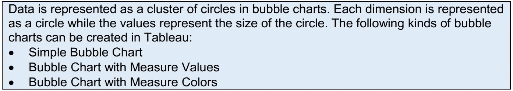

**散点图**

**甘特图**

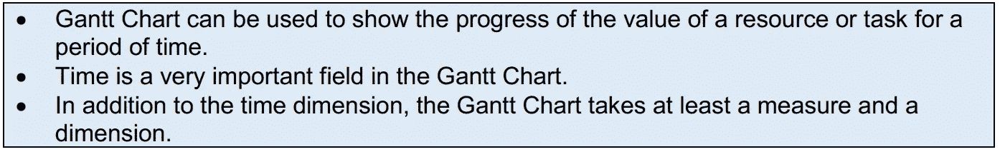

**直方图**

**树形图**

**凹凸图**

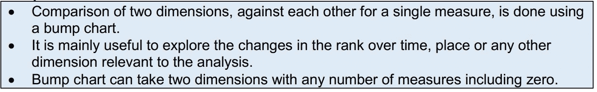

**瀑布图**

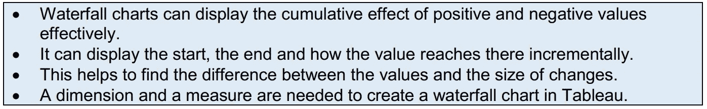

# 20.仪表盘

仪表板是许多工作表及其相关信息在一个位置的综合视图。
这有助于同时监控和比较各种数据。
我们可以同时查看不同的数据视图。