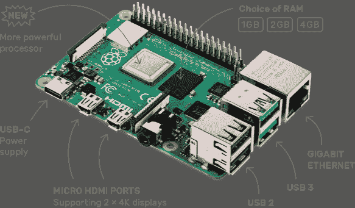
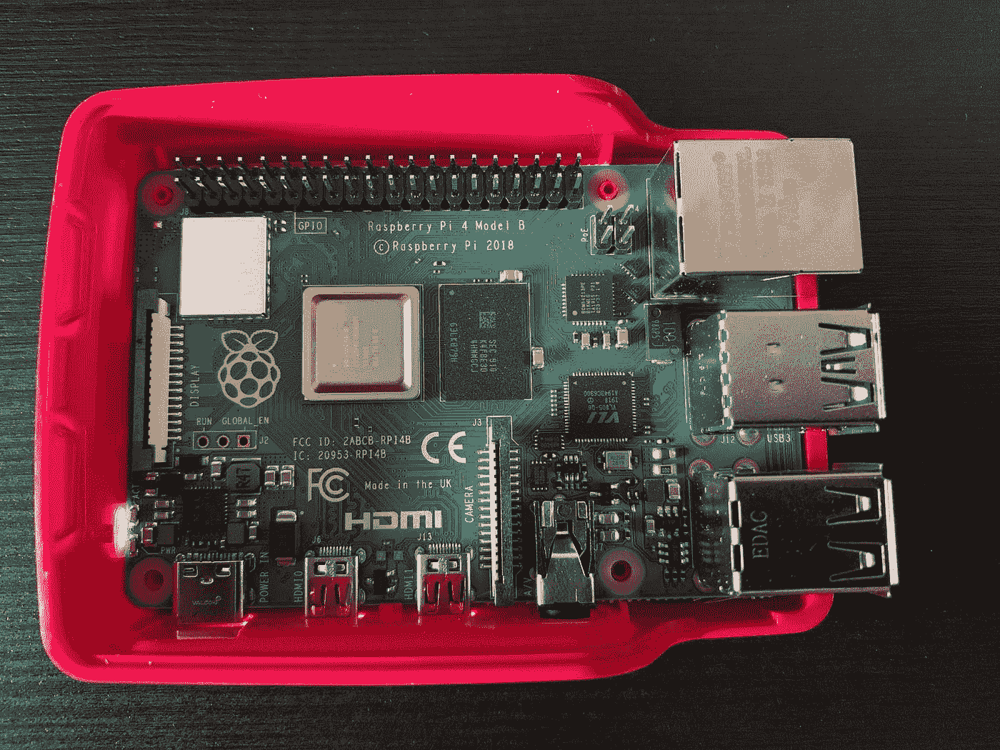
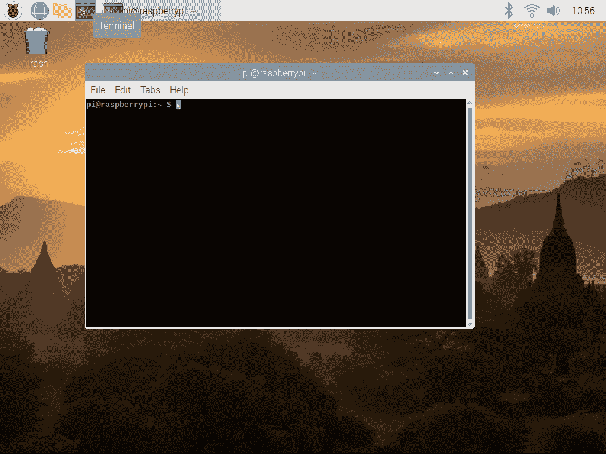
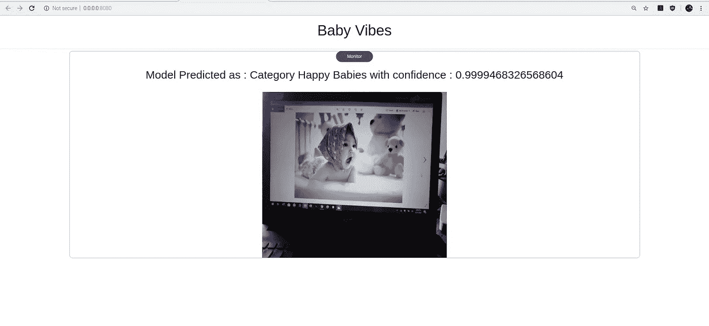

# 在 Raspberry Pi 4 上安装 PyTorch 和 fastai 的快速设置说明

> 原文：<https://medium.com/analytics-vidhya/quick-setup-instructions-for-installing-pytorch-and-fastai-on-raspberry-pi-4-5ffbe45e0ae3?source=collection_archive---------4----------------------->

## PyTorch 和 fastai 在 Raspberry Pi 4 Model B 上进行深度学习任务，如图像分类和对象检测。



来源:[https://www . raspberry pi . org/products/raspberry-pi-4-model-b/](https://www.raspberrypi.org/products/raspberry-pi-4-model-b/)

Y 是的，就像每个刚刚开始用树莓 Pi 测试其深度学习模型的人一样，甚至我也太兴奋和好奇了，以至于在我从[Amazon.com](https://www.amazon.com/CanaKit-Raspberry-Starter-32GB-Official/dp/B07VDGKN51)带来的全新树莓 Pi 4 model B 上部署了我用深度学习库 PyTorch 和 fastai 构建的图像分类器 [Baby_Vibes](https://github.com/SriramyaK/Baby-Vibes-Pytorch-fastai-Raspberry-pi-4)

在我开始使用我的模型推理之前，还没有清晰的文档可以用来在 Python 3.7 上用 Pytorch 和 Fastai 设置 Raspberry Pi 4。然而，我发现这个来自 [fastai](https://forums.fast.ai/t/deployment-on-raspberry-pi/52935/2) 论坛的讨论链接对入门非常有用。

让我们快速了解我们在处理什么—

**py torch 是什么？**


来源:[https://pytorch.org/](https://pytorch.org/)

> PyTorch 是一个基于 Torch 库的开源机器学习库，用于计算机视觉和自然语言处理等应用。它主要由脸书人工智能研究实验室开发。它是在修改后的 BSD 许可下发布的免费开源软件。

现在有几个 PyTorch 在线教程和 YouTube 视频，但仍然是我的最爱:官方 PyTorch 教程[和 fastai——程序员实用深度学习，v3](https://pytorch.org/tutorials/)

**什么是 Fast.ai？**


来源:[https://www.fast.ai/](https://www.fast.ai/)

> fastai 是一个现代深度学习库，[可从 GitHub](https://github.com/fastai/fastai) 获得，作为 Apache 2 许可下的开源，可以使用 conda 或 pip 包管理器直接安装。它包括[完整的文档和教程](https://docs.fast.ai/)，是《fastai 和 PyTorch 程序员的*深度学习:没有博士学位的 ai 应用* (Howard 和 Gugger [2020](https://www.fast.ai/2020/02/13/fastai-A-Layered-API-for-Deep-Learning/#ref-dlbook) )这本书的主题。

**最后，什么是树莓派 4？**

> 你的微型双显示器台式电脑
> 
> …机器人大脑、智能家庭中枢、媒体中心、联网人工智能核心、工厂控制器等等..



树莓 Pi 4 型号 B

下面是我们将要安装的库/包-

1.  Python 3.7
2.  PyTorch 依赖项
3.  火炬
4.  火炬视觉
5.  fast.ai
6.  fast.ai 依赖项

**注意:**如果这是您第一次打开您的树莓 Pi，请参考[树莓 Pi 4 入门视频](https://www.youtube.com/watch?v=BpJCAafw2qE&t=749s)并完成初始启动。完成后，打开“终端”，如下图所示-



树莓 Pi 4 型号 B 终端屏幕

运行以下命令，获取搜索兼容 PyTorch 轮所需的 Pi 的 **ARM 处理器配置**

```
uname -a
```

如果输出是 **armv7l GNU/Linux** 继续安装。

**等等！！！什么是 ARM 处理器，它与我们大多数台式机中的英特尔处理器有何不同？？**

> **ARM(高级 RISC(精简指令集计算)机器)**一直是现代微处理器和嵌入式设计的中心。
> 
> ARM 处理器广泛应用于智能手机、平板电脑、多媒体播放器等消费类电子设备以及可穿戴设备等其他移动设备。由于其精简的指令集，它们需要更少的晶体管，这使得集成电路(IC)的芯片尺寸更小。
> 
> 另一方面，英特尔处理器属于 CISC 家族，代表复杂指令集计算。
> 
> 与 RISC 计算机不同，CISC 上可用的指令更侧重于执行具有很大灵活性的复杂任务。就英特尔而言，它主要生产面向高性能和高吞吐量环境的处理器，包括台式机、笔记本电脑、服务器，甚至超级计算机。

如果您有兴趣了解更多信息，请阅读此内容— [了解 ARM 和 x86 处理内核之间的差异](https://www.allaboutcircuits.com/news/understanding-the-differences-between-arm-and-x86-cores/)。

所以这就是为什么我们不能从我们的 PC/笔记本电脑/标准 x86_64 机器直接使用 python 包到我们的 Raspberry Pi 中的原因，因为它与 Pi 的处理器架构不兼容，相反，安装在 Pi 中的 python 包应该针对其特定架构进行编译。

也就是说，在 Raspberry Pi 上安装 PyTorch 有两种方式:

1.  构建 PyTorch 来源:如果你对此感兴趣，请参考令人惊叹的博客— [为树莓 Pi 板构建 py torch](https://nmilosev.svbtle.com/compling-arm-stuff-without-an-arm-board-build-pytorch-for-the-raspberry-pi)
2.  使用一些伟大的人为我们做了所有艰苦工作的人上传的预制 PyTorch 轮子。

我们将使用简单的选项 2，并使用由其他兼容 armv7l GNU/Linux 的人上传的预建 PyTorch 轮子。

因此，继续下载 [torch-1.3](https://wintics-opensource.s3.eu-west-3.amazonaws.com/torch-1.3.0a0%2Bdeadc27-cp37-cp37m-linux_armv7l.whl) 和 [torchvision-0.4](https://drive.google.com/uc?export=download&id=1nhk7PKDUzcmGGwnx7PK7iW3__2fOJVl1) wheel 文件，并使用 USB 将其复制到您的 pi 中，或者使用您的 Pi 中的 chromium 浏览器直接从链接中下载。

Python 有两种风格，Python 2x 和 Python 3x。我们将在我们的安装中使用 Python3x。

在终端窗口中，通过键入以下内容检查 python 3.7:

```
python3 --version
```

如果您获得的 python 版本为 3.7，请继续安装，否则请参考[如何在 Raspberry Pi 上安装 Python 3.7](https://installvirtual.com/install-python-3-7-on-raspberry-pi/)。如果您不熟悉虚拟环境，请参考[本](https://packaging.python.org/guides/installing-using-pip-and-virtual-environments/)并继续。

```
sudo apt update && sudo apt upgrade
mkdir project_folder
cd project_folder
python3 -m venv env
source env/bin/activate
```

首先安装 PyTorch 依赖项:

```
sudo apt install libopenblas-dev libblas-dev m4 cmake cython python3-dev python3-yaml python3-setuptools python3-wheel python3-pillow python3-numpy
```

确保 torch 和 torchvision wheel 文件保存在 project_folder 中，并在终端中键入:

```
sudo apt install libatlas3-basesudo pip3 install numpypython3 -m pip install Pillow==6.1pip3 install torch-1.3.0a0+deadc27-cp37-cp37m-linux_armv7l.whlpip3 install torchvision-0.4.0a0+d31eafa-cp37-cp37m-linux_armv7l.whlpip3 install fastai --no-deps
```

要测试是否安装正确，请登录 python 终端并运行命令:

```
$ python3.7>>> import torch>>> import torchvision>>> import fastai
```

如果你在做的时候有更多的错误—

```
from fastai.vision import *
```

在 project_folder 中创建新的文本文件，并复制下面的内容。将其命名为 requirements.txt

```
beautifulsoup4
bottleneck
fastprogress>=0.2.1
matplotlib
numexpr
nvidia-ml-py3
packaging
pandas
pyyaml
requests
scipy
```

现在输入终端:

```
pip3 install -r requirements.txt
```

这应该可以解决您的错误，并为 vision 项目成功导入 torch、torchvision 和 fastai。我们已经跳过了 fastai 文本包所需的 spacy 依赖，所以对于 vision 它应该可以工作。参考 [fastai 论坛讨论。](https://forums.fast.ai/t/deployment-on-raspberry-pi/52935/3)

**最后注意:**如果您使用不同版本的 PyTorch 来训练您的模型文件‘export . pkl’并在 pi 上安装不同版本的 PyTorch，您可能会得到警告。如果你觉得这些警告可以忽略，python 在[sys-系统特定参数和函数](https://docs.python.org/3/library/warnings.html)库中有一个警告模块，这是你可以处理它的方式

```
**import** **sys**

**if** **not** sys.warnoptions:
    **import** **warnings**
    warnings.simplefilter("ignore")
```

将此代码片段添加到您的 inference.py 或 app.py 文件中。

如果你能过来的话。唷..是的，我们做到了！！我们都准备好在 Raspberry pi 4 Model b 上测试我们的深度学习 PyTorch fastai 图像分类模型推断了，万岁！！

如果你想要一个用于测试的样本代码，请克隆 Baby-Vibes [github](https://github.com/SriramyaK/Baby-Vibes-Pytorch-fastai-Raspberry-pi-4) 并开始工作。

Baby-Vibes 使用图像分类来识别哭泣的婴儿，并向 Google Home 发送语音命令，以播放他们最喜欢的卡通片，例如在这种情况下的汤姆和杰里，而我们则从每个人那里原谅我们，并来拯救他们。



如果你有兴趣学习 Pytorch fastai Azure Web 服务部署，你可以参考[这篇文章。](/analytics-vidhya/pytorch-web-service-deployment-using-azure-machine-learning-service-and-azure-web-apps-from-vs-code-a1ba75e43520)

编码快乐！！！😊😊😊

参考资料:

[](https://discuss.pytorch.org/t/pytorch-1-3-wheels-for-raspberry-pi-python-3-7/58580) [## 用于树莓派的 PyTorch 1.3 轮子(Python 3.7)

### 目前，我无法访问我修改源代码的 RPI(我被锁定了……

discuss.pytorch.org](https://discuss.pytorch.org/t/pytorch-1-3-wheels-for-raspberry-pi-python-3-7/58580) [](https://forums.fast.ai/t/deployment-on-raspberry-pi/52935/3) [## 在 Raspberry Pi 上部署

### 我终于设法让 fastai 在 Raspberry PI Zero 上运行起来——速度不快，但似乎很有效。我放弃了…

forums.fast.ai](https://forums.fast.ai/t/deployment-on-raspberry-pi/52935/3) [](https://github.com/nmilosev/pytorch-arm-builds) [## nmilosev/pytorch-arm-builds

### 非官方的 ARMv6，ARMv7 和 Aarch64 版本的 pytorch 和 torchvision。可以用在树莓 Pi 0，1，2，3，4…

github.com](https://github.com/nmilosev/pytorch-arm-builds) [](/secure-and-private-ai-writing-challenge/a-step-by-step-guide-to-installing-pytorch-in-raspberry-pi-a1491bb80531) [## 在 Raspberry Pi 中安装 PyTorch 的分步指南

### 在本文中，我将带您完成在您的 Raspberry Pi 中安装 PyTorch 的步骤。这是…的第三篇文章

medium.com](/secure-and-private-ai-writing-challenge/a-step-by-step-guide-to-installing-pytorch-in-raspberry-pi-a1491bb80531)