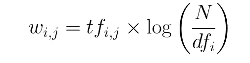

# Quora 不真诚问题分类

> 原文：<https://medium.com/analytics-vidhya/quora-insincere-question-classification-eda-41add82a2d0b?source=collection_archive---------5----------------------->

## 检测有毒内容以改善在线对话

在这篇博客中，我将解释我如何通过机器学习和深度学习方法对 Quora 虚假问题数据集进行分类。

# **问题概述:**

如今，任何主要网站都面临一个生存问题，那就是如何处理有毒和分裂性的内容。Quora 希望正面解决这个问题，让他们的平台成为一个用户可以放心地与世界分享知识的地方。

[Quora](https://www.quora.com/) 是一个让人们能够相互学习的平台。在 Quora 上，人们可以提出问题，并与贡献独特见解和高质量答案的其他人联系。一个关键的挑战是剔除不真诚的问题——那些建立在错误前提上的问题，或者那些旨在陈述而不是寻找有用答案的问题。

Quora 提出了一个竞赛，我们开发模型来识别和标记不真诚的问题。

# 问题陈述:

预测 Quora 上问的一个问题是否真诚。

# 评估指标:

指标是预测目标和观察目标之间的 F1 分数。只有两个阶层，但积极阶层仅占总数的 6%多一点。因此，目标是高度不平衡的，这就是为什么像 F1 这样的指标似乎适合这种问题，因为它考虑了测试的精确度和召回率来计算分数。


[F](https://stackoverflow.com/questions/35365007/tensorflow-precision-recall-f1-score-and-confusion-matrix) 1 分([环节](https://stackoverflow.com/questions/35365007/tensorflow-precision-recall-f1-score-and-confusion-matrix))

# 数据概述:

Quora 提供了大量的训练和测试数据来识别不真诚的问题。训练数据由 130 万行和 3 个特征组成。

# 文件描述

*   train.csv 训练集
*   test.csv —测试集
*   嵌入

# 数据字段

*   qid —唯一的问题标识符
*   问题 _ 文本— Quora 问题文本
*   目标—标记为“不真诚”的问题的值为 1，否则为 0

# 探索性数据分析:

## 负载训练和测试数据集:

```
train = pd.read_csv(“train.csv”)
test=pd.read_csv(‘test.csv’)
print(“Number of train data points:”,train.shape[0])
print(“Number of test data points:”,test.shape[0])
print(“Shape of Train Data:”, train.shape)
print(“Shape of Test Data:”, test.shape)
train.head()
```

首先，加载训练和测试数据集。在这里，我也检查一组中的形状和数据点。

## 数据点在输出类中的分布:


```
print(‘~> Percentage of Sincere Questions (is_duplicate = 0):\n {}%’.format(100 — round(train[‘target’].mean()*100, 2)))
print(‘\n~> Percentage of Insincere Questions (is_duplicate = 1):\n {}%’.format(round(train[‘target’].mean()*100, 2)))#Output
~> Percentage of Sincere Questions (is_duplicate = 0):
   93.81%

~> Percentage of Insincere Questions (is_duplicate = 1):
   6.19%
```

我们可以看到，数据集是高度不平衡的，只有 6.19%的无诚意问题。

## 基本特征工程:

我们可以添加一些功能，作为 Quora 虚假问题分类挑战的功能工程管道的一部分。

下面列出了我所包含的一些功能:

*   **freq _ qid**= qid 的频率
*   **qlen**= qid 长度
*   **n_words** =问题字数
*   **数字字数** =所讨论的数字字数
*   **sp_char_words** =有问题的特殊字符数
*   **唯一单词** =问题中唯一单词的数量
*   **char_words** =问题中的字符数

```
#Feature Engineering on Train Data
train[‘freq_qid’] = train.groupby(‘qid’)[‘qid’].transform(‘count’) 
train[‘qlen’] = train[‘question_text’].str.len() 
train[‘n_words’] = train[‘question_text’].apply(lambda row: len(row.split(“ “)))
train[‘numeric_words’] = train[‘question_text’].apply(lambda row: sum(c.isdigit() for c in row))
train[‘sp_char_words’] = train[‘question_text’].str.findall(r’[^a-zA-Z0–9 ]’).str.len()
train[‘char_words’] = train[‘question_text’].apply(lambda row: len(str(row)))
train[‘unique_words’] = train[‘question_text’].apply(lambda row: len(set(str(row).split())))#Feature Engineering on Test Data
test[‘freq_qid’] = test.groupby(‘qid’)[‘qid’].transform(‘count’) 
test[‘qlen’] = test[‘question_text’].str.len() 
test[‘n_words’] = test[‘question_text’].apply(lambda row: len(row.split(“ “)))
test[‘numeric_words’] = test[‘question_text’].apply(lambda row: sum(c.isdigit() for c in row))
test[‘sp_char_words’] = test[‘question_text’].str.findall(r’[^a-zA-Z0–9 ]’).str.len()
test[‘char_words’] = test[‘question_text’].apply(lambda row: len(str(row)))
test[‘unique_words’] = test[‘question_text’].apply(lambda row: len(set(str(row).split())))
```

我添加了上面提到的特征，因为它们将帮助我们更好地评估我们的数据，以确定哪些特征是有用的，哪些是要丢弃/删除的。

# 数据预处理:

文本数据并不完全干净，因此我们需要应用一些数据预处理技术。

数据清理的预处理技术；

1.  删除标点符号

数据中的特殊字符；我们将使用替换来删除这些字符

```
puncts=[‘,’, ‘.’, ‘“‘, ‘:’, ‘)’, ‘(‘, ‘-’, ‘!’, ‘?’, ‘|’, ‘;’, “‘“, ‘$’, ‘&’, ‘/’, ‘[‘, ‘]’, ‘>’, ‘%’, ‘=’, ‘#’, ‘*’, ‘+’, ‘\\’, 
 ‘•’, ‘~’, ‘@’, ‘£’, ‘·’, ‘_’, ‘{‘, ‘}’, ‘©’, ‘^’, ‘®’, ‘`’, ‘<’, ‘→’, ‘°’, ‘€’, ‘™’, ‘›’, ‘♥’, ‘←’, ‘×’, ‘§’, ‘″’, ‘′’, 
 ‘█’, ‘…’, ‘“‘, ‘★’, ‘”’, ‘–’, ‘●’, ‘►’, ‘−’, ‘¢’, ‘¬’, ‘░’, ‘¡’, ‘¶’, ‘↑’, ‘±’, ‘¿’, ‘▾’, ‘═’, ‘¦’, ‘║’, ‘―’, ‘¥’, ‘▓’, 
 ‘ — ‘, ‘‹’, ‘─’, ‘▒’, ‘：’, ‘⊕’, ‘▼’, ‘▪’, ‘†’, ‘■’, ‘’’, ‘▀’, ‘¨’, ‘▄’, ‘♫’, ‘☆’, ‘¯’, ‘♦’, ‘¤’, ‘▲’, ‘¸’, ‘⋅’, ‘‘’, ‘∞’, 
 ‘∙’, ‘）’, ‘↓’, ‘、’, ‘│’, ‘（’, ‘»’, ‘，’, ‘♪’, ‘╩’, ‘╚’, ‘・’, ‘╦’, ‘╣’, ‘╔’, ‘╗’, ‘▬’, ‘❤’, ‘≤’, ‘‡’, ‘√’, ‘◄’, ‘━’, 
 ‘⇒’, ‘▶’, ‘≥’, ‘╝’, ‘♡’, ‘◊’, ‘。’, ‘✈’, ‘≡’, ‘☺’, ‘✔’, ‘
’, ‘≈’, ‘✓’, ‘♣’, ‘☎’, ‘℃’, ‘◦’, ‘└’, ‘‟’, ‘～’, ‘！’, ‘○’, 
 ‘◆’, ‘№’, ‘♠’, ‘▌’, ‘✿’, ‘▸’, ‘⁄’, ‘□’, ‘❖’, ‘✦’, ‘．’, ‘÷’, ‘｜’, ‘┃’, ‘／’, ‘￥’, ‘╠’, ‘↩’, ‘✭’, ‘▐’, ‘☼’, ‘☻’, ‘┐’, 
 ‘├’, ‘«’, ‘∼’, ‘┌’, ‘℉’, ‘☮’, ‘฿’, ‘≦’, ‘♬’, ‘✧’, ‘〉’, ‘－’, ‘⌂’, ‘✖’, ‘･’, ‘◕’, ‘※’, ‘‖’, ‘◀’, ‘‰’, ‘\x97’, ‘↺’, 
 ‘∆’, ‘┘’, ‘┬’, ‘╬’, ‘،’, ‘⌘’, ‘⊂’, ‘＞’, ‘〈’, ‘⎙’, ‘？’, ‘☠’, ‘⇐’, ‘▫’, ‘∗’, ‘∈’, ‘≠’, ‘♀’, ‘♔’, ‘˚’, ‘℗’, ‘┗’, ‘＊’, 
 ‘┼’, ‘❀’, ‘＆’, ‘∩’, ‘♂’, ‘‿’, ‘∑’, ‘‣’, ‘➜’, ‘┛’, ‘⇓’, ‘☯’, ‘⊖’, ‘☀’, ‘┳’, ‘；’, ‘∇’, ‘⇑’, ‘✰’, ‘◇’, ‘♯’, ‘☞’, ‘´’, 
 ‘↔’, ‘┏’, ‘｡’, ‘◘’, ‘∂’, ‘✌’, ‘♭’, ‘┣’, ‘┴’, ‘┓’, ‘✨’, ‘\xa0’, ‘˜’, ‘❥’, ‘┫’, ‘℠’, ‘✒’, ‘［’, ‘∫’, ‘\x93’, ‘≧’, ‘］’, 
 ‘\x94’, ‘∀’, ‘♛’, ‘\x96’, ‘∨’, ‘◎’, ‘↻’, ‘⇩’, ‘＜’, ‘≫’, ‘✩’, ‘✪’, ‘♕’, ‘؟’, ‘₤’, ‘☛’, ‘╮’, ‘␊’, ‘＋’, ‘┈’, ‘％’, 
 ‘╋’, ‘▽’, ‘⇨’, ‘┻’, ‘⊗’, ‘￡’, ‘।’, ‘▂’, ‘✯’, ‘▇’, ‘＿’, ‘➤’, ‘✞’, ‘＝’, ‘▷’, ‘△’, ‘◙’, ‘▅’, ‘✝’, ‘∧’, ‘␉’, ‘☭’, 
 ‘┊’, ‘╯’, ‘☾’, ‘➔’, ‘∴’, ‘\x92’, ‘▃’, ‘↳’, ‘＾’, ‘׳’, ‘➢’, ‘╭’, ‘➡’, ‘＠’, ‘⊙’, ‘☢’, ‘˝’, ‘∏’, ‘„’, ‘∥’, ‘❝’, ‘☐’, 
 ‘▆’, ‘╱’, ‘⋙’, ‘๏’, ‘☁’, ‘⇔’, ‘▔’, ‘\x91’, ‘➚’, ‘◡’, ‘╰’, ‘\x85’, ‘♢’, ‘˙’, ‘۞’, ‘✘’, ‘✮’, ‘☑’, ‘⋆’, ‘ⓘ’, ‘❒’, 
 ‘☣’, ‘✉’, ‘⌊’, ‘➠’, ‘∣’, ‘❑’, ‘◢’, ‘ⓒ’, ‘\x80’, ‘〒’, ‘∕’, ‘▮’, ‘⦿’, ‘✫’, ‘✚’, ‘⋯’, ‘♩’, ‘☂’, ‘❞’, ‘‗’, ‘܂’, ‘☜’, 
 ‘‾’, ‘✜’, ‘╲’, ‘∘’, ‘⟩’, ‘＼’, ‘⟨’, ‘·’, ‘✗’, ‘♚’, ‘∅’, ‘ⓔ’, ‘◣’, ‘͡’, ‘‛’, ‘❦’, ‘◠’, ‘✄’, ‘❄’, ‘∃’, ‘␣’, ‘≪’, ‘｢’, 
 ‘≅’, ‘◯’, ‘☽’, ‘∎’, ‘｣’, ‘❧’, ‘̅’, ‘ⓐ’, ‘↘’, ‘⚓’, ‘▣’, ‘˘’, ‘∪’, ‘⇢’, ‘✍’, ‘⊥’, ‘＃’, ‘⎯’, ‘↠’, ‘۩’, ‘☰’, ‘◥’, 
 ‘⊆’, ‘✽’, ‘⚡’, ‘↪’, ‘❁’, ‘☹’, ‘◼’, ‘☃’, ‘◤’, ‘❏’, ‘ⓢ’, ‘⊱’, ‘➝’, ‘̣’, ‘✡’, ‘∠’, ‘｀’, ‘▴’, ‘┤’, ‘∝’, ‘♏’, ‘ⓐ’, 
 ‘✎’, ‘;’, ‘␤’, ‘＇’, ‘❣’, ‘✂’, ‘✤’, ‘ⓞ’, ‘☪’, ‘✴’, ‘⌒’, ‘˛’, ‘♒’, ‘＄’, ‘✶’, ‘▻’, ‘ⓔ’, ‘◌’, ‘◈’, ‘❚’, ‘❂’, ‘￦’, 
 ‘◉’, ‘╜’, ‘̃’, ‘✱’, ‘╖’, ‘❉’, ‘ⓡ’, ‘↗’, ‘ⓣ’, ‘♻’, ‘➽’, ‘׀’, ‘✲’, ‘✬’, ‘☉’, ‘▉’, ‘≒’, ‘☥’, ‘⌐’, ‘♨’, ‘✕’, ‘ⓝ’, 
 ‘⊰’, ‘❘’, ‘＂’, ‘⇧’, ‘̵’, ‘➪’, ‘▁’, ‘▏’, ‘⊃’, ‘ⓛ’, ‘‚’, ‘♰’, ‘́’, ‘✏’, ‘⏑’, ‘̶’, ‘ⓢ’, ‘⩾’, ‘￠’, ‘❍’, ‘≃’, ‘⋰’, ‘♋’, 
 ‘､’, ‘̂’, ‘❋’, ‘✳’, ‘ⓤ’, ‘╤’, ‘▕’, ‘⌣’, ‘✸’, ‘℮’, ‘⁺’, ‘▨’, ‘╨’, ‘ⓥ’, ‘♈’, ‘❃’, ‘☝’, ‘✻’, ‘⊇’, ‘≻’, ‘♘’, ‘♞’, 
 ‘◂’, ‘✟’, ‘⌠’, ‘✠’, ‘☚’, ‘✥’, ‘❊’, ‘ⓒ’, ‘⌈’, ‘❅’, ‘ⓡ’, ‘♧’, ‘ⓞ’, ‘▭’, ‘❱’, ‘ⓣ’, ‘∟’, ‘☕’, ‘♺’, ‘∵’, ‘⍝’, ‘ⓑ’, 
 ‘✵’, ‘✣’, ‘٭’, ‘♆’, ‘ⓘ’, ‘∶’, ‘⚜’, ‘◞’, ‘்’, ‘✹’, ‘➥’, ‘↕’, ‘̳’, ‘∷’, ‘✋’, ‘➧’, ‘∋’, ‘̿’, ‘ͧ’, ‘┅’, ‘⥤’, ‘⬆’, ‘⋱’, 
 ‘☄’, ‘↖’, ‘⋮’, ‘۔’, ‘♌’, ‘ⓛ’, ‘╕’, ‘♓’, ‘❯’, ‘♍’, ‘▋’, ‘✺’, ‘⭐’, ‘✾’, ‘♊’, ‘➣’, ‘▿’, ‘ⓑ’, ‘♉’, ‘⏠’, ‘◾’, ‘▹’, 
 ‘⩽’, ‘↦’, ‘╥’, ‘⍵’, ‘⌋’, ‘։’, ‘➨’, ‘∮’, ‘⇥’, ‘ⓗ’, ‘ⓓ’, ‘⁻’, ‘⎝’, ‘⌥’, ‘⌉’, ‘◔’, ‘◑’, ‘✼’, ‘♎’, ‘♐’, ‘╪’, ‘⊚’, 
 ‘☒’, ‘⇤’, ‘ⓜ’, ‘⎠’, ‘◐’, ‘⚠’, ‘╞’, ‘◗’, ‘⎕’, ‘ⓨ’, ‘☟’, ‘ⓟ’, ‘♟’, ‘❈’, ‘↬’, ‘ⓓ’, ‘◻’, ‘♮’, ‘❙’, ‘♤’, ‘∉’, ‘؛’, 
 ‘⁂’, ‘ⓝ’, ‘־’, ‘♑’, ‘╫’, ‘╓’, ‘╳’, ‘⬅’, ‘☔’, ‘☸’, ‘┄’, ‘╧’, ‘׃’, ‘⎢’, ‘❆’, ‘⋄’, ‘⚫’, ‘̏’, ‘☏’, ‘➞’, ‘͂’, ‘␙’, 
 ‘ⓤ’, ‘◟’, ‘̊’, ‘⚐’, ‘✙’, ‘↙’, ‘̾’, ‘℘’, ‘✷’, ‘⍺’, ‘❌’, ‘⊢’, ‘▵’, ‘✅’, ‘ⓖ’, ‘☨’, ‘▰’, ‘╡’, ‘ⓜ’, ‘☤’, ‘∽’, ‘╘’, 
 ‘˹’, ‘↨’, ‘♙’, ‘⬇’, ‘♱’, ‘⌡’, ‘⠀’, ‘╛’, ‘❕’, ‘┉’, ‘ⓟ’, ‘̀’, ‘♖’, ‘ⓚ’, ‘┆’, ‘⎜’, ‘◜’, ‘⚾’, ‘⤴’, ‘✇’, ‘╟’, ‘⎛’, 
 ‘☩’, ‘➲’, ‘➟’, ‘ⓥ’, ‘ⓗ’, ‘⏝’, ‘◃’, ‘╢’, ‘↯’, ‘✆’, ‘˃’, ‘⍴’, ‘❇’, ‘⚽’, ‘╒’, ‘̸’, ‘♜’, ‘☓’, ‘➳’, ‘⇄’, ‘☬’, ‘⚑’, 
 ‘✐’, ‘⌃’, ‘◅’, ‘▢’, ‘❐’, ‘∊’, ‘☈’, ‘॥’, ‘⎮’, ‘▩’, ‘ு’, ‘⊹’, ‘‵’, ‘␔’, ‘☊’, ‘➸’, ‘̌’, ‘☿’, ‘⇉’, ‘⊳’, ‘╙’, ‘ⓦ’, 
 ‘⇣’, ‘｛’, ‘̄’, ‘↝’, ‘⎟’, ‘▍’, ‘❗’, ‘״’, ‘΄’, ‘▞’, ‘◁’, ‘⛄’, ‘⇝’, ‘⎪’, ‘♁’, ‘⇠’, ‘☇’, ‘✊’, ‘ி’, ‘｝’, ‘⭕’, ‘➘’, 
 ‘⁀’, ‘☙’, ‘❛’, ‘❓’, ‘⟲’, ‘⇀’, ‘≲’, ‘ⓕ’, ‘⎥’, ‘\u06dd’, ‘ͤ’, ‘₋’, ‘̱’, ‘̎’, ‘♝’, ‘≳’, ‘▙’, ‘➭’, ‘܀’, ‘ⓖ’, ‘⇛’, ‘▊’, 
 ‘⇗’, ‘̷’, ‘⇱’, ‘℅’, ‘ⓧ’, ‘⚛’, ‘̐’, ‘̕’, ‘⇌’, ‘␀’, ‘≌’, ‘ⓦ’, ‘⊤’, ‘̓’, ‘☦’, ‘ⓕ’, ‘▜’, ‘➙’, ‘ⓨ’, ‘⌨’, ‘◮’, ‘☷’, 
 ‘◍’, ‘ⓚ’, ‘≔’, ‘⏩’, ‘⍳’, ‘℞’, ‘┋’, ‘˻’, ‘▚’, ‘≺’, ‘ْ’, ‘▟’, ‘➻’, ‘̪’, ‘⏪’, ‘̉’, ‘⎞’, ‘┇’, ‘⍟’, ‘⇪’, ‘▎’, ‘⇦’, ‘␝’, 
 ‘⤷’, ‘≖’, ‘⟶’, ‘♗’, ‘̴’, ‘♄’, ‘ͨ’, ‘̈’, ‘❜’, ‘̡’, ‘▛’, ‘✁’, ‘➩’, ‘ா’, ‘˂’, ‘↥’, ‘⏎’, ‘⎷’, ‘̲’, ‘➖’, ‘↲’, ‘⩵’, ‘̗’, ‘❢’, 
 ‘≎’, ‘⚔’, ‘⇇’, ‘̑’, ‘⊿’, ‘̖’, ‘☍’, ‘➹’, ‘⥊’, ‘⁁’, ‘✢’]def clean_punct(x):
 for punct in puncts:
 if punct in x:
 x = x.replace(punct, ‘{}’ .format(punct))
 return x
```

2.清理数字

```
def clean_numbers(x):
 if bool(re.search(r’\d’, x)):
 x = re.sub(‘[0–9]{5,}’, ‘#####’, x)
 x = re.sub(‘[0–9]{4}’, ‘####’, x)
 x = re.sub(‘[0–9]{3}’, ‘###’, x)
 x = re.sub(‘[0–9]{2}’, ‘##’, x)
 return x
```

3.纠正拼写错误的单词

为了更好的嵌入覆盖率，我们将使用拼写错误映射和正则表达式函数替换拼写错误的单词。

```
mispell_dict = {‘colour’: ‘color’, ‘centre’: ‘center’, ‘favourite’: ‘favorite’, ‘travelling’: ‘traveling’, ‘counselling’: ‘counseling’, ‘theatre’: ‘theater’, ‘cancelled’: ‘canceled’, ‘labour’: ‘labor’, ‘organisation’: ‘organization’, ‘wwii’: ‘world war 2’, ‘citicise’: ‘criticize’, ‘youtu ‘: ‘youtube ‘, ‘Qoura’: ‘Quora’, ‘sallary’: ‘salary’, ‘Whta’: ‘What’, ‘narcisist’: ‘narcissist’, ‘howdo’: ‘how do’, ‘whatare’: ‘what are’, ‘howcan’: ‘how can’, ‘howmuch’: ‘how much’, ‘howmany’: ‘how many’, ‘whydo’: ‘why do’, ‘doI’: ‘do I’, ‘theBest’: ‘the best’, ‘howdoes’: ‘how does’, ‘mastrubation’: ‘masturbation’, ‘mastrubate’: ‘masturbate’, “mastrubating”: ‘masturbating’, ‘pennis’: ‘penis’, ‘Etherium’: ‘bitcoin’, ‘narcissit’: ‘narcissist’, ‘bigdata’: ‘big data’, ‘2k17’: ‘2017’, ‘2k18’: ‘2018’, ‘qouta’: ‘quota’, ‘exboyfriend’: ‘ex boyfriend’, ‘airhostess’: ‘air hostess’, “whst”: ‘what’, ‘watsapp’: ‘whatsapp’, ‘demonitisation’: ‘demonetization’, ‘demonitization’: ‘demonetization’, ‘demonetisation’: ‘demonetization’, 
‘electroneum’:’bitcoin’,’nanodegree’:’degree’,’hotstar’:’star’,’dream11':’dream’,’ftre’:’fire’,’tensorflow’:’framework’,’unocoin’:’bitcoin’,‘lnmiit’:’limit’,’unacademy’:’academy’,’altcoin’:’bitcoin’,’altcoins’:’bitcoin’,’litecoin’:’bitcoin’,’coinbase’:’bitcoin’,’cryptocurency’:’cryptocurrency’,‘simpliv’:’simple’,’quoras’:’quora’,’schizoids’:’psychopath’,’remainers’:’remainder’,’twinflame’:’soulmate’,’quorans’:’quora’,’brexit’:’demonetized’,‘iiest’:’institute’,’dceu’:’comics’,’pessat’:’exam’,’uceed’:’college’,’bhakts’:’devotee’,’boruto’:’anime’,‘cryptocoin’:’bitcoin’,’blockchains’:’blockchain’,’fiancee’:’fiance’,’redmi’:’smartphone’,’oneplus’:’smartphone’,’qoura’:’quora’,’deepmind’:’framework’,’ryzen’:’cpu’,’whattsapp’:’whatsapp’,
‘undertale’:’adventure’,’zenfone’:’smartphone’,’cryptocurencies’:’cryptocurrencies’,’koinex’:’bitcoin’,’zebpay’:’bitcoin’,’binance’:’bitcoin’,’whtsapp’:’whatsapp’,‘reactjs’:’framework’,’bittrex’:’bitcoin’,’bitconnect’:’bitcoin’,’bitfinex’:’bitcoin’,’yourquote’:’your quote’,’whyis’:’why is’,’jiophone’:’smartphone’,‘dogecoin’:’bitcoin’,’onecoin’:’bitcoin’,’poloniex’:’bitcoin’,’7700k’:’cpu’,’angular2':’framework’,’segwit2x’:’bitcoin’,’hashflare’:’bitcoin’,’940mx’:’gpu’,
‘openai’:’framework’,’hashflare’:’bitcoin’,’1050ti’:’gpu’,’nearbuy’:’near buy’,’freebitco’:’bitcoin’,’antminer’:’bitcoin’,’filecoin’:’bitcoin’,’whatapp’:’whatsapp’,‘empowr’:’empower’,’1080ti’:’gpu’,’crytocurrency’:’cryptocurrency’,’8700k’:’cpu’,’whatsaap’:’whatsapp’,’g4560':’cpu’,’payymoney’:’pay money’,‘fuckboys’:’fuck boys’,’intenship’:’internship’,’zcash’:’bitcoin’,’demonatisation’:’demonetization’,’narcicist’:’narcissist’,’mastuburation’:’masturbation’,‘trignometric’:’trigonometric’,’cryptocurreny’:’cryptocurrency’,’howdid’:’how did’,’crytocurrencies’:’cryptocurrencies’,’phycopath’:’psychopath’,\‘bytecoin’:’bitcoin’,’possesiveness’:’possessiveness’,’scollege’:’college’,’humanties’:’humanities’,’altacoin’:’bitcoin’,’demonitised’:’demonetized’,‘brasília’:’brazilia’,’accolite’:’accolyte’,’econimics’:’economics’,’varrier’:’warrier’,’quroa’:’quora’,’statergy’:’strategy’,’langague’:’language’,‘splatoon’:’game’,’7600k’:’cpu’,’gate2018':’gate 2018',’in2018':’in 2018',’narcassist’:’narcissist’,’jiocoin’:’bitcoin’,’hnlu’:’hulu’,’7300hq’:’cpu’,‘weatern’:’western’,’interledger’:’blockchain’,’deplation’:’deflation’, ‘cryptocurrencies’:’cryptocurrency’, ‘bitcoin’:’blockchain cryptocurrency’,}def _get_mispell(mispell_dict):
 mispell_re = re.compile(‘(%s)’ % ‘|’.join(mispell_dict.keys()))
 return mispell_dict, mispell_remispellings, mispellings_re = _get_mispell(mispell_dict)
def replace_typical_misspell(text):
 def replace(match):
 return mispellings[match.group(0)]
 return mispellings_re.sub(replace, text)
```

4.消除收缩

缩写是我们用撇号写的单词。

```
contraction_dict = {“ain’t”: “is not”, “aren’t”: “are not”,”can’t”: “cannot”, “‘cause”: “because”, “could’ve”: “could have”, “couldn’t”: “could not”, “didn’t”: “did not”, “doesn’t”: “does not”, “don’t”: “do not”, “hadn’t”: “had not”, “hasn’t”: “has not”, “haven’t”: “have not”, “he’d”: “he would”,”he’ll”: “he will”, “he’s”: “he is”, “how’d”: “how did”, “how’d’y”: “how do you”, “how’ll”: “how will”, “how’s”: “how is”, “I’d”: “I would”, “I’d’ve”: “I would have”, “I’ll”: “I will”, “I’ll’ve”: “I will have”,”I’m”: “I am”, “I’ve”: “I have”, “i’d”: “i would”, “i’d’ve”: “i would have”, “i’ll”: “i will”, “i’ll’ve”: “i will have”,”i’m”: “i am”, “i’ve”: “i have”, “isn’t”: “is not”, “it’d”: “it would”, “it’d’ve”: “it would have”, “it’ll”: “it will”, “it’ll’ve”: “it will have”,”it’s”: “it is”, “let’s”: “let us”, “ma’am”: “madam”, “mayn’t”: “may not”, “might’ve”: “might have”,”mightn’t”: “might not”,”mightn’t’ve”: “might not have”, “must’ve”: “must have”, “mustn’t”: “must not”, “mustn’t’ve”: “must not have”, “needn’t”: “need not”, “needn’t’ve”: “need not have”,”o’clock”: “of the clock”, “oughtn’t”: “ought not”, “oughtn’t’ve”: “ought not have”, “shan’t”: “shall not”, “sha’n’t”: “shall not”, “shan’t’ve”: “shall not have”, “she’d”: “she would”, “she’d’ve”: “she would have”, “she’ll”: “she will”, “she’ll’ve”: “she will have”, “she’s”: “she is”, “should’ve”: “should have”, “shouldn’t”: “should not”, “shouldn’t’ve”: “should not have”, “so’ve”: “so have”,”so’s”: “so as”, “this’s”: “this is”,”that’d”: “that would”, “that’d’ve”: “that would have”, “that’s”: “that is”, “there’d”: “there would”, “there’d’ve”: “there would have”, “there’s”: “there is”, “here’s”: “here is”,”they’d”: “they would”, “they’d’ve”: “they would have”, “they’ll”: “they will”, “they’ll’ve”: “they will have”, “they’re”: “they are”, “they’ve”: “they have”, “to’ve”: “to have”, “wasn’t”: “was not”, “we’d”: “we would”, “we’d’ve”: “we would have”, “we’ll”: “we will”, “we’ll’ve”: “we will have”, “we’re”: “we are”, “we’ve”: “we have”, “weren’t”: “were not”, “what’ll”: “what will”, “what’ll’ve”: “what will have”, “what’re”: “what are”, “what’s”: “what is”, “what’ve”: “what have”, “when’s”: “when is”, “when’ve”: “when have”, “where’d”: “where did”, “where’s”: “where is”, “where’ve”: “where have”, “who’ll”: “who will”, “who’ll’ve”: “who will have”, “who’s”: “who is”, “who’ve”: “who have”, “why’s”: “why is”, “why’ve”: “why have”, “will’ve”: “will have”, “won’t”: “will not”, “won’t’ve”: “will not have”, “would’ve”: “would have”, “wouldn’t”: “would not”, “wouldn’t’ve”: “would not have”, “y’all”: “you all”, “y’all’d”: “you all would”,”y’all’d’ve”: “you all would have”,”y’all’re”: “you all are”,”y’all’ve”: “you all have”,”you’d”: “you would”, “you’d’ve”: “you would have”, “you’ll”: “you will”, “you’ll’ve”: “you will have”, “you’re”: “you are”, “you’ve”: “you have”}def _get_contractions(contraction_dict):
 contraction_re = re.compile(‘(%s)’ % ‘|’.join(contraction_dict.keys()))
 return contraction_dict, contraction_recontractions, contractions_re = _get_contractions(contraction_dict)def replace_contractions(text):
 def replace(match):
 return contractions[match.group(0)]
 return contractions_re.sub(replace, text)
```

5.删除停用词

```
stopword_list = nltk.corpus.stopwords.words(‘english’)
def remove_stopwords(text, is_lower_case=True):
 tokenizer = ToktokTokenizer()
 tokens = tokenizer.tokenize(text)
 tokens = [token.strip() for token in tokens]
 if is_lower_case:
 filtered_tokens = [token for token in tokens if token not in stopword_list]
 else:
 filtered_tokens = [token for token in tokens if token.lower() not in stopword_list]
 filtered_text = ‘ ‘.join(filtered_tokens)
 return filtered_text
```

6.堵塞物

词干提取是使用粗略的启发式规则将单词转换成其基本形式的过程。例如，一个规则可以是从任何单词的末尾去掉“s”，这样“cats”就变成了“cat”。

```
from nltk.stem import SnowballStemmer
from nltk.tokenize.toktok import ToktokTokenizer
def stem_text(text):
 tokenizer = ToktokTokenizer()
 stemmer = SnowballStemmer(‘english’)
 tokens = tokenizer.tokenize(text)
 tokens = [token.strip() for token in tokens]
 tokens = [stemmer.stem(token) for token in tokens]
 return ‘ ‘.join(tokens)
```

7.词汇化

词汇化与词干化非常相似，但它的目的是仅当字典中存在基本形式时才删除词尾。

```
from nltk.stem import WordNetLemmatizer
from nltk.tokenize.toktok import ToktokTokenizer
wordnet_lemmatizer = WordNetLemmatizer()
def lemma_text(text):
 tokenizer = ToktokTokenizer()
 tokens = tokenizer.tokenize(text)
 tokens = [token.strip() for token in tokens]
 tokens = [wordnet_lemmatizer.lemmatize(token) for token in tokens]
 return ‘ ‘.join(tokens)
```

一旦我们处理完文本，我们将应用下面给出的步骤来清理训练和测试数据上的文本。

```
def clean_sentence(x):
 x = x.lower()
 x = clean_punct(x)
 x = clean_numbers(x)
 x = replace_typical_misspell(x)
 x = remove_stopwords(x)
 x = replace_contractions(x)
 #x = preprocess(x)
 x = stem_text(x)
 x = lemma_text(x)
 x = x.replace(“‘“,””)
 return x
```

# 提取特征的分析:


从词云我们可以看到，穆斯林、特朗普、黑人、印度人等是在不真诚的问题中出现很多的词。

在应用数据预处理和清理之后，我们的文本就可以进行分类了。我应用了传统和深度学习方法进行分类。

我们先来了解分类的机器学习方法。

# 机器学习方法

# 高级 NLP 文本处理:

## 1.单词包(计数矢量器)

单词包(BoW)指的是描述文本数据中单词存在的文本表示。这背后的直觉是，两个相似的文本字段将包含相似种类的单词，因此将具有相似的单词包。此外，仅从文本中，我们可以了解一些关于文件的含义。

```
cnt_vectorizer = CountVectorizer(dtype=np.float32,
 strip_accents=’unicode’, analyzer=’word’,token_pattern=r’\w{1,}’,
 ngram_range=(1, 3),min_df=3)# Fitting count vectorizer to both training and test sets (semi-supervised learning)
cnt_vectorizer.fit(list(train.preprocessed_question_text.values) + list(test.preprocessed_question_text.values))
X_train = cnt_vectorizer.transform(train.preprocessed_question_text.values) 
X_test = cnt_vectorizer.transform(test.preprocessed_question_text.values)
y_train = train.target.values
```

CountVectorizer 将文本文档的集合转换为令牌计数的矩阵。为此，我选择 n-gram 范围为 1–3，min_df 为 3 来构建词汇表。

我们为逻辑回归、朴素贝叶斯和 LightGBM 等机器学习模型运行这些功能。

```
# Fitting a simple Logistic Regression
clf = LogisticRegression(C=1.0)
clf.fit(X_train,y_train)
```

## 2.术语频率—反向文档频率(TF-IDF)

**词频(tf)** :给出这个词在语料库中每个文档中的出现频率。它是单词在文档中出现的次数与该文档中单词总数的比率。它随着该单词在文档中出现的次数的增加而增加。每个文档都有自己的 tf。


**逆数据频率(idf):** 用于计算语料库中所有文档中稀有词的权重。在语料库中很少出现的单词具有高 IDF 分数。它由下面的等式给出。


结合这两者，我们得出语料库中文档中的单词的 TF-IDF 分数(w)。它是 tf 和 idf 的产物:



```
tfv = TfidfVectorizer(dtype=np.float32, min_df=3, max_features=None, 
 strip_accents=’unicode’, analyzer=’word’,token_pattern=r’\w{1,}’,
 ngram_range=(1, 3), use_idf=1,smooth_idf=1,sublinear_tf=1,
 stop_words = ‘english’)# Fitting TF-IDF to both training and test sets (semi-supervised learning)
tfv.fit(list(train.preprocessed_question_text.values) + list(test.preprocessed_question_text.values))
X_train = tfv.transform(train.preprocessed_question_text.values) 
X_test_tfv = tfv.transform(test.preprocessed_question_text.values)
y_train = train.target.values
```

TfidfVectorizer 将原始文档集合转换为 TF-IDF 特征矩阵。为此，n-gram 范围也是 1-3，min_df 是 3，以建立词汇。

我们再次为逻辑回归、朴素贝叶斯和 LightGBM 等机器学习模型运行这些功能。

## 3.哈希功能(哈希矢量器)

哈希矢量器被设计成尽可能地节省内存。矢量器不是将记号存储为字符串，而是应用[散列技巧](https://en.wikipedia.org/wiki/Feature_hashing)将它们编码为数字索引。这种方法的缺点是，一旦矢量化，就无法再检索要素的名称。

```
from sklearn.feature_extraction.text import HashingVectorizerhv = HashingVectorizer(dtype=np.float32,
 strip_accents=’unicode’, analyzer=’word’,
 ngram_range=(1, 3),n_features=2**10)
# Fitting Hash Vectorizer to both training and test sets (semi-supervised learning)
hv.fit(list(train.preprocessed_question_text.values) + list(test.preprocessed_question_text.values))
X_train = hv.transform(train.preprocessed_question_text.values) 
X_test_tfv = hv.transform(test.preprocessed_question_text.values)
y_train = train.target.values
```

HashingVectorizer 将一组文本文档转换成一个标记出现的矩阵。2**10 是我们希望在输出矩阵的一列中包含的特征数量。

为此，我尝试了逻辑回归和 LightGBM。

## 4.Word2Vec 功能(单词嵌入)

**单词嵌入**是一种语言建模技术，用于将单词映射到实数向量。它用几个维度表示向量空间中的单词或短语。可以使用各种方法生成单词嵌入，如神经网络、共现矩阵、概率模型等。

**Word2Vec** 由生成单词嵌入的模型组成。这些模型是具有一个输入层、一个隐藏层和一个输出层的浅层两层神经网络。

```
def load_glove_index():
 EMBEDDING_FILE = ‘glove.840B.300d/glove.840B.300d.txt’
 def get_coefs(word,*arr): return word, np.asarray(arr, dtype=’float32')[:300]
 f = open(EMBEDDING_FILE,encoding=”utf-8")
 embeddings_index = dict(get_coefs(*o.split(“ “)) for o in f)
 return embeddings_indexembeddings_index = load_glove_index()print(‘Found %s word vectors.’ % len(embeddings_index))from nltk.corpus import stopwords
from nltk import word_tokenizestop_words = stopwords.words(‘english’)
def sent2vec(s):
 words = str(s).lower()
 words = word_tokenize(words)
 words = [w for w in words if not w in stop_words]
 words = [w for w in words if w.isalpha()]
 M = []
 for w in words:
 try:
 M.append(embeddings_index[w])
 except:
 continue
 M = np.array(M)
 v = M.sum(axis=0)
 if type(v) != np.ndarray:
 return np.zeros(300)
 return v / np.sqrt((v ** 2).sum())# create sentence vectors using the above function for training and validation set
xtrain = [sent2vec(x) for x in tqdm(train.preprocessed_question_text.values)]
xtest_glove = [sent2vec(x) for x in tqdm(test.preprocessed_question_text.values)]
```

为此，也尝试了逻辑回归和 LightGBM。

既然我们已经详细了解了传统方法，现在让我们看看我是如何应用深度学习方法的。

# 深度学习方法

我将解释我为这一分类尝试的深度学习模型，如 TextCNN、BiLSTM 和 Attention。

**注:**对于所有模型，在输出层使用 sigmoid 作为激活函数，在编译模型时，使用 Adam 优化器和二元交叉熵作为损失函数。

# 1.TextCNN

TextCNN 主要使用一维卷积层和 max-over-time 池层。假设输入的文本序列由 ***n*** 个单词组成，每个单词由一个 ***d*** 维单词向量表示。然后输入示例有宽度为 ***n*** ，高度为 ***1*** ，输入通道为 ***d*** 。textCNN 的计算主要可以分为以下几个步骤:

1.  定义多个一维卷积核，并使用它们对输入执行卷积计算。具有不同宽度的卷积核可以捕获不同数量的相邻单词的相关性。
2.  对所有输出通道执行最大持续时间池，然后将这些通道的池输出值连接到一个向量中。
3.  连接的矢量通过完全连接的图层转换为每个类别的输出。在这个步骤中可以使用脱落层来处理过拟合。

```
filter_sizes = [1,2,3,5]
num_filters = 36inp = Input(shape=(maxlen,))
x = Embedding(max_features, embed_size, weights=[embedding_matrix],trainable=False)(inp)
x = Reshape((maxlen, embed_size, 1))(x)maxpool_pool = []
for i in range(len(filter_sizes)):
 conv = Conv2D(num_filters, kernel_size=(filter_sizes[i], embed_size),
 kernel_initializer=’he_normal’, activation=’relu’)(x)
 maxpool_pool.append(MaxPool2D(pool_size=(maxlen — filter_sizes[i] + 1, 1))(conv))z = Concatenate(axis=1)(maxpool_pool) 
z = Flatten()(z)
z = Dropout(0.1)(z)outp = Dense(1, activation=”sigmoid”)(z)
```

2D 卷积图层创建一个卷积核，它与图层输入进行卷积以产生输出张量。我选择了 36 作为输出空间的尺寸，以及一个指定 conv2D 窗口高度和宽度的过滤器尺寸列表。使用 ReLu 作为激活，he_normal 作为内核初始化器。在此之上，应用最大池。

该模型的 f1 值为 0.6101。

# 2.双向 LSTM

Keras 通过[双向](https://keras.io/layers/wrappers/#bidirectional)层包装器支持双向 LSTMs。

这个包装器将一个循环层(例如第一个 LSTM 层)作为参数。

它还允许您指定合并模式，即前向和后向输出在传递到下一层之前应该如何组合。

双向 RNN 实际上就是两个 RNN，其中一个向前馈送序列，而另一个向后馈送序列。


双向 RNN

对双向 RNN 最简单的解释是，把 RNN 单元想象成一个黑盒，接受一个隐藏状态(向量)和一个字向量作为输入，给出一个输出向量和下一个隐藏状态。这个盒子具有一些权重，这些权重将使用损耗的反向传播来调整。此外，相同的单元格应用于所有单词，以便句子中的单词共享权重。这种现象被称为重量共享。


对于长度为 4 的序列，如**、【快速棕狐】、**，RNN 单元给出 4 个输出向量，这些向量可以连接起来，然后用作密集前馈架构的一部分。

在双向 RNN 中，唯一的变化是我们以通常的方式以及相反的方式阅读文本。因此，我们并行堆叠两个 rnn，因此我们可以追加 8 个输出向量。

一旦我们得到了输出向量，我们就将它们发送通过一系列密集层，最后通过 softmax 层来构建文本分类器。

```
inp = Input(shape=(maxlen,))
x = Embedding(max_features, embed_size, weights=[embedding_matrix],trainable=False)(inp)
x = Bidirectional(CuDNNLSTM(64, return_sequences=True))(x)
avg_pool = GlobalAveragePooling1D()(x)
max_pool = GlobalMaxPooling1D()(x)
conc = concatenate([avg_pool, max_pool])
conc = Dense(64, activation=”relu”)(conc)
conc = Dropout(0.1)(conc)
outp = Dense(1, activation=”sigmoid”)(conc) 
```

这里 64 是隐藏状态向量以及输出向量的大小(dim)。保留 return_sequence 我们需要整个序列的输出。那么这一层的输出维数是多少呢？
64*70(maxlen)*2(双向连接)

**注意:** CuDNNLSTM 是 Keras 中 LSTM 层的快速实现，只能在 GPU 上运行。

BiLSTM 模型给出的 F1 值为 0.6272。

# 3.注意力模型

Dzmitry Bahdanau 等人在他们的论文“[通过联合学习对齐和翻译的神经机器翻译](https://arxiv.org/abs/1409.0473)中提出了注意力，这是他们之前在编码器-解码器模型上的工作的自然延伸。

注意力被提出作为对编码器-解码器模型的限制的解决方案，该编码器-解码器模型将输入序列编码为一个固定长度的向量，从该向量中解码每个输出时间步长。当解码长序列时，这个问题被认为是更大的问题。

注意力被认为是一种对齐和翻译的方法。

对齐是机器翻译中的问题，它确定输入序列的哪些部分与输出中的每个单词相关，而翻译是使用相关信息选择适当输出的过程。


我们希望为文本中的每个单词创建分数，这就是一个单词的注意力相似度分数。

为此，我们从权重矩阵(W)、偏差向量(b)和上下文向量 u 开始。优化算法学习所有这些权重。在这一点上，我想强调我非常喜欢神经网络的一点——如果你不知道一些参数，让网络学习它们。我们只需要担心如何创建要调优的架构和参数。

然后就是一系列的数学运算。请参见图中的详细说明。我们可以将 u1 视为 RNN 字输出的非线性。之后，v1 是 u1 与上下文向量 u 的点积，u 的乘幂。从直觉的角度来看，如果 u 和 u1 相似，v1 的值将会很高。因为我们希望分数的总和为 1，所以我们用 v 除以 v 的总和来得到最终分数 s

然后，这些最终得分乘以 RNN 单词输出，根据单词的重要性对其进行加权。然后将输出相加，并通过密集层和 softmax 发送，用于文本分类任务。

```
inp = Input(shape=(maxlen,))
x = Embedding(max_features, embed_size, weights=[embedding_matrix], trainable=False)(inp)
x = Bidirectional(CuDNNLSTM(128, return_sequences=True))(x)
x = Bidirectional(CuDNNLSTM(64, return_sequences=True))(x)
x = AttentionWithContext()(x)
x = Dense(64, activation=”relu”)(x)
x = Dense(1, activation=”sigmoid”)(x)
```

**注意:** CuDNNLSTM 是 Keras 中 LSTM 层的快速实现，只能在 GPU 上运行。

这款车型的 F1 得分为 0.6305，比我尝试过的任何其他车型都要好。

# 结果

运行 5 重分层 CV 后的结果。

```
******************** Conventional Methods ********************
+---------------------+-------------------+---------------------+
|        Model        |     Vectorizer    |    Test F1-Score    |
+---------------------+-------------------+---------------------+
| Logistic Regression |  CountVectorizer  |  0.6061869265414231 |
|     Naive Bayes     |  CountVectorizer  |  0.5411124898212416 |
|       LightGBM      |  CountVectorizer  | 0.44805759949363083 |
| Logistic Regression |  TFIDFVectorizer  |  0.5940808706791779 |
|     Naive Bayes     |  TFIDFVectorizer  |  0.5029684543565248 |
|       LightGBM      |  TFIDFVectorizer  | 0.44225094843332863 |
| Logistic Regression | HashingVectorizer |  0.3491367081425039 |
|       LightGBM      | HashingVectorizer |  0.3469309621513192 |
| Logistic Regression |      Word2vec     |  0.5191204693754455 |
|       LightGBM      |      Word2vec     |  0.4302154845215734 |
+---------------------+-------------------+---------------------+

******************** Deep Learning Methods ********************
+-----------+--------------------+
|   Model   |   Test F1-Score    |
+-----------+--------------------+
|  TextCNN  | 0.6101427665518363 |
|   BiLSTM  | 0.6272316455189987 |
| Attention | 0.6304589487057329 |
+-----------+--------------------+
```

# 未来的工作

对于上述所有模型，我没有进行超参数调整。您可以尝试通过使用超视或网格搜索或随机搜索进行超参数调整来提高性能。

# 结论:

从深度学习方法 CuDNNLSTM with Attention 获得的 F1-score 表现优于任何其他模型，给出了 0.6304 的分数。

对于这个问题的分类，我首先执行了必要的数据预处理和清理，如删除标点符号、缩写、停用词、替换拼写错误的单词、词干和对文本进行词条整理。

之后，我使用 sklearn 的文本特征提取方法(如计数矢量器、TF-IDF、哈希和 Word2vec 嵌入)执行了机器学习分类方法，如朴素贝叶斯、逻辑回归和 LightGBM。

为了获得更好的结果，我还使用 TextCNN、有注意力和无注意力双向 LSTM 等模型进行了深度学习。

一个编码[链接](https://github.com/Priyanka2205/Quora-Insincere-Question-Classification)到这个问题实现。

也对[的 mlwhiz](https://mlwhiz.com/) 大声喊出来，他在这个项目上的博客帮助我实现了它。

最后，感谢大家阅读我的博客。

# 参考资料:

[](https://www.kaggle.com/c/quora-insincere-questions-classification) [## Quora 虚假问题分类

### 下载数千个项目的开放数据集+在一个平台上共享项目。探索热门话题，如政府…

www.kaggle.com](https://www.kaggle.com/c/quora-insincere-questions-classification) [](https://mlwhiz.com/blog/2019/01/17/deeplearning_nlp_preprocess/) [## NLP 学习系列:第 1 部分——深度学习的文本预处理方法

### 最近，我在 Kaggle 上发起了一个名为 Quora 问题不真诚挑战的 NLP 竞赛。这是一个 NLP…

mlwhiz.com](https://mlwhiz.com/blog/2019/01/17/deeplearning_nlp_preprocess/) [](https://www.geeksforgeeks.org/python-word-embedding-using-word2vec/) [## Python |使用 Word2Vec - GeeksforGeeks 进行单词嵌入

### 单词嵌入是一种语言建模技术，用于将单词映射到实数向量。它代表单词…

www.geeksforgeeks.org](https://www.geeksforgeeks.org/python-word-embedding-using-word2vec/) [](https://mlwhiz.com/blog/2019/02/08/deeplearning_nlp_conventional_methods/) [## 自然语言处理学习系列:第 2 部分-传统的文本分类方法

### 最近，我在 Kaggle 上发起了一个名为 Quora 问题不真诚挑战的 NLP 竞赛。这是一个 NLP…

mlwhiz.com](https://mlwhiz.com/blog/2019/02/08/deeplearning_nlp_conventional_methods/) 

[https://mlwhiz . com/blog/2019/03/09/deep learning _ architectures _ text _ class ification/](https://mlwhiz.com/blog/2019/03/09/deeplearning_architectures_text_classification/)

[](https://machinelearningmastery.com/how-does-attention-work-in-encoder-decoder-recurrent-neural-networks/) [## 注意在编码-解码递归神经网络中是如何工作的

### 注意力是一种机制，其被开发来改善机器上的编码器-解码器 RNN 的性能

machinelearningmastery.com](https://machinelearningmastery.com/how-does-attention-work-in-encoder-decoder-recurrent-neural-networks/) 

[https://towards data science . com/light-on-math-ml-attention-with-keras-DC 8 db C1 fad 39](https://towardsdatascience.com/light-on-math-ml-attention-with-keras-dc8dbc1fad39)