# Quora 问题对相似性问题

> 原文：<https://medium.com/analytics-vidhya/quora-question-pairs-similarity-problem-8e3ae90441f0?source=collection_archive---------1----------------------->

> Quora 是一个获取和分享任何知识的地方。这是一个提问的平台，可以联系那些提供独特见解和高质量答案的人。这使人们能够相互学习，更好地了解世界。每月有超过 1 亿人访问 Quora，所以很多人问类似的问题也就不足为奇了。具有相同意图的多个问题会导致搜索者花费更多的时间来寻找问题的最佳答案，并使作者感到他们需要回答同一问题的多个版本。Quora 重视规范问题，因为它们为积极的搜索者和作者提供了更好的体验，并从长远来看为这两个群体提供了更多的价值。

*演职员表:卡格尔*

请点击此链接获取编码实现。[https://github . com/vedanshharma/Quora-Questions-Pairs-Similarity-Problem](https://github.com/vedanshsharma/Quora-Questions-Pairs-Similarity-Problem)

# 介绍

这个案例研究叫做 *Quora 问题对相似性问题。在本案例研究中，我们将处理将 quora 中的重复问题配对的任务。更正式地说，以下是我们的问题陈述*

*   确定 Quora 上问的哪些问题是已经问过的问题的重复。
*   这对于立即提供已经回答的问题的答案可能是有用的。
*   我们的任务是预测一对问题是否重复。

**注意-** 我们在讨论问题的语义相似度。

**来源**:[https://www.kaggle.com/c/quora-question-pairs](https://www.kaggle.com/c/quora-question-pairs)

让我们看看几个目标和约束。

1.  错误分类的代价可能非常高。
2.  我们需要一对问题重复的概率，以便我们可以选择任何选择阈值。
3.  没有严格的延迟问题。我们可以用一毫秒以上的时间(比如说)来返回给定的一对问题相似的概率。
4.  可解释性是部分重要的。

# 机器学习问题

## 数据

数据保存在一个名为“Train.csv”的 csv 文件中，可以从 kaggle 本身([https://www.kaggle.com/c/quora-question-pairs](https://www.kaggle.com/c/quora-question-pairs))下载。

*   Train.csv 包含 5 列:qid1、qid2、question1、question2、is_duplicate
*   Train.csv 的大小— 60MB
*   Train.csv 中的行数= 404，290

“qid1”和“qid2”是各自问题的 id，“问题 1”和“问题 2”是问题本身，“is_duplicate”是目标标签，对于不相似的问题为 0，对于相似的问题为 1。

这也可以认为 qid1，qid2，question1，question 2’是 x 标签，而‘is _ duplicate’是 y 标签。

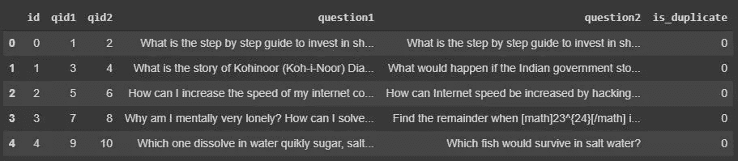

数据集的前五行。

## 性能指标

这是一个二元分类问题，对于给定的一对问题，我们需要预测它们是否重复。唯一的修改是我们将使用概率分数来设置阈值。

指标-

*   对数损失:[https://www.kaggle.com/wiki/LogarithmicLoss](https://www.kaggle.com/wiki/LogarithmicLoss)
*   二元混淆矩阵

因为我们将处理概率得分，所以最好选择对数损失作为我们的度量。对数损失总是对概率分数的小偏差不利。二元混淆矩阵将为我们提供一些指标，如 TPR、FPR、TNR、FNR、精度和召回率。

来源:[https://www . ka ggle . com/c/quora-question-pairs/overview/evaluation](https://www.kaggle.com/c/quora-question-pairs/overview/evaluation)

## 训练和测试分割

一个更好的分割数据的方法是**基于时间的分割，因为问题的类型会随着时间而变化**。但是我们还没有得到给定的时间戳。因此，我们将通过以 70:30 或 80:20 的比例随机分割来构建训练和测试，无论我们选择什么，因为我们有足够的点来工作。

# 探索性数据分析

在本节中，我们将分析数据，以了解数据中发生的情况。

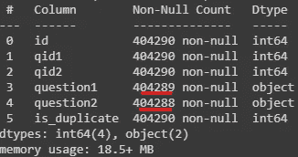

除了“问题 1”和“问题 2”分别有 1 个和 2 个空对象外，每个功能都有 404290 个非空值。我们将以不同的方式处理这些行。这是数据的高级视图。

## 数据点在输出类中的分布

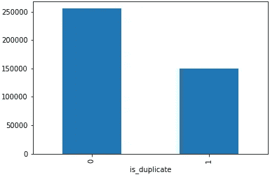

我们有 63.08%的非重复对和 36.92%的重复对。我们有

*   独特问题的数量是 537933
*   出现多于一个的独特问题的数量是 111780，相当于所有独特问题的 20.78 %。
*   单个问题重复的最大次数:157
*   我们没有重复的问题。

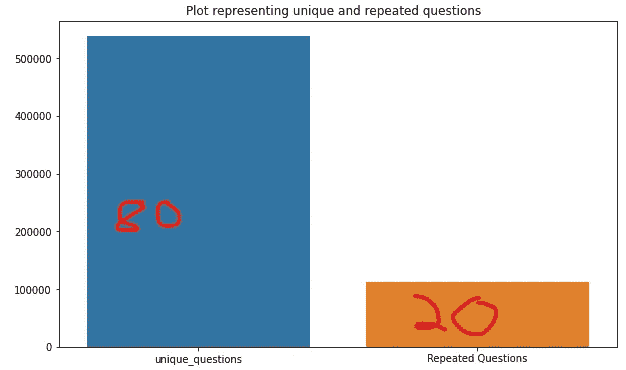

现在我们来看看这个问题的分布。

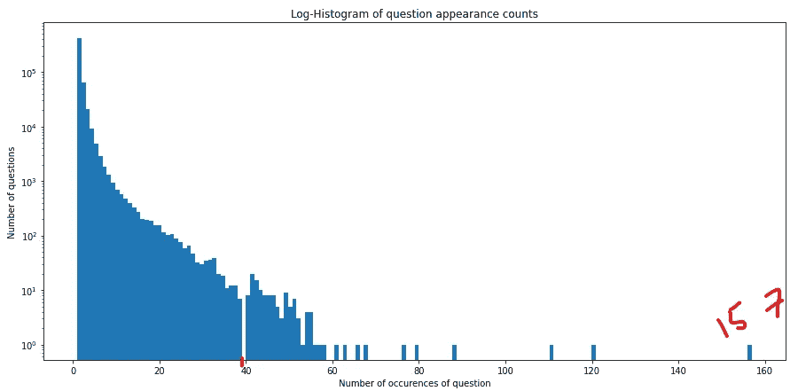

这看起来像一个指数分布。

从上图可以清楚的看到**大部分问题出现不到 40 次**。我们很少有偶然出现超过 60 次的异常值，一个问题出现了 157 次的极端情况。

就空值而言，我们只是用一个空格来替换它们。

## 基本特征提取(清洁前)

在清理之前，我们将提取一些基本特征。这些功能可能会也可能不会解决我们的问题。

*   **freq _ qid 1**= qid 1 的频率
*   **freq _ qid 2**= qid 2 的频率
*   **Q1 len**= Q1 的长度
*   **q2len**= Q2 的长度
*   **q2_n_words** =问题 2 的字数
*   **word_Common** =(问题 1 和问题 2 中常见唯一词的数量)
*   **word_Total** =(问题 1 总字数+问题 2 总字数)
*   **word _ share**=(word _ common)/(word _ Total)
*   **freq _ Q1+freq _ Q2**= qid 1 和 qid2 的频率总和
*   **freq _ Q1-freq _ Q2**= qid 1 和 qid2 的绝对频率差

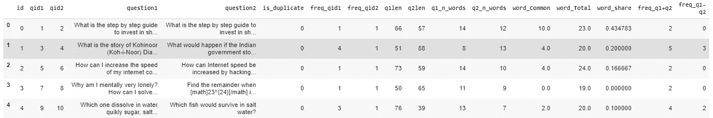

让我们分析一些特征

*   单词共享

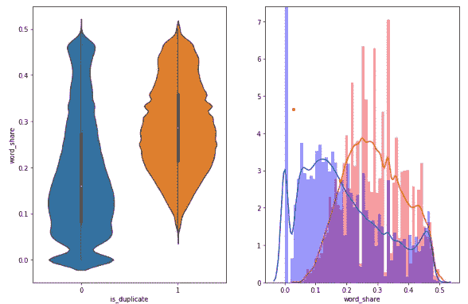

1.  标准化 word_share 的分布在最右侧有一些重叠，即有相当多的问题具有高的单词相似性
2.  当 qid1 和 qid2 重复(相近)时，它们的平均词份额和共有词数都较大

这意味着该特征在分类中具有某些价值。

*   Word_Common

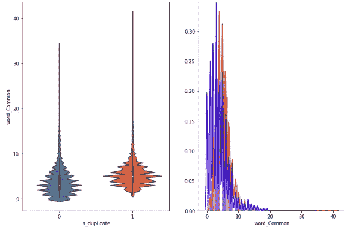

word_Common 特征在相似和非相似问题中的分布高度重叠。因此，该特征不能用于分类。或者换句话说，我们可以说它的预测能力很小。

## 文本预处理

在我们进入复杂的特征工程之前，我们需要清理数据。预处理的一些步骤包括-

*   删除 html 标签
*   删除标点符号。
*   执行词干分析，将屈折词(或有时衍生词)简化为词干、词根或词根形式的过程。

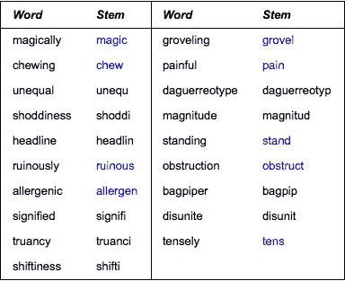

一些单词及其词干

*   删除停用词。一些停用词的例子有:“a”、“and”、“but”、“how”、“or”和“what”
*   扩展缩写，例如将“ll”替换为“will”，“n`t”替换为“not”，“$”替换为“dollar”等。

## 高级特征提取(自然语言处理和模糊特征)

我们将提取一些高级功能。首先，我们应该熟悉一些术语。

*   **令牌**:将句子分割成一个空格，得到一个令牌
*   **停止字**:根据 NLTK 停止字。NLTK 是我们正在使用的 nlp 库。
*   **字**:不是停止字的令牌

现在让我们来看看它的特点。

*   **CWC _ min**:Q1 和 Q2 常用字数与最小字数之比
    cwc_min =常用字数/ (min(len(q1_words)，len(q2_words))
*   **CWC _ max**:common _ word _ count 与 Q1 和 Q2 字数最大长度的比值
    CWC _ max = common _ word _ count/(max(len(Q1 _ words)，len(q2_words))
*   **CSC _ min**:Q1 和 Q2 的公共停止计数与最小停止计数长度的比值
    csc_min =公共停止计数/ (min(len(q1_stops)，len(q2_stops))
*   **CSC _ max**:common _ stop _ count 与 Q1 和 Q2 停车计数最大长度的比值
    CSC _ max = common _ stop _ count/(max(len(Q1 _ stops)，len(q2_stops))
*   **CTC _ min**:common _ token _ count 与 Q1 和 Q2 令牌计数的最小长度之比
    CTC _ min = common _ token _ count/(min(len(Q1 _ tokens)，len(q2_tokens))
*   **CTC _ max**:common _ token _ count 与 Q1 和 Q2 令牌计数最大长度之比
    CTC _ max = common _ token _ count/(max(len(Q1 _ tokens)，len(q2_tokens))
*   **last_word_eq** :检查两个问题的首字是否相等
    last _ word _ eq = int(Q1 _ tokens[-1]= = Q2 _ tokens[-1])
*   **first_word_eq** :检查两个问题的首字是否相等
    First _ word _ eq = int(Q1 _ tokens[0]= = Q2 _ tokens[0])
*   **abs_len_diff** : Abs。长度差
    ABS _ len _ diff = ABS(len(Q1 _ tokens)—len(Q2 _ tokens))
*   **mean_len** :两个问题的平均令牌长度
    mean _ len =(len(Q1 _ tokens)+len(Q2 _ tokens))/2
*   **fuzz _ ratio**:[https://github.com/seatgeek/fuzzywuzzy#usage](https://github.com/seatgeek/fuzzywuzzy#usage)[http://chair nerd . seat geek . com/fuzzywuzzy-fuzzy-string-matching-in-python/](http://chairnerd.seatgeek.com/fuzzywuzzy-fuzzy-string-matching-in-python/)
*   **fuzzy _ partial _ ratio**:[https://github.com/seatgeek/fuzzywuzzy#usage](https://github.com/seatgeek/fuzzywuzzy#usage)[http://chair nerd . seat geek . com/fuzzywuzzy-fuzzy-string-matching-in-python/](http://chairnerd.seatgeek.com/fuzzywuzzy-fuzzy-string-matching-in-python/)
*   **token _ sort _ ratio**:[https://github.com/seatgeek/fuzzywuzzy#usage](https://github.com/seatgeek/fuzzywuzzy#usage)[http://chair nerd . seat geek . com/fuzzywuzzy-fuzzy-string-matching-in-python/](http://chairnerd.seatgeek.com/fuzzywuzzy-fuzzy-string-matching-in-python/)
*   **token _ set _ ratio**:[https://github.com/seatgeek/fuzzywuzzy#usage](https://github.com/seatgeek/fuzzywuzzy#usage)[http://chair nerd . seat geek . com/fuzzywuzzy-fuzzy-string-matching-in-python/](http://chairnerd.seatgeek.com/fuzzywuzzy-fuzzy-string-matching-in-python/)
*   **longest _ substr _ Ratio**:Q1 和 Q2 令牌计数的最长公共子串长度与最小长度之比
    longest_substr_ratio = len(最长公共子串)/ (min(len(q1_tokens)，len(q2_tokens))

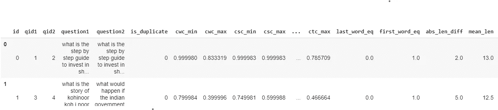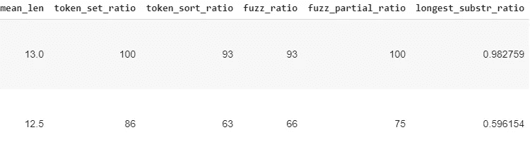

## 分析提取的特征

我们将首先创建单词云。词云是由在特定文本或主题中使用的**个词**组成的图像，其中每个**词**的大小表示其出现的频率或重要性。

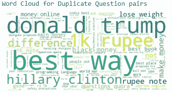

在这里，我们可以清楚地看到，诸如“唐纳德”、“特朗普”、“最佳”等词的大小更大，这意味着它们在重复的问题对中出现的频率很高

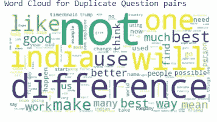

在非重复问句对中，我们会看到像“不”、“印度”、“将要”等词。要注意的一点是，单词“best”即使在非重复对中也有相当大的频率，但是这里它的频率相当低，因为它的图像具有较小的尺寸。

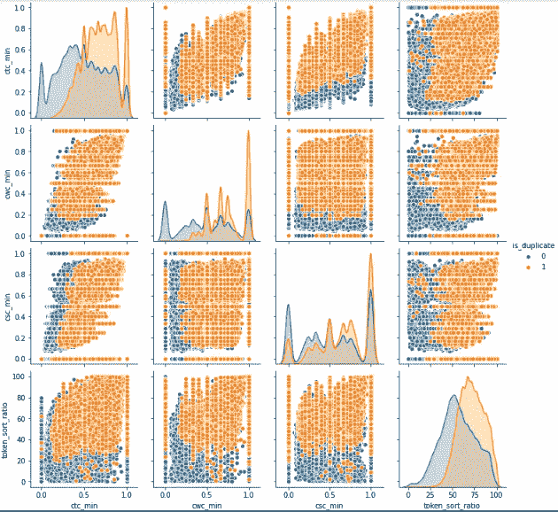

这些是一些高级功能的配对图。我们可以观察到的一点是，几乎所有的图都有部分重叠。因此，我们可以得出结论，这些特征可以提供部分可分性。它们都提供了一些**预测能力**。

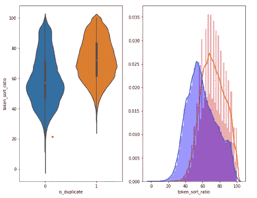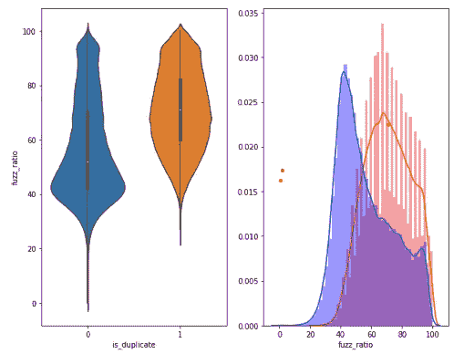

类似地，token_sort_ratio 和 fuzz_ratio 也提供了一些可分离性，因为它们的 pdf 有部分重叠。

## 形象化

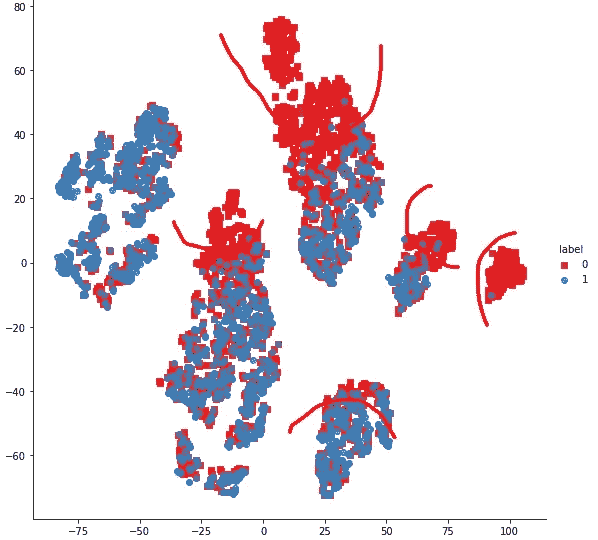

这种可视化是通过使用困惑度= 30 和 max_iter = 1000 的 t-SNE 对 5000 个数据点的样本执行维度缩减(由于计算资源的限制)而创建的。维数从 15 减少到 2。如你所见，有几个突出显示的区域，在那里我们能够完全分离点。这意味着我们在正确的轨道上。

## 用 tfidf 加权词向量特征化文本数据

存在于问题中的词语是有价值的。例如，我们注意到一些单词在重复问题对中出现的频率比非重复问题对更高(如“唐纳德·特朗普”)，反之亦然。现在，我们将使用 [tfidf](https://scikit-learn.org/stable/modules/generated/sklearn.feature_extraction.text.TfidfTransformer.html#sklearn.feature_extraction.text.TfidfTransformer) 加权单词向量。TF–IDF 或 TFIDF 是术语频率–逆文档频率的缩写，是一种对文本数据进行矢量化的数字方法，旨在反映一个词对集合或语料库中的文档有多重要。

*   找到 TF-IDF 分数后，我们通过这些分数将每个问题转换为 word2vec 向量的加权平均值。
*   在这里，我们使用一个预先训练好的手套模型，它是免费的。[https://spacy.io/usage/vectors-similarity](https://spacy.io/usage/vectors-similarity)
*   它是在维基百科上训练的，因此，它在单词语义方面更强。

对于每个问题，我们都会有一个 96 维的数字向量。

在将其与之前的特征(即 nlp 和简单特征)结合之后，数据的总维度将是 221。

首先是我们的高级 nlp 特征，然后是简单特征，最后是问题 1 和问题 2 的向量。

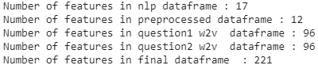

# 训练模型

## 构建随机模型(寻找最坏情况下的日志丢失)

我们的关键性能指标“对数损失”是一个范围为 *(0，* ∞ *)的函数。*因此，我们需要一个随机模型来获得指标的上限。当给定 x_i 时，随机模型将随机产生 1 或 0，其中两个标签是等概率的。

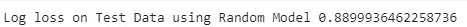

0.88 是我们随机模型的对数损失值。对于我们的问题,“体面的”模型将具有不接近 0.88 的对数损失值。请注意，类 0 的数据点比类 1 的数据点多。

## 超参数调整的逻辑回归

由于我们的数据既不是高维(例如 1000)也不是低维(例如 30)，它在某种程度上位于 221 维的中间。因此，我们将首先尝试超参数调整的逻辑回归模型。我们将使用网格搜索。

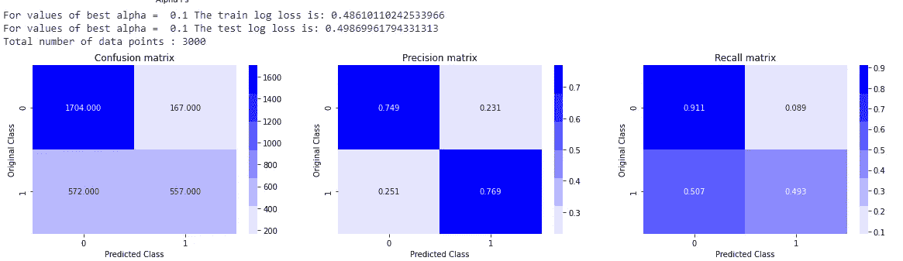

我们得到的最佳 alpha(超参数)为 0.1，测试数据的对数损失约为 0.4986，比随机模型稍好**。我们在这个模型中观察到的几件事是-**

*   该模型没有过度拟合的问题，因为它在训练中的对数损失和测试数据非常接近。它可能存在高偏差或不合适
*   模型能够很好地预测类别 0，但在类别 1 的情况下表现不佳。
*   两个类的精度都在 0.85 左右，不是很高。
*   0 类的召回率很高，但 1 类的召回率很低。

## 具有超参数调谐的线性 SVM

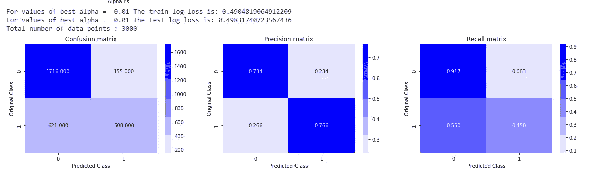

*   与逻辑回归模型类似，线性 SVM 模型不会出现过拟合问题，因为它对训练数据和测试数据的对数损失非常接近。可能是偏高或不合适。
*   线性 SVM 也存在类似的精度和召回率问题。
*   我们在模型中没有观察到任何显著的改进，因为测试数据的对数损失仍然非常相似。

## XGboost 带超参数调整

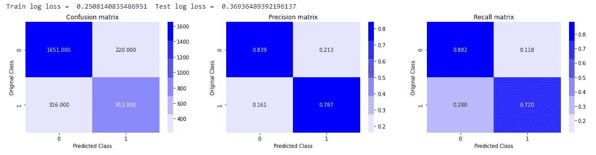

*   训练损失和测试损失之间有很大的差异，这意味着我们的模型存在过度拟合的问题。我们的测试损失仍然比线性模型好。
*   对于 1 类，我们在精确度和召回率上都有所提高。这意味着我们的模型即使对于类 1 也能够很好地执行。

总之，XGboost 的性能比线性模型好得多。这表明数据不是线性可分的，我们需要一个复杂的非线性模型，如 XGboost。

# 参考

*   讨论:[https://www . ka ggle . com/anokas/data-analysis-xgboost-starter-0-35460-lb/comments](https://www.kaggle.com/anokas/data-analysis-xgboost-starter-0-35460-lb/comments)
*   Kaggle 获胜方案及其他途径:[https://www . Dropbox . com/sh/93968 nfnrzh 8 BP 5/aaczdtsapc 1 qst QC 7x 0h 3qz 5a？dl=0](https://www.dropbox.com/sh/93968nfnrzh8bp5/AACZdtsApc1QSTQc7X0H3QZ5a?dl=0)
*   博客 1:[https://engineering . quora . com/Semantic-Question-Matching-with-Deep-Learning](https://engineering.quora.com/Semantic-Question-Matching-with-Deep-Learning)
*   博客 2:[https://towards data science . com/identifying-duplicate-questions-on-quora-top-12-on-ka ggle-4c 1 cf 93 f1 C30](https://towardsdatascience.com/identifying-duplicate-questions-on-quora-top-12-on-kaggle-4c1cf93f1c30)