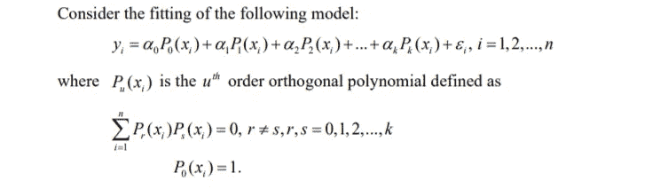

# 用于拟合基本回归模型的 r 命令

> 原文：<https://medium.com/analytics-vidhya/r-commands-for-fitting-basic-regressions-4a1bc1962856?source=collection_archive---------18----------------------->


**图片来自**[**r . codes(@ r codes _ Official)| Twitter**](https://twitter.com/rcodes_official)

## 介绍

在本文中，我将为您提供所有的 **R 命令**，帮助我们**拟合基本回归模型**。基本上，本文由以下部分组成-

1.  拟合简单线性回归**的 r 命令**
2.  拟合**多元线性回归**的 r 命令
3.  拟合**多项式回归**的 r 命令
4.  拟合**正交多项式回归的 r 命令**
5.  用λ的最佳值拟合**岭回归的 r 命令**
6.  用λ的最佳值拟合**套索回归的 r 命令**
7.  用超参数的最佳值拟合**弹性网回归的 r 命令**

**1。拟合简单线性回归的 r 命令**

希望符合以下模型-


使用已经包含在 R 的**基础包中的 **lm()** 函数如下-**

```
Simple_Linear_Model <- lm(formula = y ~ X  , data =              train_data_with_target_and_predictor)
```

如果想去掉截距项，只需在**公式的**参数中添加 **-1** ，如下-

```
Simple_Linear_Model <- lm(formula = y ~ X **-1**  ,  data = train_data_with_target_and_predictor)
```

**2。拟合多元线性回归的 r 命令**

希望符合以下模型-


再次使用已经包含在 R 的**基础包中的 **lm()** 函数，如下-**

```
Multiple_Linear_Model <- lm(formula = y ~ X_1 + X_2 + ... + X_k  ,  data = train_data_with_target_and_predictor)
```

另一种方法是，用一个**单圆点** **(。)**代替如下分别写出所有预测值-

```
Multiple_Linear_Model <- lm(formula = Y ~ **.**   ,  data = train_data_with_target_and_predictor)
```

如果你想删除一个特定的预测值，比如 X_2，那么只需在**公式**参数中添加 **-X_2** ，如下所示

```
Multiple_Linear_Model <- lm(formula = Y ~ . - X_2 , data = train_data_with_target_and_predictor)
```

想去掉截距项，只需在**公式中添加**-1****自变量如下-

```
Multiple_Linear_Model <- lm(formula = Y ~ . - 1 , data = train_data_with_target_and_predictor)
```

**3。拟合多项式回归的 r 命令**

希望符合以下模型-


再次使用已经包含在 R 的**基础包中的 **lm()** 函数。另外，在**公式**参数中使用 **I()** 来包含高阶预测项，如下所示-**

```
Polynomial_Model <- lm(formula = y ~ X + I(X^2) , data = train_data_with_target_and_predictor)
```

希望符合以下模型-


用于此目的的 r 代码如下-

```
Polynomial_Model <- lm(formula = y ~ X_1 + X_2 + I((X_1)^2) + I((X_2)^2) + X_1:X_2 , data = train_data_with_target_and_predictor)
```

**4。拟合正交多项式回归的 r 命令**

希望符合以下模型-



同样，我们将使用 **lm()** 函数。同样，在**公式**参数中使用 **poly()** 函数如下-

```
Ortho_Polynomial_Model <- lm(formula = Y ~ poly(X_1 , upto_which_order) + poly(X_2 , upto_which_order) +.....+ poly(X_k , upto_which_order) , data = train_data_with_target_and_predictor)
```

在上面的代码中，我为每个预测器拟合了正交多项式。但是，如果需要以线性形式包含任何预测值，那么就相应地包含该预测值，就像我在多元回归拟合或简单线性回归中所做的那样。请看下面的代码

```
Ortho_Polynomial_Model <- lm(formula = Y ~ X_1 + poly(X_2 , upto_which_order) +.....+ poly(X_k , upto_which_order) , 
data =train_data_with_target_and_predictor)
```

在上面的代码中， ***我已经以线性形式包含了预测因子 X_1，而其他所有预测因子都以正交多项式*** *的形式包含了。*

**5。用λ的最佳值拟合岭回归的 r 命令**

众所周知，要拟合岭回归，我们必须找出超参数λ的最佳值。为此，使用以下 R 代码-

```
cv_for_best_lambda <-  cv.glmnet(x_train, y_train, family = "gaussian", alpha = 0, type.measure = "mse")
```

在上面的代码中，请注意**训练数据集以稍微不同的方式**提供。我们必须分离预测值和目标值，并以**矩阵**的形式提供它们，正如我提供 x_train 和 y_train 一样

现在，为了拟合岭回归，使用下面的 R 代码-

```
ridge = glmnet(x_train, y_train, family = "gaussian",alpha = 0, lambda = cv_for_best_lambda$lambda.min)
```

在上面的代码中，您必须注意参数 lambda 的值。 **cv_for_best_lambda** 是在拟合脊线恢复的第一步中创建的 R 对象，您必须在 **cv_for_best_lambda** 后写入 **$lambda.min**

6。用λ的最佳值拟合套索回归的 r 命令

为了拟合 Lasso 回归，我们必须找出超参数λ的最佳值。为此，使用以下 R 代码-

```
cv_for_best_lambda <-  cv.glmnet(x_train, y_train, family = "gaussian", alpha = 1, type.measure = "mse")
```

这里再次注意到**训练数据集以稍微不同的方式**提供。我们必须将预测值和目标值分开，并以**矩阵**的形式提供，就像我提供 x_train 和 y_train 一样

现在，为了拟合 Lasso 回归，使用下面的 R 代码-

```
lasso = glmnet(x_train, y_train, family = "gaussian", alpha = 1, lambda = cv_for_best_lambda$lambda.min)
```

同样，在上面的代码中，您必须注意参数 lambda 的值。 **cv_for_best_lambda** 是在拟合套索回归的第一步中创建的 R 对象，您必须在 **cv_for_best_lambda** 后写入 **$lambda.min**

**7。用超参数的最佳值拟合弹性网回归的 r 命令**

为了拟合弹性网回归，我们必须找出超参数α和λ的最佳值。为此，使用以下 R 代码-

```
**# Define Training Control**
set.seed(123)
train.control <- trainControl(method = "repeatedcv", number = 10, repeats = 3 , search = "random")

**# Train the model**
cv_for_best_value <- train(target_name ~ ., data = train_data, method="glmnet", trControl = train.control)
```

在上面的代码中，请注意 **train_data** 由**目标**和**预测器**组成，位于**数据帧**中。

现在，为了适应弹性网回归，使用下面的 R 代码-

```
enet <- glmnet(x_train, y_train, alpha = cv_for_best_value$bestTune[1,1] , lambda = cv_for_best_value$bestTune[1,2] , family = "gaussian"
```

在上面的代码中，注意参数 alpha 和 lambda 的值。关于脊、套索和弹性网回归的更多信息，请阅读我的文章 [**多重共线性/脊/套索/弹性网回归**](/analytics-vidhya/multicollinearity-ridge-lasso-elastic-net-regression-using-r-6582cbabf7f3?source=friends_link&sk=9aefa18ff84a10e36d0ab2695172f638)

> 直到现在，这些都在这个笔记本里。但是这个笔记本会定期更新。我想在这个笔记本中包含不同回归技术的 R 代码。请与此笔记本保持联系，获取更多 R 代码。

## 感谢阅读我的文章！

我的 kaggle 笔记本: [**点击**](https://www.kaggle.com/pranjalpandey12/r-commands-for-fitting-basic-regressions?scriptVersionId=40603664)