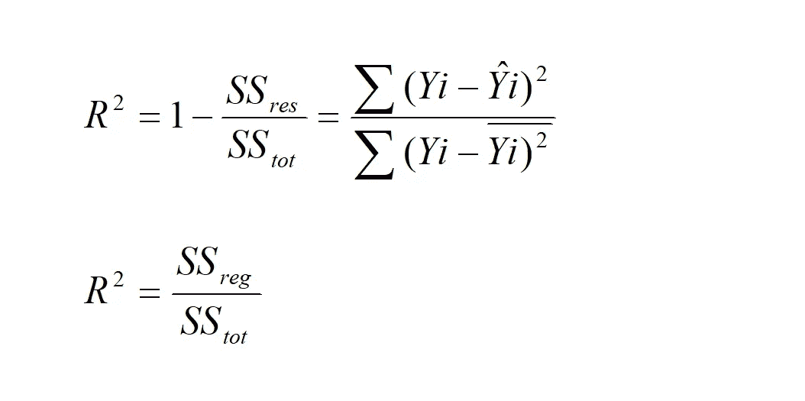
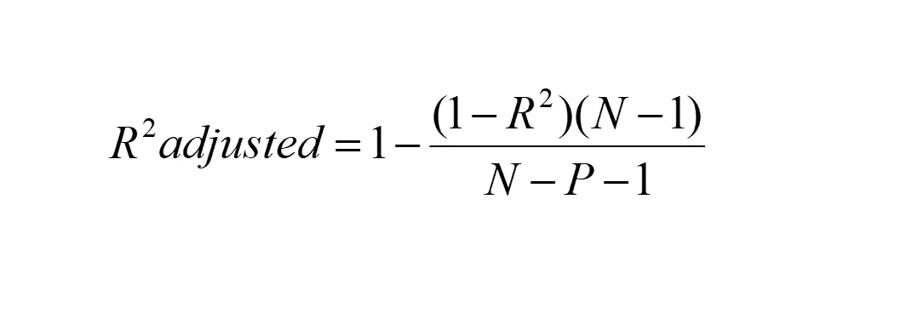

# R 平方和调整后的 R 平方

> 原文：<https://medium.com/analytics-vidhya/r-square-and-adjusted-r-square-ca39372ecdd9?source=collection_archive---------25----------------------->

# r 方形:-

r 平方也称为决定系数。

它用于检查最佳拟合线的优度。

通常，我们得到的 R 平方值在 0 到 1 之间。

R 平方值更接近 1，这表明我们的线最适合模型。

但是当我们的最佳拟合线变得比平均最佳拟合线更差时，我们的 R 平方变成负值。

当我们添加越来越多的自变量时，不管它是否与目标变量相关，我们的 R 平方值总是会增加。它从未减少。

它没有惩罚新增加的不相关的自变量。

为了惩罚新增加的不相关的自变量，我们使用了调整的方。

# 调整后的 R 平方:-

它是惩罚不相关的自变量。

当我们加入越来越多与目标变量相关的自变量时，我们调整后的 R 平方值就会增加。

但是，当我们加入越来越多与目标变量不相关的自变量时，我们调整后的 R 平方值就会减小。

# 注意:-

> 调整后的 R 平方值始终小于或等于 R 平方值。

谢了。

通过以下方式联系我:-

电子邮件:——shivammishra2186@yahoo.com

LinkedIn:-[https://www.linkedin.com/in/shivam-mishra-a03815185/](https://www.linkedin.com/in/shivam-mishra-a03815185/)