# R 平方(R)和调整后的 R 平方

> 原文：<https://medium.com/analytics-vidhya/r-square-r%C2%B2-and-adjusted-r-square-63b77d4a6bd7?source=collection_archive---------12----------------------->

大家好，今天我们将讨论 R-Square 和调整的 R-Square，所以为了获得更多关于你的线性模型的知识，请留在这里。任何回归练习的目标都是解释因变量 y 的变化。就回归模型而言，下一步是评估模型性能，并了解我们的模型相对于基准模型有多好。

在这篇博客中，我们将讨论下面提到的事情:

*   **什么是 R？**
*   **如何计算 R？**
*   **R .的范围**
*   **什么是好的 R 值？**
*   **R 的限制**
*   **调整后的 R .**

# R 是什么

R-square(R)也称为*决定系数*，它是由自变量 x 解释的 Y 的变化比例。它是模型拟合优度的度量。

如果 R 为 0.8，这意味着 80%的输出变化可以用输入变量来解释。因此，简单来说，R 越高，输入变量解释的变化就越多，因此你的模型就越好。

# 如何计算 R-square (R)？

r 是*残差平方和与**总平方和之比。***

**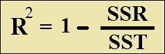**

*   **SSR(残差平方和)是实际观测值(y)和预测值(y^)之差的平方和**
*   **SST(总平方和)是实际观察值(y)和观察值平均值(yavg)之差的平方和**

**让我们借助一个例子来理解这些术语。考虑一个简单的例子，我们观察到一个人的经历如何影响薪水。**

**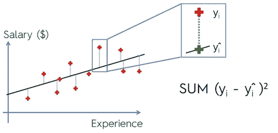****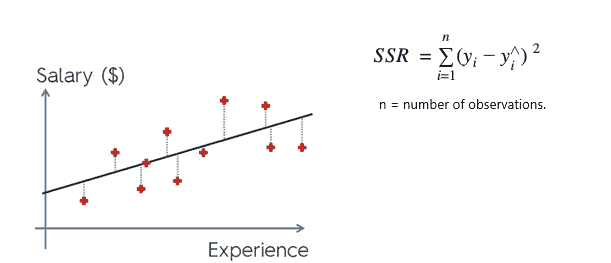**

**我们有一条黑线，它是一条回归线，描绘了相对于 x 轴上的体验，工资的预测值位于何处。星星代表工资的实际值，即相对于经验观察到的 y 值。十字标记代表 y^.表示的经验观察值的工资预测值**

**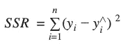**

**其中 n 是观察次数。**

> ***注:SSR 是回归线的最佳拟合标准。也就是说，回归算法通过绘制随机线并比较每条线的 SSR，为给定的一组观察值选择最佳回归线。SSR 值最小的线是最佳拟合线。***

**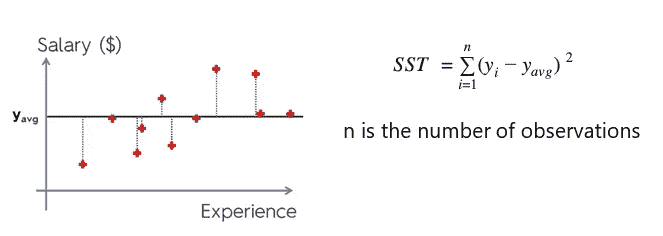**

**上图中的黑线表示平均工资相对于经验的位置。**

**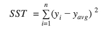**

**r 的平方现在可以通过下式计算:**

****

# **R 平方的范围(R)**

**一般说 R 的取值范围是 0 到 1，其实是***(-无穷大)到 1。*****

**R **=0 :-** 表示回归线与数据拟合不佳。即 X 和 y 之间没有线性关系**

**R **= 1 :-** 它表示完全合适**

**R **=负:-** 当预测太差，残差平方和变得大于总平方和时为负。**

> **负的 R 平方意味着什么？**
> 
> **这意味着模型的表现比每次预测平均值的水平线差。**

# **什么是好的 R 值？**

**值 *0 表示因变量根本不能用自变量来解释。***

**值 *1 表示因变量可以被自变量完美地解释*而没有错误。**

**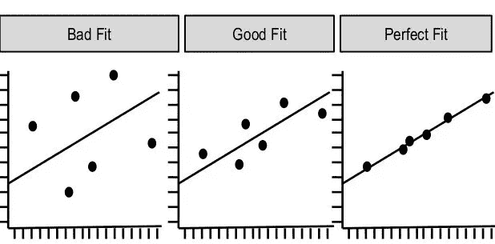**

***从左向右增加*R**

***现在考虑一种假设情况，即所有预测值都与数据集中的实际观察值完全匹配。在这种情况下，对于所有观测值，y 将等于 y^，因此导致 *SSR 等于零*。所以 R = 1。***

***在另一种情况下，如果预测值远离实际观测值，SSR 将向无穷大增加。这将增加 SSR/SST 的比值，从而导致 R 平方值减小。R = -ve。***

***因此，R 将帮助我们确定模型的最佳拟合。R 越接近 1 意味着回归越好。***

## *****R 平方何时为负？*****

***外表可能具有欺骗性。r 实际上不是任何东西的平方。虽然令人惊讶的是看到被称为“平方”的东西有负值，但这不是不可能的***(因为 R 实际上不是 R 的平方)*** *。****

***当最佳拟合直线或曲线在拟合数据方面表现不佳时，r 将为负。这种情况只会发生在您选择了一个很差的模型(可能是错误的)，或者您对模型应用了没有任何意义的约束(可能您在想要输入负数的时候输入了正数)。***

***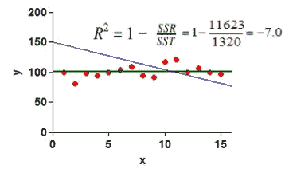***

***例子***

***以上是一个简单的例子。当 X=0 时，蓝线是约束为在 Y=150 处与 Y 轴相交的直线拟合。SSR 是红点到这条蓝线的距离的平方和。SST 是红色点到绿色水平线距离的平方和。由于 SSR 比 SST 大得多，R(对于蓝线的拟合)为负。***

***如果 R 为负，请检查您是否选择了合适的模型，并正确设置了任何约束。***

# *****R 的限制*****

***如上所述，我们考虑了一个简单的例子，其中我们有两个变量 ***经验*** 和 ***薪水。我们根据员工的经验来预测工资。r 和回归可以计算如下:******

***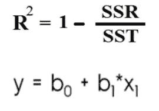***

***还有一个问题是，如果我们在第二个方程中加入另一个变量。***

***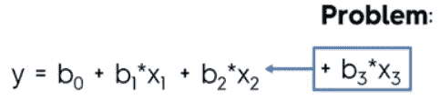***

***一旦我们向我们的模型**添加了一个新变量，SSR** 将最小化，SST 将不受影响，那么 **(SSR / SST )** 将减少。所以 R **的值**会增加。这是 R 的极限，当我们加入变量时，R 永远不会减少。***

***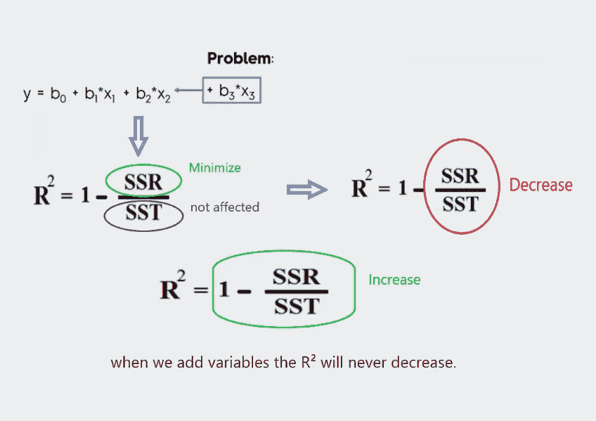***

***所以在加入变量后，你不会发现它会如何影响你的模型，因为 R 不会减少，它会增加。因此，为了克服这个问题，我们使用调整后的 R。***

# ***调整后 R***

***与 R 相同，调整后的 R 衡量因变量的变化。***

***调整后 R 平方的公式:***

***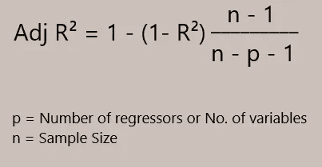***

***调整后的 R 公式***

***当 R 随着变量的增加而增加时，分数 n-1/n-p-1 随着变量的增加而增加。***

***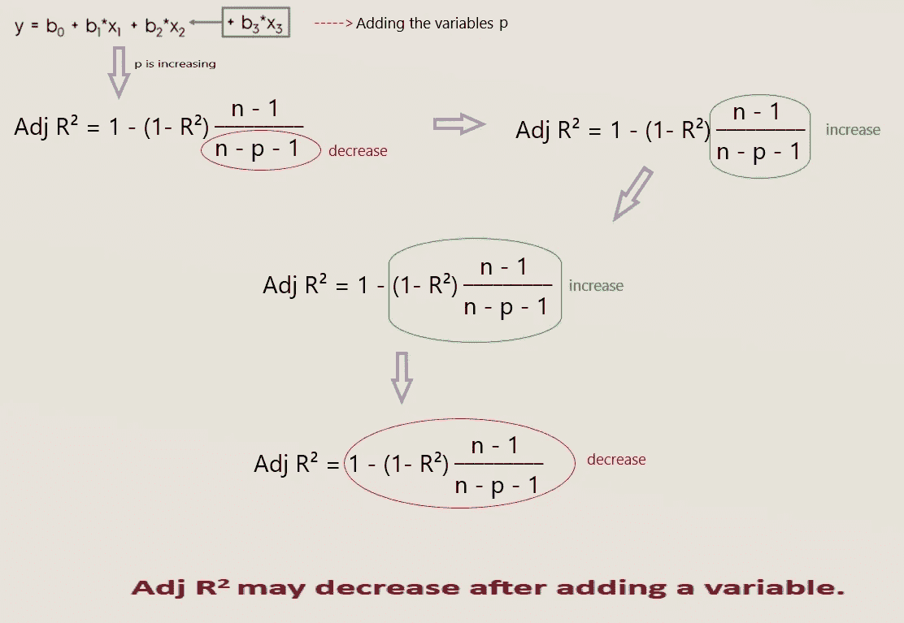***

***因此，调整后 R 的概念增加了回归变量的成本。因此，当变量添加到回归中时，调整后的 R-square 可能会减少。***

***因此，仅当增加的变量相关时，调整后的 R 才会增加。***

> ***请注意，调整后的 R 始终小于或等于 R。***

***因此，在衡量模型的拟合优度时，建议使用调整后的 R 而不是 R。***

***所以这是关于 R 和调整后的 R，我希望你喜欢这个！👍***

***如果您有任何问题或建议，请告诉我！***

***谢谢大家！😊***