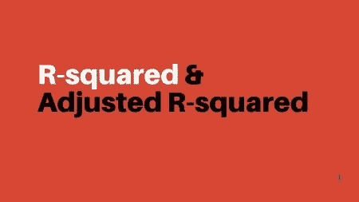

# R 平方和调整的 R 平方

> 原文：<https://medium.com/analytics-vidhya/r-squared-and-adjusted-r-squared-408aaca84fd5?source=collection_archive---------8----------------------->

使用线性回归模型时，使用 ***summary()*** 函数或使用**从 python 中的 **statsmodel.api** 包对 R 中的模型进行汇总。OLS()** 函数，你会遇到不同的统计措施，其中包括 R 平方，调整 R 平方，F 统计和 P 值。我们来谈谈 R 平方和调整后的 R 平方。

# r 平方:

r 平方是输入变量解释预测变量方差的一种度量。

> 方差是统计学中的一种度量，它决定了点之间的距离。换句话说，它被定义为单个点和期望值之间的差的平方的平均值。

r 平方是与均值模型相关的一个相对术语。r 平方值的范围为 0-1，越接近 1，就越能解释其平均值[附近响应数据的可变性。](https://simple.wikipedia.org/wiki/Mean)

所以 R 的平方值越大就意味着模型越好？是的，但是较高的 R 平方值并不总是意味着模型是好是坏。

乔恩·泰森在 [Unsplash](https://unsplash.com?utm_source=medium&utm_medium=referral) 上的照片

对于良好的模型，R 平方的值较低；对于不符合数据的模型，R 平方的值较高。R-Squared 只是提供了对模型和响应变量之间关系强度的估计，并没有为这种关系提供正式的假设检验。总体显著性的 [F 检验](https://en.wikipedia.org/wiki/F-test)确定这种关系是否具有统计显著性。关于我为什么做这个声明，请参考这篇文章。

由于 R-Squared 与均值模型相关，因此向模型中添加更多变量可能会增加 Squared 的值，尽管该变量可能不会对模型产生太大影响。这也可能导致模型的[过度拟合](https://en.wikipedia.org/wiki/Overfitting)，因为它变得过度定制以适应样本中的特性和随机噪声，而不是反映整个总体。

R-squared 公式。

> 其中，SSres 是回归平方和，也称为模型解释的方差。
> 
> SStot 是总和的平方和。
> 
> 易正在实际观察。
> 
> yi_cap 是预测观测值。
> 
> y_bar 是实际值的平均值。

# 调整后的 R 平方:

因为 R 平方可以通过添加更多数量的变量来增加，并且可能导致模型的[过拟合](/analytics-vidhya/over-fitted-and-under-fitted-models-f5c96e9ac581)，所以调整后的 R 平方就出现了。

调整后的 R 平方是 R 平方的修改版本，其值仅在模型中的变量为其增值时才会增加，因此模型中存在的无用变量越多，调整后的 R 平方的值就越小，R 平方的值就越大。这就是调整后的 R 平方值总是小于 R 平方值的原因。

> 尽管 R 平方和调整后的 R 平方给出了落入回归线的数据点的概念。它们之间的唯一区别是，**调整的 R 平方**发现由自变量解释的实际影响因变量的变化百分比，而 **R 平方**假设每个变量都解释了因变量的变化。

调整的 R 平方公式

> 在哪里，
> 
> n 是数据点的数量。
> 
> k 是模型中变量的数量，不包括因变量。

喜欢我的文章？请为我鼓掌并分享它，因为这将增强我的信心。此外，我每周日都会发布新文章，所以请保持联系，以了解数据科学和机器学习基础系列的未来文章。

另外，如果你想的话，可以在 linkedIn 上联系我。

马特·博茨福德在 [Unsplash](https://unsplash.com?utm_source=medium&utm_medium=referral) 上拍摄的照片