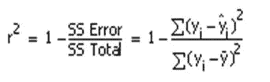
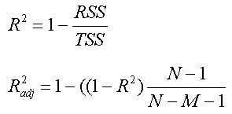

# R 平方与调整后的 R 平方

> 原文：<https://medium.com/analytics-vidhya/r-squared-vs-adjusted-r-squared-a3ebc565677b?source=collection_archive---------3----------------------->

建立机器学习模型后，下一步是评估模型性能，了解我们的模型相对于基准模型有多好。要使用的评估标准取决于您尝试解决的问题的类型-是监督问题还是非监督问题，以及是分类任务还是回归任务。

在这篇文章中，我将谈论两个用于回归问题的重要评估指标，并强调它们之间的关键区别。

# r 平方

r 平方，也称为系数确定，定义了因变量(或目标)中的方差可以由自变量(特征)解释的程度。

让我们通过一个例子来理解这一点——假设某个特定模型的 R 平方值为 0.7。这意味着 70%的因变量变化是由自变量解释的。

理想情况下，我们希望自变量能够解释目标变量的所有变化。在这种情况下，r 的平方值将为 1。因此，我们可以说，r 平方值越高，模型越好。

因此，简单来说，R 的平方越高，输入变量解释的变化就越多，因此你的模型就越好。此外，r 平方的范围从 0 到 1。这是计算 R 平方的公式

R 平方的计算方法是将回归模型的残差平方和(由 SSres 给出)除以平均模型的误差平方和(由 SStot 给出)，然后从 1 中减去。

r 平方的一个缺点是，它假设每个变量都有助于解释目标的变化，这可能并不总是正确的。例如，如果我们向数据中添加新要素(可能有用，也可能没用)，模型的 r 平方值将增加或保持不变，但永远不会减少。

这由 r 平方稍微修改后的版本负责，称为调整 r 平方。

# 调整后的 R 平方

与 R 平方相似，调整后的 R 平方测量因变量(或目标)的变化，仅通过有助于进行预测的特征进行解释。与 R-squared 不同，调整后的 R-squared 会因为添加了对预测目标无用的要素而对您不利。

让我们从数学上理解这一特性是如何适应调整后的 R 平方的。这是调整后的 r 平方的公式

这里，R^2 是计算的 r 平方，n 是行数，m 是列数。随着特征数量的增加，分母中的值减小。

*   如果 R2 显著增加，则调整后的 r 平方会增加。
*   如果 r2 没有显著变化，那么调整后的 R2 将下降。

资源:

*   [应用机器学习课程](https://courses.analyticsvidhya.com/courses/applied-machine-learning-beginner-to-professional?utm_source=medium&utm_medium=R2vsAdjustedR2)
*   [你应该知道的 11 个重要评估指标！](https://www.analyticsvidhya.com/blog/2019/08/11-important-model-evaluation-error-metrics/?utm_source=medium&utm_medium=R2vsAdjustedR2)