# 你准备好见证新冠肺炎了吗？| Plotly 和 Tableau 可视化

> 原文：<https://medium.com/analytics-vidhya/r-you-ready-to-witness-covid-19-plotly-tableau-visualizations-10034161f0e7?source=collection_archive---------19----------------------->

截至 2020 年 5 月 20 日更新

在过去的几个月里，从当地到国际的新闻和社交媒体都在报道一件事，那就是新冠肺炎。病毒突然升级，形成比区块链更大的链，比神经网络更快地联网，并成为全球流行病。除了一般新闻，每个人都可能看到的一件常见的事情是新冠肺炎显示其影响的数据可视化。

数据在评估和控制冠状病毒方面发挥了至关重要的作用。从跟踪受影响的人到计算死者和恢复率，数据可视化一直是卫生工作者的指南。可以肯定的是，有许多网站显示了更好的新冠肺炎传播图，我决定在从事这个项目的同时，为分析冠状病毒传播和学习做出贡献。

我们将看到笔记本是用 R markdown 脚本编写的，并使用“plotly”包绘制了所有图表。稍后我们将在最后看到 Tableau 仪表板。我不会用技术部分来烦你，因为它已经被处理好了。现在让我们深入分析新冠肺炎

在进入剧情之前，下面显示的图形是交互式的，读者可以与图形进行交互，并在我的 Kaggle 报告中以更好的视角查看:[**剧情世界&印度**](https://www.kaggle.com/benroshan/plotly-visualizations-of-covid-19-in-world-india) *中 COVID 19 的可视化。请访问并与剧情互动*

# 1.前 15 个条形图

## 世界民族

下图显示了哪些国家名列前茅。根据数据，我们可以清楚地看到受病毒影响的前 15 个国家的分布情况。如果你想和剧情互动请访问我的 [kaggle 笔记本](https://www.kaggle.com/benroshan/plotly-visualizations-of-covid-19-in-world-india)

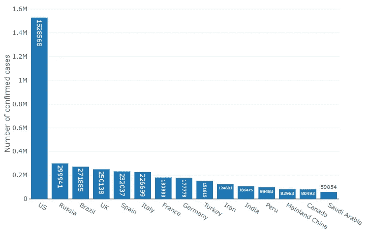

截至 2020 年 5 月 19 日的前 15 个世界国家

让我们来谈谈高度关注的国家——美国，你可以看到美国的病例数量急剧增加。我在 Quora 上找到了一个有趣的答案，关于为什么美国的案件不断增加，我想在这里引用一下

> 我认为这是因为很大一部分人没有认真对待它。人们没有考虑到这种病毒的传染性。它的传染性被认为是季节性流感的 3-10 倍。根据疾病预防控制中心的数据，今年美国有 8.3%的人感染了季节性流感，尽管由于缺乏足够的检测试剂盒，无法获得准确的数字，但预计新冠肺炎至少会感染 20%的人口，伦敦的一个预测模型显示，美国人的感染率可能高达 81%。基于我们 3 . 27 亿的人口，这是 6500 万到 2 . 42 亿病例的范围。太多的人没有遵循常识性的建议以及州和联邦政府的指示，即使他们没有表现出任何感染症状，也要呆在家里。他们可能没有症状，但忽视留在家里和练习社交距离的指导方针可能会导致将其传递给老年人，他们父母或祖父母年龄的人，对他们来说，这可能会变得严重甚至致命。

## 印度各邦

下图显示了印度排名靠前的邦。根据数据，我们可以清楚地看到受病毒影响的前 15 个邦的分布。如果你想和剧情互动请访问我的 [kaggle 笔记本](https://www.kaggle.com/benroshan/plotly-visualizations-of-covid-19-in-world-india)

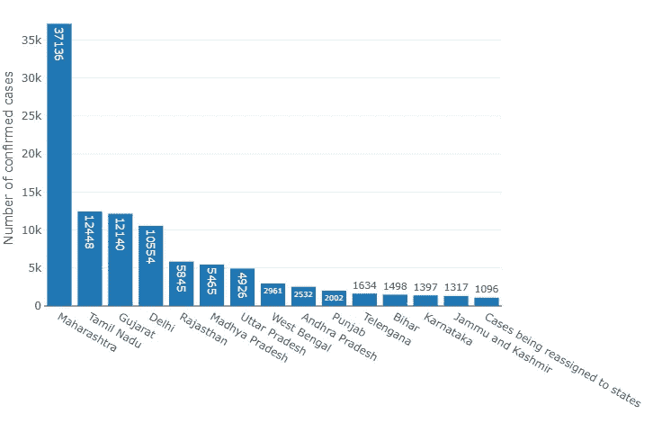

截至 2020 年 5 月 20 日的印度前 15 个邦

如果你看到图中顶部的州，我们可以推断这些州有高人口工业，这些是发生最多的州，有更多的工业和商业中心。新闻报道称，这些州的医院设施准备不足，许多人没有遵守封锁令，导致病例数量上升。

# 2.死亡、恢复和活动状态-条形图

## 世界民族(样本:30)

下图显示了 30 个国家的死亡、康复和活跃样本。我们可以清楚地看到活动病例增多，死亡病例减少。如果你想和剧情互动，请访问我的 [kaggle 笔记本](https://www.kaggle.com/benroshan/plotly-visualizations-of-covid-19-in-world-india)，因为这个博客不支持剧情功能。您也可以使用我的 [kaggle 笔记本](https://www.kaggle.com/benroshan/plotly-visualizations-of-covid-19-in-world-india)中的代码来更改样本计数

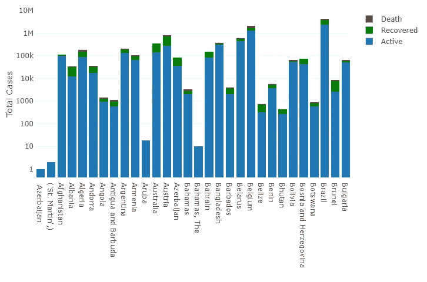

截至 2020 年 5 月 19 日世界各国的死亡、活动、康复状态分布

## 印度各邦(样本:10)

下图显示了 10 个状态样本的死亡、恢复和活动状态。我们可以清楚地看到活动病例增多，死亡病例减少。如果你想和剧情互动，请访问我的 [kaggle 笔记本](https://www.kaggle.com/benroshan/plotly-visualizations-of-covid-19-in-world-india)，因为这个博客不支持剧情功能。您也可以使用我的 [kaggle 笔记本](https://www.kaggle.com/benroshan/plotly-visualizations-of-covid-19-in-world-india)中的代码来更改样本计数

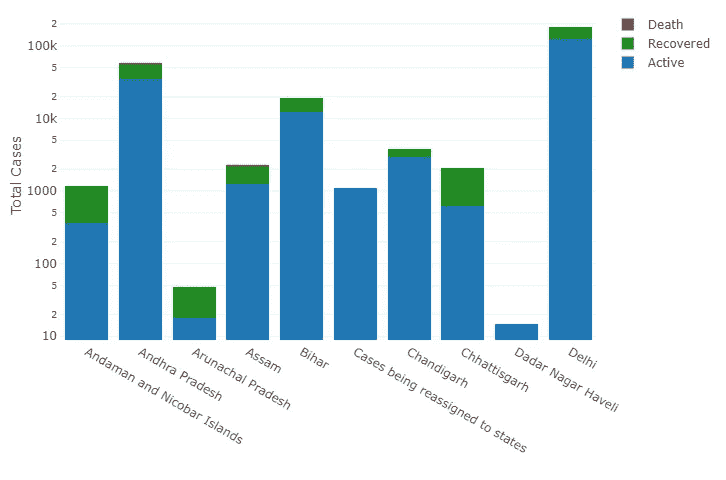

截至 2020 年 5 月 20 日印度各邦的死亡、活动、康复状态分布

我有一个问题，**如果冠状病毒有 95%的治愈率，那么所有的炒作是什么？**下面是来自[斯蒂芬·泰勒](https://www.quora.com/If-the-coronavirus-has-a-95-recovery-rate-then-whats-with-all-the-hype)的回答

> 因为到明年这个时候，世界大部分地区很可能会变成委内瑞拉的样子。请原谅我。病毒本身的死亡率只是冰山一角。为防止或忽视它而采取的措施所产生的全球连锁反应，可能是你一生中见过的最可怕的事情。

# 3.时间序列分析

## 世界趋势线

下面的趋势图显示了世界各国的活跃病例、死亡病例和康复病例是如何增加的，正如你所看到的，病毒传播的增长速度很快。升级从三月中旬开始。

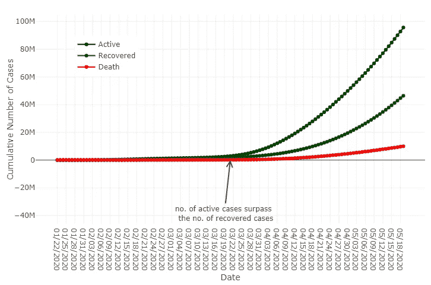

截至 2020 年 5 月 19 日的全球总病例、痊愈病例和死亡病例时间序列

## 印度趋势线

下面的趋势图显示了印度的活跃病例、死亡病例和康复病例是如何增加的，正如你所看到的，病毒传播的速度非常快。升级从四月中旬的**开始**。

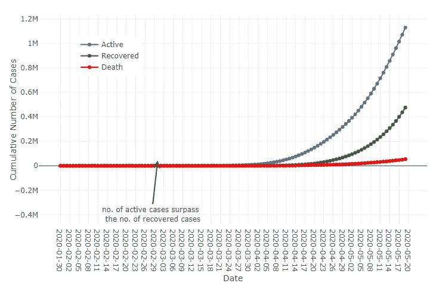

截至 2020 年 5 月 20 日印度总病例、痊愈病例和死亡病例的时间序列

# 4.印度与世界其他地区-折线图

下面是一个比较线图，显示了印度和世界其他国家的情况。你可以看到印度的立场！

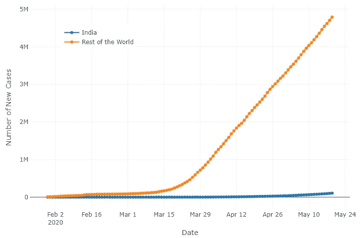

截至 2020 年 5 月 19 日的全球总病例、痊愈病例和死亡病例时间序列

我有一个问题，**印度受冠状病毒恐慌的影响相对较小吗？**以下是 [Vaishnavi Chavan](https://www.quora.com/Is-India-comparatively-less-affected-by-the-Corona-virus-scare) 的回答

> 我读了很多书，也做了一些关于新冠肺炎的研究。与其他国家相比，人口第二多的印度病例较少。不知何故，我认为如果它到达印度，将没有任何办法来遏制它。这是因为印度不太先进的技术和高人口，这将导致它传播得更快。印度很快就取消了落地签证，几个飞往高风险国家的航班被取消。乘客在机场接受高密度的检查。在几个州也观察到部分封锁。此外，印度人吃的食物要煮很长时间。几乎每一道印度菜都要煮 30-45 分钟，以杀死病毒。任何一种肉通常都要煮很多次以使其变嫩，大多数印度人更喜欢吃咖喱而不是沙拉。这些可能是原因

# 5.恢复率与死亡率-气泡图

## 世界各国

下面是一个气泡图，显示了世界各国的恢复和日期率，请与图形交互以查看工具提示中的详细信息。访问我的 [kaggle 笔记本](https://www.kaggle.com/benroshan/plotly-visualizations-of-covid-19-in-world-india)与每个泡泡互动

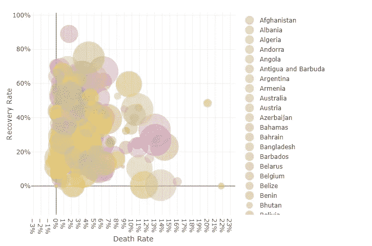

截至 2020 年 5 月 19 日至少有 100 例病例的世界各国的恢复率和死亡率

## 印度各邦

下面是一个气泡图，显示了印度各州的恢复和数据率，请与图表进行交互，以查看工具提示中的详细信息。访问我的 [kaggle 笔记本](https://www.kaggle.com/benroshan/plotly-visualizations-of-covid-19-in-world-india)与每个泡泡互动

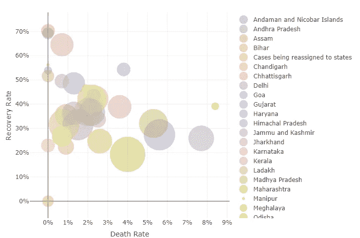

截至 2020 年 5 月 20 日至少有 100 例病例的印度各邦的治愈率和死亡率

# Tableau 公共仪表板

现在，是时候让我们进入可视化工具之王 Tableau 了。为您呈现仪表盘，请访问我的 [tableau 公众号](https://public.tableau.com/profile/ben.roshan#!/)与仪表盘互动

## 世界各国- Tableau 仪表板

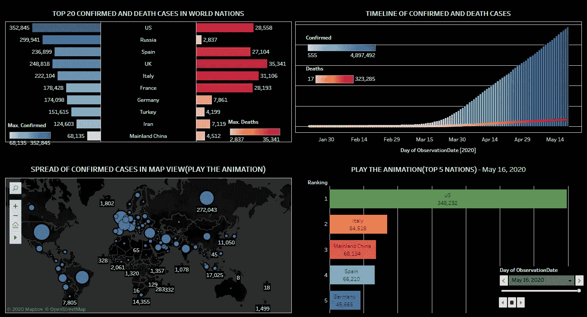

截至 2020 年 5 月 19 日的新冠肺炎世界国家仪表板

## 印度各州- Tableau 仪表板

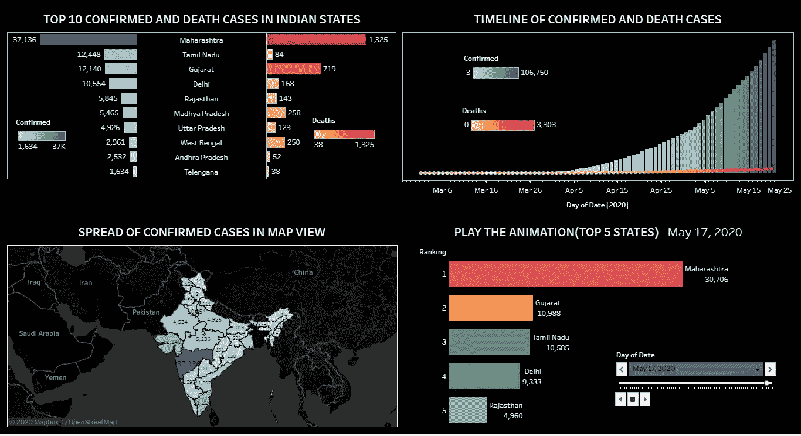

截至 2020 年 5 月 20 日的新冠肺炎印度仪表板

那都是乡亲们！如果你想查看一些互动的图片，可以在附录中找到。这可能听起来很老套。但是这些图可以在这里以更好的方式可视化。点击这个- [kaggle 笔记本](https://www.kaggle.com/benroshan/plotly-visualizations-of-covid-19-in-world-india)。如果你觉得这篇文章有价值，请分享给你的朋友。

## Kaggle 笔记本附录

这些图片是互动时捕捉到的。请访问我的 [Kaggle 笔记本](https://www.kaggle.com/benroshan/plotly-visualizations-of-covid-19-in-world-india?scriptVersionId=34162042)与剧情互动并获得最大的洞察力

## **参考:** [Plotly 机器学习专家 Python 教程](https://neptune.ai/blog/plotly-python-tutorial-for-machine-learning-specialists)

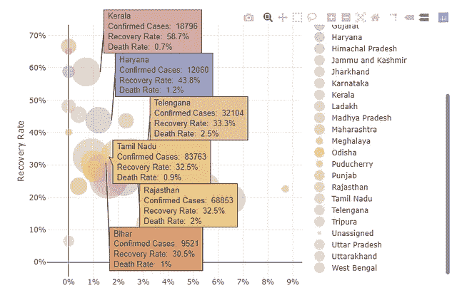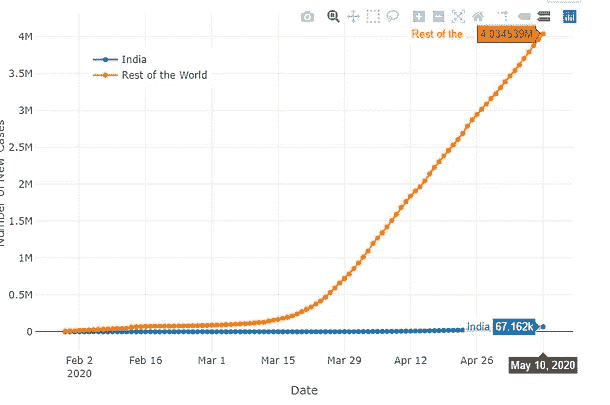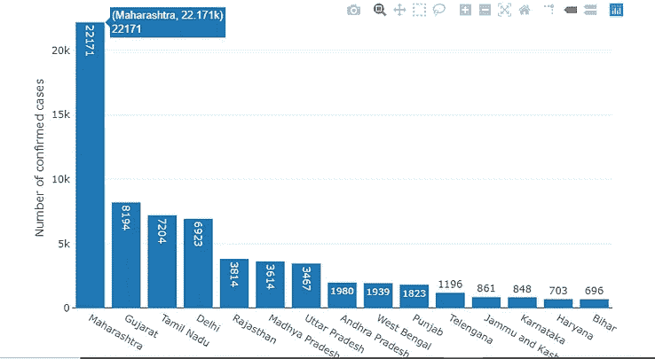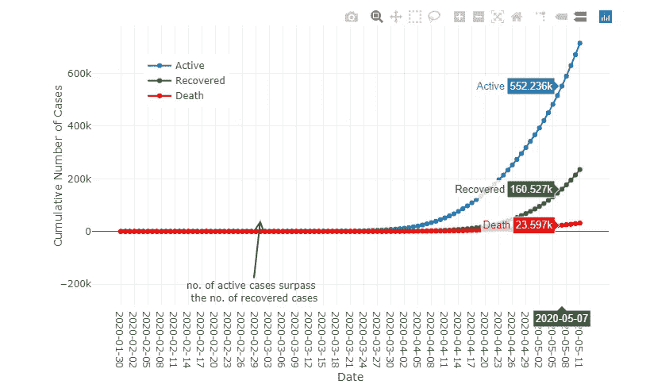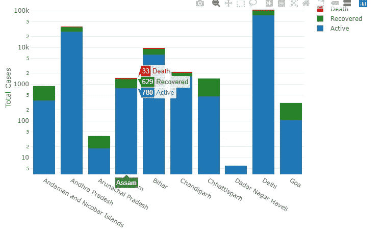

互动时的情节