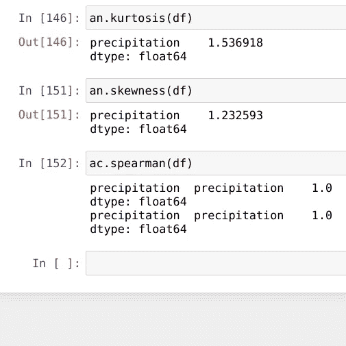

# 巴西东北部地区的降雨概率。

> 原文：<https://medium.com/analytics-vidhya/rain-probability-in-the-northeast-region-of-brazil-706b4d0ec8e6?source=collection_archive---------18----------------------->

本文是指位于巴西东北部地区的各州发生降雨事件的概率，使用统计技术进行数据分析，以预测在给定地区更有可能发生气候事件的各州。

1.  **简介**

**1.1 背景**

天气条件是农业的基础，因为天气条件除了是决定作物产量的主要因素之一外，还决定了农场的活动日程，因此，对于农村生产者来说，预测这些多雨天气事件是非常重要的。

**1.2 问题**

大量的农业生产，使得食品和其他几种类型的产品到达消费者手中，但是它们依赖于定期的降雨周期，当降雨量发生变化时，这种事件中出现了一种称为干旱的现象，并且在补充这些食品时会感觉到某些后果，从而增强了最终消费者对产品的需求。

**1.3 解决方案**

为了解决这个问题，我基于一个数据集进行了数据分析，该数据集来自名为“*巴西的降水*”的 kaggle，我使用了统计学和数据科学技术以及机器学习，这是一个处理信息的模型，以便预测给定地区发生降雨天气事件的概率。

**2。数据采集和清理**

**2.1 数据来源**

在我们问题的当前背景下，影响我们决策的事实将是:

*   平均风速
*   最大风速(平均)
*   平均云量
*   全年总雨量
*   平均补偿温度
*   平均相对湿度

提取和生成必要信息所需的数据源:

BDMEP 数据库——用于教学和研究的气象数据库

位于:

提取和生成必要信息所需的数据源:

BDMEP 数据库——用于教学和研究的气象数据库

位于:

[http://www.inmet.gov.br/portal/index.php?r=bdmep/bdmep](http://www.inmet.gov.br/portal/index.php?r=bdmep/bdmep)

和 kaggle 数据集

位于:

 [## 巴西的降水

### 1998 年至 2017 年的平均降雨量

www.kaggle.com](https://www.kaggle.com/fabiopotsch/precipitation-in-brazil) 

**2.2 数据清理**

在 BDMEP 的数据库中，有许多历史数据，并且以令人不快的格式执行分析，它是在 txt 中，我必须执行到 csv 的转换，并修改字段的数据类型，之后我用空值替换广义平均值。

**3。** **探索性数据分析**

**3.1 描述性数据分析**

识别异常值，很明显有 45%以上的降水量。

比较各州的降雨量。

费希尔分布，许多值接近于零，呈下降趋势。

平均云量的散点图，我们观察到高斯分布的理想值在 6.5 和 7.5 之间

在最大风速(平均)指标的散点图上，我们观察到高斯分布的理想值在 6 和 8 之间

**3.2 数据正常性验证**

**3.2 按国家分列的索赔比较**

通过比较各州的降雨量，我们可以清楚地看到阿马帕州的降雨量远远高于伯南布哥州

最需要对多雨天气事件保持警惕的州之一是 PE 州，因为与降雨量最大的州相比，该地区的降雨强度非常小，基于这一点，农民可以在一年中的特定时间更好地准备此类事件。

**5。结论**

这项研究的目的是帮助我们的农民预防他们最期待的事件之一，提供库存食品来销售这些产品，增加消费者的消费和国家的经济。

**6。参考文献**

1.  [卡格尔](https://www.kaggle.com/)
2.  [BDMEP](http://www.inmet.gov.br/portal/index.php?r=bdmep/bdmep)
3.  [超级自行车](https://www.superbac.com.br/blog/quais-os-principais-impactos-da-seca-na-agricultura/)