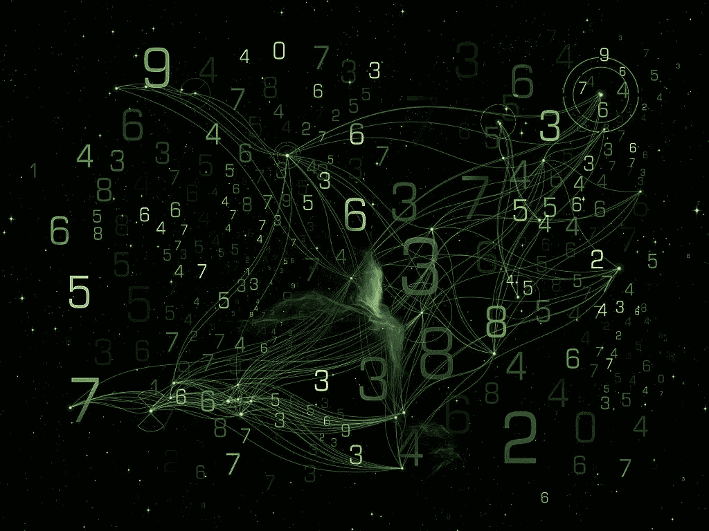
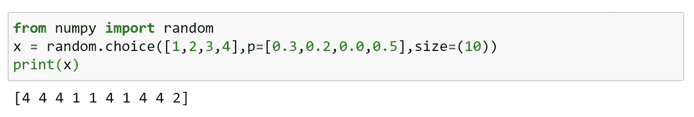
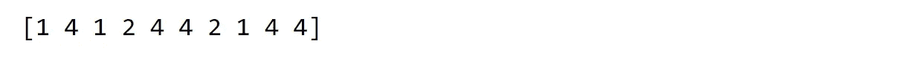
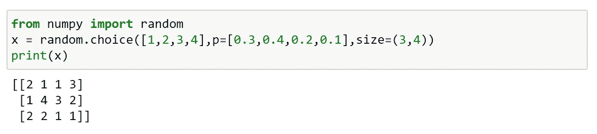
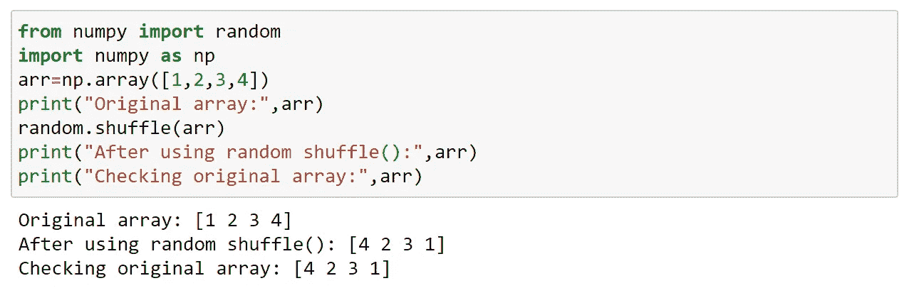
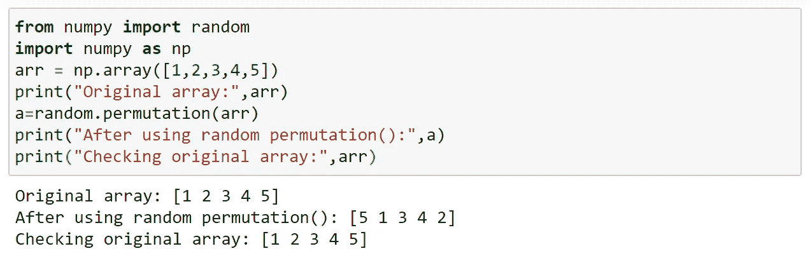

# 数字中的随机数据分布

> 原文：<https://medium.com/analytics-vidhya/random-data-distribution-in-numpy-101c7c9188f9?source=collection_archive---------26----------------------->

## 什么是数据分布？

数据分布是显示数据的所有可能值(或区间)以及每个值出现的频率的函数或列表。

在处理统计和数据科学时，数据分布非常重要。

random 模块提供了返回随机生成的数据分布的方法。

## 随机分布:

随机分布是一组遵循特定概率密度函数的随机数。

**什么是概率密度函数？**

描述连续概率(即数组中所有值的概率)的函数。

我们可以使用 choice()方法来生成它。

概率由 0 到 1 之间的数字设定；

0:值永远不会出现。

1:价值总会发生。

我们知道，所有概率的总和应该总是 1。

示例 1:

生成包含 10 个值的一维数组，其中每个值必须是 1、2、3 或 4。

该值为 1 的概率被设置为 0.3

该值为 2 的概率被设置为 0.2

该值为 3 的概率被设置为 0

该值为 4 的概率被设置为 0.5

再次跑步；

无论你运行这个程序多少次，值 3 都不会出现。这是因为我们已经将概率 3 赋值/设置为‘0’。

您还可以通过在 *size* 参数中指定形状来返回任何形状和大小的数组。

示例 2:

生成 3 行的二维数组，每行包含 4 个值；

## **随机排列:**

置换是指改变元素的排列。

Numpy 随机模块为此提供了两种方法:

无序播放()

排列()

***洗牌():***

它就地改变元素的排列(在数组本身中)。

(即)对原始数组进行改变。

***排列():***

它在复制时改变元素的排列。

(即)通过返回重新排列的数组而不改变原始数组来进行改变。

就这样，我们来到了这篇文章的结尾。

快乐编码…😊😊😊