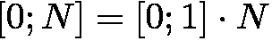
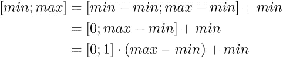
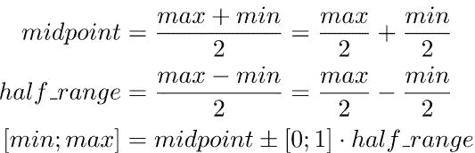

# 任意范围内的随机浮动

> 原文：<https://medium.com/analytics-vidhya/random-floats-in-any-range-9b40d30b637b?source=collection_archive---------16----------------------->


我最近遇到了这样一种情况，我想测试一个方法，给它输入随机的浮点数，并验证它没有边界。我原以为这是一件简单的事情，但是在这篇文章中我们会探究很多陷阱。

让我们从一个规范开始:我想要一个函数，它可以生成没有特殊属性的随机浮点数。即。应使用整个范围，无特殊值，同时使用大正值(如 1e38)、小正值(如 1e-20)、小负值(如-1e-20)和大负值(如-1e38)。

在所有示例中，我们都假设可以访问该变量:

```
private Random rand = new Random();
```

## 没有范围

在 Java 中，获得一个随机浮点数很容易:

```
return rand.nextFloat();
```

然而，这种方法不符合我们的规范，因为它只生成范围在[0；1].

## 正范围

我们需要扩大范围。让我们从将范围扩展到[0；N]对于任何 N ≤ `Float.MAX_VALUE`。数学很简单:



它直接翻译成代码:

```
return rand.nextFloat() * N;
```

## 小范围

我们要做的下一件事是扩展我们的函数，这样我们也可以改变较低的值。我们已经有一个[0；N]，如果我们从期望的[ *min* 开始，我们就可以利用这一点； *max* 然后从范围的两个分量中减去 *min* ，如下所示:



导致这种方法:

```
return rand.nextFloat() * (max - min) + min;
```

这对于小范围非常有效，但请记住，我们的初始函数并不适用于所有 n。我们在这种情况下的问题是，如果`min`为负，那么`max — min`可能会大于`Float.MAX_VALUE`，从而导致∞。

## 大范围

为了解决这个溢出问题，我们可以使用一个技巧:我们可以将范围从中间分开，然后使用一个随机布尔值来确定使用两半中的哪一半。但是我们仍然需要注意范围，因为我们不能将数字相加(由于同样的溢出)。解决方案是将分割推进到每个组件上:



关键的洞见是，无论我们加多少数，如果它们都被除以 2，它们就永远不会溢出。该代码遵循以下公式:

```
float midpoint = max/2 + min/2;
float half_range = max/2 - min/2;
int plus_minus = rand.nextBoolean() ? 1 : -1;
return midpoint + plus_minus * rand.nextFloat() * half_range;
```

有了这个，我们可以在`-Float.MAX_VALUE`(为什么不是`Float.MIN_VALUE`)的整个范围内生成浮点？)到`Float.MAX_VALUE`而不出错。但是，如果我们查看输出，我们只会看到“E36”到“E38”范围内的数字。这是为什么呢？我们的函数不是均匀分布的吗？当我们只依赖均匀分布的随机生成器时，这怎么可能呢？

起初，这个问题相当微妙。我们确实在整个范围内产生了均匀分布的数字，从绘制它们可以看出这一点。每个数字被选中的概率相同，但是从 E37 到 E38 的数字比从 E34 到 E35 的数字多 1000 倍。所以随机选择，我们更有可能选择 E 值较高的数字。

其实我们也不希望他们千篇一律。我们既要大的*又要小的*(接近于零)数。

## 指数一致

在这一点上，我们有了新的见解。我们希望数字以它们的位模式均匀分布。因此，我们可以采取的一个策略是生成一个随机的位模式(int ),然后将其转换为 float。这种显而易见的方法(`(float)rand.nextInt()`)不起作用，因为 Java 试图保留值而不是位模式。所以我们需要使用:

```
return Float.intBitsToFloat(rand.nextInt());
```

画出这个结果，看起来我们只产生了 0 附近的数字，但那是因为我们现在需要在对数标度上画出它。这样做我们看到它是一条直线，对应于在每个[Ex；E(x+1)]范围。

还有最后一个问题，它还为特殊值`Float.NaN`、`Float.NEGATIVE_INFINITY`和`Float.POSITIVE_INFINITY`生成位模式。

## 没有特殊值

我们没有研究我们想要剔除的位模式，也没有想出一些复杂的公式，而是使用了渲染引擎中的一个简单技术。

> 在渲染引擎中，我们有时希望通过圆形光圈进行均匀的光线投射，而不是想出如何在圆形中均匀的公式，我们通过正方形生成光线，然后如果光线在圆形之外，我们简单地重新滚动它。

重新滚动不需要的值是将一个随机算法域映射到另一个域的标准方法。它实现起来很简单，并且保留了分布:

```
float result;
do {
  result = Float.intBitsToFloat(rand.nextInt());
} while (result != Float.NaN
      && result != Float.POSITIVE_INFINITY
      && result != Float.NEGATIVE_INFINITY);
return result;
```

这种方法的唯一缺点是我们不能保证这个算法会终止。事实上，正是因为这个原因，它被称为半算法。但实际上它终止了，而且很快，最重要的是实现起来很快。

也就是说，如果你找到了一个简单到可以在推特上发布的实际算法，请发推特给我@themaxipaxi 我很想看看。如果你喜欢解决一个问题，像我们一样一步一步地完善它，你应该看看我的关于重构的书:

[](https://www.manning.com/books/five-lines-of-code)