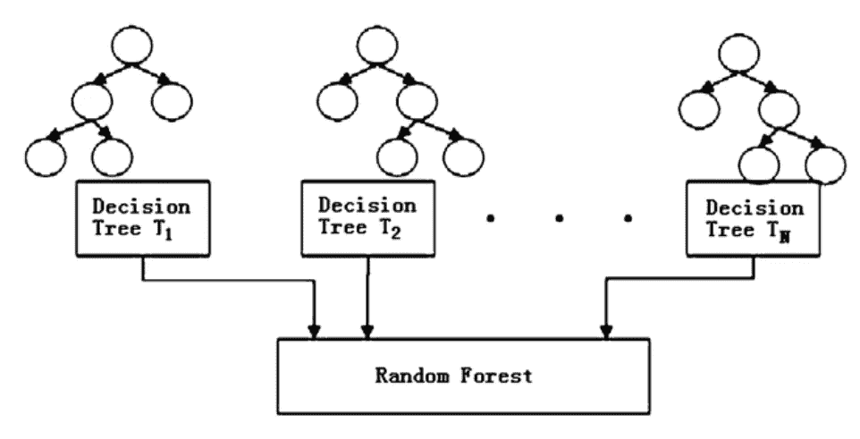

# 随机森林—简明的技术概述

> 原文：<https://medium.com/analytics-vidhya/random-forest-a-concise-technical-overview-cd1c5b565fa5?source=collection_archive---------14----------------------->

随机森林是最流行和最强大的机器学习算法之一。它是可以用于分类和回归任务的算法之一，因此，它是机器学习领域中使用最多的算法之一。

随机森林是一种监督学习算法。那么‘随机森林’到底是什么？顾名思义，这种算法创建了一个有许多树的“森林”。该算法的基本逻辑是在森林中有更多的树以产生高精度的结果。简而言之，随机森林构建多个(集合)决策树，并将它们合并在一起，以实现准确稳定的预测。

构建的决策树不仅仅是简单的决策树，而是*袋装决策树*，它们在每次分裂时被分裂为特征的*子集。现在，越来越有趣了，不是吗？*

让我们了解一下什么是袋装树。但在此之前，我们需要了解什么是**自举。**

Bootstrapping 是一种强大的统计方法，用于从数据样本(如均值)中估计值。例如，对数据进行采样并计算每个样本的平均值，以对所有计算的平均值进行平均，从而找到真实平均值的更好估计。在 bagging 技术中，使用了类似的方法，但是我们不是估计一个值，而是估计整个统计模型(决策树)。训练集被分成多个样本，并为每个样本构建模型。此外，每个这样的模型对新数据进行预测，并且这些预测被平均以给出真实输出值的更好估计。

通常单个决策树会遭受过度拟合(高方差)，但是通过 bagging 技术，我们在预测过程中引入了许多决策树。这将弱学习者和强学习者结合起来，从而平均方差(消除过度拟合的风险)！

来源:谷歌图片

由于 bagging 技术，随机森林的性能更好，因为它通过分割随机特征子集来解除树的相关性。在每次分割时，模型只考虑一小部分要素，而不是所有要素。这种在每次分割时随机选择较少特征的方法降低了方差。如果数据集包含几个强预测值，这些预测值将被一致地选择在树的顶部，从而形成非常相似的结构化树。因此，袋装树防止了少数选择强预测因子的支配，并在预测因子选择中引入随机性。

让我们看看随机森林伪代码是如何进行预测的。

步骤 1:采用**测试特性**，并使用每个随机创建的决策树的规则来预测结果，并将预测的结果存储为目标。

第二步:计算每个预测目标的**票数**。

第三步:将**最高票**预测目标作为随机森林算法的**最终预测**。

为了使用经过训练的随机森林算法来执行预测，我们需要通过每个随机创建的树的规则来传递测试特征。假设我们组成了 100 棵随机决策树。

每个树将预测相同测试特征的不同目标(结果)。然后通过考虑每个预测目标，计算票数。假设 100 个随机决策树预测 3 个唯一目标 **x，y，z** ，那么支持 x 的票数是 100 个随机决策树中有多少个树预测目标为 x. 同样，我们将计算其他 2 个目标- y 和 z 的票数。例如，如果从 **100 个**随机决策树中， **60 个**树预测目标为 **x** ，那么最后的随机树返回【T14

**优点:**

1.  即使存在不一致的数据，随机森林也能保持准确性。
2.  非常方便和易于使用，因为它的默认超参数经常产生良好的预测输出。
3.  它有平衡类总体不平衡数据集中的误差的方法。随机森林试图最小化整体错误率，因此当我们有一个不平衡的数据集时，较大的类将获得较低的错误率，而较小的类将具有较大的错误率。
4.  随机森林对异常值和非线性数据不敏感。

**局限性:**

1.  就大型数据集而言，树的大小会使处理内存过载。
2.  解释是棘手的，因为随机森林就像黑盒，因此可能在很大程度上损害模型解释。
3.  它是一个预测性的建模工具，而不是描述性的工具。如果目标是找到数据中关系的描述，那么其他方法将是首选。