# 随机森林——一种旨在提供混沌结构的模型

> 原文：<https://medium.com/analytics-vidhya/random-forest-a-model-designed-to-provide-structure-in-chaos-e267d559ca04?source=collection_archive---------1----------------------->

想象一下，你需要基于大量的特征进行预测。首先想到的是什么算法？对我来说，我通常总是选择随机森林。当面临过度拟合的问题时，前来救援的机器学习技术(通常情况下)又是随机森林。当我们想要一个简单的方法来解决一个由贪婪算法引起的问题时，随机森林似乎就是答案。

直到不久前，随机森林还是各种数据科学竞赛中使用最广泛的预测建模技术之一。最近，boosting 算法 XGBoost 已经取而代之，但是随机森林仍然是一种非常有用的技术。

这应该足以说服任何渴望进入数据科学世界的个人，在他/她的工具包中拥有 random forest。

## 然后是什么样的随机森林？为什么会被认为这么好？

有大量的材料在解释随机森林的概念。我在这里的尝试是解释这个概念，但通过将它与一些社会科学场景并置来进行简化。那些数据科学新手可能会被技术洪流吓倒，失去兴趣。因此，我试图给出一些相关的比较快照。一旦背景确定下来，我们就可以深入研究技术细节了。

# **目录**

1.  随机森林和民主——一个偶然的比较
2.  罗马不是一天建成的——决策树是随机森林的基石
3.  决策树-未完成的解决方案
4.  随机森林-弥赛亚
5.  个案研究

## 1.随机森林和民主——一个偶然的比较

人们会惊讶地发现，兰登森林的运作方式似乎与民主的运作方式有很多相似之处。民主似乎与“混乱中的结构”这句话有着最高的共鸣。随机森林，顾名思义，是一个由数百棵决策树组成的森林，但是关于如何操作，却有一个结构和方法。

从概念上讲，民主试图实现的主要理想是什么?《随机森林》的哪一方面引起了共鸣？

1.  在民主国家，政府由多数人的意见决定。因此，最终的决定是在投票的基础上做出的，不像在君主政体或独裁政体中那样。随机森林的相似之处在于，预测模型是用多个决策树构建的，并且每个树的结果被聚合以决定最终结果。
2.  在民主体制下，比如说印度，选举在全国各地举行，分布在许多选区。考虑到人口的多样性，一个政党不可能通过一份只吸引该国少数群体/社区/文化的宣言来赢得多数。因此，民主考验着每个政党的宣言。我要说的是，如果一个宣言只对社会中的一小部分人有利，它在本质上就不是包容性的，因为它的目的是赢得选举，而不考虑全体人民的需求。因此，如果一个政党的宣言可以与数据科学中的模型相提并论，那么这个宣言就会与随机森林模型中使用的交叉验证概念产生共鸣。交叉验证的关键目标是防止任何贪婪算法(贪婪算法的概念将在后面的章节中解释)接管。交叉验证是一种统计方法，用于评估统计分析的结果如何推广到一个独立的数据集。在没有交叉验证的情况下，模型输出可能非常依赖于模型训练所依据的数据。
3.  如前所述，在像印度这样的民主体制中，每个邦的许多选区都会举行选举。因此，每个选区的选举结果对最终选举结果都有影响。随机森林是决策树的集合，其中来自每棵树的决策在每个观察的预测的最终决策中被考虑。选举与随机森林中的决策树同义，即选举执政党的努力是选区级别的许多选举(单个决策树)的集合。
4.  在人民院选举中，任何候选人都不能在两个以上的选区竞选。这消除了选民对受欢迎的候选人的偏见，并有助于建立所有竞选成员的问责制。在随机森林中，不是所有的预测器都被考虑在每个决策树中。预测器的子集由每个决策树随机挑选用于预测。这有助于所有预测者对最终决策做出重要贡献。

随机森林即使在有大量混乱的场景中也能茁壮成长，也就是说有许多预测者。很难知道哪个预测器重要，哪个不重要。当我们拥有数量惊人的独立变量时，所有其他传统的统计技术可能会失败或陷入困境。

**2。罗马不是一天建成的——决策树，随机森林的基石**

在对随机森林有了非常一般的理解之后，我们现在将转向算法的技术复杂性。建造一片森林意味着建造许多单独的树木，作为一个集合体。因此，理解决策树的工作以理解随机森林的临时办法是必要的。

在现实生活中，决策过程通常是一种下意识的逐步活动，其中，每个选项(相当于数据科学术语中的特征/预测器)都要权衡利弊，并选择产生最佳输出的选项。换句话说，这是一个循序渐进的过程，在每一步中，选择能更好地区分各级决策的因素进行进一步分析，直到做出最终决策。在这里，我们看到了一个真实生活中的决策树示例(左侧)，其中决策级别为“是”(我应该辞职)和“否”(我不应该)，根据不同的情况，答案因人而异。

在数据科学中，决策树算法致力于将数据分成同类的组。这是通过选择有助于获得最佳分割的预测值来实现的。它对分类问题和回归问题都有效。通常用于识别重要预测值的标准是**、【熵】、【信息增益】和【基尼系数】**，这些预测值最终有助于数据的分割。所有这三种技术的目的是确定最佳分割，帮助我们在目标变量的不同水平之间进行清晰的分离。当我们有一个不能进一步同质化的分裂时，我们就有了那个分支的决定。在决策树中，我们可以有多个分支，最终帮助定义提供预测所需信息的规则。关于这些概念如何工作的更详细的技术解释，请参考我在媒体本身中发现的一个非常有趣的博客，[决策树。解码](/data-science-group-iitr/decision-trees-decoded-c70b4f7ff542)，编剧[阿克希尔·古普塔](https://medium.com/u/ae175187b1b9?source=post_page-----e267d559ca04--------------------------------)。

我提供了一个决策树如何工作的小例子，当阅读上面提到的博客时，将有助于更好地理解。见下文。为此，我使用了著名的泰坦尼克号数据集，该数据集捕捉了乘坐该船旅行并在海上遭遇致命事故的乘客的详细信息。请看下面的 R 部分，它以一个决策树结束，如果我们有关于其他变量的信息，这个决策树可以用来预测一个乘客是死是活。

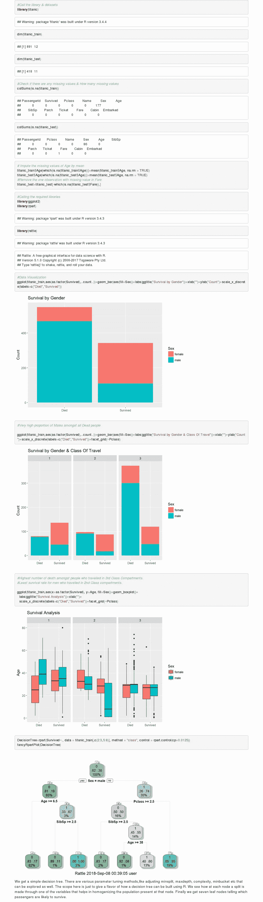

每个叶节点给出该节点中目标变量的多数类。像左边的第一个叶节点构成了总人口的 62%,其中 83%是男性。这个节点代表死亡人口的子集。

## 3.决策树-未完成的解决方案

决策树的运行方式有很多优点，但是单独来看，决策树会带来很多问题。有了这些问题，我们很难找到一个稳健的预测模型。我这样说的一些原因作为缺点列举如下:

**缺点:**

I .非常不稳定，因为数据集的变化会导致形成非常不同的树。该树非常依赖于所使用的训练数据。

二。过度拟合是决策树的常见问题。它们过于紧密地遵循训练数据的模式，这不能被所有数据集复制，从而导致在看不见的数据上表现不佳。

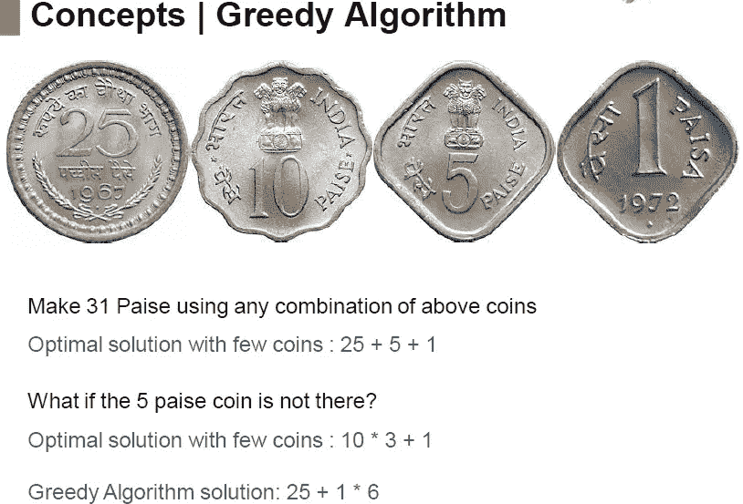

贪婪算法的例子:如果在第一个节点，算法选择 25，在没有 5 派斯硬币的情况下，我们不会得到一个解。

三。它们容易受到贪婪算法的影响，因为每个节点的目标是找到该节点的最佳分割。我们可能找不到全局最优的树。由于决策树在寻找树的正确起点时所应用的贪婪策略，最终结果会受到很大影响。也就是说，早期的小变化会对以后产生大的影响。

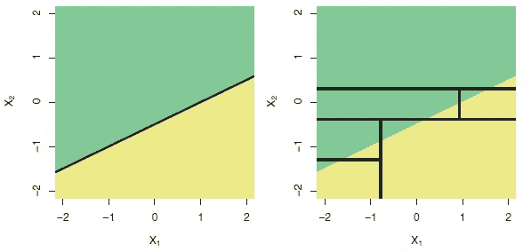

一个二维分类示例，其中真实的决策边界是线性的，由阴影区域表示。假设线性边界的经典方法(左)将优于执行平行于轴的分割的决策树(右)。这摘自《统计学习导论》一书。

四。如果你有平滑的边界，决策树就不能很好地工作。也就是说，当你有不连续的分段常数模型时，它们工作得最好。树画的边界总是平行于 X 轴(或 Y 轴)。如果你真的有一个线性目标函数，决策树不是最好的。

**4。随机森林-弥赛亚**

就个人而言，决策树并不是预测模型的最佳选择，如前一节所述。然而，可以从单个树中获得的强度可以被聚集以给出非常健壮的模型。这正是兰登森林所做的。随机森林本质上是许多树木的集合体，它击败了上一节强调的所有负面因素。随机森林的工作可以通过几个步骤来详细说明，如下所述。

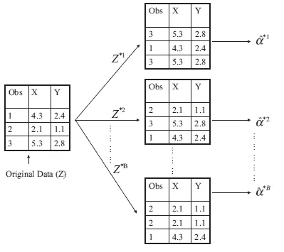

第一步:随机抽样替换。包含 n = 3 个观察值的小样本的 bootstrap 方法的图示。每个 bootstrap 数据集包含 n 个观察值，这些观察值是用原始数据集的替换值进行采样的。图片取自 ISL 书。

**步骤 1:** 随机森林通过构建多棵树来工作，其中每棵树都是通过从原始数据中获取自举训练样本来构建的。*自举*是一种重采样类型，其中从单个原始*样本*中重复抽取大量相同大小的较小*样本*，并进行替换。请看左边引导抽样的简单直观表示。这是第一次在模型中引入随机性。

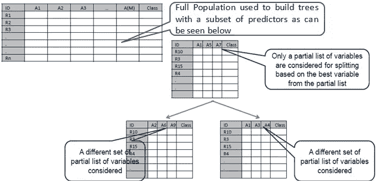

Ste2:为每个树/样本随机选择所有预测因子的子集。

**第二步:**每棵树都是通过选取原始数据中可用预测因子的子集来构建的。这是算法中引入的第二个随机性。在构建这些决策树时，每次考虑树中的分裂时，从“p”个预测值的全集中选择“m”个预测值的随机样本作为分裂候选值。允许分裂仅使用这 m 个预测值中的一个。m 个预测值的新样本在每次分割时被提取，在分类问题中通常是 m ≈√p。回归问题中 m:p 的缺省比率是 1/3。

**第三步:分类**

基于“n”个样本，构建了“n”棵树。每个记录都由所有构建的树进行分类。因此，建立了“n”棵树后，我们将对每个记录进行“n”次预测。在分类问题中，每个记录的最终类别是基于投票决定的，即预测的模式是最终预测。在下面的示例中，Tree1 是用绿色边界内的观察值构建的。类似地，树 2 的观察值以橙色突出显示，树 3 的观察值位于紫色边界内。他们每个人都有不同的预测。如您所见，第一行观察的最终输出是从三棵树获得的三个预测的模式。

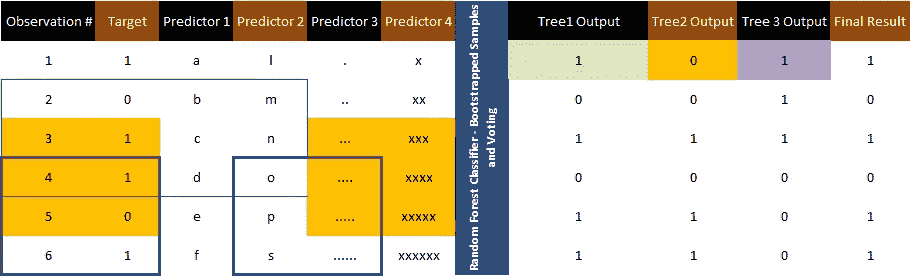

步骤 3:使用自举样本为单个树建立模型。采用从每棵树得到的分类模式对每个观测值进行最终预测

**随机森林获得的优势:**

1.  随机森林免费提供交叉验证。默认情况下，随机森林选取 2/3 的数据用于训练，其余数据用于回归测试，几乎 70%的数据用于训练，其余数据用于分类测试。交叉验证有助于防止**过度拟合**，因为模型从多个数据样本中总结经验。
2.  由于如上所述，在每个节点选择特征的子集用于分裂，所以树通常是**去相关的。**这也有助于防止任何**贪婪算法**接管，因为，如果有一个非常强的预测器，它将不会在所有的树中支配结果。
3.  在随机森林中，通过对所有树的结果进行平均，可以极大地减少单棵树表现出的差异。方差预计减少 1/n，其中 n 是种植的树木数量。
4.  我们可以根据所有预测因素对目标变量的影响程度来确定它们的相对重要性。这反过来有助于特征选择。我们可以在下一节提供的案例研究中看到这一点。
5.  决策界限可以变得更加精确和灵活。请参见下面的示例，其中决策树和随机森林模型在同一数据集上绘制了决策边界。决策树中的错误分类大多在随机森林中得到解决。

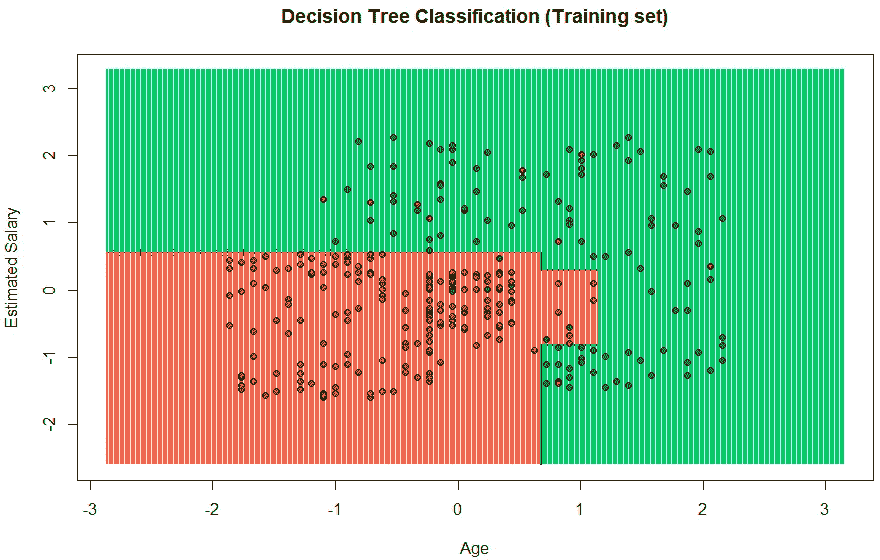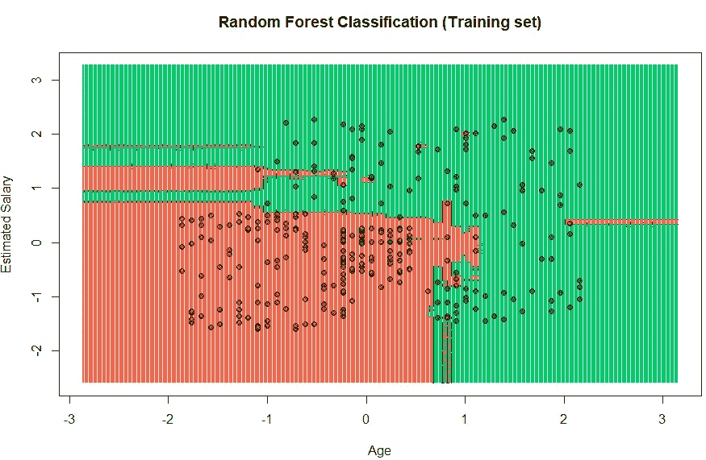

**5。案例研究:两个分类案例研究采用了具有极高数量预测值的数据集。**

**案例研究 I——基于人类活动的预测(560 个预测器)**

该项目使用的数据集是从 30 名人类受试者的记录中收集的，这些记录是通过内置惯性传感器的智能手机拍摄的。许多机器学习课程将这些数据用于教学目的。这是一个多分类问题。数据集有 10，299 行和 561 列。
对于数据集，30 个人被用来执行 6 种不同的活动。他们每个人的腰上都别着一部三星 Galaxy SII。使用智能手机的嵌入式传感器(加速度计和陀螺仪)，用户的速度和加速度在三个轴方向上进行测量。传感器的数据被用来预测用户的活动。用户活动可以是以下六种之一:
行走、上楼、下楼、坐着、站着和躺着。
数据可以从下面的 UCI 机器学习库导入。[数据集](http://archive.ics.uci.edu/ml/datasets/Human+Activity+Recognition+Using+Smartphones)。下面是案例研究以及 R 代码和适用的注释。下面的 r 代码是不可能被复制的。然而，可以从这里复制代码的版本可以找到[这里](https://rpubs.com/PranovMishra/415917)。

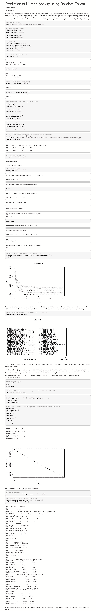

**案例研究二——建立随机森林模型预测客户行为——客户是否会购买产品(85 个预测值)**

这个案例研究是通过从一本非常受欢迎的书[、](http://www-bcf.usc.edu/~gareth/ISL/) (ISLR)的《统计学习导论》中选取一组数据完成的。该数据包含 5822 条真实的客户记录。每条记录由 86 个变量组成，包含社会人口统计数据(变量 1-43)和产品所有权(变量 44-86)。社会人口统计数据来自邮政编码。居住在相同邮政编码区域的所有客户都具有相同的社会人口统计属性。变量 86 ( `Purchase`)指示客户是否购买了房车保险单。可以在[http://www.liacs.nl/~putten/library/cc2000/data.html](http://www.liacs.nl/~putten/library/cc2000/data.html)获得关于单个变量的更多信息

除了学习如何构建随机森林模型，这个案例研究还帮助我们处理**不平衡数据的方法。**我使用了 **SMOTE** 技术来平衡数据。我参考了一篇 **Analytics Vidhya** 的博客，[**R**](https://www.analyticsvidhya.com/blog/2016/03/practical-guide-deal-imbalanced-classification-problems/)处理不平衡分类问题的实用指南，来处理不平衡数据集问题。下面提供了 r 中构建模型的工作以及相关的注释。

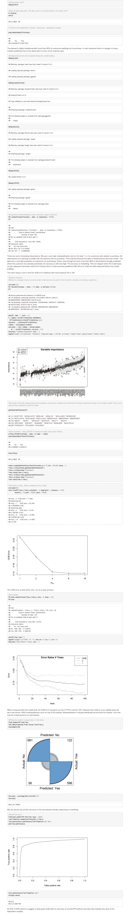

应用 boosting 模型提高性能— XGBoost

使用 xgboost 实现了一个完美的模型。代码如下所示

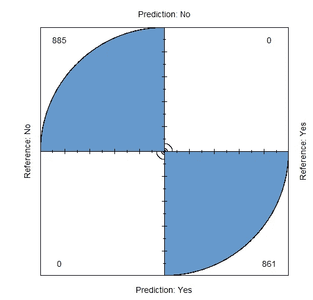

# **结束注释**

我们看到了两个例子，说明在没有随机森林的情况下，分析师们会很难处理如此大量的独立变量。我们还看到了 random forest 如何使用决策树来构建一个非常健壮的模型。在第二个案例研究中，我们解决了当我们有一个不平衡的数据集时可以看到的问题。通过使用随机森林作为分类器，达到的准确率约为 87%，然后通过使用 boosting 模型进一步提高到 100%。我们还看到随机森林对于特征选择来说是非常有用的工具。这有助于从最终模型中消除不需要的特征。