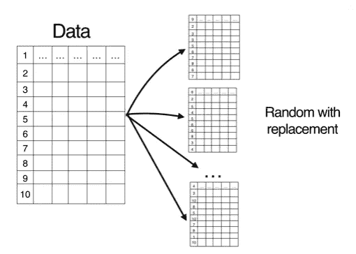
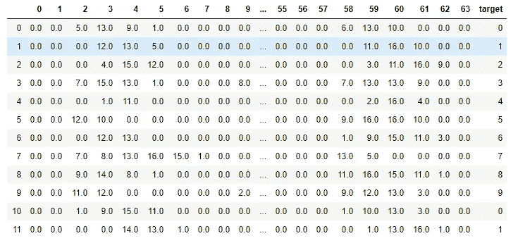
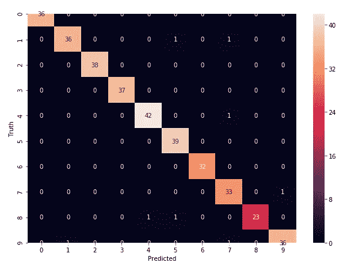

# 用 Python 实现随机森林算法

> 原文：<https://medium.com/analytics-vidhya/random-forest-algorithm-with-python-7ccfbe9bcb47?source=collection_archive---------10----------------------->

本文包括四个部分:

1.  什么是随机森林？
2.  随机森林算法应用。
3.  随机森林的优势
4.  随机森林与**巨蟒**(**T3 与代号** )

在这篇文章中，我们将探索著名的**监督机器学习算法**“随机森林”的代码。

# 什么是随机森林？

随机森林是**袋装决策树**模型，在每次分裂时在特征的**子集上分裂。随机森林和香草装袋只有一点不同。它使用一种改进的树学习算法，在学习过程中的每个阶段检查**特征的随机子集**。我们这样做是为了避免树之间的相关性。假设我们在数据集中有一个强有力的预测因子，以及其他几个中等强度的预测因子。在收集袋装树时，我们的大多数或所有决策树将使用强大的预测器进行第一次分裂！所有装袋的树看起来都差不多。因此，来自袋装树的所有预测将是高度相关的。相关的
预测器不能帮助提高预测的准确性。通过获取随机的要素子集，随机森林系统地避免了相关性并增强了模型的性能。下面的例子说明了随机森林算法是如何工作的。**

# 随机森林算法应用。

在电子商务中，随机森林算法可以根据相似顾客的体验来预测顾客是否会喜欢推荐的产品。

在股票市场中，随机森林算法可以用来识别股票的行为和预期的损失或利润。

在医学中，随机森林算法既可以用于识别组件的正确组合，也可以通过分析患者的医疗记录来识别疾病。

# 随机森林的优势

**1。**随机森林基于 **bagging** 算法，使用**集成学习**技术。它在数据子集上创建尽可能多的树，并组合所有树的输出。这样，**减少了决策树中的过拟合**问题，**也减少了方差**，因此**提高了精度**。

**2。**随机森林可用于**解决分类和回归问题**。

**3。**随机森林适用于**分类变量和连续变量**。

**4。**随机森林可以自动**处理缺失值**。

**5。不需要特征缩放:**在随机森林的情况下不需要特征缩放(标准化和规范化),因为它使用基于规则的方法而不是距离计算。

**6。有效处理非线性参数:**非线性参数不会影响随机森林的性能，不像基于曲线的算法。因此，如果独立变量之间存在高度非线性，随机森林可能优于其他基于曲线的算法。

**7。**随机森林可以自动**处理缺失值**。

**8。**随机森林通常**对离群值**具有鲁棒性，并且可以自动处理它们。

**9。**随机森林受噪声的影响相对**较小**。

# 带 Python 的随机森林

 [## abhijeetap/带 Python 的随机森林算法

### permalink dissolve GitHub 是超过 5000 万开发人员的家园，他们一起工作来托管和审查代码，管理…

github.com](https://github.com/Abhijeetap/Random-forest-Algorithm-With-Python/blob/master/RandomForest.ipynb) 

df['目标']= digits . target
df[0:12]

df[0:12]

#数据结果
模型.得分(X _ 测试，y _ 测试)

**0.95555555555556**

% matplotlib inline
import matplotlib . py plot as PLT
import seaborn as sn
PLT . figure(figsize =(10，7))
sn.heatmap(cm，annot = True)
PLT . xlabel(' Predicted ')
PLT . ylabel(' Truth ')

感谢您的阅读。如果您有任何反馈，请告诉我。

# 我关于机器学习算法的其他帖子

 [## 什么是支持向量机(SVM)

### 本文包括三个部分:

medium.com](/analytics-vidhya/what-is-the-support-vector-machine-svm-dc89207c011)  [## 基于 Python 的 k 近邻算法(KNN)

### 本文包括六个部分:

medium.com](/@abhi.pujara97/k-nearest-neighbors-algorithm-knn-with-python-e570f6bb8aed)  [## 用 Python 实现朴素贝叶斯算法

### 本文包括五个部分:

medium.com](/@abhi.pujara97/naïve-bayes-algorithm-with-python-7b3aef57fb59) 

快乐学习！！！

**快乐编码:)**

别忘了拍手拍手拍手…

