# 过采样数据下的随机森林和人工神经网络模型

> 原文：<https://medium.com/analytics-vidhya/random-forest-and-ann-model-with-oversampling-data-b7adde23e55f?source=collection_archive---------5----------------------->

使用 SMOTE(合成少数过采样技术)过采样数据时，这些模型的性能如何相互比较

# 介绍

*本文是印度尼西亚通信与信息部(Kominfo)35 天奖学金课程中 6 天挑战的成果。*

真实世界的数据不是正态分布的，它总是向右或向左倾斜(图 1。)，我们如何处理这样的数据？只需丢弃较高比例的数据以使其平衡，但如果数据严重失衡，如欺诈案件或保险索赔，在这种情况下，我们可以对少数类使用过采样技术，以制作类似真实的数据，最终数据具有相同的分布。

图一。皮尔逊模式偏度([信用](https://www.statisticshowto.com/pearson-mode-skewness/)

***什么是 SMOTE？***

图二。SMOTE ( [信用](https://imbalanced-learn.readthedocs.io/en/stable/over_sampling.html#cbhk2002))

> 合成少数过采样(SMOTE)不是复制少数观察结果(如违约者、欺诈者、投机者)，而是根据现有的少数观察结果创建合成观察结果( [Chawla 等人，2002](https://arxiv.org/abs/1106.1813) )。

[特别是](https://machinelearningmastery.com/smote-oversampling-for-imbalanced-classification/#:~:text=This%20is%20a%20type%20of,for%20oversampling%20imbalanced%20classification%20datasets.)，首先从少数民族中随机选择一个例子。然后找到该示例的最近邻居的 *k* (通常 *k=5* )。选择随机选择的邻居，并在特征空间中两个示例之间的随机选择点处创建合成示例(图 2。)

因此，可以简单地从少数特征空间数据中用 KNN 方法建立新的数据库。

# 数据集

数据集是来自 Kaggle 的[旅游保险](https://www.kaggle.com/mhdzahier/travel-insurance)由 63326 个实例组成，具有 10 个特征:

*   代理类型，
*   旅游保险代理机构的分销渠道(分销。频道)
*   旅游保险产品名称(产品。姓名)
*   旅行持续时间(持续时间)
*   旅行目的地(目的地)
*   旅游保险单销售额(净额。销售)
*   旅游保险代理佣金(佣金)
*   被保险人的性别(性别)
*   被保险人年龄(年龄)

和 1 个目标列(声称是/否)，目标严重失衡(图 3。左)

# 方法

## 预处理

我们对数据进行了一些处理，

*   在性别栏中添加第三个类别以填充 NaN 值，因为该栏有太多的 NaN，所以它有男性/女性和未披露的类别。
*   替换年龄和持续时间列中的异常值，超过 100 岁的年龄由数据的平均年龄替换，具有负值的持续时间列由 0 替换。
*   将目标“否”的实例数量减少到只有 10.000 个实例，以便“是”的比例更高。

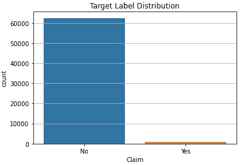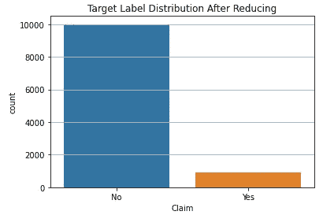

图 3。缩小前后的标签分布(左)

**过采样(SMOTE)**

为了使模型对每个类别更加稳健，使用过采样技术 SMOTE 来平衡每个类别标签的数据集(图 4。).

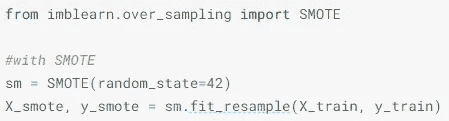

图 4。SMOTE 过采样

现在，如果我们看一下数据分布，每个类都有相同数量的标签(图 5 & 6)。

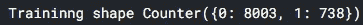

图 5。过采样前

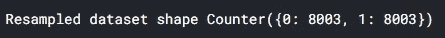

图 6。过采样后

# 系统模型化

## 随机森林

使用过采样数据集，从其他算法中选择后，选择随机森林(图 7。)

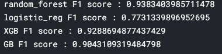

图 7。算法选择

之后，随机森林 algirthm 适合所有训练数据(图 8。)，使用从 RandomSearchCV 获得的最佳参数

> 最佳参数{ ' n _ estimates ':400，' max_depth': 8}

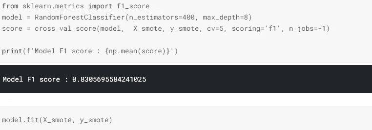

图 8。随机森林拟合

## 人工神经网络

人工神经网络结构包括 1 个输入层、4 个隐藏层和 1 个输出层，其中 3 个为避免过度拟合而减少的层(图 9 和 10。)

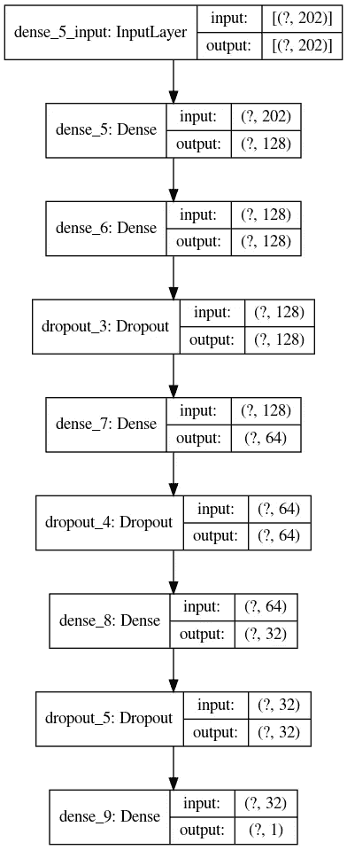

图 9。人工神经网络架构

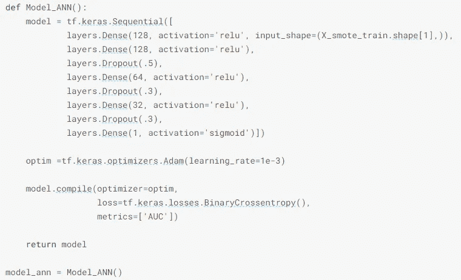

图 10。人工神经网络代码

# 结果

这个结果来自以前从未见过的测试集

## 随机森林

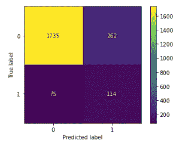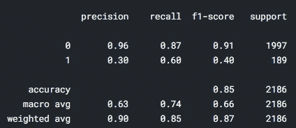

图 11。随机森林分类报告

随机森林的类 0 的 F1 值为 0.91，类 1 的 F1 值为 0.4。过采样技术有效，但不是很好，模型仍无法对类 1 进行分类，满足结果仍低于 0.5。

## 安

从训练曲线来看，结果是比较令人满意的，训练和验证仍然在同一个方向线上。

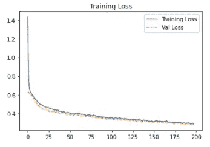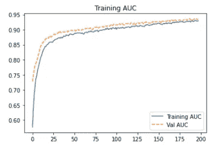

图 12。培训损失(左)培训 AUC(右)

使用测试集怎么样，结果如下所示(图 13)

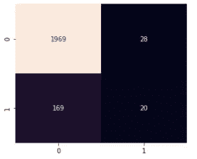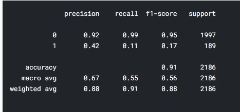

图 13。人工神经网络分类结果

人工神经网络模型在这个问题上并不是很好，它为 1 类得到了 0.95 的 F1 分数，但仅为 0.17。随机森林打败了这个模型。

# 结论

从这次挑战中，我们得到了一些结论:

*   您的数据确实需要预处理
*   过采样通过使用 KNN 制作合成数据来降低工作效率
*   过多的过采样数据来填补类别不平衡的差距并不能真正帮助模型学习真实世界的数据
*   在这个实验中，兰登森林打败了安

更多关于我的项目请访问 [***我的 github***](https://github.com/said-rasidin)