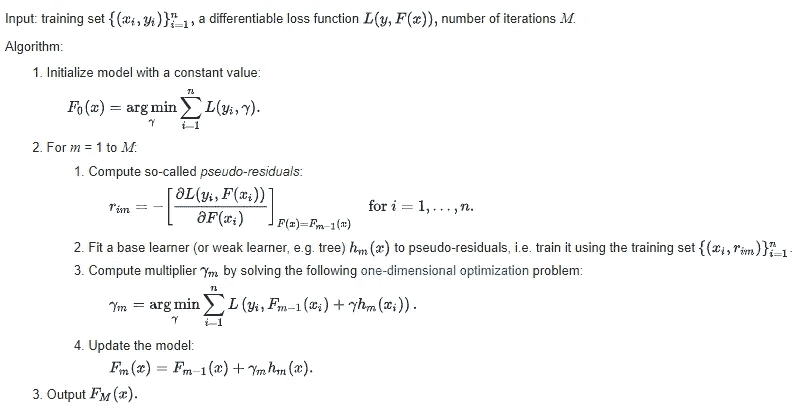
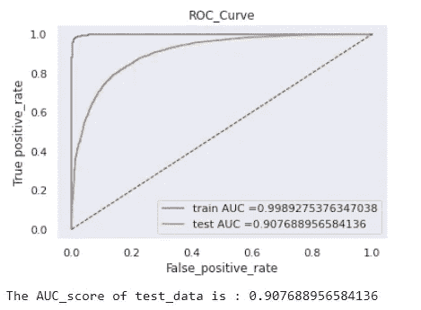

# 随机森林和集合学习与亚马逊食品评论

> 原文：<https://medium.com/analytics-vidhya/random-forest-and-ensembles-learning-with-amazon-food-reviews-e58c72c189be?source=collection_archive---------6----------------------->

在这篇博客中，我们将尝试理解机器学习中最重要的算法之一，即随机森林算法。我们将尝试研究使随机森林如此特殊的东西，并尝试在现实世界的数据集上实现它。

# 内容

1.  什么是合奏？
2.  集成学习的类型。
3.  装袋。
4.  随机森林和建筑。
5.  随机森林的最好和最坏情况。
6.  助推。
7.  增压的类型。
8.  梯度推进。
9.  AdaBoost(自适应升压)。
10.  XGBoost。
11.  堆叠分类器。
12.  级联分类器。
13.  随机森林和 XGBOOST 与亚马逊美食评论。

# 什么是合奏？

通常，单个模型会有偏差或方差，这就是为什么我们需要集成学习。

集成方法是一种将来自多个机器学习算法的预测结合在一起的技术，以做出比任何单个模型更准确的预测。由许多模型组成的模型被称为**集合模型**。

一般来说，在机器学习中，当我们有多个模型时，然后将它们组合起来，并有可能生成强大的模型，这被称为集成。

## 集成学习的类型

*   打包(引导汇总)
*   助推
*   堆垛
*   级联

当模型比我们更不同时，我们得到更好的表现。

**套袋(Bootstrap aggregating):** 随机森林是流行的套袋技术。

Bootstrap 是指带有替换的随机抽样。Bootstrap 允许我们更好地理解数据集的偏差和方差。Bootstrap 涉及从数据集中随机抽取一小部分数据。

这是一个通用过程，可用于减少那些具有高方差的算法(通常是决策树)的方差。Bagging 使每个模型独立运行，然后在最后聚合输出，而不偏向任何模型。

**技术:**使用 Bootstrap 样本训练模型，即每个模型都有不同的数据子集，并使用聚合将所有模型结合起来。

分类汇总的典型方法采用多数投票，如果是回归，则采用平均值(或)中值。

**当我们执行 Bootstrap 采样时？**

当模型随着训练数据的变化而发生很大变化(称为高方差)时，当我们通过改变数据集将自举采样应用于该模型时，自举采样不会影响模型，因为我们使用了聚集技术。

**Bagging:** 这是一种可以减少模型中的方差而不影响偏倚的技术。

基本模型是低偏差和高方差模型。在这个模型上使用 Bagging，我们可以将高方差减少到合理的方差，而不会因为 bootstrap 抽样和聚集而改变偏差。

**示例**:深度决策树大(高方差低偏差)

## 决策树的问题？

决策树对训练它们的特定数据很敏感。如果训练数据被改变，则得到的决策树可能会非常不同，并且反过来预测也可能非常不同。

此外，训练决策树的计算成本很高，具有过度拟合的巨大风险，并且容易找到局部最优解，因为它们在进行分割后无法返回。

为了解决这些弱点，我们转向随机森林，它展示了将许多决策树组合到一个模型中的能力。

## 随机森林与建筑

随机森林是一种监督学习算法，使用集成学习方法进行分类和回归。

随机森林是一种装袋技术。随机森林中的树是并行运行的。在构建树时，这些树之间没有交互。

它通过在训练时构建大量决策树并输出类来运行，该类是各个树的类(分类)或均值预测(回归)的模式。

随机森林是一个元估计器(即它结合了多个预测的结果)，它聚合了许多决策树，并做了一些有益的修改。

每个节点上可分割的特征数量被限制为总数的某个百分比(称为超参数)。这确保了集成模型不会过于依赖任何单个特征，并且公平地使用所有潜在的预测特征。

每棵树在生成分裂时都会从原始数据集中抽取一个随机样本，进一步增加了随机性元素，以防止过度拟合。

**自付(OOB)积分**

在随机森林中，不需要交叉验证或单独的测试集来获得测试集误差的无偏估计。内部估计如下。

每个树都是使用来自原始数据的不同引导样本构建的。大约三分之一的情况被排除在引导样本之外，并且不用于第 k 棵树的构造。

我们可以在交叉验证中使用这些点。

## 随机森林的最佳和最差情况

1.  对于分类问题中的应用，随机森林算法将避免过拟合问题。
2.  对于分类和回归任务，可以使用相同的随机森林算法。
3.  随机森林算法可用于从训练数据集中识别最重要的特征，换句话说，特征工程。
4.  随着森林构建的进行，它会生成概化误差的内部无偏估计。
5.  它有一个有效的方法来估计缺失数据，并在大部分数据缺失时保持准确性。
6.  已经观察到随机森林对于一些具有噪声分类(或)回归任务的数据集来说过度拟合。
7.  对于包含具有不同级别数量的分类变量的数据，随机森林偏向于那些具有更多级别的属性。因此，来自随机森林的可变重要性分数对于这种类型的数据是不可靠的。
8.  决策树失败的地方，随机森林也会失败。

## 助推

术语“增强”指的是将弱学习者转换为强学习者的一系列算法。

boosting 不是创建一个强大的模型，而是将多个简单的模型组合成一个复合模型。这个想法是，随着我们引入越来越多的简单模型，整体模型变得越来越强大。在 boosting 术语中，简单模型被称为弱模型(或弱学习器)。

然后建立第二个模型，试图纠正第一个模型中存在的错误。继续这个过程并添加模型，直到正确预测了完整的训练数据集或者添加了最大数量的模型。

核心思想 : Boosting 减少偏差，我们在 Boosting 中使用低方差高偏差模型作为基础学习器。

## 顺序集成方法

boosting 的主要思想是给系综 ***依次*** 添加新的模型。本质上，提升通过从*弱*模型(例如，只有几个分裂的决策树)开始，然后*通过继续构建新的树来提升*的性能，其中序列中的每个新树试图修复前一个树犯最大错误的地方(即，序列中的每个新树将关注前一个树具有最大预测误差的训练行)。

**基础学习者** : Boosting 是一个框架，它迭代改进*任何*弱学习模型。许多梯度提升应用程序允许你随意“插入”不同类别的弱学习者。然而，在实践中，boosted 算法总是使用决策树作为基础学习器。

**训练弱模型**:弱模型是错误率仅略好于随机猜测的模型。本质上，通过关注先前树具有最大误差或残差的训练数据行。关于决策树，浅树即具有相对较少分裂的树表示弱学习者。在 boosting 中，1-6 分裂的树是最常见的。

**关于错误的顺序训练**:被增强的树顺序生长。每棵树都是使用来自先前生长的树的信息来生长的，以提高性能。通过将序列中的每棵树与前一棵树的残差进行拟合，我们允许序列中的每棵新树关注前一棵树的错误。其步骤如下...

1.  我们在开始时给出了列车数据 Dtrain(，易)。为数据拟合一个浅层决策树，即 F1(x)=Y。
2.  然后，我们将下一个决策树拟合到残差，即 h1(x)= Yi F1(x)。
3.  将这个新树添加到我们的算法中，即 F2(x)=F1(x)+h1(x)。
4.  将下一个决策树拟合到 F2(x)的残差，即 H2(x)= Yi F2(x)。
5.  将这个新树添加到我们的算法中，即 F3(x)=F2(x)+h2(x)。
6.  继续这个过程，直到低残差，然后训练误差减少意味着偏差减少。

这里的最终模型是 j 棵个体树的逐阶段相加模型，

## 增压的类型

1.  梯度推进
2.  自适应增强
3.  XGBoost

## **梯度推进**

梯度推进机这个名字来源于这样一个事实，即这个过程可以推广到损失函数。

梯度推进被认为是梯度下降算法。梯度下降是一种非常通用的优化算法，能够找到各种问题的最优解。梯度下降的一般思想是迭代地调整参数以最小化成本函数。

梯度推进树解决了上面提到的部分限制。不是训练单个树，而是依次训练多个树。为了降低树的方差，它们受到限制。通过限制树的深度，他们变成了弱学习者。决策树的深度通常在 3 到 6 层之间选择。我们允许有一点深度，这样我们可以比较共同出现的变量。

## 梯度增强中梯度出现在哪里？

残差不仅包含大小信息，还包含方向，因此残差是向量。剩余向量的符号也是向量。大多数文章将残差视为近似值和真实目标值之间的误差，但是我们一般将这些称为方向向量，以强调它们是向量，而不仅仅是大小。将残差视为误差向量也使得谈论优化绝对误差而不是平方误差的梯度提升机器变得尴尬。

通过将近似值添加到残差中，梯度增强机器正在追踪梯度，因此，术语*梯度*增强。

梯度推进提供了最小化任何损失函数，只要它是可微分的。

## 剩余函数和损失函数

考虑下面显示的我们的升压最终方程。

残余不过是，

误差= Yi F1(x)在模型 k 的末尾。

如果我们将误差视为平方误差，那么损失函数为，

然后我们对 w . r . t . Fk(x)求导，

这个负梯度被称为**伪残差**，它有助于任何损失函数达到可微。

**关键思想:**我们可以用伪残差(负梯度)代替这个误差，因为我们可以使用任何损失函数。

关于损失函数和梯度的更多信息，请访问 [**此处**](https://www.ritchievink.com/blog/2018/11/19/algorithm-breakdown-why-do-we-call-it-gradient-boosting/) 。

损失函数可以是逻辑损失、平方损失、铰链损失(或)任何可微的损失。

梯度增强算法的步骤如下:

更多信息请访问[T5 这里 。](https://en.wikipedia.org/wiki/Gradient_boosting#Algorithm)

## **正规化**

将训练集拟合得太接近会导致模型的泛化能力下降。几种所谓的正则化技术通过约束拟合过程来减少这种过拟合效应。

一个自然正则化参数是梯度增强迭代的数量 *M* ，即当基础学习者是决策树时模型中树的数量。增加 *M* 会减少训练集的误差，但将其设置得太高可能会导致过度拟合。 *M* 的最佳值通常通过监控独立验证数据集的预测误差来选择。除了控制 *M* 之外，还使用了其他几种正则化技术。

另一个正则化参数是树的深度。该值越高，模型越有可能过度拟合训练数据。

## 收缩

梯度推进方法的一个重要部分是收缩正则化，它包括如下修改更新规则:

其中参数 **ν** 称为“学习率”。

经验上已经发现，使用小的学习率，例如 **ν** < 0.1，在没有收缩( **ν** =1)的情况下，在模型的泛化能力上产生显著的改进。然而，这是以增加训练和查询期间的计算时间为代价的。较低的学习速率需要更多的迭代。

## 自适应增强

Adaboost 将多个弱学习器组合成一个强学习器。AdaBoost 中的弱学习器是具有单一分裂的决策树，称为决策树桩。

当 AdaBoost 创建它的第一个决策树桩时，所有的观察值被同等地加权。为了纠正之前的错误，错误分类的观测值现在比正确分类的观测值具有更大的权重。AdaBoost 算法可用于分类和回归问题。

AdaBoost 广泛用于人脸检测中的图像处理。AdaBoost 算法的步骤如下:

1.  初始化数据集，并为每个数据点分配相等的权重。
2.  将其作为模型的输入，并识别错误分类的数据点。
3.  增加错误分类的数据点的权重。
4.  如果(得到所需结果)
    转到步骤 5
    否则
    转到步骤 2
5.  结束

考虑 2D 的这个玩具数据集，并假设我们的弱分类器是决策树桩(垂直或水平半平面):

**第一轮:**计算完权重后，我们将在进入下一步之前增加误分类点的权重。

**第二轮:**这一步也是找到权值，增加误分类点的权值再进行下一步。

**第三轮**:求权重，增加误分类点的权重，再进行下一步。

**最终分类器:**像**α1 h1(x)+α2 H2(x)+α3 H3(x)**一样把最后一步的所有模型组合起来我们得到 F(x)模型。

有关 AdaBoost 的更多信息，请访问 [**此处**](https://alliance.seas.upenn.edu/~cis520/wiki/index.php?n=lectures.boosting) 。

## XGBoost

XGBoost 代表**极限梯度提升**。XGBoost 是梯度提升决策树的实现，旨在提高速度和性能。由于顺序模型训练，梯度推进机器在实施中通常非常慢。因此，它们的可伸缩性不是很好。因此，XGBoost 侧重于计算速度和模型性能。

该库提供了一个用于各种计算环境的系统，尤其是:

*   **树构造的并行化**在训练期间使用你所有的 CPU 核心。
*   **分布式计算**使用机器集群训练非常大的模型。
*   **核外计算**适用于不适合内存的超大型数据集。
*   **数据结构和算法的缓存优化**充分利用硬件。

## 堆积分类器

堆叠是一种集成学习技术，通过元分类器来组合多个分类模型。基于完整的训练集训练个体分类模型；然后，基于集成中各个分类模型的输出(元特征)来拟合元分类器。元分类器可以根据预测的类别标签或来自集成的概率来训练。该算法可以总结如下，

这种技术经常在现实世界中使用，但为了更好的表现，也广泛应用于 Kaggle 比赛。

在标准堆叠过程中，第一级分类器适合用于为第二级分类器准备输入的相同训练集，这可能导致过度适合。然而，堆叠分类器使用交叉验证的概念，数据集被分成 *k* 个折叠，并且在 *k* 个连续回合中， *k-1* 个折叠被用于拟合第一级分类器；在每一轮中，然后将第一级分类器应用于在每次迭代中没有用于模型拟合的剩余 1 个子集。得到的预测然后被堆叠并作为输入数据提供给第二级分类器。

在堆叠分类器的训练之后，第一级分类器适合整个数据集，如下图所示。

由于时间复杂性，这种技术经常在现实世界中使用。关于堆叠分类器的更多信息，请访问 [**此处**](http://rasbt.github.io/mlxtend/user_guide/classifier/StackingClassifier/) 。

## 级联分类器

这类模型非常非常精确。级联最常用于不能犯错误的情况。例如，级联技术主要用于检测欺诈性信用卡交易，或者当您想要确定您没有癌症时。

当犯错误的代价非常非常高时，通常使用级联模型。

假设我们有一个事务查询点 Xq，我们将把它提供给模型 1。模型 1 可以是任何模型随机森林(或)逻辑回归。它可以是任何东西！基本上，模型 1 所做的是预测类概率，以确定给定查询点属于哪个类的可能性更高。

假设类标签 1 表示交易是欺诈性的，类标签 0 表示交易不是欺诈性的。通常，预测概率由这个 P(Yq=0)和 P(Yq=1)给出，其中 Yq 是我们实际的类标签。现在让我们假设 P(Yq=0)，即交易不是欺诈性的概率非常高。所以即使在我们稍微不确定的时候，我们也会训练另一个模型 2。它做同样的事情，它接收查询点并预测 P(Yq=0)。这个过程一直持续到我们确认。

在上图中，我们依次有四个模型。我们在整个训练数据集上训练模型 1，并在测试数据集上评估其性能。只要我们不确定某些数据点，即它们是否是欺诈性的，我们就将其传递到下一阶段。

直观上，级联是以这样一种方式设计的，即序列中的下一个模型只在模型不确定类别标签是什么的数据点上训练。我们必须根据模型在生产环境中运行时会看到什么类型的数据来训练我们的模型。

## Random Forest 和 XGBOOST 提供亚马逊美食评论

让我们对来自 Kaggle 的真实数据集 Amazon Fine Food Review 分析应用随机森林和 XGBOOST 算法。

**首先我们想知道什么是亚马逊美食点评分析？**

这个数据集由亚马逊的美食评论组成。这些数据跨越了 10 多年的时间，包括截至 2012 年 10 月的所有约 500，000 篇评论。评论包括产品和用户信息、评级和明文评论。我们也有来自所有其他亚马逊类别的评论。

亚马逊评论通常是最公开可见的消费品评论。作为一个经常使用亚马逊的用户，我对检查亚马逊评论的大型数据库的结构和可视化这些信息很感兴趣，以便成为一个更聪明的消费者和评论者。

**来源:**[**https://www.kaggle.com/snap/amazon-fine-food-reviews**](https://www.kaggle.com/snap/amazon-fine-food-reviews)

**亚马逊美食点评数据集由来自亚马逊的美食点评组成。**

**评论数:568，454
用户数:256，059
产品数:74，258
时间跨度:1999 年 10 月—2012 年 10 月
数据中的属性/列数:10**

**属性信息:**

1.  **身份**
2.  **产品 Id —产品的唯一标识符**
3.  **UserId —用户的唯一标识符**
4.  **ProfileName**
5.  **帮助度分子—认为评论有帮助的用户数量**
6.  **帮助度分母——表示他们认为评论是否有帮助的用户数量**
7.  **分数—介于 1 和 5 之间的等级**
8.  **时间—审核的时间戳**
9.  **摘要—审核的简要摘要**
10.  **文本—审阅的文本**

# **目标**

**给出一个评价，确定该评价是正面的(评分为 4 或 5)还是负面的(评分为 1 或 2)。**

# **数据预处理**

**数据预处理是一种用于将原始数据转换成干净数据集的技术。换句话说，无论何时从不同来源收集数据，都是以原始格式收集的，这对于分析是不可行的。**

****

**要了解亚马逊食品评论数据集和特征的完整概述，请访问我以前的博客链接 [**这里**](/analytics-vidhya/amazon-fine-food-reviews-featurization-with-natural-language-processing-a386b0317f56) **。****

# **列车测试分离**

**当机器学习算法用于对不用于训练模型的数据进行预测时，训练-测试分离过程用于估计机器学习算法的性能。**

**如果您有一个数据集，您需要首先使用 Sklearn `train_test_split`函数来分割它。**

****

# **使用单词包的文本特征化**

****

# **超参数调谐**

**我们要选择最佳深度和最佳 n_estimators 意味着更好的模型性能的树的数量，通过使用网格搜索交叉验证来选择这些。**

**我们已经定义了一个 Grid_search 函数，当我们调用它时，它会给出结果。**

********

**在我们使用网格搜索 CV 找到最佳参数后，我们希望使用测试数据检查性能，在本例研究中，我们使用 AUC 作为性能度量。**

**我们已经定义了一个测试数据的函数，当我们调用它时，它会给出结果。**

****

# **性能指标**

**绩效指标用于衡量企业的行为、活动和绩效。这应该是在一个范围内测量所需数据的数据形式，允许形成支持总体业务目标实现的基础。**

**要了解机器学习中使用的性能指标的详细信息，请访问我以前的博客链接[**这里**](/@sachin.s1dn/performance-metrics-for-machine-learning-models-80d7666b432e) **。****

**我们已经为性能指标定义了一个函数，当我们调用它时，它会给出结果。**

****

# **弓上的特征重要性**

**Wordcloud 中的 20 大重要特性。要了解 Wordcloud，请访问 [**这里**](https://pypi.org/project/wordcloud/) 。**

****

**类似地，我们构建了一个具有 TFIDF、AvgWord2Vec、TFIDF_AvgWord2Vec 特性的随机森林和 XGBOOST 模型。要了解完整代码，请访问我的 [**GitHub**](https://github.com/Sachin-D-N/Amazon_Food_Reviews/blob/main/08.Random_Forest_Amazon_Food_Reviews/Random_Forest_Amazon_Food_Reviews_Assignment_.ipynb) 链接。**

# **结论**

**为了在表格中写入震荡，我们使用了 python 库 PrettyTable。**

**pretty table 是一个简单的 Python 库，旨在使在视觉上吸引人的表格中表示表格数据变得快速而简单。**

****

# **观察**

1.  **从上表中，我们得出结论，最佳深度为 60 且最佳估计值为 500 的随机森林中的 TFIDF 具有最高的 AUC 得分，即 93.40 %。**
2.  **具有最佳深度 10 和最佳估计量 500 的 xgboost 和 TFIDF 具有最高的 AUC 分数，即 93.96 %。**
3.  **随机森林和 xgboost 模型在测试数据上都表现得相当好。**

**要了解亚马逊食品评论数据集和特征的完整概述，请访问我以前的博客链接 [**这里**](/analytics-vidhya/amazon-fine-food-reviews-featurization-with-natural-language-processing-a386b0317f56) **。****

**要了解机器学习中使用的性能指标的详细信息，请访问我以前的博客链接[**这里**](/@sachin.s1dn/performance-metrics-for-machine-learning-models-80d7666b432e) **。****

**要了解完整代码请访问我的 [**GitHub**](https://github.com/Sachin-D-N/Amazon_Food_Reviews/blob/main/08.Random_Forest_Amazon_Food_Reviews/Random_Forest_Amazon_Food_Reviews_Assignment_.ipynb) 链接。**

# **参考**

*   **应用人工智能**
*   **维基百科(一个基于 wiki 技术的多语言的百科全书协作计划ˌ也是一部用不同语言写成的网络百科全书ˌ 其目标及宗旨是为全人类提供自由的百科全书)ˌ开放性的百科全书**
*   **Coursera**
*   **数据营**

**感谢您的阅读和耐心。我希望你喜欢这个帖子，如果我的帖子有错误，请告诉我。如果你发现帖子中有什么错误或者有什么要补充的，就在评论中讨论吧…**

**快乐学习！！**