# 亚马逊 SageMaker 和 AWS Lambda 上的 Random Forest 和 XGBoost

> 原文：<https://medium.com/analytics-vidhya/random-forest-and-xgboost-on-amazon-sagemaker-and-aws-lambda-29abd9467795?source=collection_archive---------2----------------------->

## 在 Amazon SageMaker 和 AWS Lambda 函数上使用 Random Forest 和 XGBoost 实现回归模型的分步过程。

凯文·Ku 在 [Unsplash](https://unsplash.com?utm_source=medium&utm_medium=referral) 上的照片

# 介绍

我写这篇博客是作为我关于[使用亚马逊 Sagemaker 和 Lambda 函数部署 ML 模型的虚拟谈话的一部分](https://www.meetup.com/minneapolis-wimlds/events/270064273/)在[明尼阿波利斯机器学习中的女性&数据科学](https://www.meetup.com/minneapolis-wimlds) (WiMLDS)。所以，我们开始-

学习如何使用 Amazon SageMaker 的最佳方式是在其上创建、训练和部署一个简单的机器学习模型，我们将采用自上而下的方法，我们将直接登录 AWS 控制台，启动 SageMaker 笔记本实例，了解决策树(Random forest 和 XGBoost 的构造块)，然后训练和部署端点到 AWS Lambda。

# 让我们开始吧..

1.  登录 [AWS 管理控制台](https://aws.amazon.com/)

2.在“查找服务”中搜索亚马逊 SageMaker，然后打开 SageMaker dashboard。

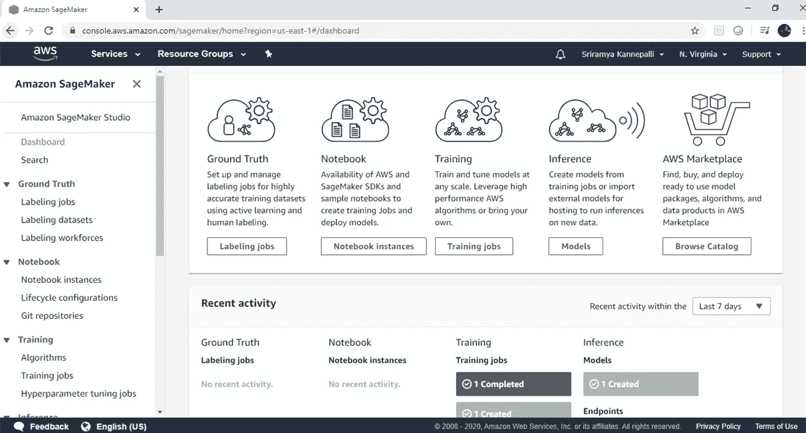

3.单击笔记本实例并创建笔记本实例。

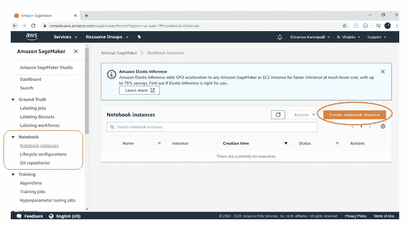

4.输入笔记本实例名称。

从下拉列表中选择笔记本实例类型“ml.t2.medium”。我们仅计划将此笔记本实例用作开发环境，并依靠按需环境来执行繁重的培训和部署工作，即我们将在培训和部署脚本中分配“ml.m4.xlarge”实例。有关其他笔记本实例类型的信息，请参考 [Amazon SageMaker 定价。](https://aws.amazon.com/sagemaker/pricing/)

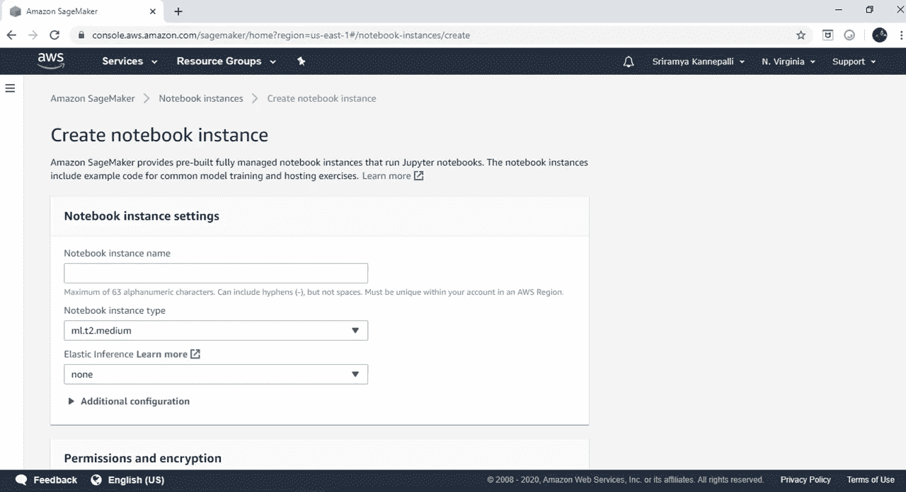

5.通过 IAM 角色向 notebook 实例授予权限，这样就可以从 notebook 访问必要的 AWS 资源，而不需要每次都提供 AWS 凭证。

如果您没有 IAM 角色，Amazon SageMaker 将在您的允许下自动为您创建一个角色。

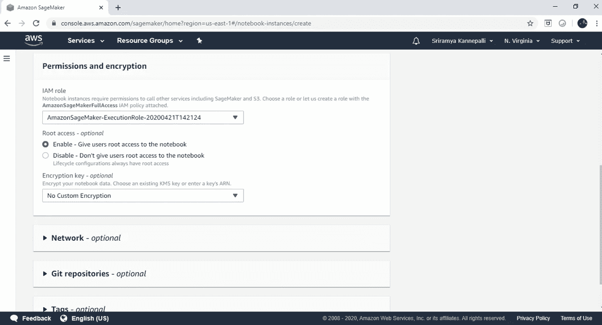

6.单击“创建笔记本实例”。

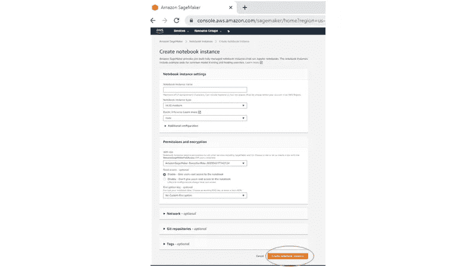

7.从“挂起”状态变为“活动”状态大约需要 1-2 分钟。

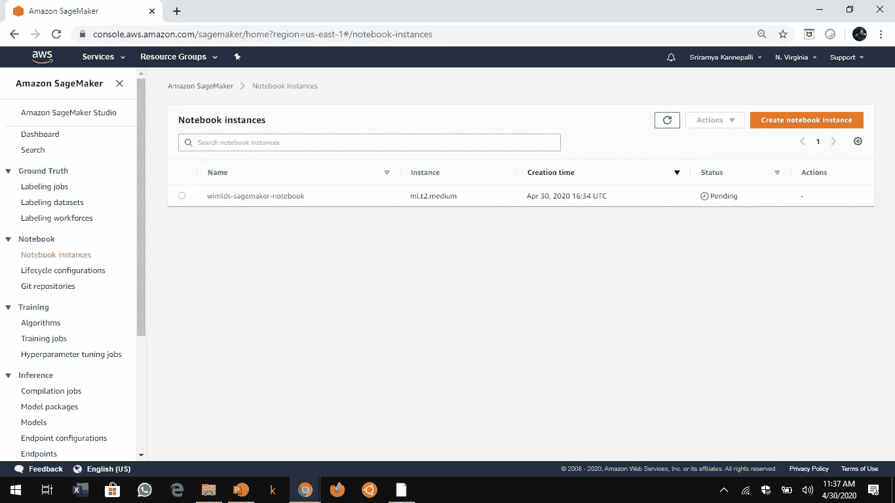

8.现在点击“打开 Jupyter”。

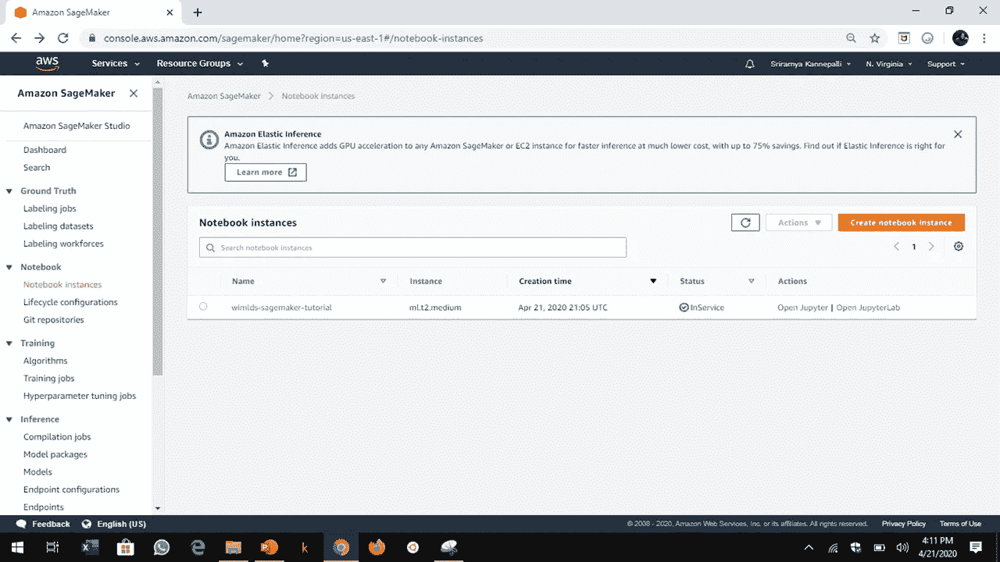

9.您可以使用“上传”功能从本地上传您自己的文件，就像您在普通 Jupyter 笔记本界面中所做的那样。请记住，这些文件保存在当前的“ml.t2.notebook”实例中，如果您在工作完成后决定删除该 notebook 实例，您也将丢失这些文件。

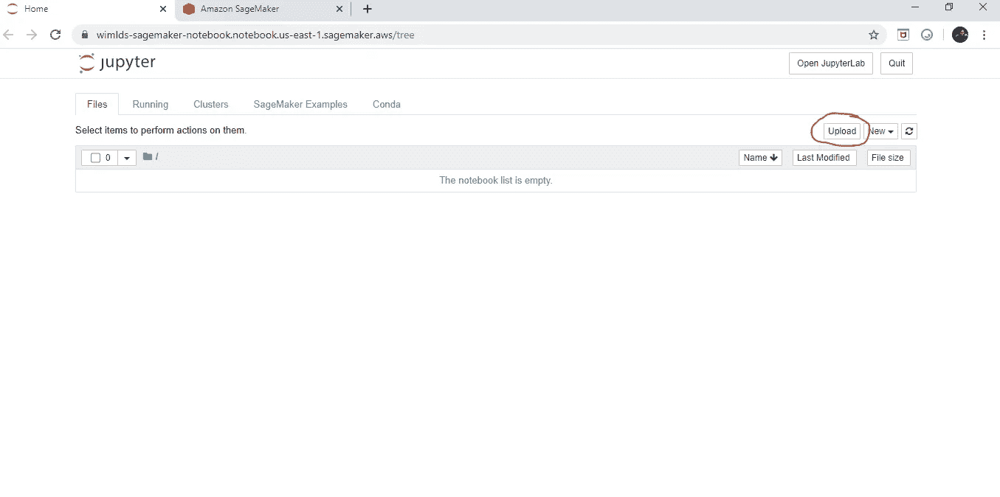

10.如果您是 SageMaker 的新手，您可以参考 AWS SMEs 编写的大量“SageMaker 示例”作为起点。

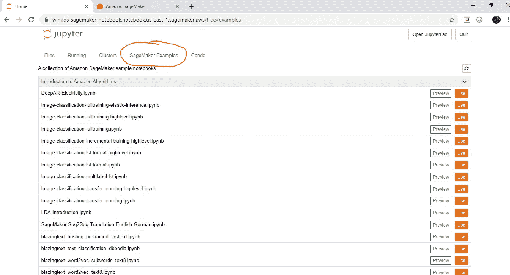

现在转到使用随机森林的**回归& Amazon SageMaker XGBoost 算法，**为此，您需要:

1.  **一个数据集**。我们将使用 [Kaggle 数据集:美国西雅图金县的房屋销售预测](https://www.kaggle.com/harlfoxem/housesalesprediction)。此数据集包含 2014 年 5 月至 2015 年 5 月期间西雅图金县出售的房屋的销售价格。对于评估简单回归模型来说，这是一个很好的数据集。
2.  **一个算法**。我们将使用 scikit-learn 中的随机森林算法和 Amazon SageMaker 提供的 XGBoost 算法，使用房屋数据集训练模型并预测价格。

您还需要一些资源来存储您的数据并在 Amazon SageMaker 中运行代码:

1.  一个**Amazon Simple Storage Service(Amazon S3)bucket**，用于存储 Amazon SageMaker 在训练模型时创建的训练数据和模型工件(不要担心，我们将在下面的代码中进行分配)
2.  一个**Amazon sage maker notebook**实例，用于准备和处理数据，以及训练和部署机器学习模型(我们已经在上面启动了一个 notebook 实例)
3.  一个 **Jupyter 笔记本**,用于与笔记本实例一起准备您的培训数据，并培训和部署模型(如果您从一开始就跟随，我们会打开我们的 Jupyter 笔记本)

我们将用 Python 3 编写代码-

**重要提示:**要在 Amazon SageMaker 中训练、部署和验证模型，您可以使用以下方法之一。

*   亚马逊 SageMaker Python SDK。
*   用于 Python 的 AWS SDK(Boto 3)。

# 亚马逊 Sagemaker Python SDK vs AWS Python SDK(Boto 3)

Amazon SageMaker Python SDK 抽象了几个实现细节，并且易于使用。如果你是第一次使用 Amazon SageMaker，aws 建议你用它来训练、部署和验证模型。

另一方面，Boto 3 是 Python 的 Amazon Web Services (AWS) SDK。它使 Python 开发人员能够创建、配置和管理 AWS 服务，如 EC2 和 S3。Boto 提供了一个易于使用的、面向对象的 API，以及对 AWS 服务的底层访问。

今天，我们将学习如何创建您需要培训的所有资源，并使用**Amazon SageMaker Python SDK**部署一个模型。

这些步骤包括:

1.  正在获取数据集。
2.  探索并转换训练数据，以便可以将其输入到 Amazon SageMaker 算法中。
3.  特征工程和数据可视化。
4.  准备数据。
5.  数据摄取。
6.  训练一个模特。
7.  使用 Python SDK 启动培训作业。
8.  将模型部署到 Amazon SageMaker。
9.  验证模型。
10.  将 Amazon SageMaker 端点集成到面向互联网的应用程序中。
11.  打扫

在我们开始处理数据之前，让我们快速了解一下—

什么是决策树，以及树集合如何构成随机森林和 XG Boost 的基础？

让我们从决策树开始:

# 决策图表

*   决策树是从根节点自上而下构建的，包括将数据划分为包含具有相似值(同类)的实例的子集。
*   决策树以树结构的形式建立回归或分类模型。

重复划分数据以获得同类组的过程称为递归划分。

步骤 1:识别将数据点分成最相似的两组的二元问题。

步骤 2:对每个叶节点重复步骤 1，直到达到停止标准。

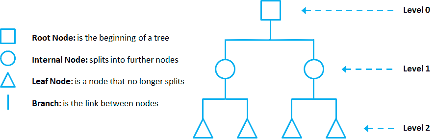

*资料来源:迭戈洛佩兹 Yse(2019 年 4 月 17 日)。决策树。从介质中检索:*[*https://towards data science . com/the-complete-guide-to-decision-trees-28 a4 E3 c 7 be 14*](https://towardsdatascience.com/the-complete-guide-to-decision-trees-28a4e3c7be14)

*资料来源:迭戈洛佩兹 Yse(2019 年 4 月 17 日)。决策树。从介质中检索:*[*https://towardsdatascience . com/the-complete-guide-to-decision-trees-28 a4 E3 C7 be 14*](https://towardsdatascience.com/the-complete-guide-to-decision-trees-28a4e3c7be14)

# 盲人和大象的寓言

来源:Jinde Shubham。(2018 年 7 月 3 日)。集成学习是盲人摸象的寓言。从介质中检索:[*https://becoming human . ai/ensemble-learning-bagging-and-boosting-d 20 f 38 be 9 B1 e*](https://becominghuman.ai/ensemble-learning-bagging-and-boosting-d20f38be9b1e)

集成模型背后的主要原理是一组弱学习者聚集在一起形成强学习者，从而增加模型的准确性。在上图中，四个盲人正试图通过触摸大象的身体部位来预测它。尽管从他们自己的角度来看，他们的预测是正确的，但在预测大象方面，他们是弱学习者。当这些弱学习者在一起讨论时，他们可以识别一头大象，因此形成一个合奏。

# 群众的智慧

> 在集合中，预测可以通过多数投票或取平均值来组合。下面是一个由多数投票形成的集合如何产生比它所基于的单个模型更准确的预测的例子:“

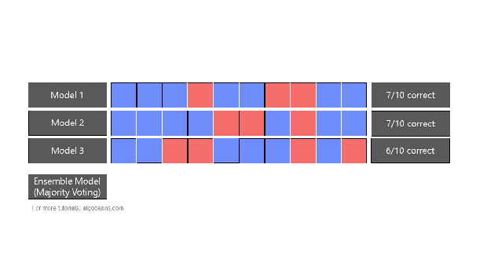

来源:Annalyn Ng 和 Kenneth Soo(2016 年 7 月 27 日)。如何在随机森林中创建一棵树？检索自 algo beans . com:[*https://algobeans.com/2016/07/27/decision-trees-tutorial/*](https://algobeans.com/2016/07/27/decision-trees-tutorial/)

# **装袋增压:**

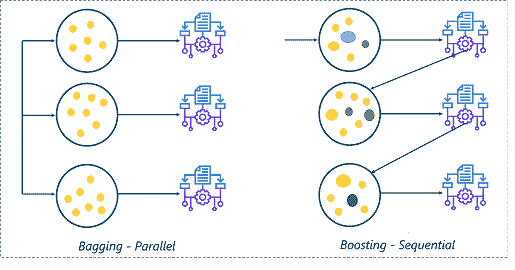

*资料来源:Zulaikha Lateef(2019 年 6 月 28 日)。装袋升压。检索自 Edureka.co:*[*https://www.edureka.co/blog/boosting-machine-learning/*](https://www.edureka.co/blog/boosting-machine-learning/)

## 装袋:

> ****指无顺序学习*** *。**
> 
> **-对于 T 轮，从训练样本中随机抽取样本子集(替换)。**
> 
> **-这些抽签中的每一个都独立于前一轮的抽签，但具有相同的分布。**
> 
> ****——这些随机选择的样本然后被用来生长一个决策树(弱学习者)。然后选择最受欢迎的类别(或回归问题中的平均预测值)作为最终预测值。****
> 
> **装袋方法也称为自举。”**

## *增压:*

> **“Boosting 描述了将许多弱学习器组合成一个非常精确的预测算法。**
> 
> **-弱学习者指的是仅比随机预测略好的学习算法。**
> 
> **-当查看基于树的集成算法时，单个决策树将是弱学习器，例如，多个决策树的组合将产生 AdaBoost 算法。**
> 
> ****-boosting 方法是一种顺序算法，它对整个训练样本进行 T 轮预测，并使用来自前一轮预测准确性的信息迭代地提高 boosting 算法的性能。***T42*

*来源:朱莉娅·尼库尔斯基(2020 年 3 月 16 日)。装袋升压。从介质中检索:https://towards data science . com/the-ultimate-guide-to-AdaBoost-random-forests-and-xgboost-7f 9327061 c4f*

# *随机森林*

*现在，Random Forest 是树集合和装袋的结合。*

> *随机森林是集合的一个例子，集合是来自不同模型的预测的组合。它也使用装袋。Bagging 用于创建数千个相关性最小的决策树。在 bagging 中，选择训练数据的随机子集来训练每棵树。此外，该模型随机限制了可在每棵树的分裂处使用的变量。因此，生长的树是不同的，但它们仍然保留了一定的预测能力。”*

*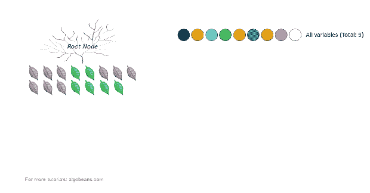*

*来源:Annalyn Ng 和 Kenneth Soo(2016 年 7 月 27 日)。群体的智慧。转自 algo beans . com:[*https://algobeans.com/2016/07/27/decision-trees-tutorial/*](https://algobeans.com/2016/07/27/decision-trees-tutorial/)*

> **“在上面的例子中，有 9 个变量用 9 种颜色表示。* ***在每次拆分时，从最初的 9 个变量中随机抽取一个变量子集。在这个子集内，算法选择最佳变量进行分割。*** *子集的大小被设置为原变量个数的平方根。因此，在我们的例子中，这个数字是 3。”**

*现在有了这样的理解，让我们继续在 Amazon SageMaker 笔记本实例上实现**随机森林。为此，你需要从[这里](https://github.com/SriramyaK/My-WiMLDS-Minneapolis-Talks/blob/master/Random%20Forest%20and%20XGBoost%20Final%20V%204.0%20-%2025042020.ipynb)下载 Jupyter 笔记本，从[这里](https://www.kaggle.com/harlfoxem/housesalesprediction)下载数据。如上所述，将它们上传到您的 SageMaker 笔记本实例中，然后继续操作。***

# *XGBoost 算法*

*XGBoost(极限梯度增强)是由 Chen & Guestrin 在 2016 年推出的。*

*开发它主要是为了**提高速度和性能，同时引入正则化参数以减少过拟合。***

*   *首先，让我们先了解 XGBoost 的模型选择:决策树集成。树集成模型由一组分类和回归树(CART)组成。这里有一个简单的购物车的例子，它对某人是否会喜欢一个假设的电脑游戏 x 进行分类。*
*   *我们将一个家庭的成员分为不同的叶子，并给他们分配相应叶子上的分数。CART 与决策树有点不同，决策树的叶子只包含决策值。在 CART 中，一个真实的分数与每片叶子相关联，这给了我们比分类更丰富的解释。这也允许有原则的、统一的优化方法。*

*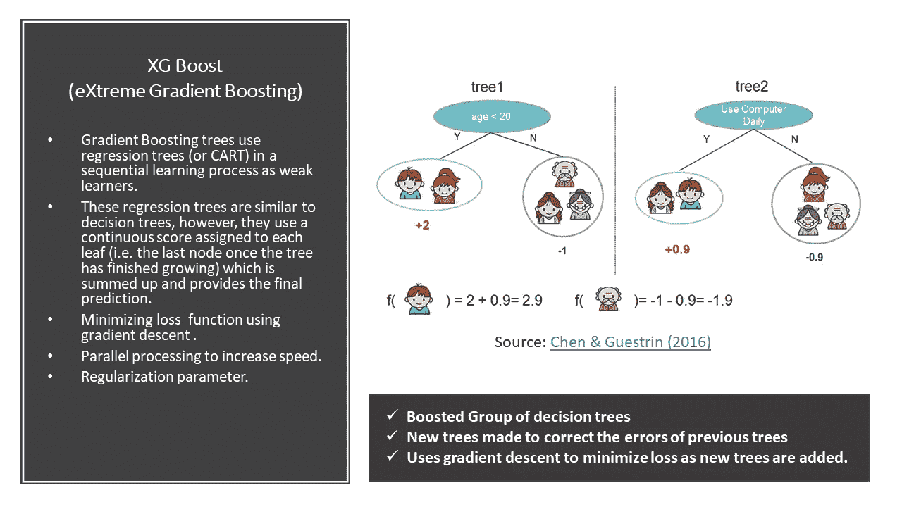*

*让我们从 Sagemaker 上的 XGBoost 实现开始吧—*

*Jupyter Notebook，用于在 Amazon Sagemaker notebook 实例上实现 XGBoost。*

# *将 Amazon SageMaker 端点集成到面向互联网的应用程序中*

*在生产环境中，您可能有一个面向 internet 的应用程序向端点发送请求以进行推断。下面的高级示例展示了如何将模型端点集成到应用程序中。*

*关于如何使用 Amazon API Gateway 和 AWS Lambda 来设置和部署可以从客户端应用程序调用的 web 服务的示例-*

*   *创建 AWS Lambda 服务主体可以承担的 IAM 角色。授予角色调用 Amazon sage maker invoke endpoint API 的权限。*
*   *创建一个 Lambda 函数，调用 Amazon SageMaker invoke endpoint API。*
*   *从移动应用程序调用 Lambda 函数。*

*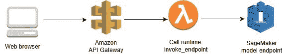*

*从客户端开始，*

*   *客户端脚本调用 Amazon API Gateway API 操作并传递参数值。*
*   *API 网关是向客户端提供 API 的层。此外，它还密封了后端，这样 AWS Lambda 就可以在一个受保护的私有网络中运行。*
*   *API Gateway 将参数值传递给 Lambda 函数。*
*   *Lambda 函数解析该值并将其发送到 SageMaker 模型端点。*
*   *该模型执行预测，并将预测值返回给 AWS Lambda。Lambda 函数解析返回值并将其发送回 API Gateway。API 网关用该值响应客户端。*

# *但是，什么是 AWS Lambda？*

*   *AWS Lambda 是一个计算服务，由 Amazon 提供的无服务器计算平台，作为 AWS 的一部分，允许您运行代码，而无需配置或管理服务器。*
*   *它是一种计算服务，运行代码以响应事件，并自动管理该代码所需的计算资源。*

*要将本笔记本中创建的端点与 AWS Lambda 集成，请阅读我的博客[使用 AWS Lambda](/@sriramya.kannepalli/invoke-an-amazon-sagemaker-endpoint-using-aws-lambda-83ff1a9f5443?source=your_stories_page---------------------------) 调用 Amazon SageMaker 端点。*

*关于[亚马逊 Sagemaker 定价](https://aws.amazon.com/sagemaker/pricing/)的最后一句话*

*免费试用亚马逊 SageMaker 两个月！*

> *作为 AWS 免费层的一部分，你可以免费使用 Amazon SageMaker。如果你以前从未使用过 Amazon SageMaker，在前两个月，你将获得每月 250 小时的 t2.medium 或 t3.medium 笔记本使用时间，用于构建你的模型，外加 50 小时的 m4.xlarge 或 m5.xlarge 用于培训，外加 125 小时的 m4.xlarge 或 m5.xlarge 用于部署你的机器学习模型，以便使用 Amazon SageMaker 进行实时推理和批量转换。您的免费等级从您创建第一个 SageMaker 资源的第一个月开始。*

# *参考*

1.  *迭戈·洛佩兹·伊塞(2019 年 4 月 17 日)。决策树。检索自媒体:[https://towards data science . com/the-complete-guide-to-decision-trees-28 a4 E3 C7 be 14](https://towardsdatascience.com/the-complete-guide-to-decision-trees-28a4e3c7be14)*
2.  *金德·舒巴姆。(2018 年 7 月 3 日)。集成学习是盲人摸象的寓言。从介质中检索:[https://becoming human . ai/ensemble-learning-bagging-and-boosting-d 20 f 38 be 9 B1 e](https://becominghuman.ai/ensemble-learning-bagging-and-boosting-d20f38be9b1e)*
3.  *陈天琦和卡洛斯.盖斯特林。2016.XGBoost:一个可扩展的树提升系统。《第 22 届 ACM SIGKDD 知识发现和数据挖掘国际会议论文集》(KDD '16)。计算机械协会，纽约，纽约州，美国，785-794。https://doi.org/10.1145/2939672.2939785*
4.  *Annalyn Ng 和 Kenneth Soo(2016 年 7 月 27 日)。如何在随机森林中创建一棵树？转自 algo beans . com:【https://algobeans.com/2016/07/27/decision-trees-tutorial/ *
5.  *AWS SageMaker 截图和图。从亚马逊网络服务公司检索:[https://docs . AWS . Amazon . com/sage maker/# Amazon-sage maker-overview](https://docs.aws.amazon.com/sagemaker/#amazon-sagemaker-overview)*