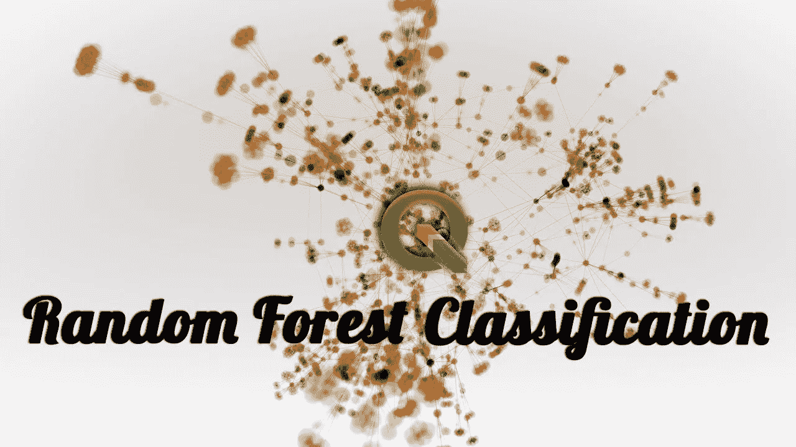
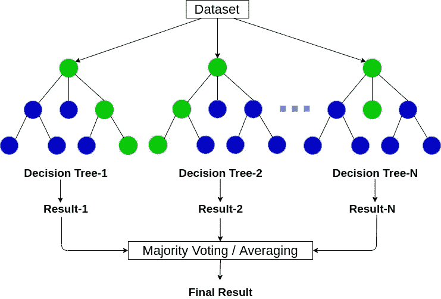
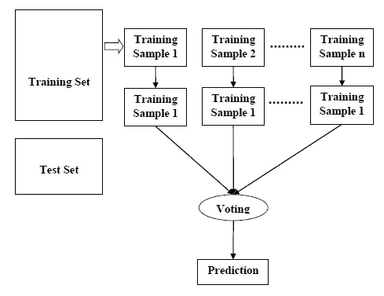
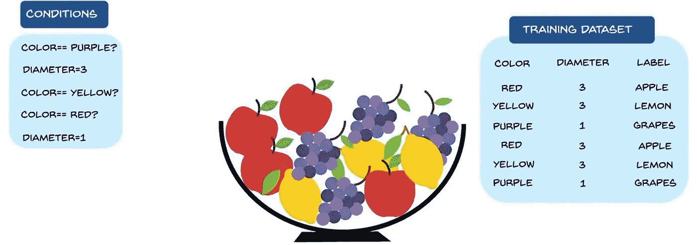
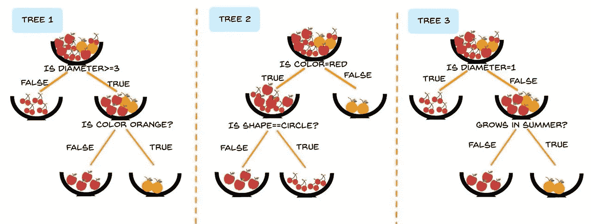
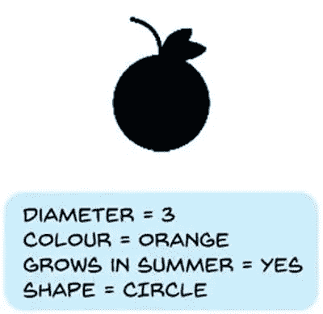
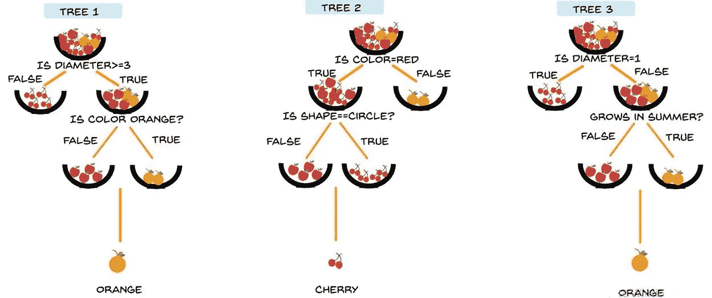
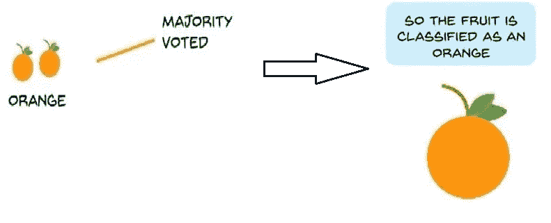

# 随机森林分类及其数学实现

> 原文：<https://medium.com/analytics-vidhya/random-forest-classification-and-its-mathematical-implementation-1895a7bb743e?source=collection_archive---------10----------------------->

让我们继续学习吧

在这个博客中，我们将尝试学习机器学习的随机森林分类算法，它是如何工作的&这种算法背后的数学原理。

在直接跳到随机森林分类器之前，我们应该知道随机森林，它是如何工作的。

## **什么是随机森林？**

1.  随机森林是一种监督学习算法。
2.  它使用了*集成学习技术。*(集成学习是一次使用多个算法或者多次使用单个算法，使一个模型更强大)在随机的数据点建立几个决策树。然后对他们的预测进行平均。取几个决策树预测的平均值，然后预测最终结果。可以参考上图。

## 随机森林模型的类型:

1.一个**分类问题的随机森林预测。**

2.一个**回归问题的随机森林预测。**

## 什么是随机森林分类？

1.  这是一种基于系综树的学习算法。
2.  随机森林分类器是从随机选择的训练集子集得到的一组决策树。
3.  它*聚集来自不同决策树*的投票来决定测试对象的最终类。
4.  ***随机森林算法在数据样本上创建决策树，然后从每个样本中获得预测，最后通过投票的方式选择最佳方案。***

随机森林的结构

## 随机森林算法是如何工作的？

让我们通过以下步骤来理解随机森林算法的工作原理

*   **步骤 1**—首先，从给定数据集中选择随机样本开始。
*   **步骤 2**—接下来，该算法将为每个样本构建一个决策树。然后它会从每棵决策树中得到预测结果。
*   **步骤 3**—在该步骤中，将对每个预测结果进行投票。
*   **第四步**——最后选择投票最多的预测结果作为最终预测结果。

随机森林分类算法的工作

# **例如:**

**问题陈述**:从给定的不同类型的水果样本中，我们必须根据它们的特征来选择水果。

抽样资料

**解**:对于给定的同一个水果样本，我们取三个决策树。

现在给这个模型一个带有它们特征的水果。

样本值输入

根据这一结果的特征，决策树的预测如下:

预言

我们可以看到大多数人投票选择橘子作为输出。

最终输出=橙色

## 随机森林的优势:

1.  它通过平均或组合不同决策树的结果来克服过拟合的问题。
2.  随机森林比单个决策树更适用于大范围的数据项。
3.  随机森林非常灵活，并且具有非常高的准确性。

## 随机森林的缺点:

1.  复杂性是随机森林算法的主要缺点。
2.  与其他算法相比，实现随机森林算法需要更多的计算资源，并且非常耗时。
3.  如果我们有大量的决策树，这就不那么直观了。

## 随机森林的应用:

1.  **银行业:**银行业大多使用这种算法来识别贷款风险。
2.  **医学:**在这种算法的帮助下，可以确定疾病的趋势和风险。
3.  **营销:**营销趋势可以用这个算法来识别。

## **结论:**

在这篇文章中，我们学习了随机森林算法，它的工作原理，我们也知道了在随机森林算法背后使用了多个决策树。

这篇博客到此结束。

***感谢您宝贵的时间***