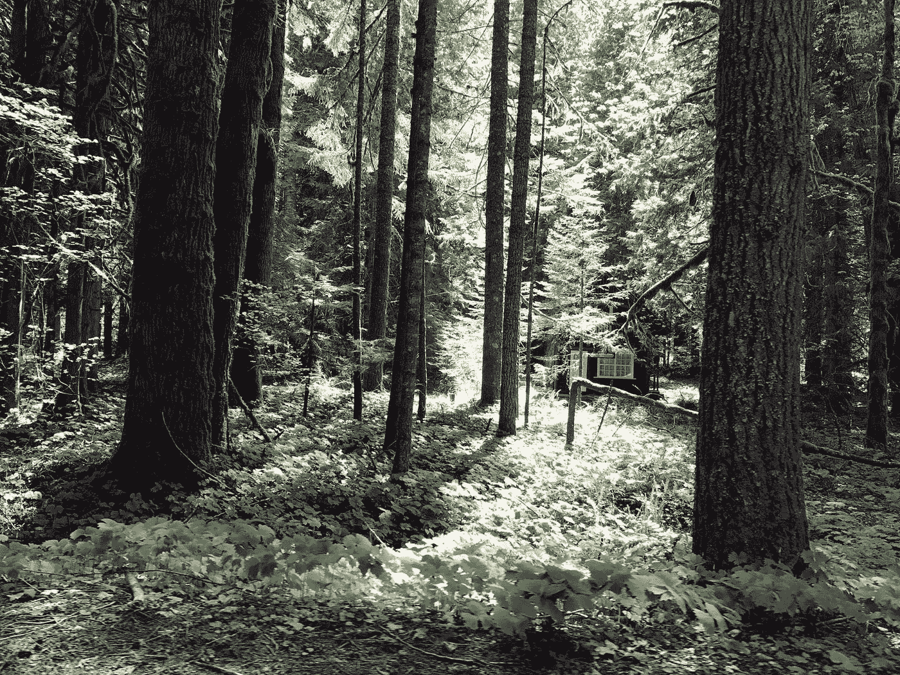

# 用于生物信息学的随机森林分类器

> 原文：<https://medium.com/analytics-vidhya/random-forest-classifier-for-bioinformatics-b8b1ee97d458?source=collection_archive---------9----------------------->

这张照片是作者在 2017 年 5 月访问华盛顿巴克利时拍摄的

在机器学习(ML)的世界中，研究人员和从业者正在寻找新的方法，并给出另一种新的算法来进行预测，随机森林分类器(RFC)仍然像昨天一样重要。现代生物学正以前所未有的速度采用 ML 和数据科学(DS)。与神经网络不同，RFC 是非参数的、可解释的、高效的，并且具有很高的通用性。