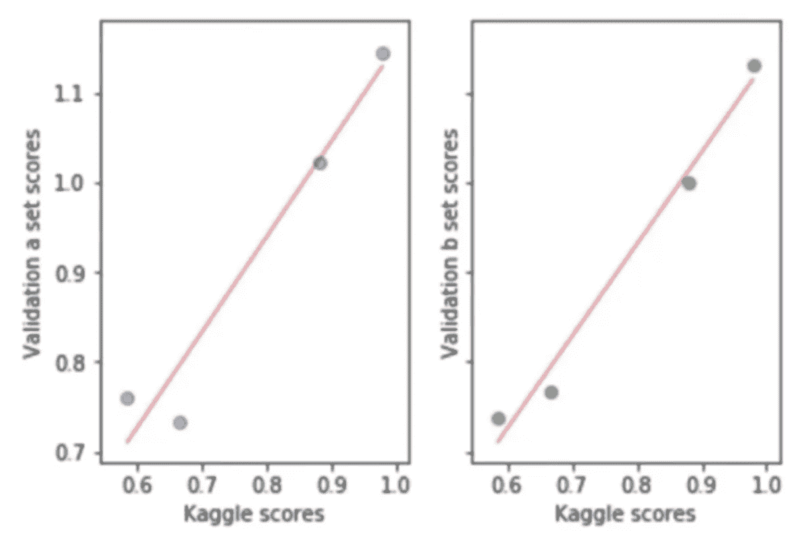
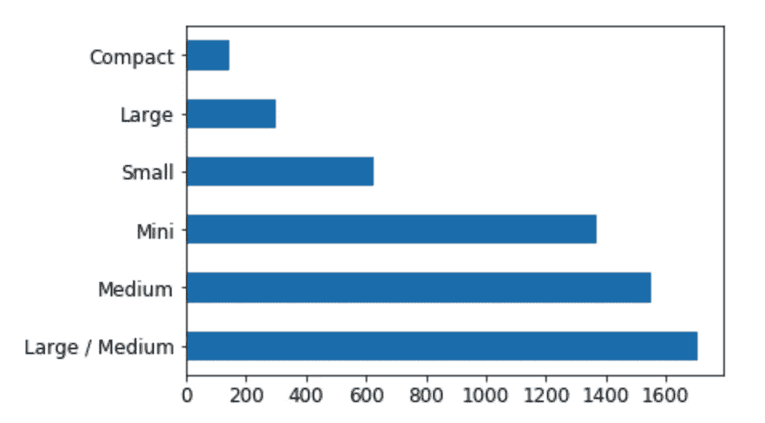
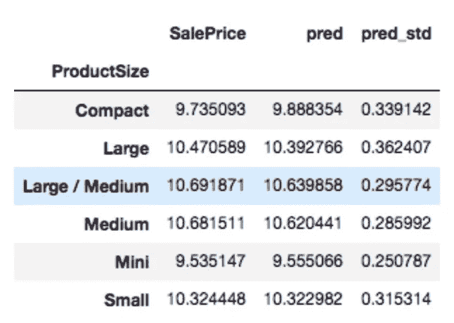
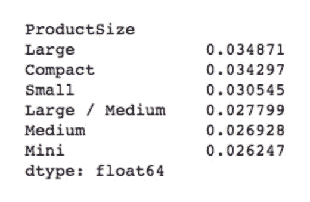
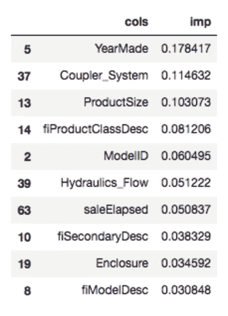
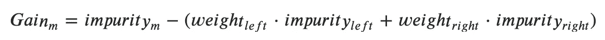
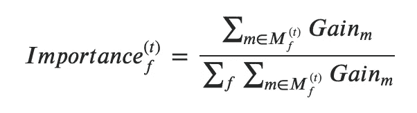
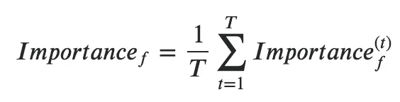
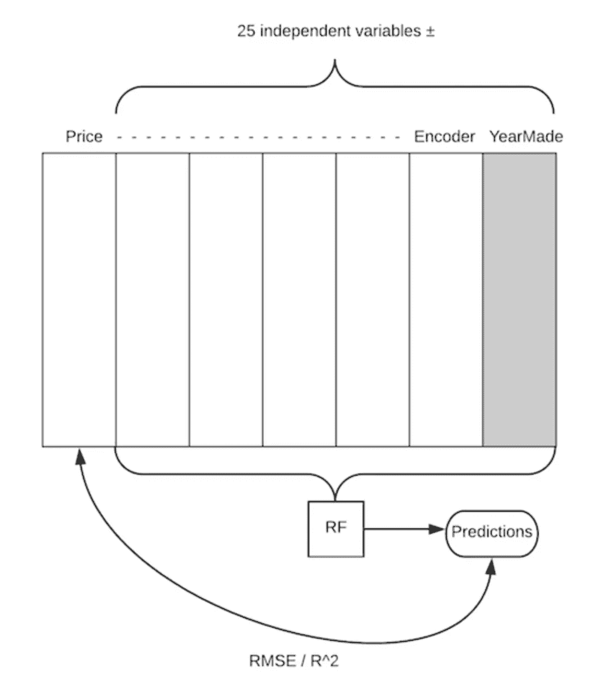

# Fast.ai 为编码人员提供的随机森林解释和超越— ML(第 3 课)

> 原文：<https://medium.com/analytics-vidhya/random-forest-deep-dive-beyond-ml-for-coders-by-fast-ai-lesson-3-a8caf01ac9d7?source=collection_archive---------27----------------------->

*这篇文章深入讨论了 Fast.ai 提供的“程序员 ML 入门”课程中第三课的学习细节*

*与传统的课程笔记不同，我的重点是用外部来源的信息丰富讨论的主题。要访问我在本系列中讨论课程背景的第一篇文章，并浏览所有课程，请单击此处的*[](/@alexrobwong/ml-for-coders-beyond-572ae05448)**。**

# *摘要*

*在课程的前半部分，Jeremey 从分析一个[杂货销售预测数据集](https://www.kaggle.com/c/favorita-grocery-sales-forecasting)开始，这是一个预测大型杂货连锁店销售额的 kaggle 挑战。与此同时，他提供了许多关于如何有效处理大型数据集的建议。*

*在课程的后半部分，他切换回他在上一课中最初分析的[推土机蓝皮书](https://www.kaggle.com/c/bluebook-for-bulldozers)数据集，并重温了一种用于解释随机森林中的单个树木预测的技术。*

# *目录*

1.  *使用大型数据集*
2.  *创建良好的验证集*
3.  *解释采油树预测'置信度'*
4.  *特征重要性*
5.  *排列重要性*

# *感谢*

*特别感谢[杰瑞米·霍华德](https://github.com/fastai/fastai)发布他的课程和源代码。还要特别感谢[上原广美·末永](/@hiromi_suenaga)出版了她详细的课程笔记。*

*这篇文章是我综合了许多来源的信息。我已经尽力提供了原始资料的链接，并强调了我引用他人作品的地方。*

# ***处理大型数据集***

*杂货销售预测数据集包含大约 1 . 25 亿行，是一个关系数据集，其中几个表可以连接在一起。具体来说，该数据集以“星型模式”为特色，其中有一个链接所有数据的中央事务表。*

*请注意，本课的重点不是如何为此数据集构建高性能 RF 模型，而是如何跨以下主题处理大型数据集:*

## ***读取数据***

*当通过 pandas 加载一个数据帧时，只有当整个文件被读取后，它才会确定一个列的数据类型。虽然这通常很方便，但是如果仅仅为了推断一个数据类型就需要读取数百万行，那么这种方法的效率会很低。这里的解决方案是在读入数据时将列类型指定为参数，如下所示:*

```
*types = {'id': 'int64',
         'item_nbr': 'int32',
         'store_nbr': 'int8',
         'unit_sales': 'float32',
         'onpromotion': 'object'}%%time
df_all = pd.read_csv(f'{PATH}train.csv', parse_dates=['date'], 
                     dtype=types, infer_datetime_format=True)*CPU times: user 1min 41s, sys: 5.08s, total: 1min 46s
Wall time: 1min 48s**
```

*请注意，可以指定许多数据类型。虽然一个特定的列可以使用多种数据类型，但最好使用内存效率最高的一种数据类型，这种数据类型正好满足数据的要求(例如，int8 和 int32，具体取决于整数的大小)*

*除了熊猫特有的数据类型`categorical`和 `datetime64[ns, tz]`之外，以下数据类型也可通过 numpy*获得:*

```
*[numpy.generic,
 [[numpy.number,
   [[numpy.integer,
     [[numpy.signedinteger,
       [numpy.int8,
        numpy.int16,
        numpy.int32,
        numpy.int64,
        numpy.int64,
        numpy.timedelta64]],
      [numpy.unsignedinteger,
       [numpy.uint8,
        numpy.uint16,
        numpy.uint32,
        numpy.uint64,
        numpy.uint64]]]],
    [numpy.inexact,
     [[numpy.floating,
       [numpy.float16, numpy.float32, numpy.float64, numpy.float128]],
      [numpy.complexfloating,
       [numpy.complex64, numpy.complex128, numpy.complex256]]]]]],
  [numpy.flexible,
   [[numpy.character, [numpy.bytes_, numpy.str_]],
    [numpy.void, [numpy.record]]]],
  numpy.bool_,
  numpy.datetime64,
  numpy.object_]]*
```

**来源: [Stackoverflow](https://stackoverflow.com/questions/24251219/pandas-read-csv-low-memory-and-dtype-options)*

*请注意，`object`的 dtype 是一种通用的 python 数据类型，速度慢且占用大量内存。通常，通过对数据进行一些清理，可以将这种数据类型更新为内存效率更高的数据类型。*

## *如何在不加载数据帧的情况下知道数据类型*

*正如上一节所讨论的，在加载 pandas 数据帧时指定类型是最佳选择……但是我们怎么知道要指定什么呢？*

*如果还没有指导模式存在，一个低效的选择是通过反复试验，加载数据并查看结果。然而，这自然违背了效率低下的目的。*

*Jeremy 提到，这里一个潜在的解决方案是使用 UNIX 命令`shuf`来获取数据的随机样本。然而，作为一个操作系统用户，如果没有一些额外的解决方法，这个命令就不能直接工作，比如这里列出的。*

*对于 mac 用户来说，另一种方法是在终端窗口中以稍微结构化的格式分析 csv 文件。更多详情请参考[斯特法安·利彭斯](https://www.stefaanlippens.net/pretty-csv.html)的帖子:*

```
*cat data.csv | column -t -s, | less -S*
```

*简而言之，虽然这不会返回随机的行样本，但它将提供对潜在数据类型的初步了解。*

## *有效地设置最大值和最小值*

*在应该存在最小值和最大值的地方，通过 numpy 处理异常值的一个有效方法是使用 clip 方法:*

**

*来源:[SciPy.org](https://docs.scipy.org/doc/numpy/reference/generated/numpy.clip.html)*

## *`Profiling`*

*有几个 IPython 神奇的命令可以用来理解代码执行时间。虽然 Jeremy 使用`%prun`添加了一个分析器，并了解哪些代码行运行时间最长(例如在 scikit-learns fit 方法中),但还有其他几个值得一提，例如在 [Python 数据科学手册](https://jakevdp.github.io/PythonDataScienceHandbook/01.07-timing-and-profiling.html)中概述的:*

*   *`%time`:计时单个语句的执行时间*
*   *`%timeit`:定时重复执行一条语句，以提高准确性*
*   *`%prun`:用概要分析器运行代码*
*   *`%lprun`:用逐行分析器运行代码*
*   *`%memit`:测量单个语句的内存使用情况*
*   *`%mprun`:用逐行内存分析器运行代码*

*请注意，在软件工程中，查看哪些事情占用了时间被称为“剖析”。*

# *创建良好的验证集*

*作为快速复习，当构建机器学习模型时，可用数据被分成训练、验证和测试集。如本[堆栈溢出帖子](https://stackoverflow.com/questions/2976452/whats-is-the-difference-between-train-validation-and-test-set-in-neural-netwo)所述:*

*   ****训练集*** *:该数据集用于调整模型的权重**
*   ****验证集*** *:该数据集用于最小化过拟合。您并没有使用该数据集来调整网络的权重，您只是验证了在训练数据集上的任何准确度的提高实际上产生了在以前没有向网络显示过的数据集上的准确度的提高，或者至少网络没有对其进行过训练(即验证数据集)。如果训练数据集的精度提高了，但验证数据集的精度保持不变或降低了，那么您的模型会过度拟合，您应该停止训练。**
*   ****测试集*** *:该数据集仅用于测试最终解决方案，以确认模型的实际预测能力。**

*换句话说，需要一个验证集，以便您可以知道您的模型是否会可靠地告诉您当它投入生产/用于测试数据时它将如何执行。在 kaggle 竞赛的上下文中，测试集是上传预测结果返回的分数。*

*虽然测试集应该在项目/比赛结束时使用，但它可以用来**校准您的验证集**。*

*这里的方法是训练几个半体面的模型，并在验证和测试集上评估它们的性能——在这种情况下，测试集是 kaggle 结果。通过绘制验证与测试集分数的关系图，完美的 45 度线表示验证集完美地反映了测试集，如下所示:*

**

*验证与测试(Kaggle)结果，用于了解验证集是否已“校准”。(来源:[上原广美末永](/@hiromi_suenaga/machine-learning-1-lesson-3-fa4065d8cb1e))*

*请注意，y=x 线不是必需的。更重要的是，验证集和测试集一致地告知模型之间的相对性能。*

*当选择与测试集中包含的观测值相似的观测值时，校准数据集需要一点技巧。通常情况下，可能会有相关的时间因素和可以利用的领域专业知识。*

# *解释树预测'置信度'*

*在本课的这一点上，Jeremy 切换主题并导航回推土机的[蓝皮书](https://www.kaggle.com/c/bluebook-for-bulldozers)数据集。在上一课中，对随机森林进行了训练，并介绍了分析单棵树预测的概念。回想以下代码，查看各个树预测:*

```
*m = RandomForestRegressor(n_jobs=-1, verbose=3)
m.fit(X_train, y_train)preds = np.stack([t.predict(X_valid) **for** t **in** m.estimators_]) preds[:,0], np.mean(preds[:,0]), y_valid[0]*(array([ 9.21034,  8.9872 ,  8.9872 ,  8.9872 ,  8.9872 ,  9.21034,  8.92266,  9.21034,  9.21034,  8.9872 ]),  
9.0700003890739005,  
9.1049798563183568)*preds.shape
*(10, 12000)**
```

*为了获得 RF 预测，取所有树的平均响应。然而，为了理解该预测的“相对置信度”,可以分析预测的标准偏差。请注意，这种意义上的“置信度”并不一定意味着准确性，相反，它表明 RF 模型中的各个树直接向最终值收敛，而输入会导致所有树具有非常不同的响应。*

*上面的代码片段是获取单个观察的树预测的简单过程。fast.ai 库有一个名为`parallel_trees`的函数来并行化计算。下面显示了如何使用该函数及其源代码的示例*

```
*def get_preds(t): return t.predict(X_valid)
%time preds = np.stack(**parallel_trees**(m, get_preds))
np.mean(preds[:,0]), np.std(preds[:,0])*CPU times: user 100 ms, sys: 180 ms, total: 280 ms
Wall time: 505 ms(9.1960278072006023, 0.21225113407342761)**
```

*来自 fast.ai 的源代码*

## *示例-树预测的标准偏差*

*在之前的视频课程中，推土机最终价格的一个分类预测值被确定为`ProductSize`。可以分析不同机柜类型的预测标准偏差:*

```
*x.ProductSize.value_counts().plot.barh()*
```

**

```
*x = raw_valid.copy()
x['pred_std'] = np.std(preds, axis=0)
x['pred'] = np.mean(preds, axis=0)flds = ['ProductSize', 'SalePrice', 'pred', 'pred_std']
summ = x[flds].groupby(flds[0]).mean()
summ*
```

**

*由于潜在的目标值较大，因此预期较大的产品会有较大的标准差。分析`SalePrice`与`pres_std`的比值，可以看出越大越紧凑的产品比值最大，相对标准差也最大。*

```
*(summ.pred_std/summ.pred).sort_values(ascending=False)*
```

**

*正如[上原广美·苏埃纳加](/@hiromi_suenaga/machine-learning-1-lesson-3-fa4065d8cb1e)所说，您可以将这个置信区间用于两个主要目的:*

1.  **您可以查看各组的平均置信区间，找出您似乎对哪些组没有信心。**
2.  **也许更重要的是，您可以查看它们的具体行。当您将它投入生产时，您可能总是希望看到置信区间。例如，如果你做信用评分来决定是否给某人贷款，你可能不仅想知道他们的风险程度，还想知道我们有多有信心。如果他们想借很多钱，而我们对预测他们是否会还钱的能力一点信心都没有，我们可能会给他们小额贷款。**

# *特征重要性*

*RandomForestRegressor 类是一种内置的功能重要性方法。fast.ai 库有一个函数可以优雅地调用这个方法，并为用户返回格式化的输出:*

*`fi = rf_feat_importance(m, df_trn); fi[:10]`*

**

*推土机蓝皮书数据集的要素重要性示例*

*rf_feat_importance 函数的 Fast.ai 源代码*

*实际上，对于随机森林预测来说，通常只有一部分特征是重要的。正是在这一点上，应该注入领域专业知识，以进一步理解底层特性是什么，因为这可以推动特性工程的其他想法。*

## *特征重要性背后的数学原理*

*scikit-learn 特征重要性方法基于通过分割特征实现的杂质减少。如第 1 课所述，分类树通常使用基尼指数或熵，回归树通常使用标准差。以下对特征重要性背后的数学解释来自[堆栈交换](https://datascience.stackexchange.com/questions/66280/how-is-the-feature-importance-value-calculated-in-sklearn-modules-for-each):*

**对于具有左右子节点的给定(二进制)节点𝑚，杂质减少𝐺𝑎𝑖𝑛的计算如下，其中权重被定义为子节点中父实例的份额**

**

**现在，为了导出树 t、* *中给定特征 f* ***的* ***总杂质减少量，您需要对在该特征 f 上执行分割的所有节点求和，并除以该树所有节点的总杂质减少量:******

**

*请注意，由于这一标准化步骤，您的特征重要性总计为 1。最终，将计算任意森林中所有树木 t 的要素𝑓的总重要性，树木总数为 t:*

*现在，要获得𝑡树中给定特征𝑓的总杂质减少量，需要对所有节点𝑚∈𝑀(𝑡)𝑓m∈Mf(t 求和，这些节点对该特征𝑓f 执行分割，然后除以该树所有节点的总杂质减少量:*

**

## *特征重要性的限制*

*正如在 [scikit-learn 文档](https://scikit-learn.org/stable/auto_examples/inspection/plot_permutation_importance.html)中直接指出的，请注意随机森林特征重要性的以下限制:*

*   **基于杂质的重要性偏向高基数特性**
*   **基于杂质的重要度是根据训练集统计数据计算的，因此不能反映出特征对进行归纳到测试集的预测有用的能力**
*   **当两个特征相关且其中一个特征被置换时，模型仍可通过其相关特征访问该特征。这将导致这两个特性的重要性降低，而它们实际上可能是重要的。处理这种情况的一种方法是对相关的要素进行聚类，并且只保留每个聚类中的一个要素。**

# *排列重要性*

*本课的最后一个主题是排列重要性，这是一种模型不可知的技术，用于根据随机排列时特征对响应变量的影响来理解特征的重要性。*

> *该过程打破了特征和目标之间的关系，因此模型得分的下降表明了模型对特征的依赖程度(来源: [scikit-learn](https://scikit-learn.org/stable/modules/permutation_importance.html) )*

*换句话说，通过比较单个预测器特性(例如下图中的`YearMade`)被随机打乱时的性能下降，我们可以对哪些特性相对更重要进行排序。*

**

*来源:[上原广美·苏娜加](/@hiromi_suenaga/machine-learning-1-lesson-3-fa4065d8cb1e)*

*Scikit-learn 提供了一个`permutation_importance_ method`，它可以在下面的[链接](https://scikit-learn.org/stable/modules/generated/sklearn.inspection.permutation_importance.html#sklearn.inspection.permutation_importance)中找到。*

***请注意，在 fast.ai 课程中，Jeremey 使用上面的排列重要性图表作为 scikit-learn 的特征重要性方法的简化解释。**虽然有助于直观理解，因为两者都输出输入特征的相对重要性，但应理解它们不是一回事:*

*   *fast.ai 库中使用的 scikit-learn 特征重要性方法基于平均减少不完整性(MDI)*
*   *置换重要性，如 scikit-learn 中实现的版本，是基于指定的评分函数的。置换重要性被定义为“基线度量和置换特征列的度量之间的差异”。*

*有关两者之间差异的更多信息，请参考 sci-kit learn 的这篇[文章。](https://scikit-learn.org/stable/modules/permutation_importance.html)*

# *这一课到此结束，敬请期待下一课！*