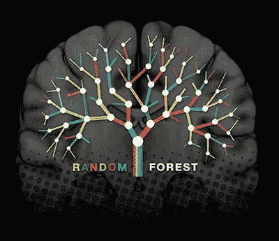

# 随机森林

> 原文：<https://medium.com/analytics-vidhya/random-forest-e205561c3489?source=collection_archive---------31----------------------->

[随机森林](https://www.frontiersin.org/files/MyHome%20Article%20Library/284242/284242_Thumb_400.jpg)

> 随机森林是一种监督学习算法。就像你已经从它的名字中看到的，它创造了一个森林，使它变得随机。它建造的森林，是[决策树](/swlh/decision-tree-regression-c977b732eb51)的**合奏**，大部分时间用**套袋法**训练。

## 集成学习

在**集成学习**中，我们多次采用多个算法或同一个算法，我们将它们放在一起或合并在一起，以制作比原始算法更强大的东西。

## 装袋技术

**引导**数据并使用**集合**做出决定被称为**打包**。它提高了机器学习算法的稳定性和准确性。bagging 方法的一般思想是学习模型的组合增加了整体结果。

[装袋技术](https://www.kdnuggets.com/wp-content/uploads/Budzik-fig1-ensemble-learning.jpg)

随机森林是一种**集成学习**技术。

> 随机森林建立多个决策树，并将它们合并在一起，以获得更准确和稳定的预测。

让我们看看随机森林是如何工作的:

**步骤 1:** 从训练集中随机选取 K 个数据点或样本，并创建一个“**自举**数据集。为了创建与原始数据集大小相同的引导数据集，我们只需从原始数据集中随机选择样本，我们还可以多次选择相同的数据或样本。

**步骤 2** :建立与这 K 个数据点或样本相关的决策树。现在，我们使用自举数据集创建一个决策树，但在每一步只考虑变量(或列)的随机子集。

**第三步**:选择你想要建造的 N 棵树的数量，然后重复第一步&第二步，你会得到各种各样的树。树的多样性使得随机森林比个体决策树更有效。

**步骤 4** :对于一个新的数据点，让 N 棵树中的每一棵树预测该数据点的 Y 值。将数据运行到随机森林中的所有树后，我们将判断哪个选项获得了更多投票，该选项是最终输出，或者可以说是 y 的值。

# 为什么使用随机森林算法？

> 随机森林给出高水平的精确和更稳定的预测。它还降低了过度拟合的风险，并可以有效地运行大型数据库，以产生高度准确的预测。

随机森林算法到此为止。敬请关注更多博客。

*谢谢*

海量数据上随机森林的实现

> 数据集:[泰坦尼克号](https://github.com/InternityFoundation/MachineLearning_Navu4/blob/master/15th%20June%20:%20Implementation%20of%20Decision%20Tree%20and%20Random%20Forest/titanic.csv)数据集

链接:[https://github . com/internity foundation/machine learning _ navu 4/blob/master/15 日%20 June % 20:% 20 实现% 20 of % 20 决策% 20 树% 20 和% 20 Random % 20 forest/Random _ forest _ on _ titanic _ dataset . ipynb](https://github.com/InternityFoundation/MachineLearning_Navu4/blob/master/15th%20June%20:%20Implementation%20of%20Decision%20Tree%20and%20Random%20Forest/Random_forest_on_titanic_dataset.ipynb)