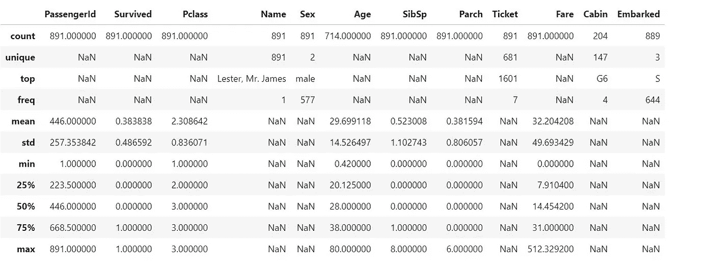

# 泰坦尼克号数据集⛵.上的随机森林

> 原文：<https://medium.com/analytics-vidhya/random-forest-on-titanic-dataset-88327a014b4d?source=collection_archive---------0----------------------->

图片取自 K. Mitch Hodge

## ***这里我们将探索 Kaggle 中可用的 Titanic 数据集的特征，并构建一个随机森林*** 分类器 ***。***

我多次进入 Kaggle 寻找解决方案或不同的数据集。我参加过不同的机器学习课程，所有这些课程都在某种程度上使用了 Kaggle 的数据集。这是有意义的，因为所有数据集都得到了很好的描述，分为训练和测试，并有许多功能供您探索。所以我决定跳进 Kaggle，尝试我的第一个比赛，最好的起点是泰坦尼克号数据集，那是 Kaggle 的入门。对于那些不知道的人来说，RMS 泰坦尼克号是一艘由白星公司运营的英国客轮，于 1912 年 4 月 15 日凌晨沉入北大西洋，你可以在维基百科中读到更多，还有一部名为泰坦尼克号的美丽电影。

这个想法是利用泰坦尼克号的乘客数据(姓名、年龄、票价等。)来预测谁会活下来，谁会死，这有点令人毛骨悚然，但却是一种有效的方法。因此，让我们从加载数据集开始。在我的例子中，我从 [Kaggle](https://www.kaggle.com/c/titanic) 下载了一个 zip 文件。

我们将使用 [Python](https://www.python.org/) 和 [Jupyter 笔记本](http://jupyter.org/)。让我们从导入开始，提取。zip 文件。我设定了一个我喜欢的 Seaborn 风格。

库的导入

数据框的俯视图

我们加载了测试和训练数据，训练数据集包含 891 个训练示例和 12 个特征，包括标签，测试数据集包含 418 行和 11 个特征，没有标签。接下来是特性的描述。

*   **乘客 ID** 识别乘客的数字特征(乘客 ID/票号)。
*   **幸存下来**是我们的标签，我们可以看到是一个二元特征，如果幸存下来就是 1，否则就是 0。
*   **Pclass** 是车票等级(1 = 1 号(上)，2 = 2 号(中)，3 = 3 号(下))
*   年龄是以年为单位的年龄
*   是泰坦尼克号上兄弟姐妹/配偶的数量
*   泰坦尼克号上父母/孩子的数量
*   **票号**是票号
*   **票价**是乘客的票价
*   **船舱**是船舱编号
*   **登船**指登船港口。C =瑟堡，Q =皇后镇，S =南安普顿

我们来看看数据的描述。

数据集的描述

通过描述数据，我们可以看到我们有许多缺失的功能。我们确认了 891 名乘客和 714 名年龄，204 个客舱号码和 889 名乘客登机。现在，如果你看过这部电影，你会同意我的说法，其中一个失踪的人是杰克·道森(莱昂纳多迪卡普里奥在泰坦尼克号)。让我们看看他是否在这个数据集中😅。

# 处理缺失数据和重复数据

在训练模型进行任何类型的分类或回归之前，首先我们必须确保我们的数据是可以理解的，并且其中没有垃圾。虽然清理数据不像训练算法那样有趣，但这一步在每个机器学习项目中都至关重要。首先让我们检查丢失的值或重复的值。

缺少和重复的值

## 填充上船和船费

我们可以看到，我们在年龄和舱位方面有许多缺失值，正如我们之前在描述部分所假设的那样。大多数缺失的数据来自于客舱要素，这可能是因为不是每个人都有客舱。我记得从电影里看到，很多人是偷渡者，很多人睡在同一个船舱里。上船时有两个值缺失，票价中有一个值缺失。我们可以用票价的平均值来填充票价，这不成问题，用最常见的登船港来填充登船港。

## 填充年龄

我们装满了船和船费，现在我们能对年龄做什么呢？

要填年龄，可以查一下头衔(小姐、先生、夫人、硕士、博士)取每一个的年龄平均值，然后根据头衔填年龄。是的，主人是《泰坦尼克号》中使用的头衔之一，用于男孩和年轻人，主要是英国人。

缺失数据的热图

几乎所有来自 Cabin 的数据都丢失了，我想我们可以做一些假设来找出填充它的方法，例如，让我们只保留第一个字母并用 x 填充丢失的字母。

我们可以看到，缺失的 X 等级的平均值非常低，这意味着没有客舱分配的人几乎在所有情况下都有较低的票价，但我们可以处理一些异常值。我们可以将这些异常值分配到 C 类或 B 类，因为它们的费用更高，我们就这么做吧。我将假设没有被分配舱位的人支付了较低的票价，因此在 X 舱中每个票价相对较高的人都是异常值，因此我将使用其余舱的平均值重新分配他们。

现在，客舱 X 的票价应该很低，我们的数据集中不再有缺失值。

# 特征工程

特征工程包括分析特征并从中提取有用的信息，还包括从现有的特征中创造新的特征。让我们从做一些可视化开始。

根据图表，我们可以看到大多数人是独自一人，大多数属于第三类(较低)。这与我们之前看到的客舱和票价相对应，大多数没有客舱分配的人票价很低，这说明他们属于 3 级。我们可以创建一个新功能，根据 SibSp(兄弟姐妹/配偶)和 Parch(父母/子女)属性以及家庭规模来指定此人是独自旅行还是与家人一起旅行。这些属性可能会令人感兴趣。此外，让我们绘制与标签相关的数据。

从图表中我们可以看出，大多数人死于这次事故。虽然大多数乘客是男性，但大多数幸存者是女性，当然，船上的工人和职员很可能是男性居多，所以这是有道理的。我们还可以看到，大多数死者属于第三等级(低等级的人)，他们可能是最后被疏散的，并且可能位于船上更难接近的部分。大多数死去的人都是孤独的，这是有道理的，因为来自第三阶级的人大多是孤独的，而且是那些死得最多的人。现在让我们看看幸存者的年龄和票价。

显然，那些幸存下来的人的费用更高，我们可以在每个人的分布中看到这一点。活下来的人比死去的人年轻一点。我们还可以看到，第一班的人比其他人年长，而第三班的人更年轻。接下来我们可以看到特征之间的相关性。Fare 和 Survived 之间有一些相关性，但相关性不考虑类别，所以最好将性别和着手方式等特征映射到数字。

特征相关矩阵

# 映射分类特征

机器学习算法处理的是数字而不是类别，所以我们需要找到一种方法将这些类别映射到数字中。这在熊猫身上用`map()`方法很容易做到。我将女性定义为 1，男性定义为 0，因为大多数幸存者都是女性，所以两者之间存在正相关。

好了，现在让我们去掉那些不重要的特征，比如姓名和票号。

# 标准化数据

许多机器学习算法，如回归类型和基于距离的算法，在数据规范化时可以更快地收敛，这是每个机器学习情况下的关键一步。为此，我将使用 Scikit Learn 的`MinMaxScaler`库，但首先我们需要去掉标签。缩放时，我们只让缩放器适合训练数据集。

缩放训练数据集

# 分类

我将使用随机森林分类器。随机森林是一种监督学习算法。它既可以用于分类，也可以用于回归。这也是最灵活和最容易使用的算法。你可以在[这里](https://www.datacamp.com/community/tutorials/random-forests-classifier-python)了解更多信息。让我们分割数据以使用带有标签的测试集。

随机森林拟合

Sklearn 的随机森林分类器的一个有趣之处在于，它提供了一种非常简单的方法来查看分类的重要特性。

修改特征重要性

我们可以删除算法中不太重要的特征，看看精确度是否会提高。所有特征的准确率为 82%。让我们来看看删除不太重要的，如“单独”，“帕奇”和“上船”。

去除不太重要的特征，准确性提高了，而且我们的模型可以更好地识别死者而不是幸存者，毕竟，他们的例子更多。最后，我们在原始测试数据集中有混淆矩阵和预测。

# 摘要

在本文中，您已经了解了如何探索 Kaggle 中可用的 Titanic 数据集的特性。我们对幸存者的分类达到了 85%的准确率，虽然不是很好，但这是一个小数据集。准确度可以通过调整分类器的超参数、添加新功能或尝试不同的分类器来提高，在[这里](https://towardsdatascience.com/hyperparameter-tuning-the-random-forest-in-python-using-scikit-learn-28d2aa77dd74)有一篇关于调整随机森林超参数的好文章。我将在以后的出版物中探讨这个问题。完整的笔记本可以在 [GitHub](https://github.com/Charlie5DH/Kaggle_Competitions/blob/master/Titanic_Machine_Learning_from_Disaster/titanic-disaster-cr.ipynb) 上找到。

# 参考

https://www.kaggle.com/c/titanic

关于随机森林:[https://www . data camp . com/community/tutorials/Random-Forests-classifier-python](https://www.datacamp.com/community/tutorials/random-forests-classifier-python)

还有这个关于随机森林的好刊物:[https://towards data science . com/Random-forest-class ification-and-its-implementation-d5d 840 dbead 0](https://towardsdatascience.com/random-forest-classification-and-its-implementation-d5d840dbead0)

当然还有 Scikit-learn:[https://Scikit-learn . org/stable/modules/generated/sk learn . metrics . accuracy _ score . html](https://scikit-learn.org/stable/modules/generated/sklearn.metrics.accuracy_score.html)