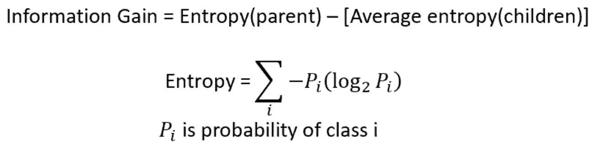
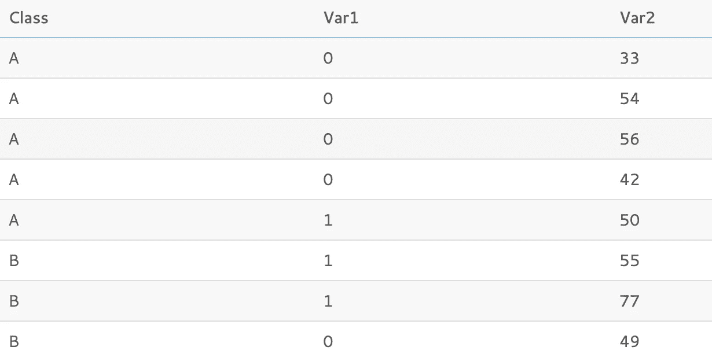

# 《随机森林基础与超越——fast . ai 为编码人员提供的 ML 》(第 1 课)

> 原文：<https://medium.com/analytics-vidhya/random-forests-fundamentals-beyond-ml-for-coders-by-fast-ai-lesson-1-5e9003811515?source=collection_archive---------13----------------------->

*这篇文章深入讨论了支持 Fast.ai 提供的“程序员 ML 入门”课程第一课学习的细节*

*与传统的课程笔记不同，我的重点是用外部来源的信息丰富讨论的主题。要访问我在本系列中讨论课程背景的第一篇文章，并浏览所有课程，请单击此处的***。**

# *摘要*

*在第一课中，Jeremy 介绍了决策树和随机森林的高级概念。他还讨论了 fast.ai 的关键功能，以快速准备建模数据。*

# *目录*

1.  *什么是随机森林？*
2.  *什么是决策树？*
3.  *驱动决策树的数学*
4.  *从决策树到随机森林(集成学习)*
5.  *随机森林是如何工作的？(伪代码)*
6.  *随机森林利弊*
7.  *从本课中学到的其他知识*

# *感谢*

*特别感谢[杰瑞米·霍华德](https://github.com/fastai/fastai)发布他的课程和源代码。还要特别感谢[上原广美·末永](/@hiromi_suenaga)出版了她详细的课程笔记。*

*这篇文章是我综合了许多来源的信息。我已经尽力提供了原始资料的链接，并强调了我引用他人作品的地方。*

# *什么是随机森林？*

> ***随机森林**或**随机决策森林**是一种用于分类、回归和其他任务的集成学习方法，它通过在训练时构建大量决策树并输出类来运行，该类是各个树的类(分类)或均值预测(回归)的模式([来源:维基百科](https://en.wikipedia.org/wiki/Random_forest)*

*换句话说，随机森林是一种用于回归和分类的机器学习算法，由许多决策树组成。每个决策树是在原始数据的随机抽样部分上开发的，并且来自各个树的预测被聚合以创建来自森林的最终预测。*

**

*随机森林的简化说明([来源](https://www.kdnuggets.com/2017/10/random-forests-explained.html))*

*为了理解随机森林是如何工作的，首先要理解什么是决策树。*

*注意，在本文中，假设读者熟悉将可用数据分成训练/验证/测试数据的概念和重要性。关于这个主题的更多信息，请查看机器学习大师的这篇伟大的[文章。](https://machinelearningmastery.com/difference-test-validation-datasets/)*

# ***什么是决策树？***

> *决策树是用于回归和分类问题的大量使用的非参数有效机器学习建模技术。为了找到解决方案，决策树根据预测数据对结果变量做出连续的、分层的决策([来源:走向数据科学—媒体](https://towardsdatascience.com/what-is-a-decision-tree-22975f00f3e1))。*

**

*一个简单的天气是否适合打网球的决策树([来源:亚达夫王子— Medium](https://towardsdatascience.com/decision-tree-in-machine-learning-e380942a4c96)*

## *决策树是如何工作的？*

*决策树由节点和分支组成。在培训期间，采取以下步骤:*

1.  *从整组观察值开始，决策树基于“*最优*”特征和值的组合，在其**根节点**将数据拆分成两个互斥的分支。*
2.  *从根节点延伸的每个分支进一步导向另外的**决策节点**，在那里基于每个决策节点可用的数据子集的“*最优*”特征和值组合进行进一步的分割。*
3.  *该过程以迭代的方式继续，直到到达**叶节点**并做出预测。当满足“*停止标准*”或节点中只剩下一个观察值时，出现叶节点。*

*在根节点和每个决策节点，分割标准的类型取决于被分割的要素的类型:*

*   *当分割的最佳特征是连续的时，分割标准是一个不等式，例如大于或小于最佳值。*
*   *当分裂的最佳特征是类别时，分裂标准是类别成员的布尔值。请注意，当一个分类变量可以有两个以上的类别时，在适当的情况下会反复使用二元分割来进一步分割类别。(例如，对于包含太阳、雨和云的分类变量，节点可能是“太阳或不是太阳”，然后每个分支可能最终导致另一个分支“雨或不是雨”)*

*请注意，术语“最佳”和“停止标准”将在本节稍后定义。有关决策树相关关键术语的摘要，请参见下图:*

**

*来源:https://clearpredictions.com/Home/DecisionTree*

## *为什么决策树是非参数化的？*

*决策树是非参数化的，因为它没有假设或要求数据中的基本特征(变量)是均匀分布的。[根据 Investopedia](https://www.investopedia.com/terms/n/nonparametric-statistics.asp) 的定义:*

*   *非参数统计是指不要求数据符合正态分布的统计方法。*
*   *非参数统计使用通常是有序的数据，这意味着它不依赖于数字，而是依赖于排序或排序。*
*   *非参数模型的模型结构不是事先指定的*，而是从数据中确定的。**
*   **术语*非参数*并不意味着这种模型完全缺少参数，而是参数的数量和性质是灵活的，不是预先固定的。**

# **驱动决策树的数学**

**有不同类型的决策树算法，每种算法使用不同的杂质测量来进行分裂。**基尼指数和信息增益常用于分类树**和**标准差用于回归树。****

## ****基尼指数(用于分类树)****

**以下是 reg 的基尼系数公式，其中 Pi 表示对象被分类到特定类别的概率。**

****

**基尼指数公式**

**基尼指数是对随机选取的特定变量被错误分类的程度或概率的衡量:**

*   **基尼系数为 0 表示所有要素都属于某一类，或者只有一类**
*   **基尼指数为 1 表示这些要素在各个阶层中随机分布**
*   **基尼指数为 0.5 表示某些阶层的要素分布均等**

**最佳分割是使基尼指数最小化的分割。一般来说，当类的数量很大时，Gini 会有困难，并且倾向于产生具有纯度的大小相等的分区的测试。**

**基尼指数用于经典的 CART(分类和回归树)算法，该算法于 1984 年由[利奥·布雷曼](https://en.wikipedia.org/wiki/Leo_Breiman)、[杰罗姆·弗里德曼](http://www.kdd.org/node/362)、[理查德·奥尔申](http://www-stat.stanford.edu/~olshen/)和[查尔斯·斯通](http://vcresearch.berkeley.edu/charles-stone)提出。虽然它最初是由 Corrado Gini 在 1912 年为衡量经济不平等而开发的，但它也是使用决策树的 sklearn 实现的默认标准。**

****基尼指数示例****

**下面这个例子来自 [LearnByMarketing](http://www.learnbymarketing.com/481/decision-tree-flavors-gini-info-gain/) 。下表中有 10 个观察值，用**变量 1** 和**变量 2** 计算**类:****

*   **对于分类变量 1，考虑二进制分裂 0，1**
*   **对于数值 Var2，您可以从不同的值到不同的值，并将分割检查为小于和大于或等于。**

****

**来源: [LearnByMarketing](http://www.learnbymarketing.com/481/decision-tree-flavors-gini-info-gain/)**

*****拆分考虑#1: Var1 == 1*****

**分割的基线:Var1 有 4 个实例(4/10)等于 1，有 6 个实例(6/10)等于 0。**

*   **对于 Var1 == 1 & Class == A: 1 / 4 实例的类等于 A。**
*   **对于 Var1 == 1 & Class == B: 3 / 4 的实例具有等于 B 的类。**

**→ *这里的基尼指数是 1-((1/4) + (3/4) ) = 0.375***

*   **对于 Var1 == 0 & Class== A: 4 / 6 实例的类等于 A。**
*   **对于 Var1 == 0 & Class == B: 2 / 6 实例的 Class 等于 B。**

**→ *这里的基尼指数是 1-((4/6) + (2/6) ) = 0.4444***

**然后，我们根据每个拆分所占数据的基线/比例，对每个拆分进行加权和求和。**

**→*4/10 * 0.375+6/10 * 0.444 =****0.41667*****

*****拆分考虑#2: Var2 ≥ 32*****

**分割的基线:Var2 有 8 个实例(8/10)，其中它等于或大于 32，当它小于 32 时有 2 个实例(2/10)。**

*   **对于变量 2 >= 32 & Class == A: 5 / 8 的实例的类等于 A。**
*   **对于变量 2 >= 32 & Class == B: 3 / 8 的实例的类等于 B。**

**→这里的基尼指数是 1-((5/8) + (3/8) ) = 0.46875**

*   **对于变量 2 < 32 & Class == A: 0 / 2 instances have class equal to A.**
*   **For Var2 < 32 & Class == B: 2 / 2 instances have class equal to B.**

**→ Gini Index here is 1-((0/2)² + (2/2)²) = 0**

**We then weight and sum each of the splits based on the baseline / proportion of the data each split takes up.**

**→ 8/10 * 0.46875 + 2/10 * 0 = **0.375****

**基于分割考虑#1 和#2 之间的结果，您将选择 Var2>=32 作为分割，因为其加权基尼指数最小。下一步是从分割和进一步划分中获取结果。**

## ****信息增益(针对分类树)****

**以下是使用熵作为计算一部分的信息增益公式:**

****

**来源:[数据驱动投资者](/datadriveninvestor/decision-tree-and-random-forest-e174686dd9eb)**

**信息增益是起始节点和它的两个子节点的加权杂质之间的不确定性(熵)的差异。最佳分裂是导致给定节点的总熵最大程度降低的分裂。请参见下面的信息论和熵的正式定义:**

> ****信息熵**，通常就是**熵**，是[信息论](https://en.wikipedia.org/wiki/Information_theory)中与任何[随机变量](https://en.wikipedia.org/wiki/Random_variable)相关的一个基本量，可以解释为变量可能结果中固有的“信息”、“惊喜”或“不确定性”的平均水平。信息熵的概念是由 Claude Shannon 在他 1948 年的论文“[A Mathematical Theory of Communication](https://en.wikipedia.org/wiki/A_Mathematical_Theory_of_Communication)”中引入的……熵也可以被解释为一个[随机](https://en.wikipedia.org/wiki/Stochastic)数据源产生[信息](https://en.wikipedia.org/wiki/Information)的[平均](https://en.wikipedia.org/wiki/Expected_value)速率。当数据源产生低概率值时(即，当低概率事件发生时)，事件比数据源产生高概率值时携带更多的“信息”。(来源:[维基百科](https://en.wikipedia.org/wiki/Entropy_(information_theory)))**

**信息增益用于 **ID3** ( **迭代二分法 3** ) [算法](https://en.wikipedia.org/wiki/Algorithm)由[罗斯·昆兰](https://en.wikipedia.org/wiki/Ross_Quinlan)发明。**

**不像基尼指数的范围在 0 和 1 之间，[熵的最大值](http://www.learnbymarketing.com/481/decision-tree-flavors-gini-info-gain/)取决于类的数量。它以 2 为基数，所以如果你有…**

*   **两类:最大熵为 1。**
*   **四类:最大熵为 2。**
*   **八类:最大熵为 3。**

****信息增益示例****

**以与基尼指数相似的方式，让我们继续使用来自 [LearnByMarketing](http://www.learnbymarketing.com/481/decision-tree-flavors-gini-info-gain/) 的相同示例，并基于信息增益计算最佳分割(回想一下，原始数据在 Var2 > 32 上被分割)。**

****

**来源:**

*****拆分考虑#1:*** Var2 < 45.5**

**分割基线:Var2 有 2 个实例(2/8)，其中它的< 45.5 and 6 instances (6/8) when it’s > =45.5。**

*   **对于 Var2 < 45.5 & Class == A: 2 / 2 instances have class equal to A.**
*   **For Var2 < 45.5 & Class == B: 0 / 2 instances have class equal to B.**

**→ Entropy here is -1 * ((2/2)*log(2/2, 2)) = 0**

*   **For Var2 > = 45.5 & Class == A: 3 / 6 的实例的类等于 A。**
*   **对于 Var2 >= 45.5 & Class == B: 3 / 6 实例的 Class 等于 B。**

**→熵这里是-1 *(3/6)* log(3/6，2) +(3/6)*log(3/6，2)) = 1**

**然后，我们根据每个拆分所占数据的基线/比例，对每个拆分进行加权和求和。**

**→ 2/8 * 0 + 6/8 * 1 = **0.75****

*****拆分考虑#2:*** Var2 < 65.5**

**分割基线:Var2 有 7 个实例(7/8)，其中它的< 65.5 and 1 instance (1/8) when it’s > =65.5。**

*   **对于 Var2 < 65.5 & Class == A: 5 / 7 instances have class equal to A.**
*   **For Var2 < 65.5 & Class == B: 2 / 7 instances have class equal to B.**

**→ Entropy here is -1 * ((5/7)*log(5/7, 2) +(2/7)*log(2/7, 2)) = 0.8631**

*   **For Var2 > = 65.5 & Class == A: 0 / 1 个实例的类等于 A。**
*   **对于 Var2 >= 65.5 & Class == B: 1 / 1 实例的 Class 等于 B。**

**→这里的熵是-1 *(1/1)* log(1/1，2)) = 0**

**然后，我们根据每个拆分所占数据的基线/比例，对每个拆分进行加权和求和。**

**→7/8 * 0.8631+1/8 * 0 =**0.7552****

**基于信息增益，我们将选择具有较低熵值的分割(因为它将最大化信息增益)。我们会选择 Var2 < 45.5 as the next split to use in the decision tree.**

## ****标准差(对于回归树)****

****

**当响应变量是分类变量时，可以使用基尼系数和信息增益，而当响应变量是连续变量时，则使用标准差作为杂质标准。**

**要确定分割的最佳变量(和值)，首先要确定每个潜在分支的标准差。一旦计算完所有分支，就可以确定加权平均标准偏差(基于观察次数)。具有最低加权标准偏差的变量(和值)被选择作为给定节点的分割。**

****标准差示例****

**下面的例子来自 [Sefik Ilkin Serengil](https://sefiks.com/) 。在下表中，有 14 个观测值(天)和四个天气特征可用于预测高尔夫球员的数量。**

****

**来源:( [Sefiks](https://sefiks.com/2018/08/28/a-step-by-step-regression-decision-tree-example/) )**

**→首先，计算目标变量的标准偏差:**

****

**→接下来，从第一个预测器*前景*开始，计算目标变量的标准偏差，一旦该预测器将目标变量分成其各自的分支**

************

**→计算所有分支后，确定该特征的加权标准偏差**

****

**根据上述步骤，对其他预测要素(温度、湿度和风)重复上述步骤。对于该节点(本例中的根节点)，选择具有最低加权标准差并因此标准差减少最大的特征进行分割。**

# **从决策树到随机森林**

**回想一下文章开头提供的维基百科对随机森林的定义:**

> ****随机森林**或**随机决策森林**是一种用于分类、回归和其他任务的集成学习方法，通过在训练时构建大量决策树并输出类(即类的模式)或个体树的均值预测(回归)来进行操作**

## **什么是集成学习方法？**

**简而言之，集成学习方法将许多单个模型的输出结合起来，用于回归或分类，理想地导致模型性能的提高。**

> **在统计和机器学习中，**集成方法**使用多种学习算法来获得比单独使用任何组成学习算法都更好的预测性能(来源:[维基百科](https://en.wikipedia.org/wiki/Ensemble_learning)**

**集成学习方法有很多种。基本集成技术包括**最大投票**、**平均**、**加权平均**。更先进的成套技术包括**堆垛**、**混合**、**装袋**和**增压**。虽然每种集成技术的细节超出了本文的范围，但更多信息可以在 Analytics Vidhya 的[帖子中找到。](https://www.analyticsvidhya.com/blog/2018/06/comprehensive-guide-for-ensemble-models/)**

**正如您将在下一节中看到的，描述随机森林如何工作，随机森林使用**装袋，**也称为**引导聚集**。**

> **Bootstrapping 是一种采样技术，其中我们从原始数据集创建观察值子集，**替换为**。子集的大小与原始集合的大小相同(来源: [Analytics Vidhya](https://www.analyticsvidhya.com/blog/2018/06/comprehensive-guide-for-ensemble-models/) )**

# **随机森林是如何工作的？**

**总之，随机森林模型是从预定数量的决策树创建的，这些决策树是在原始数据集的不同子集上训练的。每个子集都是通过随机采样并替换原始数据集来创建的，直到该子集包含与原始数据集相同数量的观察值。对于决策树的 sklearn 实现，仅使用随机选择的特征的子集在每个节点进行分割。一般的随机森林伪代码*过程如下:**

1.  **从总共“m”个特征中随机选择“K”个特征，其中 K< m**
2.  **Among the “K” features, calculate the node “d” using the best split point**
3.  **Split the node into daughter nodes using the best split method**
4.  **Repeat the previous steps until “l” number of nodes has been reached**
5.  **Build forest by repeating all steps for “n” number times to create “n” number of trees**
6.  **After the random forest decision trees and classifiers are created, predications can be made with the following steps (7–9):**
7.  **Run the test features through the rules of each decision tree to predict the outcome, then stores that predicted target outcome.**
8.  **Calculate the votes for each predicted target**
9.  **Choose the most highly voted predicted target as the final prediction**

***Source: [deepai.org](https://deepai.org/machine-learning-glossary-and-terms/random-forest)**

## ****随机森林超参数****

**随机森林具有以下超参数，这些参数是用户在模型训练之前定义的*。**

*   ****n_estimators:** 它定义了要在随机森林中创建的决策树的数量。通常，较高的数值会使预测更强、更稳定，但是非常大的数值会导致更长的训练时间。**
*   ****判据:** 定义了要用于拆分的函数。该函数测量每个要素的分割质量，并选择最佳分割。**
*   ****max_features** :
    它定义了每个决策树中分裂所允许的最大特征数。增加最大特征数通常会提高性能，但是很大的数量会降低每个树的多样性。**
*   ****max_depth** :随机森林有多个决策树。此参数定义了树的最大深度。**
*   ****min_samples_split:** 用于定义在尝试拆分之前，叶节点中所需的最小样本数。如果样本数量小于所需数量，则不分割节点。**
*   ****min_samples_leaf:** 定义一个叶节点所需的最小样本数。较小的叶子尺寸使得模型更容易捕捉训练数据中的噪声。**
*   ****max_leaf_nodes:** 该参数指定每棵树的最大叶节点数。当叶节点的数量等于最大叶节点时，树停止分裂。**
*   ****n_jobs** :表示并行运行的作业数量。如果希望它在系统中的所有核心上运行，请将值设置为-1。**

***来源:[分析 Vidhya](https://www.analyticsvidhya.com/blog/2018/06/comprehensive-guide-for-ensemble-models/)**

# **随机森林的利与弊**

**一般来说，随机森林可以用于几乎任何表格数据集，只需要很少的预处理和特征工程步骤，并且具有高度的可解释性。然而，它们不针对回归任务进行外推，并且除非并行化，否则在训练和进行预测时会很慢。**

****随机森林赞成*:****

1.  **非参数算法。参数模型具有关于数据分布的参数(推断它们)或假设，而 RF、神经网络或提升树具有与算法本身相关的参数，但它们不需要关于数据分布的假设或将数据分类为理论分布(不依赖于均匀分布的底层数据)**
2.  **可以处理高维数据集并识别最重要的特征，这可以被认为是一种降维方法**
3.  **特征重要性可以很容易地从模型中提取出来**
4.  **可以轻松处理异常值**
5.  **它有一个有效的方法来估计缺失数据，并在大部分数据缺失时保持准确性**
6.  **它有方法来平衡数据集中类不平衡的错误**
7.  **上述能力可以扩展到未标记的数据，导致无监督的聚类、数据视图和异常值检测。**
8.  **不一定需要测试组，因为袋外样品可以用作测试组。由于随机森林涉及替换输入数据的采样(自举采样)，每棵树大约有三分之一的数据没有用于训练。对没有看到特定观测值的所有树的预测进行平均，对所有观测值重复这一过程，并与实际目标变量值进行比较，这就是如何确定袋外误差样本的。**

## **随机林配置*:**

1.  **对于回归任务，树不能完美地模拟线性关系，只能使用无限小的步长变化来近似它**
2.  **对于回归任务，预测可能缺乏平滑性。这是因为输入变量的微小变化可能导致遍历树中的不同路径，最终导致非常不同的结果**
3.  **树是不稳定的，因为训练集中的微小变化可能会对最终模型产生很大影响**
4.  **对于回归任务，随机森林不会预测超出训练数据范围的数据，并且它们可能会过度拟合噪声特别大的数据集**
5.  **一个集合模型本质上比一个单独的决策树更难解释**
6.  **训练大量的深度树会有很高的计算成本(但是可以并行化),并且使用大量的内存**
7.  **预测速度较慢，这可能会给应用程序带来挑战**
8.  **对于统计建模者来说，随机森林就像是一种黑盒方法，我们对模型的功能几乎没有控制**

***以上利弊来自以下来源:**

*   **第一课上原广美·苏娜加关于人工智能的快速人工智能课程笔记**
*   **[斯特凡·詹森的算法交易机器实践学习](https://learning.oreilly.com/library/view/hands-on-machine-learning/9781789346411/)**
*   **[克里斯塔夫斯分类模式利弊](https://github.com/ctufts/Cheat_Sheets/wiki/Classification-Model-Pros-and-Cons)**
*   **陈爱龙·普拉丹的 Quora Q**
*   **[堆叠交换](https://stats.stackexchange.com/questions/147587/are-random-forest-and-boosting-parametric-or-non-parametric)**

# **从 Fast.ai 课程 1 中获得的其他知识**

**虽然不一定特定于随机森林，但以下是视频讲座中涉及的其他关键主题:**

## **Jupyter 笔记本命令**

1.  **在单元格中键入`display(*function*)`并按 shift+enter——它会告诉你*函数*的来源及其接受的参数(即定义它的脚本或笔记本)。这有助于导航到源代码。**
2.  **在单元格中键入`?*function*`并按 shift+enter——它将显示给定*函数*的文档**
3.  **在单元格中键入`??*function*`,然后按 shift+enter——它将显示*函数*的源代码。这对 fast.ai 库特别有用，因为大部分函数都像 fast.ai 创建者杰里米所说的那样“易于阅读，长度不超过 5 行”。**
4.  **在一个命令中输入`%time`,查看该命令执行需要多长时间。在单元格顶部键入`%%time`,查看执行整个单元格需要多长时间。**

## **额外快速。人工智能功能有助于数据准备**

**`add_datepart`方法从一个数据帧中获取一个日期时间列，并返回一个相同的数据帧，该数据帧带有特定于日期时间的特性的附加列(下面是源代码)。与下面的函数相比，这可能是最有用的 fast.ai 内置函数，因为它非常 python 化，并且利用了许多鲜为人知的 python/pandas 内置函数。**

**来源:Fast.ai**

**`train_cats`方法为所有字符串创建分类变量:**

**来源:Fast.ai**

**`fix_missing`方法首先检查是否有空列。如果是这样，它将创建一个新列，其名称在末尾附加有' _na '，如果它不存在，则将它设置为 1；否则为 0(布尔值)。然后，它会用中间值替换缺失的值**

**来源:Fast.ai**

**`numericalize`方法检查一个列是否是分类类型，如果分类的数量超过特定的阈值，我们将用它的代码加 1 替换这个列。默认情况下，pandas 使用-1 表示缺失:**

**来源:Fast.ai**

**`proc_df`方法复制数据框，获取因变量的值，并从数据框中删除因变量。然后它将`fix_missing`，调用`numericalize,`，然后在没有被数值化转换的分类列上创建虚拟列**

**来源:Fast.ai**

# **T**