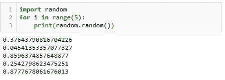
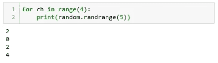
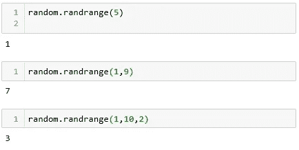
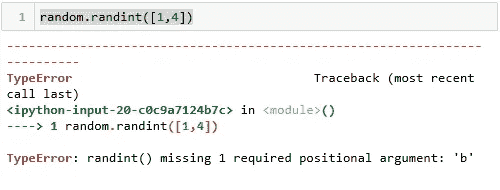
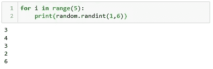
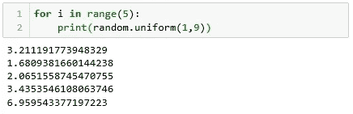
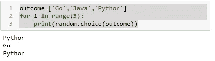

# python 中的随机函数

> 原文：<https://medium.com/analytics-vidhya/random-function-in-python-55bce40a4a48?source=collection_archive---------16----------------------->

克里斯里德在 [Unsplash](https://unsplash.com?utm_source=medium&utm_medium=referral) 上的照片

python 中有很多可用的模块，但其中一个是 ***随机*** 。*随机模块是用来生成一个**伪随机数。* ***随机*** 模块由不同的内置函数组成，但我们在本帖中了解到一些使用最广泛的 ***随机*** 函数。**

1.  *****随机()*****

**生成 ***伪随机浮点数，*** random()方法返回在**【0，1】**范围内但不包括 1 和 0 的浮点数。它不接受任何位置参数。**

****语法** - *random.random()***

****

**随机. random()**

***2。****rand rang()*****

**它选择一个整数并定义中间的范围，它将返回一个<=value< b, It can take more than one argument.**

*****语法-****random . rand range(start，stop [，step])***

****

**单参数随机范围函数**

****

**具有多个自变量的随机范围函数**

*****3。random.randint()*****

**它在指定的限制内生成随机数。list 对象不能在 ***randint()*** 中使用，它需要两个位置参数，当我们知道开始和结束值时使用。它将返回**a<=值< = b****

****语法** - *random.randint(a，b)***

****

***使用列表对象*时出错**

****

**random.randint()**

*****4。random.uniform()*****

*****uniform()*** 生成一个大于等于起始数且小于等于终止数的随机浮点数。它还需要两个位置参数。**

*****语法*** - *(开始，停止)***

****

**随机.统一()**

*****5。random.choice()*****

**当我们想在一个给定的范围或列表中随机选择一个项目或一些可重复的项目时，我们使用这个函数。python 版本 3.6 中引入的选择函数，它可以重复元素。**

*****Syntex*-*random . choice(****our choice****)*****

****

**random.choice()**

**我想你会喜欢这篇文章的，如果你发现了一些与这篇文章相关的好的策略，请在评论中告诉我们。谢谢大家！**

**享受学习！！！**