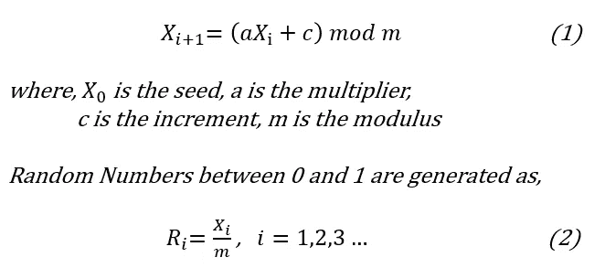
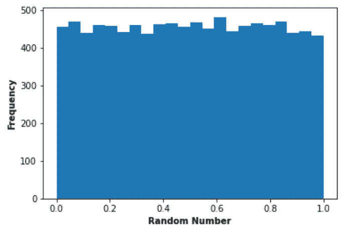
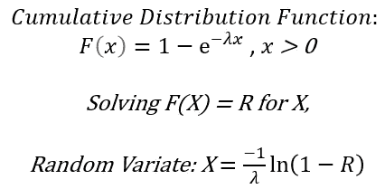
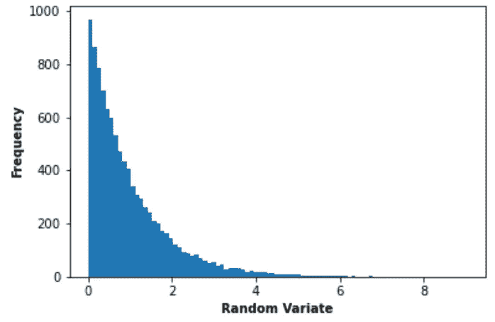
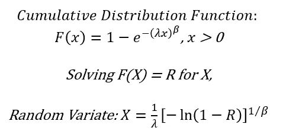
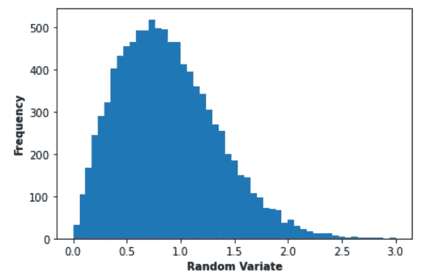

# 随机数生成和随机变量生成

> 原文：<https://medium.com/analytics-vidhya/random-number-generation-and-random-variate-generation-6961f70b6ea5?source=collection_archive---------12----------------------->


授权图片:[来源](https://stock.adobe.com/in/search?filters%5Bcontent_type%3Aphoto%5D=1&filters%5Bcontent_type%3Aillustration%5D=1&filters%5Bcontent_type%3Azip_vector%5D=1&filters%5Bcontent_type%3Avideo%5D=1&filters%5Bcontent_type%3Atemplate%5D=1&filters%5Bcontent_type%3A3d%5D=1&filters%5Binclude_stock_enterprise%5D=0&filters%5Bis_editorial%5D=0&filters%5Bfree_collection%5D=0&filters%5Bcontent_type%3Aimage%5D=1&k=random+numbers&order=relevance&safe_search=1&limit=100&search_page=1&search_type=pagination&get_facets=0&asset_id=318487428)

R 随机数广泛应用于统计和数据科学领域，因此统计学家或数据科学家应该了解随机数是如何产生的。

# 随机数生成技术；

1.  线性同余法；



等式 1 产生数字 X1，X2…介于 0 和 m-1 之间。

等式 2 产生 0 和 1 之间的随机数。

# **举例**

使用以下标准生成 10，000 个随机数:

m = 16384，c = 83，a = 29，Xo = 24

```
# Python Programming Language Code# Import pandas
import pandas as pd# Import numpy
import  numpy as np# Import maptplotlib
import matplotlib.pyplot as plt
%matplotlib inlinem = 16384 # modulus
c = 83 # increment
a = 29 # multiplier
X_0 = 24 # Seed
random_numbers = []# Generating 10,000 random numbers
for i in range(10000):
    X = (a * X_0 + c) % m
    X_0 = X
    R = X / m
    random_numbers.append(R)

# Plot histogram of the generated random numbers
plt.hist(random_numbers,bins='auto')
plt.xlabel('Random Number', fontweight ='bold')
plt.ylabel('Frequency', fontweight ='bold')
plt.show()
```



从上面的直方图可以看出，生成的随机数非常类似于 0 和 1 之间的均匀分布。

随机变量对应于从分布中生成样本。这里演示了连续分布(如指数分布和威布尔分布)的随机变量生成。

# 指数分布



这里，R 是预期已经产生的随机数。

# 例子

使用以下标准生成 10，000 个随机变量:

已经产生的随机数将作为 R 的输入，λ= 1

```
# Exponential Distribution random variates
exponential_random_variates = []
Lambda = 1
for i in range(10000):
    R = -1/(Lambda) * np.log (1 - random_numbers[i])
    exponential_random_variates.append(R)

# Plot histogram of the generated random variates
plt.hist(exponential_random_variates,bins='auto')
plt.xlabel('Random Variate', fontweight ='bold')
plt.ylabel('Frequency', fontweight ='bold')
plt.show()
```



从上面的直方图可以看出，产生的随机变量非常类似于指数分布。

# 威布尔分布



这里，R 是预期已经产生的随机数。

# 例子

使用以下标准生成 10，000 个随机变量:

已经生成的随机数将作为输入 r，λ= 1，β= 2。

```
# Weibull Distribution random variates
weibull_random_variates = []
beta = 2
Lambda = 1for i in range(10000):
    R = pow((-1 * np.log (1 - random_numbers[i])),(1/beta))/Lambda
    weibull_random_variates.append(R)

# Plot histogram of the generated random variates
plt.hist(weibull_random_variates,bins='auto')
plt.xlabel('Random Variate', fontweight ='bold')
plt.ylabel('Frequency', fontweight ='bold')
plt.show()
```



从上面的直方图可以看出，生成的随机变量非常类似于威布尔分布。