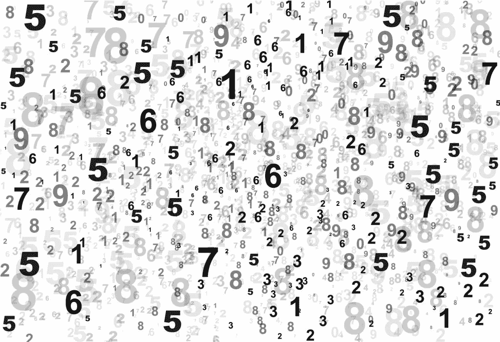
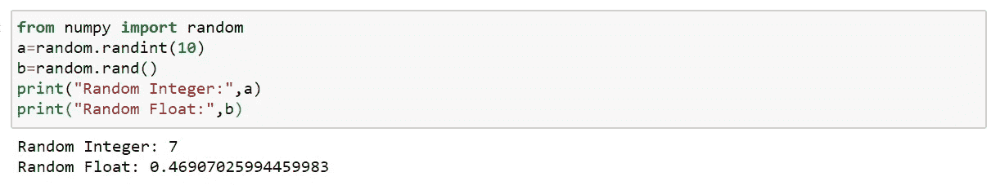
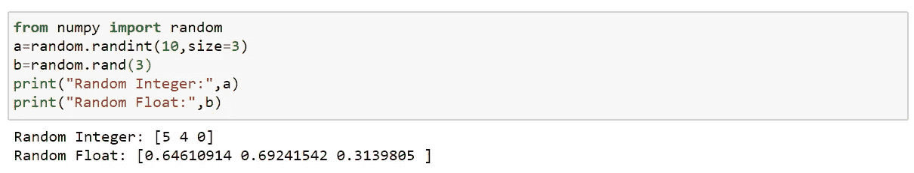
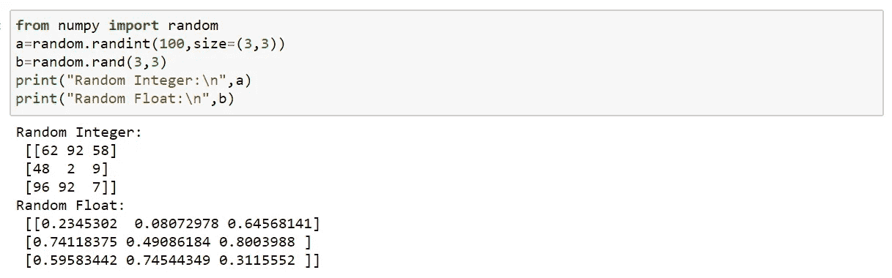
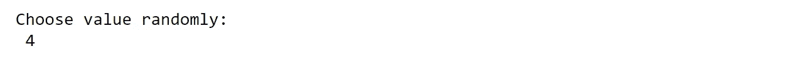
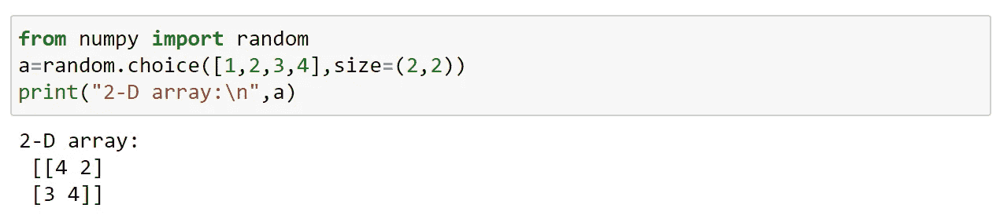
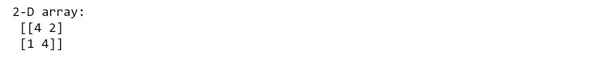

# Numpy 中的随机数

> 原文：<https://medium.com/analytics-vidhya/random-numbers-in-numpy-29e929f16c70?source=collection_archive---------29----------------------->

## 什么是随机数？

每次都不一样的数叫随机数？？？

不……然后呢？？🤔

随机数是逻辑上无法预测的数字。

计算机在程序上工作，而程序是一组指令，这意味着必须有某种算法来生成随机数。如果有一个程序来产生随机数，它是可以预测的，因此它不是真正的随机。这些被称为伪随机数。

Python 的 random 模块是伪随机的。

## Numpy 随机

Numpy 有随机模块来处理随机数。

这些随机数可以用整数或浮点数生成。

**生成随机数:**

对于整数；我们使用 randint()

对于 float 我们使用 rand()，返回一个介于 0 和 1 之间的随机浮点数。

示例 1:

生成一个数字；

示例 2:

在一维数组中生成多个随机值；

示例 3:

在多维数组中生成多个随机值；

**从数组中生成随机数:**

要从数组中随机生成一个值，我们可以使用 choice()。

choice()将 array 作为参数，随机返回其中一个值。

示例:

从数组中生成一个随机数；

再次跑步；

我们还可以使用 size 参数来表示数组的大小(形状)。

示例:

从数组生成随机二维数组；

再次跑步；

就这样，我们来到了这篇文章的结尾。

快乐编码…😊😊😊