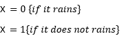
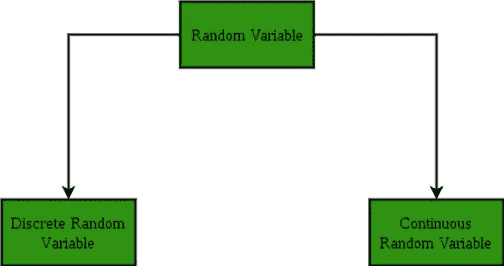
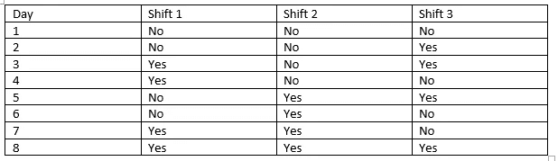
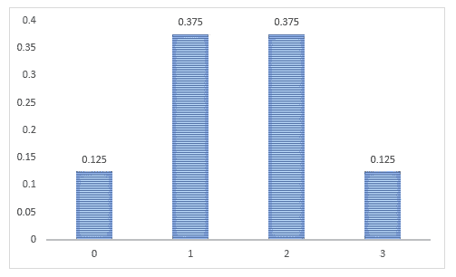
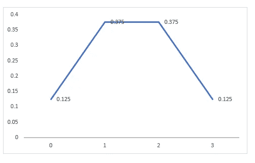
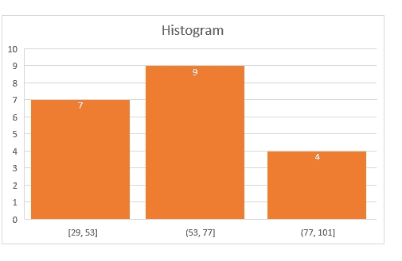
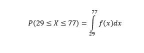

# 随机变量

> 原文：<https://medium.com/analytics-vidhya/random-variable-4b26b57667de?source=collection_archive---------14----------------------->

统计学的基本概念之一是随机变量。那么，什么是随机变量？随机变量将事件的结果与一个数字联系起来。我们举个例子。x 是变量，如果下雨，取值为 0，否则取值为 1。

统计学下的随机变量和代数下的变量大不相同。在代数中，变量不能一次取一个以上的值，而在统计中，随机变量可以从整组值中取值。随机变量下的每个值都有概率。

*随机变量的类型*

有两种基本随机变量

a)离散随机变量

b)连续随机变量

a)离散随机变量-在离散随机变量的情况下，可以列出与结果相关的值。它有一组特定的值。

b)连续随机变量-在连续随机变量的情况下，变量取值范围可以是有限的，也可以是无限的。

*构建随机变量的概率分布*—

随机变量的概率分布描述了随机变量的结果的概率分布。

我们举个例子。假设你喜欢打羽毛球。你经常练习它。下面给出了你 8 天练习的数据。你的练习在一天内被隔离了三次。“否”表示不打羽毛球，“是”表示打羽毛球。x 是一个随机变量，表示打羽毛球的次数。

P(X=0) =1/8

P(X=1) = 3/8

P(X=2) = 3/8

P(X=3) = 1/8

将 X(随机变量)的概率标绘在 Y 轴上，将 X 值或结果标绘在 X 轴上，我们得到离散随机变量 X 的概率分布。离散随机变量的概率分布称为概率质量函数。

注意，为了获得精确的概率模型，概率的总和应该等于 1，并且概率不应该是负的。

离散概率分布的一些例子是伯努利分布、二项式分布、泊松分布等。

注意，在离散随机变量的情况下，概率分布由**概率质量函数**定义。

在连续随机变量的情况下，概率分布由**概率密度函数**定义。密度函数不能直接给出随机变量取特定值的概率。通过对区间进行积分，我们得到了连续随机变量下给定区间的概率。对于连续的随机变量，取每个值并计算它的概率是没有意义的，因为它有很大的取值范围。

例如，我们有关于重量的数据，这是一个连续变量，因此寻找每个点的概率没有多大意义。为了求出概率，应该取这个区间。数据已显示在柱状图中。

为了得到该值的概率，应该在区间内进行积分。例如，如果我们想知道体重落在 77 和 29 之间的概率，那么概率密度函数将被定义为-

函数 f(x)称为概率密度函数(pdf)。

连续随机变量的概率密度函数 f(x)类似于离散随机变量的概率质量函数 p(x)。这里有两个重要的区别:

1.与概率质量函数 p(x)不同，pdf f(x)不是概率。你必须积分才能得到概率。

2.因为 f(x)不是概率，所以 f(x)小于或等于 1 没有限制。

连续概率分布的一些例子是正态分布、指数分布、贝塔分布等。

希望我的文章能帮助你对随机变量有更清晰的认识。我将继续我的文章，进一步介绍累积分布函数和常用的各种分布。

感谢您阅读我文章。请随时分享您对[ushmi2015@gmail.com](mailto:ushmi2015@gmail.com)的宝贵反馈。

*如果你想阅读我未来的帖子，只需“连接”或“关注”。*