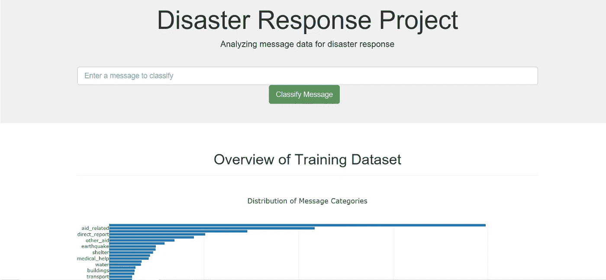
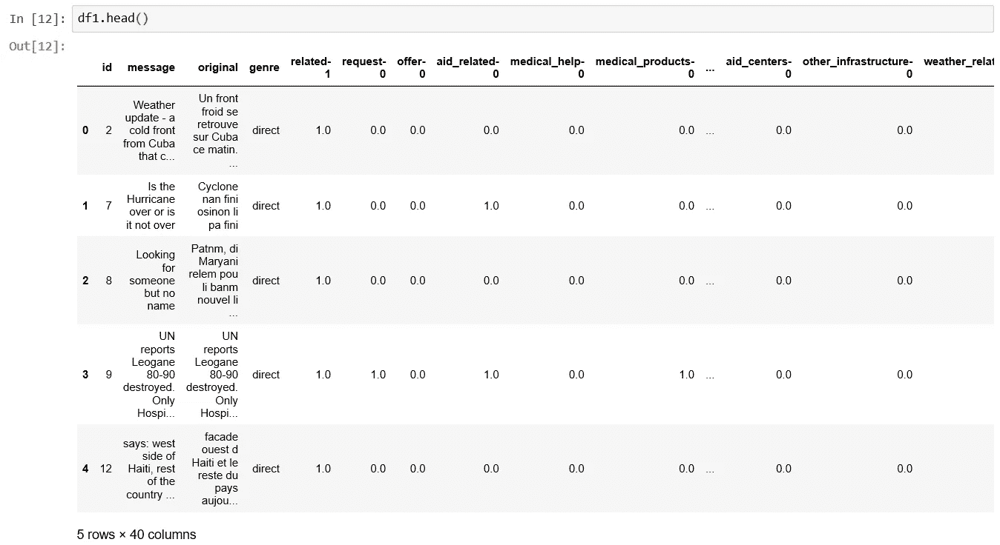
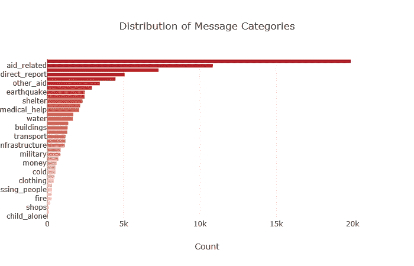
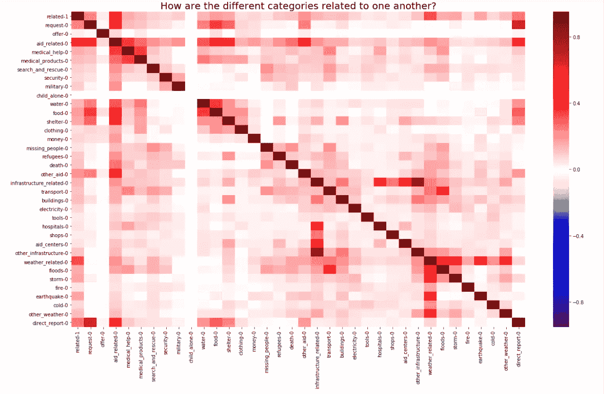
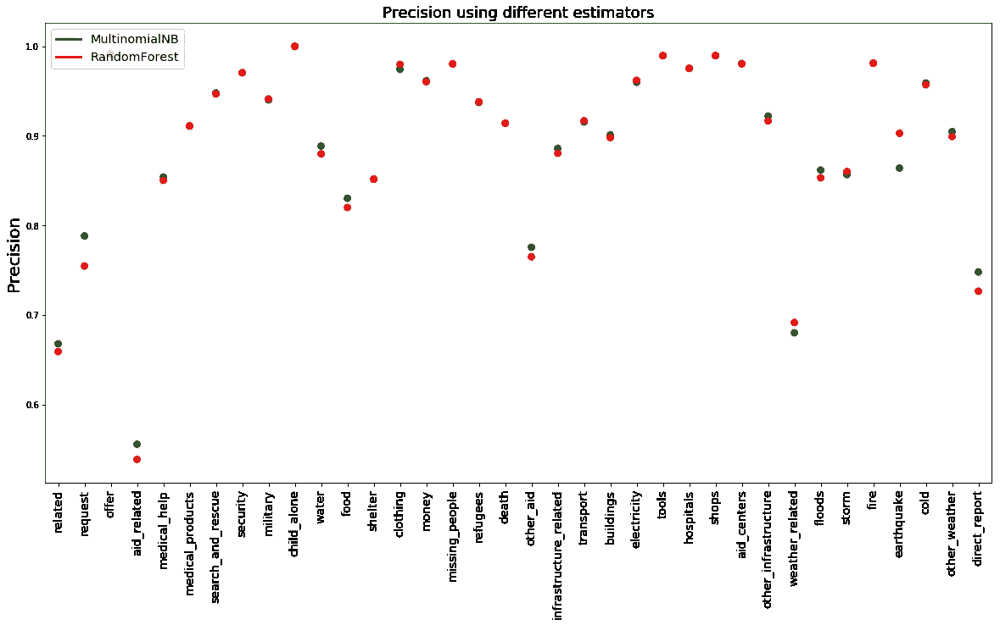

# 多输出自然语言分类问题中随机森林分类器与多项式朴素贝叶斯的比较

> 原文：<https://medium.com/analytics-vidhya/randomforest-classifier-vs-multinomial-naive-bayes-for-a-multi-output-natural-language-2426381a5217?source=collection_archive---------6----------------------->



# 简介:

自然语言处理(NLP)是当今最令人兴奋的人工智能(AI)技术之一，广泛应用于各行各业。文本识别和分类问题在数据科学家中很流行。科学家经常发现很难选择正确的机器学习模型来用于文本分类问题。

因此，这篇文章试图比较两种流行的机器学习技术在多输出文本分类问题中的性能:*随机森林分类器和 ***多项朴素贝叶斯*** 分类器。这两个模型分别应用于灾难期间接收的消息的多输出分类，目的是预测消息可能属于的类别。*

*使用的数据集来自*‘图 8’*，包括两个。csv 文件:一个 *'message.csv'* 文件和一个 *'categories.csv'* 文件。 *'message.csv'* 数据包含列: *message* (灾难期间收到的原始消息) *message_id* 、*流派*(无论是社交媒体、新闻还是直接文本消息)，而 *'categories.csv'* 包含 *message_id* 以及消息所属的不同类别。部分类别包括:*医疗相关*、*搜救、* *请求帮助*、*军事*等。，有 36 个可能的类别。这两个数据集经过[清理和预处理](https://github.com/cjayidoko/DisasterResponsePipeline/blob/master/ETL%20Pipeline%20Preparation.ipynb)以获得用于模型准备和构建的数据框架。*

****

***消息类别分布***

# ***特色工程:***

*作为模型构建的一部分，必须对收到的每一条信息进行处理，并从中提取重要的特征。编写了一个函数 [tokenize](https://github.com/cjayidoko/DisasterResponsePipeline/blob/master/train_classifier1.py) ，它将对任何给定的句子应用所有必要的文本处理技术。这些技术包括:*

***规范化:**——基本上是把所有字母都转换成小写字母，同时去掉标点符号。

**记号化:** —将每个文档/行/句子分解成记号或单词，并返回所有记号的列表

**【词汇化:** —将动词带到它们各自的动词根并去除空格，最后

**去除停用词:** —包括去除在记号化文档中找到的称为停用词的单词包中包含的所有不必要的单词。因此，tokenize 函数为每条消息返回一个经过所有处理阶段的单词列表。此外，使用以下技术提取重要特征:*

****计数矢量器:*** —它将为所有单词创建一个矩阵，并为单词

***的单次出现分配 1，为未出现分配 0，术语频率—逆术语频率(TFIDF)转换器:*** —它将返回每个单词的归一化/转换形式，包括术语频率乘以逆文档频率。*

*在特征提取阶段结束时，自变量(消息)处于矩阵形式。而因变量是数据集中所有 36 个类别的 1 和 0 的矩阵，两者都已准备好进行一些建模。*

**

***使用 seaborn 热图的类别相似度***

# ***模型构建:***

*为了训练用于文本分类的机器学习模型，设计了一种流水线，该流水线将应用上述所有需要的变换以及每个估计器的多输出分类。因为目标是比较两种机器学习技术的性能，所以估计器被单独应用于模型:“模型 1”- **随机森林**分类器和‘模型 2’——**多项式 NB** 。*

```
*#estimator = RandomForestClassifier()
 estimator = MultinomialNB()
 pipeline = Pipeline([
 	(‘transformer’, Pipeline([
 		(‘vect’, CountVectorizer(tokenizer = tokenize)),
 		(‘tfidf’, TfidfTransformer())
 	])),
 	(‘clf’, MultiOutputClassifier(estimator))
 ])*
```

*建立了网格搜索，该网格搜索将通过所提供的所有不同参数来运行机器学习管道，以找到每个模型的最佳性能参数，之后将其用于训练模型。看一看所使用的参数和网格搜索，以及每种方法中选出的最佳表现。*

```
*parameters = { 
 	‘transformer__vect__max_features’: [5000, 3000, 1000],
 	‘transformer__vect__ngram_range’: ((1,1),(1,2)),
 	‘transformer__tfidf__use_idf’: (True, False)
 	}
 #Using RandomForestClassifier:
 model1 = GridSearchCV(pipeline, param_grid = parameters)
 model1.fit(X_train,Y_train)

 #Using Multinomial Naive Bayes:
 model2 = GridSearchCV(pipeline, param_grid = parameters)
 model2.fit(X_train,Y_train)`*
```

**其中‘X _ train’和‘Y _ train’分别是自变量和因变量的训练数据集(给定数据集的 80%)。参数包括****【max-features】****，这是对* ***计数矢量器*** *、* ***、【n-gram range】****是用于决定如何将单词组合并一起分析的范围，以及****【use-IDF】****用于**

***最佳表现:***

```
*model1.best_params_ 
 		{‘transformer__tfidf__use_idf’: False,
 		‘transformer__vect__max_features’: 1000,
 		‘transformer__vect__ngram_range’: (1, 2)}
model2.best_params_ 
 		{‘transformer__tfidf__use_idf’: False,
 		‘transformer__vect__max_features’: 1000,
 		‘transformer__vect__ngram_range’: (1, 1)}*
```

# *结果:*

*结果显示用于 ***RandomForest*** 分类器的最佳参数包括:***use _ IDF***as**False**这意味着仅使用 ***tf-idf*** 矢量器中的术语频率，并且将仅取决于文档中给定单词的密度，而不会消除过多使用该单词的影响， ***max_features*** 为 **1000** 是测试的 ***max_features*** 参数中最小的一个数， ***n_gram range*** 为 **1-2** ，会优先选择最多两个字的组合。 ***多项式*** 返回的最佳参数与 ***RandomForest*** 相同，只是单字计数的 ***n_gram range*** 不同。
进一步地，模型被用于对测试数据进行预测，并且两个模型的性能指标被比较。编写了一个 [evaluate_model](https://github.com/cjayidoko/DisasterResponsePipeline/blob/master/train_classifier1.py) 函数，该函数将接受*data frame、y_pred* 、 *y_test* 和*列标签*，并返回一个重要得分指标的数据帧，例如给定类别的*f1-得分*、*准确度*、*精度*和*召回*。在评分标准中， *precision* 似乎是在这种情况下选择两个模型中最佳性能的最佳标准。这在很大程度上是基于这样一个事实，即它衡量的是一个模型只检测相关实例(这里是 1)的能力。此外，由于 precision 是真阳性与真阳性预测和假阳性预测之和的度量，使用它将有助于最大限度地减少假阳性，从而最大限度地减少对灾难类别的错误预测。下面显示了 precision 所示的两个模型的性能对比图。*

**

***车型性能对比***

# *讨论:*

*性能图表明 ***RandomForest*** 分类器对于像这样的多输出分类问题中的大部分类别会表现得更好。这是假设默认的 10 棵树。[如果增加树的数量可以带来更好的性能](https://www.researchgate.net/post/How_to_determine_the_number_of_trees_to_be_generated_in_Random_Forest_algorithm)，那么相信进一步的网格搜索可能会产生针对该问题的 ***RandomForest*** 分类器的更高性能。此外， ***朴素贝叶斯*** 模型似乎对于具有更多训练数据大小的类别表现得更好，例如:“与援助相关的”、“直接报告”、“水”、“与医疗相关的”。*

*模型的应用也为建立机器学习模型提供了不同的思路。虽然对于具有较大训练数据大小的类别，精度值显得较低，但是可以看出，模型似乎更准确地预测了这些类别。例如，对诸如“*我们的房子正遭到枪击，我们听到炸弹落下的声音”*的文本的预测将准确地返回**军事**作为类别，而文本“*随着事情的发展，我们的房子将被夷为平地，火不会在此停止”*将不会返回**火**作为适当的类别。查看[笔记本](https://github.com/cjayidoko/DisasterResponsePipeline/blob/master/ML%20Pipeline%20Preparation.ipynb)了解更多相关信息。*

# ***结论和建议:***

*这篇文章已经能够展示在文本的多输出分类中利用 ***RandomForest*** 分类器和 ***朴素贝叶斯*** 分类器的测试案例。结果可以总结如下:*

*1.在机器学习模型中使用网格搜索总是有助于选择最佳参数。然而，这可能很耗时。这种搜索显示:a .在 *1000* 、 *3000* 和 *5000* 和
中选择 *1000* 作为**、*计数矢量器*、
中的*max _ feature*b .在**、 *Tfidf-transformer* 、**
中最好不要使用逆文档频率***

*2. ***RandomForest*** 分类器在可用训练数据较少的情况下会在多输出分类中给出更好的性能，而 ***多项朴素贝叶斯*** 在测试样本量较大的情况下会表现得更好。*

*3.训练数据越大，机器学习模型在识别类别时就越准确，但并不转化为性能度量值的增加。*

*进一步的工作将比较两个模型的*召回*和*f1-得分*，以查看相关预测数量和所有相关预测之间的权衡是否能够提供关于模型性能的进一步见解。此外，在 RandomForest 分类器上进行网格搜索将有助于选择性能最佳的特征。*

*要了解更多关于这项工作和用机器学习模型构建的 web 应用程序的信息，请查看 GitHub 知识库[这里](https://github.com/cjayidoko/DisasterResponsePipeline)*

***关于作者:***

*Chijioke Idoko 拥有物理学学士学位和地球物理学硕士学位。在本文发表时，他正在完成 Udacity 的数据科学纳米学位。他在计算建模方面拥有丰富的经验，并在科学期刊上发表过同行评审的论文。*

*在 LinkedIn 上联系他[这里](https://www.linkedin.com/in/chijioke-idoko-b14135a4/)*