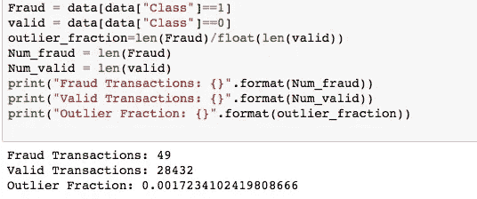

# RandomForestClassifier 与 IsolationForest 和 LocalOutlierFactor 用于信用卡欺诈检测

> 原文：<https://medium.com/analytics-vidhya/randomforestclassifier-vs-isolationforest-and-localoutlierfactor-for-credit-card-fraud-detection-df43e6140915?source=collection_archive---------11----------------------->

## 在本文中，我将讨论如何使用 IsolationForest 和 LocalOutlierFactor 以及 RandomForestClassifier 来预测异常点。


图片鸣谢:(https://dale-peterson.com)

## 隔离森林:

该算法用于异常检测，它将数据集中出现的异常点与正常点隔离开来。它遵循递归分区，使用一种称为隔离树的树结构。

**localooutlierfactor:**

该算法也用于异常检测。它基于依赖于 k 近邻的局部密度，比较对象与其近邻的局部密度，并在此基础上检测离群点。

让我们应用这两种算法来检测欺诈信用卡交易。我将使用 kaggle 上的信用卡欺诈检测数据集。

你可以从 kaggle 下载 creditcard.csv 数据集。([这里是这个的链接。](https://www.kaggle.com/mlg-ulb/creditcardfraud))

本文中使用的代码可以在这个 [github 资源库](https://github.com/pratikmishra356/ML-Credit_Card_fraud_detection)中找到。让我们首先导入必要的包。

```
**import** **numpy** **as** **np**
**import** **pandas** **as** **pd**
**import** **matplotlib.pyplot** **as** **plt**
**import** **seaborn** **as** **sns**
**from** **imblearn.over_sampling** **import** SMOTE
**from** **sklearn.ensemble** **import** IsolationForest
**from** **sklearn.neighbors** **import** LocalOutlierFactor
**from** **sklearn.ensemble** **import** RandomForestClassifier
**from** **sklearn.model_selection** **import** train_test_split
**from** **sklearn.metrics** **import** classification_report,accuracy_score
```

## ***数据可视化:***

```
print(data.shape)
data.head(3)
#this will show (28481, 31).
```

它包含一个名为 **Class** 的列，显示事务的类型。它基本上有两个等级“0”代表有效，而“1”代表欺诈交易。让我们看看这两个类在这个数据集中的分布。



如上图所示，欺诈交易的数量远低于有效交易的数量。

让我们定义一个分类器并实现这两个算法

```
classifiers = {
    "IsolationForest":IsolationForest(max_samples=len(X),
                                     contamination = outlier_fraction,random_state=1),
    "Local Outlier Factor":LocalOutlierFactor(
    n_neighbors=20,
    contamination = outlier_fraction)
}n_outliers=len(Fraud)

**for** i,(model_name,model) **in** enumerate(classifiers.items()):

    **if** model_name=="Local Outlier Factor":
        y_pred = model.fit_predict(X)
        scores_pred = model.negative_outlier_factor_
    **else**:
        model.fit(X)
        scores_pred=model.decision_function(X)
        y_pred=model.predict(X)
*#0 for valid and 1 for Fraud* 
    y_pred[y_pred==1]=0
    y_pred[y_pred==-1]=1

    n_errors=(y_pred!=Y).sum()

    print("**{}**: **{}**".format(model_name,n_errors))
    print(accuracy_score(Y,y_pred))
    print(classification_report(Y,y_pred))
```

看看他们的预测准确度。

```
IsolationForest: 71
0.99750711000316
              precision    recall  f1-score   support

           0       1.00      1.00      1.00     28432
           1       0.28      0.29      0.28        49

    accuracy                           1.00     28481
   macro avg       0.64      0.64      0.64     28481
weighted avg       1.00      1.00      1.00     28481

Local Outlier Factor: 97
0.9965942207085425
              precision    recall  f1-score   support

           0       1.00      1.00      1.00     28432
           1       0.02      0.02      0.02        49

    accuracy                           1.00     28481
   macro avg       0.51      0.51      0.51     28481
weighted avg       1.00      1.00      1.00     28481
```

我们可以看到**的精度是 0.99** ，但是我们知道，在这种异常检测数据集中，精度并不重要，我们必须考虑精度和召回率。我们可以看到，虽然 IsolationForest 的性能优于 LocalOutlierFactor，但两者对于欺诈交易的精确度和召回率都**非常低**，这表明这两种算法无法将异常点与正常点隔离开来。

正如我们所知，这个数据集是高度不平衡的，它有 0.001 离群分数。因此，我们将使用 SMOTE 对此数据执行过采样。

```
sm = SMOTE(sampling_strategy='minority', random_state=7)
x_imbtrain,x_imbtest,y_imbtrain,y_imbtest = train_test_split(X,Y,test_size=0.2)
oversampled_X, oversampled_Y = sm.fit_sample(x_imbtrain,y_imbtrain)
```

这里的' **imb'** 在名称上表示不平衡的数据，我已经将其分离出来用于进一步的预测。

让我们再次对这个过采样的数据应用 IsolationForest 和 LocalOutlierFactor。这是对这两种算法的预测。

```
IsolationForest: 22822
0.4982632018643099
              precision    recall  f1-score   support

           0       0.50      1.00      0.67     22743
           1       0.00      0.00      0.00     22743

    accuracy                           0.50     45486
   macro avg       0.25      0.50      0.33     45486
weighted avg       0.25      0.50      0.33     45486

Local Outlier Factor: 22796
0.4988348063140307
              precision    recall  f1-score   support

           0       0.50      1.00      0.67     22743
           1       0.16      0.00      0.00     22743

    accuracy                           0.50     45486
   macro avg       0.33      0.50      0.33     45486
weighted avg       0.33      0.50      0.33     45486
```

我们可以看到，不仅精度和召回率，而且准确性也非常低，这是显而易见的，因为这些算法用于异常检测，并且我们拥有的不平衡数据集包含相同数量的欺诈和有效交易。

现在，我们将对这个过采样平衡数据集应用 RandomForestClassifier，并看看它在这个数据集上的表现如何。

```
x_train,x_test,y_train,y_test = train_test_split(oversampled_X,oversampled_Y,test_size=0.2)

rf = RandomForestClassifier(n_estimators=100,max_depth=10,random_state=1)
rf.fit(x_train,y_train)
y_predict = rf.predict(x_test)

print(accuracy_score(y_test,y_predict))
print(classification_report(y_test,y_predict)) #result0.9996702571993845
              precision    recall  f1-score   support

           0       1.00      1.00      1.00      4533
           1       1.00      1.00      1.00      4565

    accuracy                           1.00      9098
   macro avg       1.00      1.00      1.00      9098
weighted avg       1.00      1.00      1.00      9098
```

**我们可以看到，RandomForestClassifier 表现良好，对于两种类型的事务，** **的准确度为 0.99，精确度和召回率为 1.00。**

乍一看，它似乎过拟合，因此我们在为测试目的(x_imbtest，y_imbtest)而分离的不平衡数据集上进行预测。

```
0.9992978760751272
              precision    recall  f1-score   support

           0       1.00      1.00      1.00      5689
           1       0.83      0.62      0.71         8

    accuracy                           1.00      5697
   macro avg       0.92      0.81      0.86      5697
weighted avg       1.00      1.00      1.00      5697
```

我们可以看到，它以 0.83 的精度和 0.62 的召回率预测了 8 个欺诈交易中的 7 个。

> **结论:**

*虽然 IsolationForest 和 LocalOutlierForest 用于异常检测，但是我们可以通过过采样数据和使用 RandomForestClassifier* **来检测异常点。**

有反馈给我吗？随意评论。可以在 [**LinkedIn 联系我。**](https://www.linkedin.com/in/pratik-mishra-661005166/)