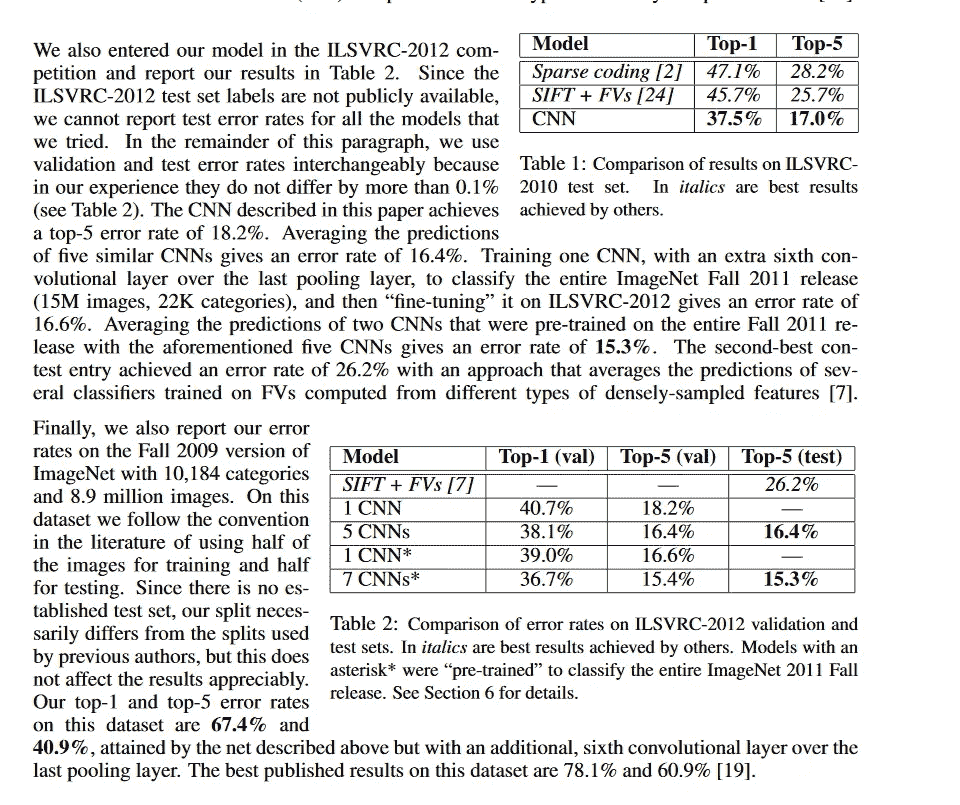

# 分级准确度

> 原文：<https://medium.com/analytics-vidhya/ranked-accuracy-11bdaef795e3?source=collection_archive---------3----------------------->

由[纸杯蛋糕媒体](https://unsplash.com/@thecupcakemedia?utm_source=medium&utm_medium=referral)在 [Unsplash](https://unsplash.com?utm_source=medium&utm_medium=referral) 上拍摄的照片

简单来说，**rank accuracy**只是一个概念的集合( **rank-1** 、 **rank-5** 、 **rank-N** )来衡量一个神经网络模型的准确度，术语多用于计算机视觉文献和研究论文中。也可称为**前 1** 、**前 5** 精度。

示例:

摘自 Geoffrey Hinton、Ilya Sutskever、Alex Krizhevsky 的《使用深度卷积神经网络的 ImageNet 分类》。

**一级精度**:

当我们把我们的输入图像给一个神经网络结构时，我们将通过类别标签接收一系列概率。

摘自 python——Adrain rose Brock 的《计算机视觉的深度学习》

现在，根据等级 1 的准确性，我们必须检查预测标签与地面标签相同的次数的百分比。本质上就是我们常识中所说的准确。

**算法**:

1.  初始化分数变量
2.  从模型中获取给定图像的标签预测
3.  确定基本事实标签是否与最可能得分的标签相同。如果是，则递增 score 变量。
4.  清点 val/测试集中的所有图像，并重复步骤#2
5.  计算分数/图片数量，你会得到 1 级的准确性

五级精度:

当有许多类别标签时，通常使用 5 级精度。

这是对等级 1 精度的扩展，其中不是检查最可能的类标签是否等于基础事实标签，而是检查基础事实标签是否在前 5 个最可能的**标签中。**

**算法:**

1.  初始化分数变量
2.  从模型中获取给定图像的标签预测
3.  按照值的降序对预测数组进行排序。
4.  确定基本事实标签是否在前 5 个最可能的标签中。如果是，则递增 score 变量。
5.  清点 val/测试集中的所有图像，并重复步骤#2
6.  计算分数/图片数量，你会得到 5 级的准确性

在 **Rank-N** 精度中，你将确定 N，为公制。

由于秩 5 比秩 1 更“宽松”，因此它主要在较大的数据集中报告，以使模型在本质上更“通用”。