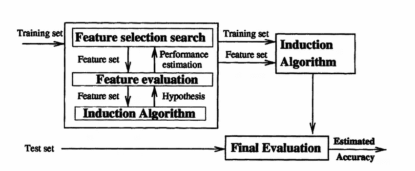
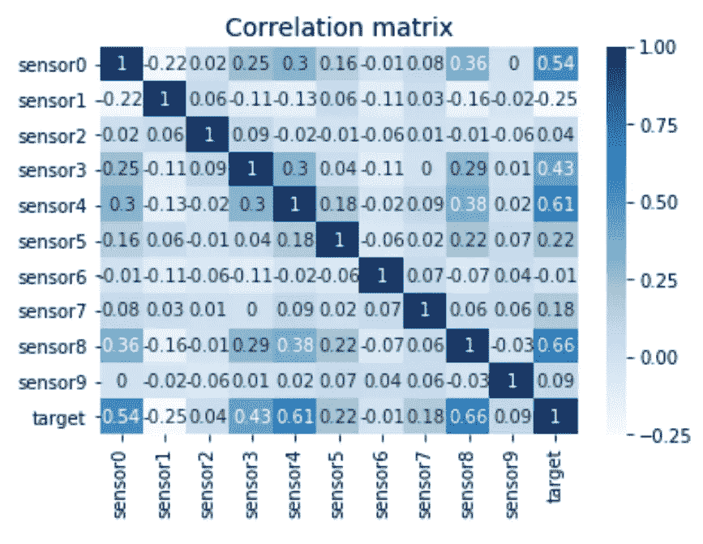
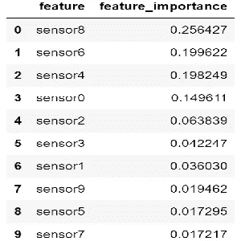
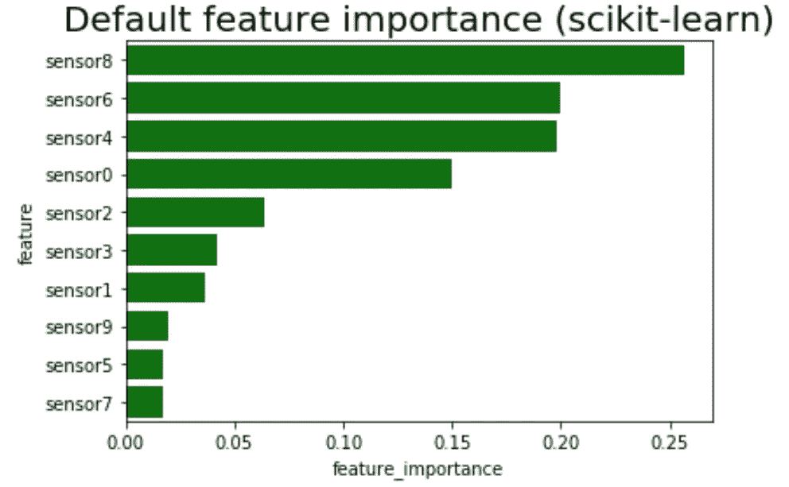
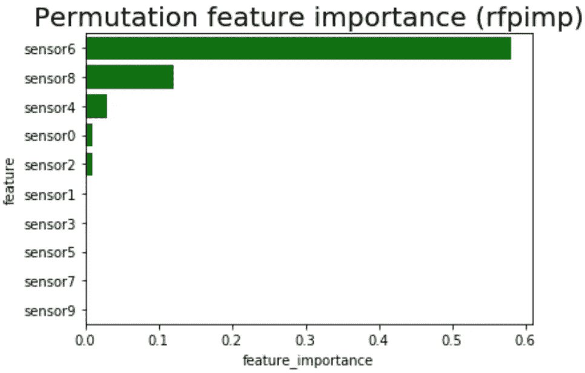
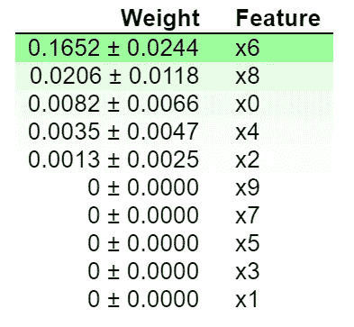
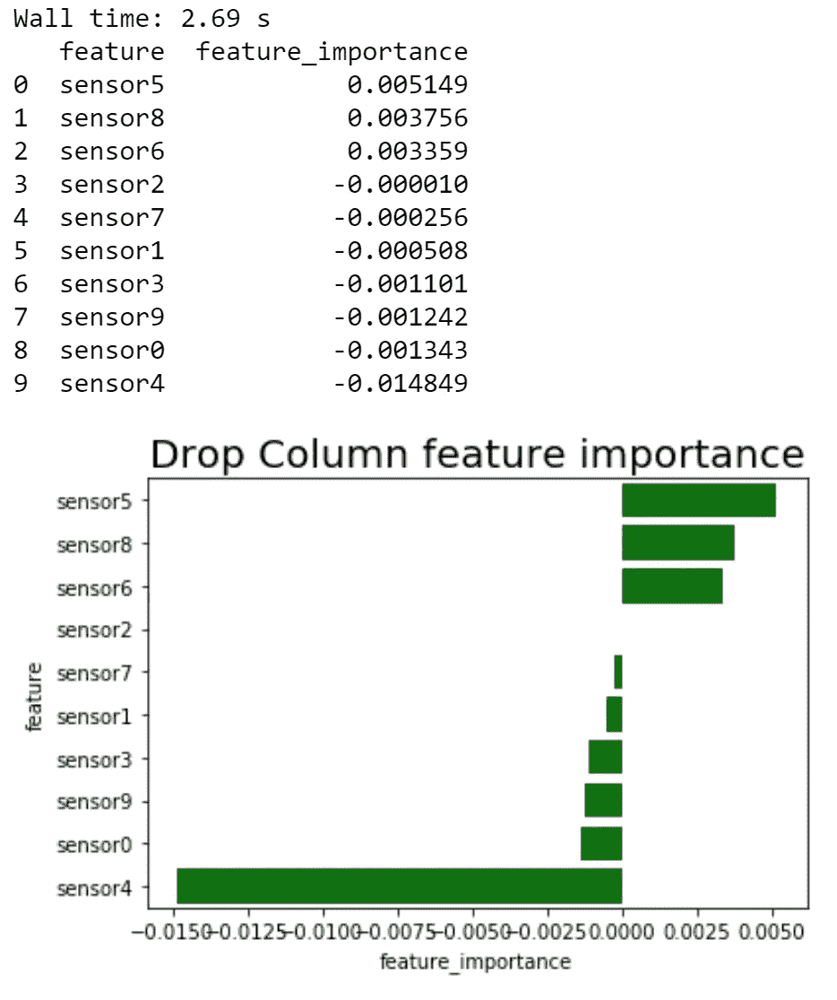
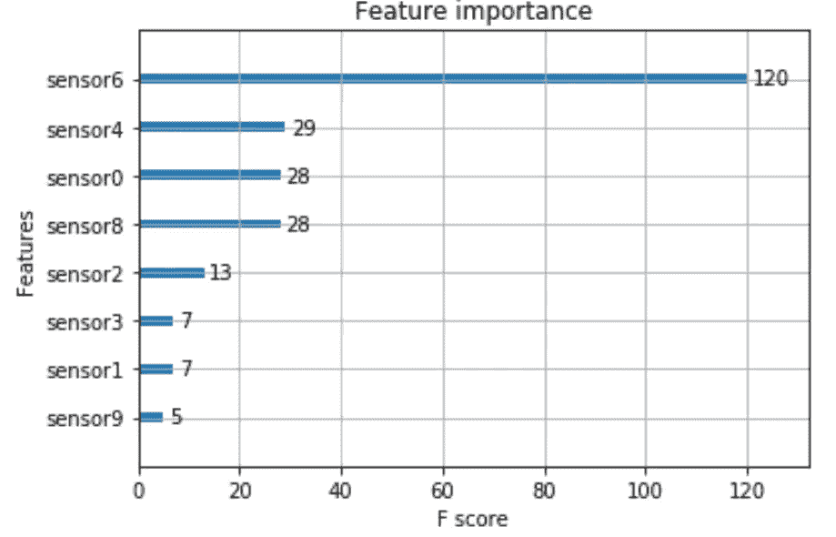

# 基于类别标签的预测能力/重要性对特征进行分级

> 原文：<https://medium.com/analytics-vidhya/ranking-features-based-on-importance-predictive-power-with-respect-to-the-class-labels-of-the-25afaed71e90?source=collection_archive---------5----------------------->



来源:[研究之门](https://www.researchgate.net/publication/2914163_Feature_Selection_for_Support_Vector_Machines_by_Means_of_Genetic_Algorithms)

人工智能正被用于许多行业，以解决各种挑战。最近，我遇到了一个这样的挑战，我们试图用以下方式解决它:

**问题陈述:**我们得到了 400 个人工生成的传感器数据样本，其中每个样本有 10 个不同的传感器读数可用。样本被分成两类，其中类标签为 1 或-1。类别标签定义了特定样本属于哪个特定类别。我们将通过解决以下问题来解决问题 *:*

> *首先，我们将了解您是如何得出这一解决方案的？
> *人工生成的数据集有哪些属性？
> *这种方法有什么长处。为什么会产生合理的结果？
> *你的方法有什么弱点。这种方法什么时候会产生不准确的结果？
> *就特征和/或样本数量而言，我们的方法的可扩展性如何？
> *什么是替代方法及其各自的优点、缺点和可扩展性？

根据问题陈述，重点是识别机器学习模型中特定特征的重要性。这是一个分类问题，其中我们需要识别重要的特征，并且我们需要通过展示为什么我们选择了一个特定的特征以及它是如何变成一个重要的特征来证明原因。识别重要特征非常重要，原因如下:
1。这将有助于我们通过关注重要的特征(变量)来改进模型。
2。它将帮助我们去除不相关的或者对模型性能没有贡献的特性。

```
>> print(data.describe())'''
Output
'''>> class_label     sensor0     sensor1     sensor2     sensor3  \
count   400.000000  400.000000  400.000000  400.000000  400.000000   
mean      0.000000    0.523661    0.509223    0.481238    0.509752   
std       1.001252    0.268194    0.276878    0.287584    0.297712   
min      -1.000000    0.007775    0.003865    0.004473    0.001466   
25%      -1.000000    0.299792    0.283004    0.235544    0.262697   
50%       0.000000    0.534906    0.507583    0.460241    0.510066   
75%       1.000000    0.751887    0.727843    0.734937    0.768975   
max       1.000000    0.999476    0.998680    0.992963    0.995119   

          sensor4     sensor5     sensor6     sensor7     sensor8     sensor9  
count  400.000000  400.000000  400.000000  400.000000  400.000000  400.000000  
mean     0.497875    0.501065    0.490480    0.482372    0.482822    0.541933  
std      0.288208    0.287634    0.289954    0.282714    0.296180    0.272490  
min      0.000250    0.000425    0.000173    0.003322    0.003165    0.000452  
25%      0.249369    0.269430    0.226687    0.242848    0.213626    0.321264  
50%      0.497842    0.497108    0.477341    0.463438    0.462251    0.578389  
75%      0.743401    0.738854    0.735304    0.732483    0.740542    0.768990  
max      0.999412    0.997367    0.997141    0.998230    0.996098    0.999465 
```

接下来，我们试图通过打印相关矩阵来查看这些特征之间是否有任何相关性。



从相关矩阵中，我们可以注意到特征之间没有相关性。接下来，我们开始建立模型。

可以使用各种模型来实现特征重要性。其中比较流行的有*随机森林、XGBoost、线性回归*。我在这里的想法是，模型越好，我们就越能依赖特征重要性和如何解释问题。接下来，我将解释选择该模型的原因。

# **型号:**

## a)随机森林:

由于决策树可以用于更好地解释模型，缺点是如果深度非常小，它也能很好地工作。由于当前数据集只有 400 个数据点，使用决策树解释模型可能很容易，但如果考虑可伸缩性方面，这可能不是最佳方法，这就是随机森林的作用所在。在随机森林中，选择数据的子集，也称为引导。这被随机地提供给具有大深度的决策树。最后的结果是通过计算所有决策树的大多数投票来获得的。这种技术被称为引导或打包。这也有助于克服偏见。

为了验证随机森林模型，我使用了`oob_score`。当数据集较小时，使用袋外评分(`oob_score`)。由于验证分数要求我们分离数据的某一部分，所以使用`oob_score.`很好，因为它只对决策树的子集有效，而验证分数是在所有决策树上计算的。

```
from sklearn.ensemble import RandomForestClassifier
from sklearn.ensemble import RandomForestRegressor
from sklearn.model_selection import train_test_splitrf =  RandomForestClassifier(n_estimators = 100,
                           n_jobs = -1,
                           oob_score = True,
                           bootstrap = True, random_state=42)rf.fit(X, y)
```

当我们打印出开箱误差 we 时，得到了: ***0.985*** *。您可能会得到不同的结果，但可能会略有变化。*

正如我们可以观察到的，该模型在训练集上表现良好。得到的`oob_score`也不错。我现在将检查哪个功能更重要，并尝试将其形象化。这将有助于我们理解哪个特性更重要。

在 Scikit learn 中，我们可以通过使用决策树来使用特性重要性，决策树可以帮助我们给出特性的一些先验直觉。决策树是一种机器学习算法，用于一系列分类和回归问题，更具体地说，用于决策分析问题。决策树提供了一个树状结构，由基于假设做出的决策组成。决策树以倒置的树结构表示，其中每个节点表示一个特征，也称为属性，每个分支也称为到节点的链接，表示用于选择特定节点的决策或条件。树的顶部节点称为根节点，最底部的节点称为叶节点。使用决策树背后的主要思想是以树的形式表示全部数据。它有一些优点，如它更快，更容易实现。不利的一面是，由于基数较高，它会遇到偏差问题，并夸大了连续特征的重要性。

当我们使用 scikit-learn 的默认特征重要性方法打印特征时，我们得到以下结果:

```
base_imp = imp_df(X.columns, rf.feature_importances_)
print(base_imp)
```



功能重要性(降序)

当我们使用 Matplotlib 绘制时，我们得到以下结果:

```
var_imp_plot(base_imp, 'Default feature importance (scikit-learn)')
```



> 使用 Scikit-learn 的默认特征重要性，我们可以得到下面提到的图表。正如我们可以注意到的，顶部的特性来自`Sensor8, Sensor4 and Sensor6`。这个默认的特征重要性并没有给出特征重要性的正确描述。这是因为这种方法存在偏差。另一个问题是共线性和对连续值的膨胀。因此我们需要找到一种更好的方法。

# 检查特征重要性的其他方法。

还有其他方法来检查特性的重要性，我选择了以下方法:

**1。排列特征重要性[3] :**
在这种方法中，我们首先训练模型，绕过验证集(或随机森林情况下的 OOB 集)计算得分。我们称这个分数为基准结果。然后，我们重新排列数据集中一个特征的值，然后将其传递给模型，再次计算得分。然后，我们计算特征重要性分数，该分数是混洗数据后获得的分数与基准测试结果之间的差值。我们对所有特征重复这一过程。该方法具有适用于任何模型、合理有效、技术可靠以及不需要在每次修改数据集时重新训练模型等优点。缺点是它的计算开销比默认的特征重要度更大排列重要度高估了相关预测值的重要性-施特罗布尔等人(2008)

```
var_imp_plot(perm_imp_rfpimp, 'Permutation feature importance (rfpimp)'
```



我们可以注意到，与 Scikit-learn 的默认特性重要性相比，置换方法给出了不同的结果。在这个结果中，`sensor 6`变得更加重要。尽管`sensor 8`仍然是一个重要的特征，并且是前 4 个值之一，但这帮助我们克服了默认特征重要性方法遇到的共线性问题。此外，请注意，使用排列方法获得特征重要性所花费的时间要少得多。这在数据集非常小的情况下是有益的。但是，当数据量增加时，与默认的要素重要性方法相比，此方法会受到严重影响。因此它是不可扩展的。

另一个特征重要性方法是使用***eli5***【4】*，这是 Scikit-learn 中的另一个选项。这种方法显示了一种检查如果特定特征不存在，分数将如何降低的方式。如果特征的数量增加，这种方法在计算上是昂贵的。由于特征的数量较少，这在我们的例子中不是问题。*

```
*eli5.show_weights(perm)*
```

**

> *我们可以注意到，通过使用这种方法，我们得到了与通过***RF pipe***【3】得到的结果相似的结果。这让我们更好的理解了 ***传感器 6*** 是的一个重要特征。它有更多的重量。*

*Scikit learn 中还提到了其他的特性选择方法，比如`lasso`，但是我没有用过。*

## *2.通过删除一列来检查要素的重要性*

*现在，我将检查如果我们为了训练而删除某些列特性，模型会如何表现。这有助于我们证明我们以前的基准和我们已经获得的结果。我们将检查`sensor6`特性是否是我们在上面看到的重要特性。*

```
*from sklearn.base import clonedef drop_col_feat_imp(model, X_train, y_train, random_state = 42):

    # clone the model to have the exact same specification as the one initially trained
    model_clone = clone(model)
    # set random_state for comparability
    model_clone.random_state = random_state
    # training and scoring the benchmark model
    model_clone.fit(X_train, y_train)
    benchmark_score = model_clone.score(X_train, y_train)
    # list for storing feature importances
    importances = []

    # iterating over all columns and storing feature importance (difference between benchmark and new model)
    for col in X_train.columns:
        model_clone = clone(model)
        model_clone.random_state = random_state
        model_clone.fit(X_train.drop(col, axis = 1), y_train)
        drop_col_score = model_clone.score(X_train.drop(col, axis = 1), y_train)
        importances.append(benchmark_score - drop_col_score)

    importances_df = imp_df(X_train.columns, importances)
    return importances_df from sklearn.ensemble import RandomForestRegressorX_train, X_test, y_train, y_test = train_test_split(X, y, test_size = 0.8, random_state = 42)rf_1 =  RandomForestRegressor(n_estimators = 100,
                           n_jobs = -1,
                           oob_score = True,
                           bootstrap = True, random_state=42)rf_1.fit(X_train, y_train)
%time drop_imp = drop_col_feat_imp(rf_1, X_train, y_train)
print(drop_imp)
var_imp_plot(drop_imp, 'Drop Column feature importance')*
```

**

> *现在我们可以看到，某些功能如果被丢弃，将会产生积极和消极的影响。正如我们所见，传感器`8,5,6`和传感器`4,0,9`对整体模型性能有很大影响。这是最重要和最准确的特征选择方法之一。在这种情况下，负重要性意味着如果我们移除这些特征，模型性能将会提高。另一个令人惊讶的事情是`sensor 4`，这是之前观察到的重要特征之一，结果却是一个负面的影响特征。*
> 
> *这种方法有一个缺点，就是计算量大。在这种方法中选择随机森林回归量的原因是，我想看看删除每个要素会对模型产生什么影响。如果我们使用随机森林分类，它将简单地分类为 1 或-1，我们无法从中得出任何意义。*

# *b) XGBoost 分类器*

```
*xgb = XGBClassifier(n_estimators = 100,
                           n_jobs = -1,
                           oob_score = True,
                           bootstrap = True, random_state=42)
xgb.fit(X, y)
# feature importance
rint(xgb.feature_importances_)# plot using default scikit learn feature selection 
# plot feature importance using XGBOOST 
plot_importance(xgb)
plt.show()*
```

**

# *结论:*

*从以上，我可以断定 ***传感器 6*** 原来是一个重要的特征。我也解释了选择模型和方法的原因。排列方法通过消除偏见帮助我们识别特征的重要性，另一方面，我也解释了它的缺点。*

*或者，我使用了 XGBOOST 特征重要性，结果表明 Scikit learn default feature _ importance 给出的结果与之前的结果相同，但令人惊讶的是，XGBoost 特征重要性给出的结果与置换方法中看到的结果相似，因为正如我们所见，在增强中，特征之间没有太多的相关性，增强将使用不相关的特征，因为相关的特征不会在分割过程中使用。*

*您可以在我的 [GitHub](https://github.com/vishalkesti382/Industrial-sensors-data-feature-importance) 上找到本文使用的代码。一如既往，我们欢迎任何建设性的反馈。你可以在 [Linkedin](https://www.linkedin.com/in/vishal-kesti-315b8569/) 或者评论里联系我。*

# *参考资料:*

1.  *[https://scikit-learn . org/stable/modules/feature _ selection . html](https://scikit-learn.org/stable/modules/feature_selection.html)*
2.  *[https://www . stat . Berkeley . edu/~ brei man/random forests/cc _ home . htm # varimp](https://www.stat.berkeley.edu/~breiman/RandomForests/cc_home.htm#varimp)*
3.  *[https://explained.ai/rf-importance/index.html#5](https://explained.ai/rf-importance/index.html#5)*
4.  *[http://Eli 5 . readthedocs . io/en/latest/black box/permutation _ importance . html】](http://eli5.readthedocs.io/en/latest/blackbox/permutation_importance.html%5D)*
5.  *[https://sci kit-learn . org/stable/auto _ examples/feature _ selection/plot _ select _ from _ model _ Boston . html # sphx-glr-auto-examples-feature-selection-plot-select-from-model-Boston-py](https://scikit-learn.org/stable/auto_examples/feature_selection/plot_select_from_model_boston.html#sphx-glr-auto-examples-feature-selection-plot-select-from-model-boston-py)*
6.  *[https://www . research gate . net/publication/2914163 _ Feature _ Selection _ for _ Support _ Vector _ Machines _ by _ Means _ of _ Genetic _ Algorithms](https://www.researchgate.net/publication/2914163_Feature_Selection_for_Support_Vector_Machines_by_Means_of_Genetic_Algorithms)*