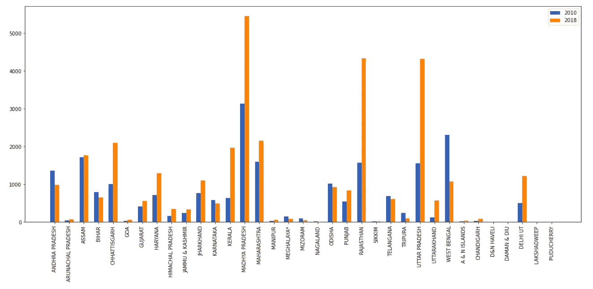

# 印度的强奸:视觉分析

> 原文：<https://medium.com/analytics-vidhya/rape-in-india-a-visual-analysis-9683dd630c10?source=collection_archive---------21----------------------->

## 一项基于数据的分析，旨在研究对妇女最具攻击性的犯罪“强奸”的趋势，并预测向当局报警。

## 介绍

是否正在采取有效措施来确保我国妇女的安全？如果是，它们在多大程度上是成功的，需要多少改进？哪些地区最不安全，哪些地方需要加强安保？..当我们想到女性安全时，许多类似的问题会浮现在我们脑海中。

深入研究目前收集的数据是获得这些问题答案的最佳选择。

分析中使用的数据摘自[**【NCRB】**](https://ncrb.gov.in/)国家犯罪记录局官方网站。编译后的数据可以在这里找到[。](https://github.com/Snigdhabhatnagar/Women_Safety_Analysis)

## 年度趋势—

让我们来看看并研究一下 2001 年至 2018 年报告的病例的实际趋势。

图 1

参见上图，强奸案件数量从 2001 年的 16，000 起跃升至 2009 年的约 21，000 起，在接下来的 9 年里，将达到 33，000 起！

**剧透预警！**从 2012 年到 2013 年，你看到的急剧增加并不是因为犯罪事件的突然增加，而是因为在 2013 年 4 月 4 日实施了**刑法修正案**，俗称 **Nirbhaya 法**之后，报案的人增多了。随着法律的通过和公众意识的提高，我们仍然不能完全同意实际发生的数量和报告的案件数量。

2014-2015 年的趋势再次显示病例数量下降。你认为事情正在步入正轨吗？可惜不是。这是因为越来越多向警方登记的案件被撤销，可能是因为对刑事司法系统缺乏信任。

从 2016 年开始的趋势也可以被视为一些法律修正案的结果。

## 哪些州是受害最严重的州？

图 2

自 2001 年以来，中央邦报告了大量病例，目前已超过 65，000 例。奥里萨邦、古吉拉特邦和德里位于中间，达曼和迪乌、本地治里、达德拉和纳加尔哈维里、拉克沙德维显示了最低的计数。虽然人口密度在预测最容易发生的地区方面也发挥了重要作用，但这个统计数据显示的是总体数字。

## 哪些州成功控制了 10%的增长？

图 3

以上是 2010 年和 2018 年各州登记案件的清晰对比。

## 对病例数未来趋势的预测

根据上述数据，使用线性回归建立了一个模型，以预测未来的案件，并提醒当局采取必要的行动。

下面是一些主要州的回归直线，它们与数据吻合得很好:

图 4

根据上述预测，如果目前的趋势继续下去，预计 2020 年德里将出现约 1354 例病例，中央邦出现 5494 例，北方邦 4383 例，马哈拉施特拉邦 3112 例。

## 结论

主要要点如下:

1.  数据中给出的案件数量的急剧增长或下降并没有真正证实目前的情况。非常有必要鼓励妇女反对任何形式的羞辱，并建立她们对司法系统的信任。
2.  经历了病例上升的州应该进行筛查来解决同样的问题。
3.  应考虑到犯罪的未来趋势，以便进一步修订。

因此，现在呼吁当局和妇女自己采取措施来控制这种快速增长的疾病。妇女必须承担起确保自身安全的责任，否则上述趋势将继续上升。

我也鼓励阅读这篇文章的其他人从他们自己的角度来研究这个问题。

要了解更多关于这个分析的信息，请点击这里的链接。