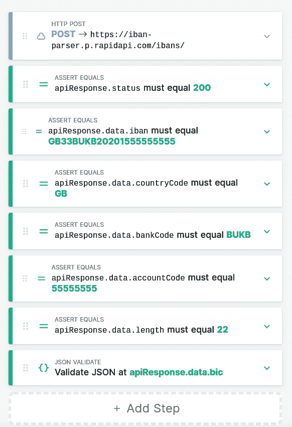

# RapidAPI:Python 的第一步

> 原文：<https://medium.com/analytics-vidhya/rapidapi-and-fastapi-d720789a5b7e?source=collection_archive---------8----------------------->


## 技术指南

## 综合指南

一位在银行工作的朋友曾经绝望地告诉我:“为什么我们要为 IBAN 解析器付出那么多？每月 300 欧元？我不能相信为什么这个这么贵”。我只能回答:“我能为 50 :D 做这件事”。他确认他会接受这笔交易，我开始研究。嗯，和你认识的商人打交道。

> 寻找一些 Python 或 JS 自由职业者，工资高达 50€/小时？请不要犹豫[在 Twitter](https://twitter.com/SchifferThorin) 或 [Linkedin](https://www.linkedin.com/in/thorin-schiffer/) 上联系我，告诉我你的简历、空闲时间和时薪。(CET +/- 3 小时)。


我的狗喜欢休息 API 和臭狗对待。

在寻找 API 的特殊主机时，我偶然发现了 RapidAPI——来自加利福尼亚的 Andreesen 和 Horowitz 烘焙 API 市场公司。这就是我所期待的，也许这就是我整个职业生涯所期待的。

作为后端工程师，你玩单机的机会更少:你设计不出好看的人人都想舔的 app 或者一个可用性突出的网站，其他不那么抽象的同事可以。除此之外，没有 Instagram 影响者或青少年需要面部识别 API。简而言之，我们的信条是 B2B 服务。

问题是，你通常不能这么容易地联系到决策者，而且很多样板文件摆在上面:账单、会计、安全等等。例如，所有这些都是通过应用程序开发人员的应用程序商店完成的。最后，我们到了，RapidAPI。

一方面，RapidAPI 为 API 开发者提供了一个平台，使他们能够专注于业务的核心部分——复杂的问题和新的可插拔功能。该平台支持 REST，最近还支持 GraphQL APIs。另一方面，它允许公司配置一次访问，并通过一个网关用一个密钥向不同的 API 提供者请求服务。实际上，这是一个非常有趣的想法！


第一个被认为有魅力的人。

在日常编程中，我们开发人员会问自己:我们应该自己写，还是应该使用库？如果这个库开发得很好，可以在多个版本中存活，那为什么不呢！RapidAPI 进一步发展了这一理念。它不是一个程序，而是为您提供一种服务，在这种服务中，平衡、SLA 和可用性不再是您的问题。嗯，至少不是全部。

然而，美中不足的是:这个项目并不完美。许多 API 都有问题，平台本身显示出相当分裂的可用性概念。也许是因为我在欧洲，也许不是，但网络应用程序相当慢。有些元素有问题，而且没有很好的记录，但我确信这是由快速增长造成的。双关语？

# FastAPI 和 RapidAPI

对于 API 来说，一个好的 python 迷你框架早就应该出现了。Django 的畸形、年龄和存在危机吓跑了新手和数据科学家。Flask 从来就不是为 API 框架而创建的，尽管它非常小巧和可插拔，但 Flask 和 Django 都不是为编程 API 而创建的。尽管 Django rest framework 是一款令人惊叹的软件，但它并不是您所需要的。

Python [庆祝](https://www.techrepublic.com/article/python-overtakes-java-to-become-the-second-most-popular-programming-language/)第二(第三？)来了。随着所有令人惊叹的新技术的发布，python 成为了数据科学的通用语言。Asyncio 已经产生了一个全新的 web 框架分支，并吸引了社区更多的关注。

其中一个框架是[FastAPI](https://fastapi.tiangolo.com/)——用于 asyncio、WebSockets 和 http/2 的 API 的 Flask。你想要的一切。有趣的事实:我最早是从我在 Cornelsen Verlag 遇到的一位数据科学家那里知道这件事的。它非常容易使用，所以即使不是分布式系统的专家也可以马上开始使用。

这个框架被很好地记录了下来。我需要的一切都可以立即找到。像许多其他 rest 框架一样，FastAPI 支持基于来自 [pydantic](https://pydantic-docs.helpmanual.io/) 的模型的模式生成，这是一个基于新的 python 类型功能的棉花糖竞赛。

像这样:

```
class ParsedIBAN(BaseModel):
    iban: str
    compact: str
    country_code: str
    bank_code: str
    account_code: str
    length: int
    bic: BIC

    class Config:
        alias_generator = to_camel
```

下面是典型端点的样子:

```
@app.post(
    "/ibans/",
    response_model=ParsedIBAN,
    responses={400: {"model": Error}, 401: {"model": Error}, 422: {"model": Error}},
)
def parse_iban(iban_str: IBANString, current_user: str = Depends(get_current_user)):
    *"""
    Parse IBAN supplied in the post payload.

    ERRORS:...*
```

相当直截了当和自我理解。

RapidAPI 需要开放 API 模式文件，以便可以使用 FastAPI 的内置功能创建该文件，如下所示:

```
def open_api():
    api = get_openapi(
        title="IBAN PARSER",
        version=VERSION,
        description="Parses IBANS",
        routes=app.routes,
    )
    api["servers"] = [
        {"url": "https://iban-parser.herokuapp.com", "description": "Production server"}
    ]
    ...
    return api
```

将结果转储到 YAML 文件中，如下所示:

```
@invoke.task
def generate_schema(context):
    *"""
    Generates open api schema yaml for the api
    """* from main import open_api

    with open("schema.yaml", "w") as yaml_s:
        yaml.dump(open_api(), yaml_s)
```

# CI 上传模式和自动上传


创建 React 应用程序示例…

为了提供 API，首先是端点，您可以通过 web 界面上传模式文件。这是一个非常简单的方法，但并不真正与现代 12 因素 API 的生命周期兼容。在应用程序的生命周期中，端点改变是很常见的事情，每次需要更新时都上传模式文件不是武士的方式。

RapidAPI 提供了一种将这些更新集成到您的 ci 中的方法。有趣的是，通过他们自己的 [API 提供元信息](https://rapidapi.com/rapidapi3-rapidapi-tools/api/openapi-provisioning)。不幸的是，这个 API 漏洞百出，我花了一段时间才弄明白是什么东西。例如，当一切正常时，它返回“204 no content”而不是 200，当出现模糊的错误消息时，它返回 400。我已经在 API 页面的讨论中发布了使用模式 YAML 的工作 curl。这又是一次:

```
curl --request PUT --url https://openapi-provisioning.p.rapidapi.com/v1/apis/$RAPID_API_API_ID \
--header 'x-rapidapi-host: openapi-provisioning.p.rapidapi.com' \
--header "x-rapidapi-key: $RAPID_API_APP_KEY" \
--header 'content-type: multipart/form-data' --form "file=@schema.yaml;type=application/yaml" -i
```

您可以在您的 marketplace 页面上找到 API id (RAPID_API_API_ID ),应用密钥应插入到配置 API 概述中。

除此之外，在尝试猜测字段的名称时，我发现 GraphQL 后端为前端请求相同的 API，因此您也可以从 overview 页面更新 API 的元数据，这不能从 schema 文件直接配置。

这是我想到的一个调用任务:

```
@invoke.task
def update_api_data(context):
    *"""
    Updates rapid api data from the schema file
    """* import requests
    from main import open_api

    url = f"https://openapi-provisioning.p.rapidapi.com/v1/apis/{env.str('RAPID_API_API_ID')}"

    api = open_api()
    with open("RapidApiDescription.md", "r") as f:
        long_description = f.read()
    payload = {
        "name": api["info"]["title"],
        "description": api["info"]["description"],
        "longDescription": long_description,
        "websiteUrl": "http://iban-parser.herokuapp.com/docs",
    }
    headers = {
        "x-rapidapi-key": env.str("RAPID_API_APP_KEY"),
        "x-rapidapi-host": "openapi-provisioning.p.rapidapi.com",
    }

    response = requests.request("PUT", url, data=payload, headers=headers)
    if response.status_code == 204:  # somehow they think 204 is okay
        print("Upload OK")
    else:
        raise Exit(f"Upload not OK: {response.status_code}: {response.text}", code=127)
```

# 快速 API 测试

该平台另一个有趣的部分是测试引擎。对于一个完美的 API，你可能会用单元测试来覆盖它。RapidAPI 允许您从外部监控 API，将集成测试和监控结合在一个工具中。


添加和配置测试及其计划间隔；通过电子邮件或短信获得通知。而且他们也很讨厌！免费的！

现在又多了一个 bug:时间表没有正常工作:它们不会立即开始，而是在一个随机的时间点开始。我希望看到这一点得到解决。

配置工具非常简单明了。一个非常好的特性是基于模式文件的端点描述来构建测试:参数和 URL 已经存在了！


使用我的狗可以使用的工具添加测试步骤(见上图)。这是非常整洁的。



这是一个简单测试的样子。这没有一行代码。

# 从 CI 触发测试

测试工具中的每个测试都可以自动触发。


通过 REST 触发测试执行

API 为您提供了关于测试状态的信息，因此您可以跟踪它，并在出现问题时使 ci 管道状态失败。下面是我为从 ci 中触发和轮询而编写的调用任务。

```
@invoke.task(help={"wait": "How many seconds to poll the result of the test"})
def trigger_rapid_api_test(context, wait=5):
    *"""
    Triggers rapid api test
    """* overall_success = True
    failed_count = 0

    trigger_urls = env.str("RAPID_API_TESTS").split(" ")
    for trigger_url in trigger_urls:
        response = requests.get(trigger_url)
        if response.status_code != 201:
            print(
                f"{trigger_url} response status not OK: {response.status_code} {response.text}"
            )
            continue

        data = response.json()
        print(data["message"])

        status_url = data["statusUrl"]
        for i in range(wait):
            data = requests.get(status_url).json()
            if data["status"] == "complete":
                print(f"STATUS: {data['status']}")
                test_success = bool(data["succesful"])
                break
            else:
                print(f"STATUS: {data['status']}")
            time.sleep(1)
        else:
            test_success = False
            failed_count += 1
        overall_success &= test_success

    if overall_success:
        print("OVERALL STATUS: OK, ALL TESTS PASSED")
    else:
        raise Exit(f"OVERALL STATUS: NOT OK, {failed_count} FAILED", code=127)
```

RapidAPI 本身在 CI 示例中引用了 Github 操作。下面是 Gitlab 的上述任务的样子:

```
rapid_api:
  stage: .post
  image: python:3.8.6
  script:
  - pip install -r requirements.txt
  - inv upload-schema
  - inv update-api-data
  - inv trigger-rapid-api-test
  only:
  - master
```

# 使用 API

好了，API 部署完毕，下一步是什么？您需要填写几个文本框，然后就可以通过 RapidAPI 客户端访问您的 API 了。您需要考虑的一件事是使用 RapidAPI 将传递的自定义 HTTP 头进行身份验证，以区分来自 RapidAPI 的调用和任何其他调用。只要凭证没有通过，您甚至希望阻止用户调用 API。


Rapid API 传递秘密，你检查有效性。

下面是如何用 FastAPI 完成的(记住 current _ user:str = Depends(get _ current _ user)？):

```
def get_current_user(
    x_rapidapi_proxy_secret: Optional[str] = Header(None),
    x_rapidapi_user: Optional[str] = Header(None),
):
    rapid_api_secret = env("RAPID_API_SECRET", None)
    if not rapid_api_secret:
        return None

    if rapid_api_secret == x_rapidapi_proxy_secret:
        return x_rapidapi_user

    raise HTTPException(
        status_code=status.HTTP_401_UNAUTHORIZED,
        detail={"message": "No credentials provided", "code": "NotAuthorized"},
    )
```

在客户端，用法非常简单:

```
import requestsurl = "[https://iban-parser.p.rapidapi.com/ibans/](https://iban-parser.p.rapidapi.com/ibans/)"payload = """{
    \"iban\": \"GB33BUKB20201555555555\"
}"""
headers = {
    'content-type': "application/json",
    'x-rapidapi-key': "XXX",
    'x-rapidapi-host': "iban-parser.p.rapidapi.com"
    }response = requests.request("POST", url, data=payload, headers=headers)print(response.text)
```

瞧啊。弗提格。搞定了。

然后，市场对剩下的部分进行汇总:记账、统计请求数等等。我真的很期待 RapidAPI 的发展，因为我不想做这些事情！

