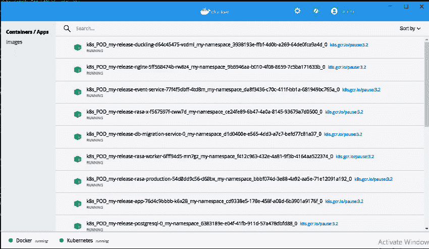
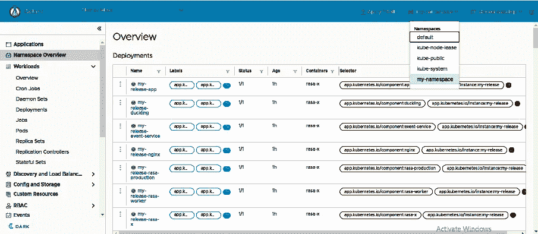

# Rasa 高级部署:第 1 部分(安装)

> 原文：<https://medium.com/analytics-vidhya/rasa-advanced-deployment-part-1-installation-51d660e0367b?source=collection_archive---------6----------------------->

部署是构建聊天机器人后的下一个目标。但是在部署之后，你可能想要随着时间更新它，这也是当你要建立一个对话式人工智能时最重要的一步。


我们将学习如何在服务器上部署我们的 rasa 聊天机器人，连接 git，并随着时间的推移更新它。

你可以通过这个链接[https://cloud.google.com/free](https://cloud.google.com/free)在谷歌云平台上申请免费积分。

要求:

我使用 windows 作为我的服务器虚拟机。你可以使用任何操作系统。

码头工人德克斯托(【https://docs.docker.com/docker-for-windows/install/】T2

舵轮图(https://github.com/helm/helm/releases)

要使用 Kubernetes，我们必须在 docker 桌面中启用 Kubernetes，然后单击应用并重启。


启用 Kubernetes

如果你使用的是 ubuntu 操作系统，那么你可以按照下面给出的命令来安装需求。

连接到您的虚拟机并发出以下命令

```
$ sudo apt update
$ sudo apt install docker.io docker-compose
$ sudo snap install microk8s --classic
```

加入 microk8s 群，避免使用 sudo。

```
$ sudo usermod -a -G microk8s $USER
$ sudo chown -f -R $USER ~/.kube
```

退出虚拟机并重新连接

启用加载项

```
$ microk8s enable dns storage helm3 registry dashboard ingress
```

配置 kubectl

```
$ cd $HOME/.kube
$ microk8s config > config
```

现在我们已经准备好了设置，让我们开始 rasa 安装的步骤。

**第一步:用凭证定义 values.yml】**

yml 是保存每个凭证的文件，比如外部 IP、初始密码等等。

用不同的字母数字字符串替换所有的<safe credential="">。</safe>

让我们首先讨论所有写下的东西。

Nginx 是一个负载平衡器，帮助我们从集群中访问 rasa-x 聊天机器人。所以我们可以在浏览器中访问聊天机器人。

在 externalIPs 中，您必须写入服务器虚拟机的内部 IP，您可以通过虚拟机详细信息页面获得。我是在本地做的，所以我对 Nginx 部分做了注释，因为它会将我的内部 IP 检测为本地主机。

在 rasax 中，我们必须设置在浏览器中访问 Rasax 时所需的密码。在其他值中，我们可以键入一个字母数字字符串。

在 rasa 中，我们可以定义我们想要使用的 rasa 版本。在这里，我们将使用“1 . 10 . 12-满”。

在 Rabbitmq，PostgreSQL，Redis 中我们只需要定义一个密码。

```
# debugMode enables / disables the debug mode for Rasa and Rasa X
debugMode: true
nginx:
  service:
    # connect LoadBalancer directly to VMs' internal IP
    # You get this value with: $ hostname -I
    externalIPs: [10.150.0.8]
rasax:
    # initialUser is the user which is created upon the initial start of Rasa X
    initialUser:
        # password for the Rasa X user
        password: "workshop"
    # passwordSalt Rasa X uses to salt the user passwords
    passwordSalt: "<safe credential>"
    # token Rasa X accepts as authentication token from other Rasa services
    token: "<safe credential>"
    # jwtSecret which is used to sign the jwtTokens of the users
    jwtSecret: "<safe credential>"
    # tag refers to the Rasa X image tag
    tag: "0.32.1"
rasa:
    # token Rasa accepts as authentication token from other Rasa services
    token: "<safe credential>"
    # tag refers to the Rasa image tag
    tag: "1.10.12-full"
rabbitmq:
    # rabbitmq settings of the subchart
    rabbitmq:
        # password which is used for the authentication
        password: "<safe credential>"
global:
    # postgresql: global settings of the postgresql subchart
    postgresql:
        # postgresqlPassword is the password which is used when the postgresqlUsername equals "postgres"
        postgresqlPassword: "<safe credential>"
    # redis: global settings of the postgresql subchart
    redis:
        # password to use in case there no external secret was provided
        password: "<safe credential>"
```

**步骤 2:创建名称空间**

我们必须在 Kubernetes 中创建一个名称空间，我们将在其中安装我们的 rasa-x，并通过该名称空间访问我们的 rasa-x 组件。这里 my-namespace 是我的命名空间的名称，您可以给它任何名称。

打开终端并键入以下命令。

```
kubectl create namespace my-namespace
```

**第三步:将 rasa 回购加入掌舵图**

```
helm repo add rasa-x https://rasahq.github.io/rasa-x-helm
```

**步骤 4:将 rasa-x 安装到 Kubernetes 中**

```
helm --namespace my-namespace install --values values.yml my-release rasa-x/rasa-x
```

我们在 values.yml 中定义的值将作为 values 参数给出，在 namespace 参数中，我们将给出我们在步骤 2 中定义的名称空间名称。

如果你想看看正在进行的过程，那么你可以导航到 docker 桌面，在那里你可以看到这样的东西。



这意味着您的 rasa-x 安装已经开始，并且 pod 当前正在运行。

现在，我们必须等到所有服务都启动，我们可以通过下面的命令来检查。

```
kubectl -n my-namespace get deployments
```


如果我们将看到所有可用的手段，我们的过程已经完成，我们可以继续前进。如果我们看到它们中的任何一个为零，那么我们必须等待它变为 1。

让我们看看哪些服务当前正在哪个端口上运行。

```
kubectl -n my-namespace get services
```


如果你能看到我的 rasa-x-nginx 服务正在 localhost:8000 端口上运行。这意味着我们的 rasa-x 在这个网址上直播。但是如果你在 gcp 虚拟机上工作，那么你可以看到这个 url [【虚拟机](http://[VM)互联网 IP】:8000。

因此，让我们打开浏览器，通过打开 [http://localhost:8000/](http://localhost:8000/) 来检查 rasa-x 是否处于活动状态。

现在它将要求输入一个密码，我们可以在其中输入我们在 values.yml fille 中定义的密码。

**奖励:**

**编辑 values.yml**

现在，无论何时您在 values.yml 中进行除密码之外的任何更改，您都必须发出这个命令。

```
helm --namespace my-namespace upgrade --values values.yml my-release rasa-x/rasa-x
```

当您执行此命令时，对 values.yml 文件的更改将反映在集群中。

**八分圆**

如果你想在 UI 中而不是命令行中可视化上述内容，那么你可以从这里安装 octant[https://github.com/vmware-tanzu/octant/releases](https://github.com/vmware-tanzu/octant/releases)并键入命令 **octant —禁用—打开—浏览器**。这将启动仪表板来显示 Kubernetes 集群。但是在键入命令之前，您必须提到这个 URL 和端口来启动仪表板。在 windows 中，我们可以很容易地按照命令来做。

```
set OCTANT_LISTENER_ADDR=0.0.0.0:8002
```

现在启动 octant，它将在 0.0.0.0:8002 上运行。

```
**octant — disable-open-browser**
```

对于 Ubuntu 用户:

在虚拟机上发出以下命令来安装 Octant

```
$ cd $HOME
$ mkdir octant
$ cd octant
$ wget [https://github.com/vmware-tanzu/octant/releases/download/v0.15.0/octant_0.15.0_Linux-64bit.deb](https://github.com/vmware-tanzu/octant/releases/download/v0.15.0/octant_0.15.0_Linux-64bit.deb)
$ sudo dpkg -i octant_0.15.0_Linux-64bit.deb
```

在后台运行 octant

```
$ OCTANT_LISTENER_ADDR=0.0.0.0:8002 octant --disable-open-browser &
```

现在输入这个 URL[http://localhost:8002/](http://localhost:8002/)如果你在本地工作或者你正在使用 GCP，然后在你的浏览器中输入[http://[VM](http://[VM)INTERNET IP]:8002。你现在可以看到八分仪表板。为了可视化我们的集群，我们必须更改名称空间。



这就是今天的 Rasa 聊天机器人预先部署系列。持续关注这个博客的系列。到那时，快乐的编码！！！

参考资料:

[](https://rasa.com/docs/rasa-x/) [## Rasa X 简介

### Rasa X 是一个对话驱动开发(CDD)的工具，这是一个倾听你的用户并使用他们的过程

rasa.com](https://rasa.com/docs/rasa-x/) [](https://info.rasa.com/advanced-deployment-workshop) [## Rasa 高级部署研讨会

### 通过部署高级认证，开始您的 Rasa 之旅。这个为期两天的认证…

info.rasa.com](https://info.rasa.com/advanced-deployment-workshop) 

如果你喜欢这篇文章，点击给我买杯咖啡！感谢阅读。

[](https://www.payumoney.com/paybypayumoney/#/147695053B73CAB82672E715A52F9AA5)

你的每一个小小的贡献都会鼓励我创造更多这样的内容。