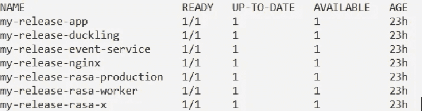
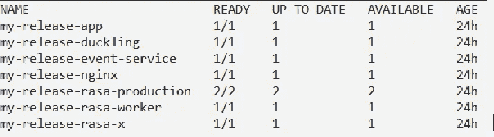

# Rasa 高级部署:第 2 部分(扩展单元和集群需求)

> 原文：<https://medium.com/analytics-vidhya/rasa-advanced-deployment-part-2-scaling-pods-and-cluster-requirements-e1bc507aa333?source=collection_archive---------13----------------------->

在之前的博客中，我们在虚拟机中安装了 rasa。我们的应用程序中运行的每个部署只需要一个 Pod 就可以完成安装。当流量增加时，我们将需要扩展应用程序以满足用户需求。


## 秤豆荚

**扩展**是通过改变部署中副本的数量来实现的。

方法 1:

在虚拟机上，发出以下命令来检查我们的部署有多少 pod:

```
kubectl -n my-namespace get deployment
```



这里我们准备了 1/1，这意味着我们有 1 个 pod 用于该部署。

在虚拟机上，发出以下命令来扩展单元:

```
kubectl -n my-namespace scale deployment my-release-rasa-production --replicas=2
```

*   -n my-namespace:安装 rasa 的名称空间的名称
*   my-release-rasa-production:您要扩展的部署的名称您可以在上面给出的图像中看到该名称。
*   — replicas=2:这意味着我们需要 2 个 pod 用于 my-release-rasa-production 部署。

让我们再次检查豆荚是有规模的。



我们可以在我的发布-rasa-production 中看到，现在我们有 2 个 pod 准备好了。

要缩小它，请发出以下命令

```
kubectl -n my-namespace scale deployment my-release-rasa-production --replicas=1
```

注意:

您也可以使用此命令重启任何 pod。

```
kubectl -n my-namespace scale deployment my-release-rasa-production --replicas=0
```

它将删除该单元，现在您可以再次初始化新单元。

```
kubectl -n my-namespace scale deployment my-release-rasa-production --replicas=1
```

它将重启我的释放-拉沙-生产舱。

方法二:掌舵

我们可以在“values.yml”中定义 replicaCount

```
# rasa: Settings common for all Rasa containers
rasa:
    versions:
       # rasaProduction is the container which serves the production environment
       rasaProduction:
           # replicaCount of the Rasa Production container
           replicaCount: 2
```

现在在虚拟机上发出这个命令

```
helm --namespace my-namespace upgrade --values values.yml my-release rasa-x/rasa-x
```

它的工作方式与命令行方式相同。但是，这里我们可以跟踪 values.yml 文件中定义的所有值。

## 集群要求

我们可以在 helm 图表的 values.yml 中指定容器需要或允许使用的每种资源的数量，例如，对于 rasa 生产容器，如果我们需要 2vcpu 和 2GB ram，那么我们可以如下定义它。

*   编辑 Values.yml 文件

```
rasa:
 versions:
   rasaProduction:
     # resources which rasaProduction is required / allowed to use
     resources:
       requests:
         cpu: "2000m"
         memory: "2Gi"
```

*   升级安装

```
helm --namespace my-namespace  upgrade --values values.yml my-release rasa-x/rasa-x
```

这将按照我们在 values.yml 中描述的那样分配资源。

Rasa 聊天机器人的预先部署系列今天就到这里。持续关注这个博客的系列。到那时，快乐的编码！！！

参考资料:

[](https://rasa.com/docs/rasa-x/) [## Rasa X 简介

### Rasa X 是一个对话驱动开发(CDD)的工具，这是一个倾听你的用户并使用他们的过程

rasa.com](https://rasa.com/docs/rasa-x/) [](https://info.rasa.com/advanced-deployment-workshop) [## Rasa 高级部署研讨会

### 通过部署高级认证，开始您的 Rasa 之旅。这个为期两天的认证…

info.rasa.com](https://info.rasa.com/advanced-deployment-workshop) 

如果你喜欢这篇文章，点击给我买杯咖啡！感谢阅读。

[](https://www.payumoney.com/paybypayumoney/#/147695053B73CAB82672E715A52F9AA5)

你的每一个小小的贡献都会鼓励我创造更多这样的内容。