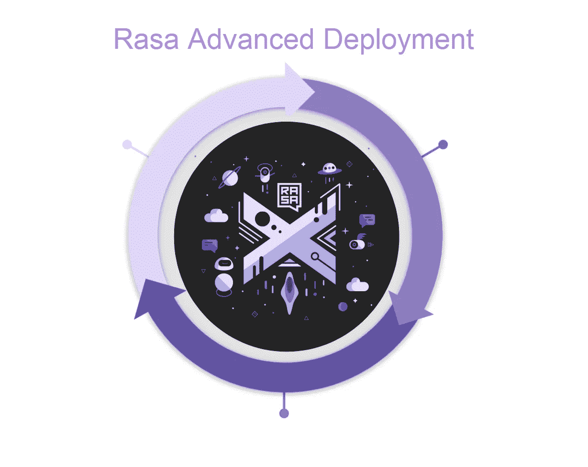
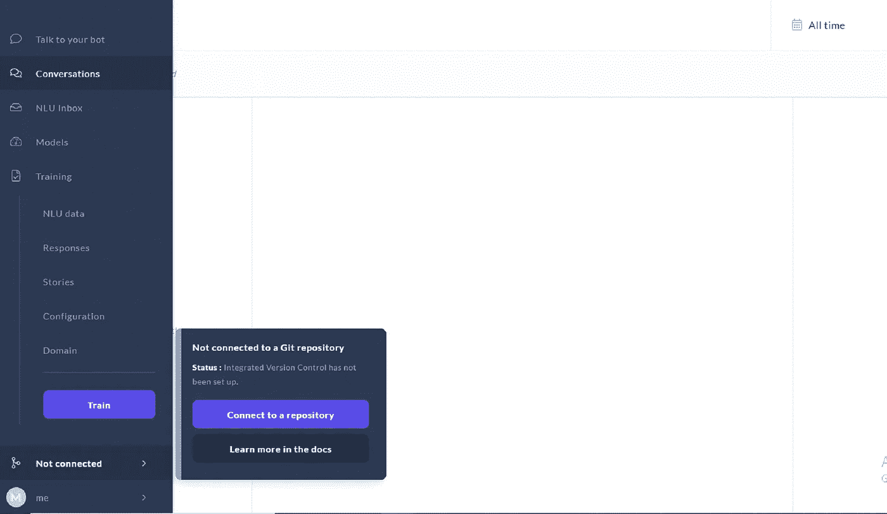
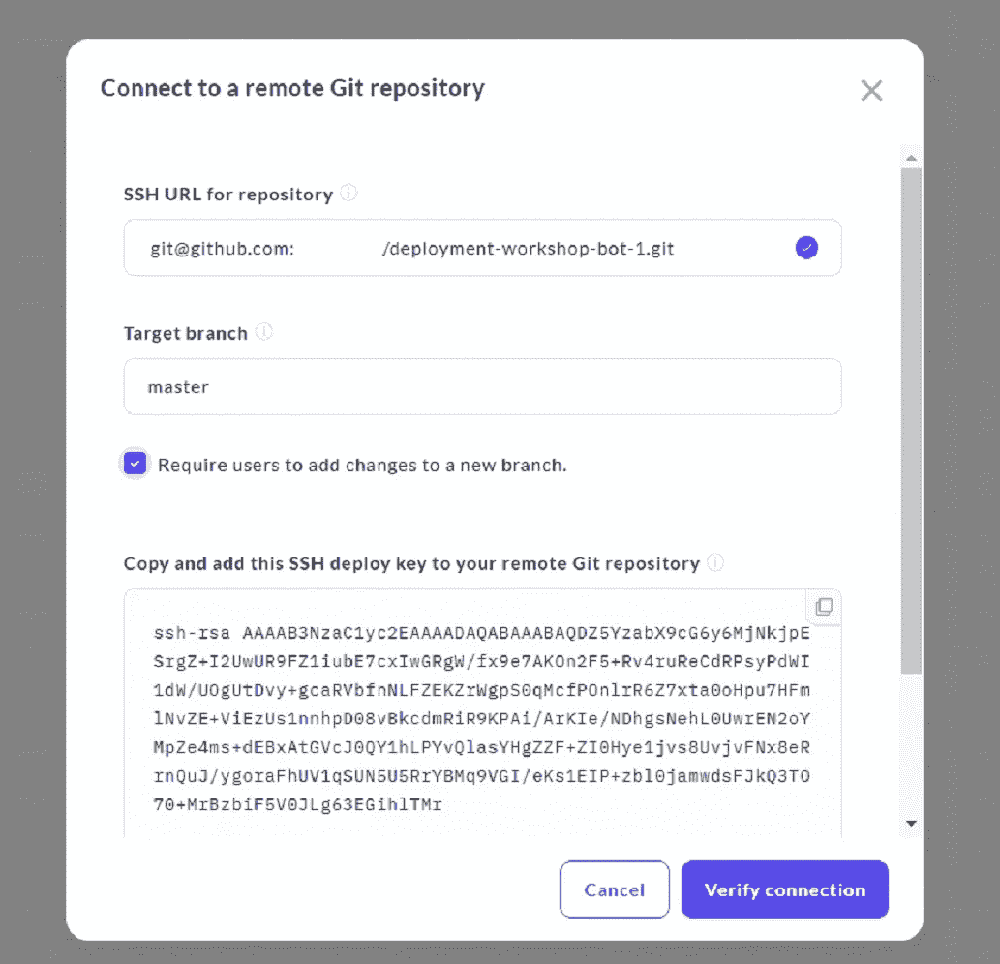
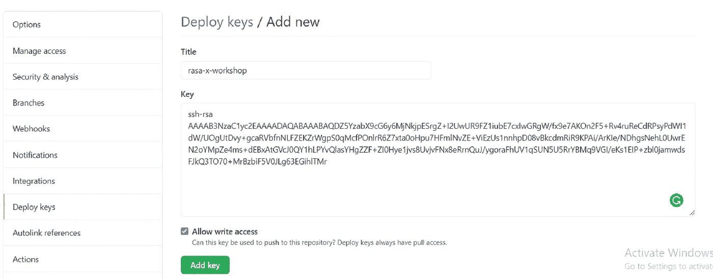
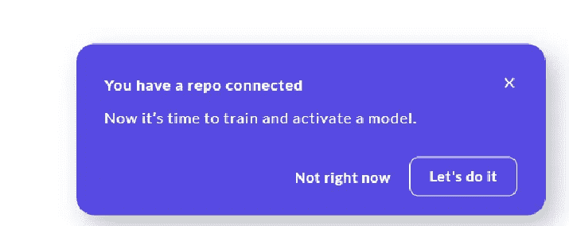
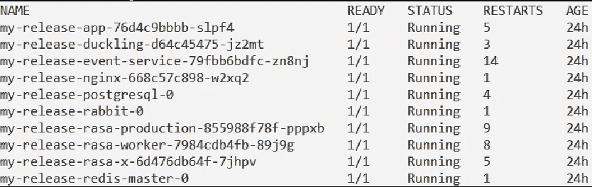
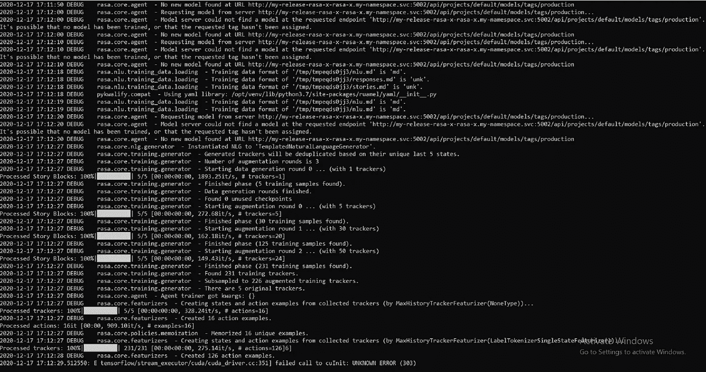
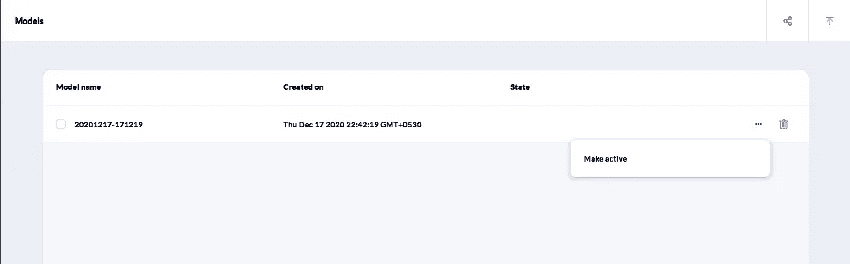
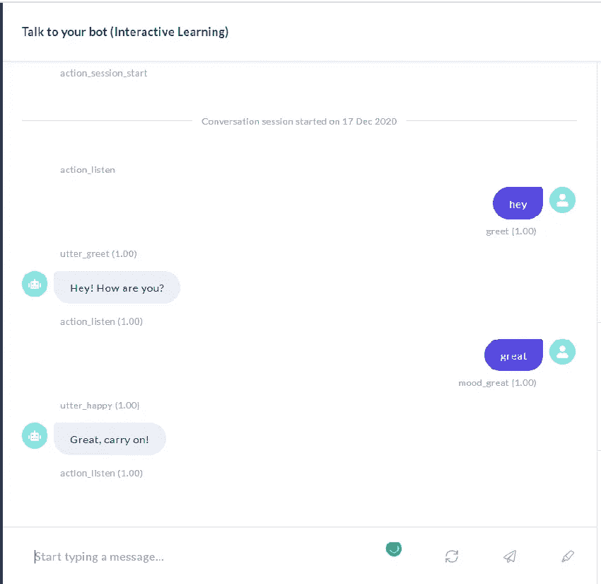

# Rasa 高级部署:第 3 部分(Git 连接)

> 原文：<https://medium.com/analytics-vidhya/rasa-advanced-deployment-part-3-git-connection-373792fbd54a?source=collection_archive---------15----------------------->

到目前为止，我们已经了解了如何在虚拟机中安装 rasa 和扩展 pod。现在让我们将我们的聊天机器人与 git 连接起来，这样我们就可以跟踪变化并与 git 同步 rasa-x 数据。以便 rasa-x 在主分支中发现任何变化时自动更新数据。



下面是连接 git repo 和 Rasa-x 的步骤。

第一步:叉[https://github.com/RasaHQ/deployment-workshop-bot-1](https://github.com/RasaHQ/deployment-workshop-bot-1)

步骤 2:导航到您的分叉副本

步骤 3:从 GitHub 存储库中复制 SSH URL

步骤 4:连接 Rasa X 中的集成版本控制



4.a .指定要用作主服务器的分支

4.b .选中“要求用户将更改添加到新分支”

4.c .首先执行步骤 5，然后单击“验证连接”



5.在 GitHub 存储库设置中复制/粘贴部署密钥

5.a .选中“允许写访问”



单击“验证连接”后，几分钟后您会看到类似这样的内容。这意味着我们的 git 连接成功了。



通过连接 GitHub rasa，现在可以从我们的回购中同步数据。我们可以在 rasa-x nlu 数据中验证这一点。

现在让我们来训练聊天机器人。在此之前，我们将在日志中看到培训过程，所以让我们开始日志。

发出此命令以查看您的 pod 名称

```
kubectl -n my-namespace get pods
```



我们必须运行 rasa-worker 的日志。因此，使用 rasa-worker pods 名称发出这个命令。

```
kubectl -n my-namespace logs my-release-rasa-worker-7984cdb4fb-89j9g --follow --tail 20
```

*   my-release-rasa-worker-7984 CDB 4 FB-89j 9g 是我的 rasa worker pod 名称。
*   — follow 表示它将与 pod 中的新日志同步。
*   — tail 20 表示它将向我们显示日志的最后 20 条记录。

现在单击 rasa-x 中的 train 按钮，导航到日志中查看训练过程



在模型被训练之后。我们必须激活模型来与之互动。导航到 rasa-x 中的模型部分，在那里您将找到您的模型。



需要一些时间来完成。什么时候结束。你可以看到这样的东西。


现在，我们的助手已经启动，我们可以点击“与机器人对话”按钮来检查您的新模型如何工作。



太好了，一切正常。因此，现在每当我们在连接到 rasa-x 的回购主分支中进行更改时，它都会同步新数据。然后，我们可以在新的同步数据上训练模型，激活它，并与它交谈。

Rasa 聊天机器人的预先部署系列今天就到这里。持续关注这个博客的系列。到那时，快乐的编码！！！

参考

[](https://rasa.com/docs/rasa-x/) [## Rasa X 简介

### Rasa X 是一个对话驱动开发(CDD)的工具，这是一个倾听你的用户并使用他们的过程

rasa.com](https://rasa.com/docs/rasa-x/) [](https://info.rasa.com/advanced-deployment-workshop) [## Rasa 高级部署研讨会

### 通过部署高级认证，开始您的 Rasa 之旅。这个为期两天的认证…

info.rasa.com](https://info.rasa.com/advanced-deployment-workshop) 

如果你喜欢这篇文章，点击给我买杯咖啡！感谢阅读。

[](https://www.payumoney.com/paybypayumoney/#/147695053B73CAB82672E715A52F9AA5)

你的每一个小小的贡献都会鼓励我创造更多这样的内容。