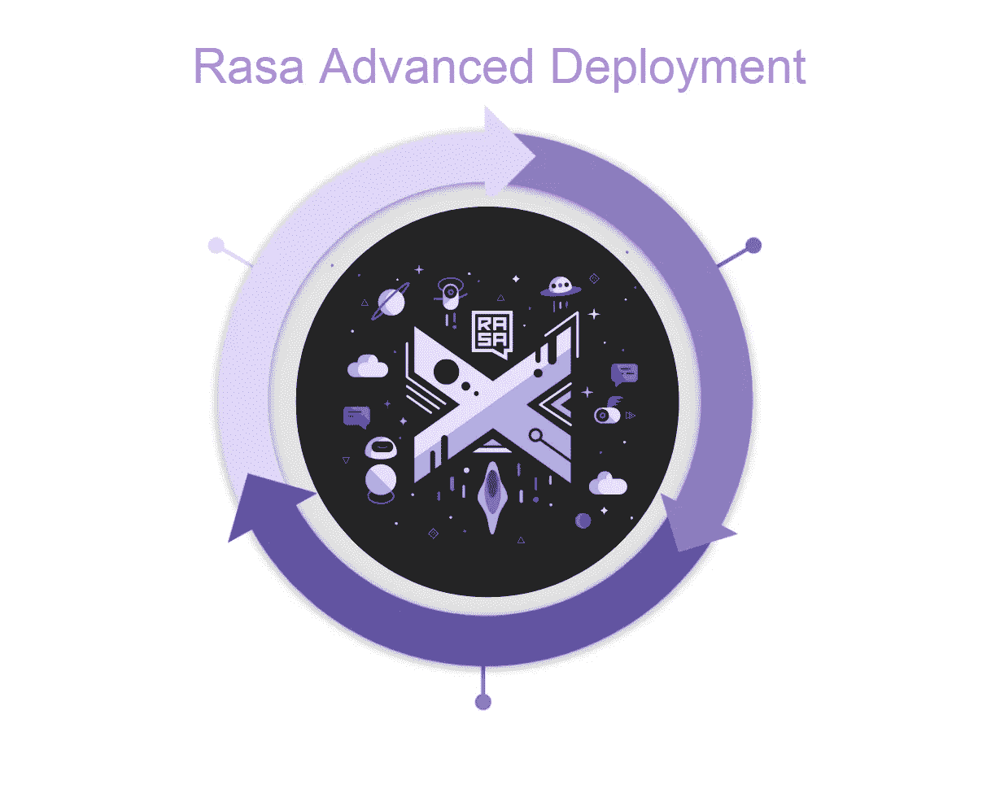

# Rasa 高级部署:第 5 部分(对话驱动的开发)

> 原文：<https://medium.com/analytics-vidhya/rasa-advanced-deployment-part-5-conversation-driven-development-264365e10587?source=collection_archive---------18----------------------->

欢迎来到 Rasa 高级开发系列的第 5 部分。在这里，我们将讨论对话驱动的开发。对话驱动开发(CDD)是倾听用户意见并利用这些见解来改进人工智能助手的过程。这是聊天机器人开发的最佳实践方法。

开发优秀的人工智能助手具有挑战性，因为用户总是会说一些你没有预料到的事情。CDD 背后的原则是，在每一次对话中，用户都在用他们自己的话告诉你他们到底想要什么。通过在机器人开发的每个阶段练习 CDD，你可以让你的助手适应真实的用户语言和行为。

CDD 包括以下行动:

*   **尽快与用户分享**您的助手
*   **定期回顾**的谈话
*   **注释**消息并将其用作 NLU 训练数据
*   测试你的助手是否总是如你所愿
*   **跟踪**你的助手何时失败，并测量其随时间的表现
*   **修正**你的助手如何处理不成功的对话

## 分享

让我们首先与测试用户或最终用户分享这个机器人。你可以在 rasa-x 的模型部分找到 share 选项。

在助手细节中，你可以写下你的聊天机器人标题或者任何你想写的东西。在描述中，你可以写聊天机器人在做什么，以及测试用户如何与之交互。

## 回顾

当客户测试人员使用我们的机器人时，我们将在 rasa-x 的对话部分看到客户测试人员的对话。

## 给…作注解

现在，如果我们看一看这个令人敬畏的文本，我们可以发现我们的聊天机器人将它识别为写在文本中的**情绪 _ 不愉快**意图。这是错误的。因此，如果我们发现任何对话是错误的，那么我们可以从这里通过点击我们的文本附近的铅笔按钮来纠正它。然后，我们可以将校正后的数据添加到训练数据中。

最佳做法是，在更正对话后，我们可以将该对话标记为已审核，这样我们就不会再次查看同一对话进行更正。

注释数据

如果我们仔细观察 rasa-x 中的 git 部分，颜色会变成黄色，因为我们的数据发生了一些变化。让我们先将数据推入 git，这样我们的数据就是最新的。

单击“将更改添加到 Git 服务器”按钮。

现在，每当我们将更改添加到我们的 Git rasa-x 将创建一个新的分支。因此，我们可以验证更改，如果它看起来不错，那么我们将与主分支合并。

我们可以比较这些变更，并通过单击 Compare & pull request 按钮创建一个 pull 请求，将这些变更与主分支合并。

在这里，我们必须更改要合并的存储库。当我们分叉回购时，我们将在左侧看到原始回购的主分支。所以要改成我们的主分支。

在这里，我们可以写下我们为未来的视角以及将要合并这个分支的开发人员所做的更改。现在我们可以创建一个拉取请求。

在这里，我们可以将变更与主分支合并。

## 测试、跟踪和修复

当我们在这里合并时，我们的 rasa-x 将尝试与主分支变更同步。我们必须等待 git 同步，当它完成时，我们可以看到 git 部分的颜色将改为绿色，我们的新数据在 NLU 数据。现在我们可以再次训练它，然后激活新模型并与它交谈。

现在我们有了新的模型，所以我们可以再次将这个 URL 给测试用户，我们将跟踪对话。此外，无论我们在哪里发现对话预测错误，我们都可以修复它并重复这个过程。

Rasa 聊天机器人的预先部署系列今天就到这里。持续关注这个博客的系列。到那时，快乐的编码！！！

参考资料:

 [## Rasa X 简介

### Rasa X 是一个对话驱动开发(CDD)的工具，这是一个倾听你的用户并使用他们的过程

rasa.com](https://rasa.com/docs/rasa-x/)  [## Rasa 高级部署研讨会

### 通过部署高级认证，开始您的 Rasa 之旅。这个为期两天的认证…

info.rasa.com](https://info.rasa.com/advanced-deployment-workshop/) 

如果你喜欢这篇文章，点击给我买杯咖啡！感谢阅读。

你的每一个小小的贡献都会鼓励我创造更多这样的内容。