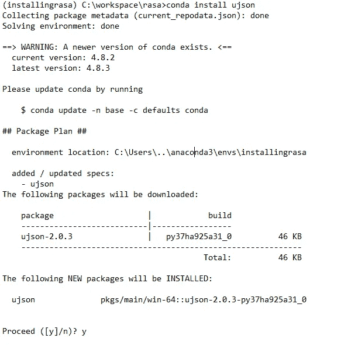

# Rasa 聊天机器人开发

> 原文：<https://medium.com/analytics-vidhya/rasa-chat-bot-development-86b4e3b1025f?source=collection_archive---------15----------------------->

在窗口中安装 Rasa 并运行初始的人工智能聊天机器人

Rasa 简介:Rasa 是机器学习驱动的开源软件，用于构建人工智能特色的机器人。它被世界领先的公司信任来构建聊天机器人。

如何在 window 机器中安装 Rasa:

1.  从下面的链接下载 anaconda python 3.7 版本并安装[https://www.anaconda.com/distribution/](https://www.anaconda.com/distribution/)
2.  使用窗口资源管理器打开 anaconda 提示符。
3.  创建 rasa 的名称，使用该名称 rasa 将被激活并提供 python 版本。

(基本)C:\ workspace \ rasa > conda create-name installingrasa python = = 3 . 7 . 6

命令和日志快照

4.上述命令将列出将要安装的软件包，并询问是否继续，如果是，则继续安装列出的软件包。

5.一旦下载并安装了列出的软件包，它将列出以下命令，提供命令“conda activate installingrasa ”,此处 installingrasa 是步骤 3 中给出的名称。
# $ conda activate installas asa
#要停用活动环境，请使用
# $ conda deactivate

激活名称的命令

6 .使用 conda install 安装 ujson 并允许继续

7 .安装张量流，康达安装张量流并允许继续进行

8.以上是在系统中运行 rasa 所需的组件，接下来是使用 Pip 在系统中安装 Rasa。

9.Rasa 安装在机器中，使用<rasa init="">初始化 rasa，并提供 rasa 将被初始化的项目路径，否则在当前位置它将被初始化。在初始化期间，它将要求训练(是或否)默认模型，该模型将作为 init 命令的一部分下载。</rasa>

10.初始模型按照我在步骤 9 中给出的“是”来训练模型。稍后也可以通过运行命令<rasa train="">来训练模型</rasa>

11.在第 9 步中，它将要求启动机器人，我已经给出了是，你可以给，稍后你也可以通过运行命令<rasa shell="">启动</rasa>

12.现在模型已经被训练了基本的意图，并且已经被加载，是时候开始和模型交流了。

rasa bot 的详细安装和执行步骤可以从 github 下载。

[https://github.com/rikesh-DS/rasainstall.git](https://github.com/rikesh-DS/rasainstall.git)