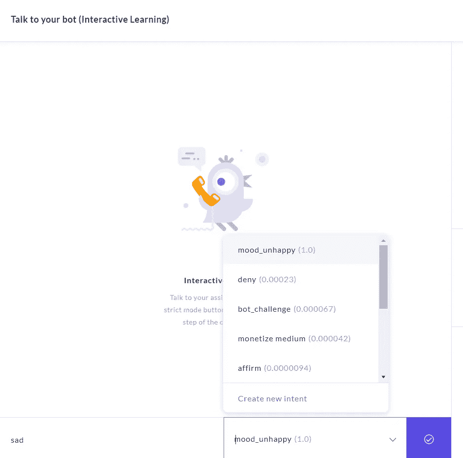

# 拉萨·NLU

> 原文：<https://medium.com/analytics-vidhya/rasa-nlu-6f0558e43318?source=collection_archive---------13----------------------->

1.  需要在您的系统中使用下面的 pip 命令在本地安装 rasa(假设您的系统中安装了 python3):

*pip3 安装 rasa*

*注意:rasa 和 tensorflow 通常会出现兼容性错误，在这种情况下，请卸载并重新安装两者。*

2.创建一个新文件夹，并在此新文件夹位置打开命令提示符，然后键入命令

*rasa init 或*

输入目录名。

这些文件在您的目录中创建。

3.cd<path of="" current="" directory=""></path>

在取消对在您的目录中创建的 config.yml 的注释之后，在这里训练您的模型。

*python -m rasa train nlu 或 rasa train nlu*

4.您可以跳过第 3 步，安装 rasa x，这需要在本地预安装 visual studio C++和 GIT。

*使用此链接检查 rasa x 的本地安装:*[https://rasa . com/docs/rasa-x/installation-and-setup/install/local-mode](https://rasa.com/docs/rasa-x/installation-and-setup/install/local-mode)

它将在本地打开:[http://localhost:5002/conversations](http://localhost:5002/conversations)

5.在“训练 NLU 训练数据”下，您可以创建意图并添加用户问题(话语)

6.让我们创建 3 个意向*Stories _ in _ media*、*成为 _a_member* 和*money _ medium*，并在上面的*部分给出各自的响应。*

7.让我们在同义词部分添加几个同义词。

双击要添加同义词的单词。

8.现在在 Stories 部分添加一个故事，基本上创建了一个流。

从现有的故事中复制粘贴，并根据您创建的意图更改名称意图和动作。

现在，要指定行动，请转到响应部分，单击+图标，并添加与故事中的行动相同的名称。(在本例中为 utter_member)

一旦你添加了这些，不要忘记训练它。(或者当您做出任何更改时)

9.在您从链接测试它之前，您需要运行命令:pythom -m rasa test(关闭 rasa x 或在不同的终端中)

10.您可以通过交互部分检查机器人的响应。(和你的机器人说话)

并保持交互模式，这样您就可以纠正机器人显示的意图映射。

为意图选择正确的动作映射。

接下来选择“行动 _ 倾听”并检查其他意图。

11.转到 Conversations 部分并点击 share bot，填写基本细节并在生成的链接中测试您的 bot。

如前所述，如果你想测试的话，不要忘记在匿名模式下打开链接。

12.为了部署 rasa x 机器人，你可以查看 rasa 官方 you tube 频道的视频。

接下来让我们讨论一下 IBM Watson NLP。