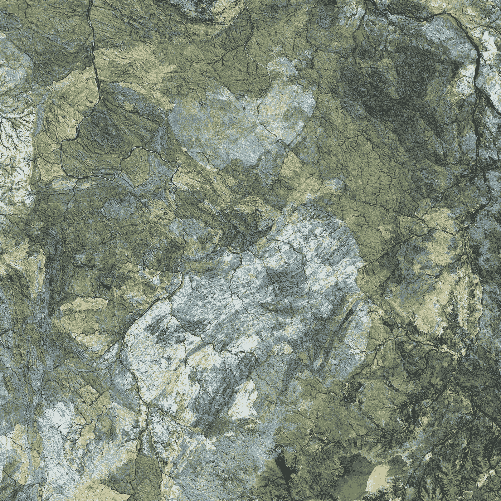

# 栅格与矢量-空间数据类型。

> 原文：<https://medium.com/analytics-vidhya/raster-vs-vector-spatial-data-types-11325b83852d?source=collection_archive---------11----------------------->

## 对栅格和矢量空间数据类型的比较理解

今天我们来讨论地理信息系统中两种不同且常用的空间数据类型。哪个更好？如果有的话其实更好！

[美国地质勘探局](https://unsplash.com/@usgs?utm_source=unsplash&utm_medium=referral&utm_content=creditCopyText)在 [Unsplash](https://unsplash.com/s/photos/geography?utm_source=unsplash&utm_medium=referral&utm_content=creditCopyText) 上拍摄的照片

GIS 专家的每个阶段都必须处理栅格和矢量类型的数据。